# THE LIVING CODEX

> **Master Knowledge Book — The Ascending Curriculum of Mind, Wealth & Mastery**

---

## 🪜 The Master Ascending Curriculum

### Volume 1: Biological & Neural Foundations
*Calibrating the biological hardware: gut-brain axis, dopamine baselines, impulse regulation, structural meditation rewiring, and psychic energy hydraulic plumbing.*

- **Chapter 1**: The Second Brain — The Gut-Mind Axis
- **Chapter 2**: The Neurochemistry of Focus & Dopamine Loading
- **Chapter 3**: Supernormal Stimuli & Urge Surfing
- **Chapter 4**: The Neurobiology of Meditation & Structural Rewiring
- **Chapter 5**: The Hydraulic Mind — Indiscipline as Misdirected Energy

### Volume 2: Daily Systems & Habit Architecture
*Constructing the daily deterministic operating system: circadian sleep ignition, Monk Mode 5-pillars, habit cascades, the 3-second rule, and always Day 1.*

- **Chapter 6**: The Circadian Architecture & Early Waking
- **Chapter 7**: The High-Agency Reset — The Monk Mode Blueprint
- **Chapter 8**: The Diderot Effect & Habit Cascades
- **Chapter 9**: The Anatomy of Indiscipline & Identity Anchors
- **Chapter 10**: The Philosophy of Day One & The Streak Fallacy

### Volume 3: Dismantling Internal Saboteurs
*Neutralizing subconscious resistance: activation energy collapse, the preparation trap & ACT choice point, ego-defensive perfectionism, overthinking rumination loops, cognitive biases, and logical fallacies.*

- **Chapter 11**: The Architecture of Action & Procrastination Equation
- **Chapter 12**: The Action Paradox — The Preparation Trap, The Choice Point & The Four 'Playing-It-Safe' Saboteurs
- **Chapter 13**: The Perfectionism Paradox & Ego Armor
- **Chapter 14**: The Architecture of Metacognition & Overthinking
- **Chapter 15**: The Architecture of Cognitive Biases & Distortions
- **Chapter 16**: The Cognitive Firewall — Epistemic Razors & Fallacy Detection
- **Chapter 17**: The Anatomy of Social Comparison & Backstage Fallacy

### Volume 4: High-Velocity Execution & Asymmetric Leverage
*Scaling speed, retention, and strategic leverage: progressive friction, the paradox of safety, growth error waves, active memory retrieval, 80/20 power laws, and iteration velocity.*

- **Chapter 18**: The Pathology of Comfort — Homeostasis, The Paradox of Safety & Progressive Friction
- **Chapter 19**: The Neurobiology of Growth & Fixed Mindset
- **Chapter 20**: The Architecture of Memory & Active Recall
- **Chapter 21**: The Anatomy of Consistency & Forced Action
- **Chapter 22**: Asymmetric Leverage & The Pareto Principle
- **Chapter 23**: The Architecture of Marginal Gains & Compounding
- **Chapter 24**: The Physics of Outworking & First-Principles Execution

### Volume 5: The Architecture of Social Sovereignty
*Navigating institutions, status dynamics, interpersonal communication, sovereign writing, pedagogy, difficult conversations, and supercommunication.*

- **Chapter 25**: The Social Fiction Matrix — The Thomas Theorem & Demystifying Status Games
- **Chapter 26**: The Three Currencies — Leveraging Economic, Cultural & Social Capital
- **Chapter 27**: The Front Stage Fallacy — Erving Goffman & Dismantling Imposter Syndrome
- **Chapter 28**: The Sociological Imagination — Personal Troubles vs. Systemic Realities
- **Chapter 29**: The Iron Cage & Anomie — Navigating Sterile Systems & Chosen Constraints
- **Chapter 30**: The Architecture of Resonance — Vocal Mastery, HAIL, Conviction & Conscious Listening
- **Chapter 31**: The Architecture of Spontaneous Communication — Impromptu Clarity, The 60-Second Narrative & Subtractive Articulation
- **Chapter 32**: The Architecture of High-Impact Pedagogy & Sovereign Writing — The MIT Formula, Reader-Centric Value & Cognitive Fences
- **Chapter 33**: The Architecture of Social Connectivity — Breaking Stranger Friction, The Incomplete Sentence Engine & The Pathology of 'Playing It Cool'
- **Chapter 34**: The Architecture of Difficult Conversations — Frame of Reference, Sovereign Boundaries & Navigating Unsupportive Circles
- **Chapter 35**: The Architecture of Supercommunication — The Matching Principle & Three Layers of Dialogue

### Volume 6: Existential Sovereignty, Purpose & The Summit
*Transcending ego and status games: true confidence, performance under pressure, integrated strength, unattached execution, sovereign solitude, emotional granularity, self-knowledge, and the power of zero (Shunya).*

- **Chapter 36**: The Architecture of True Confidence — Self-Efficacy, Performance Under Pressure & Somatic Poise
- **Chapter 37**: The Architecture of Integrated Strength — Quiet Competence, Radical Ownership & The Invariant of Respect
- **Chapter 38**: The Three Modes of Execution — Perception, Action, Self & The Immunity to Taking Things Personally
- **Chapter 39**: The Architecture of Solitude & Dismantling Loneliness
- **Chapter 40**: The Architecture of Emotional Granularity — Naming the Unspoken Landscape
- **Chapter 41**: The Architecture of Self-Knowledge & Four Reality Mirrors
- **Chapter 42**: The Architecture of Purpose & Mastery
- **Chapter 43**: The Architecture of True Fulfillment & Hedonic Adaptation
- **Chapter 44**: The Philosophy of the Void & Radical Resilience

### Volume 7: Capital Allocation & Financial Independence
*The mathematical reality of wealth: cashflow engineering, the true cost of debt, and multi-decade compounding.*

- **Chapter 45**: The Engine of Wealth — Cashflow, Debt & Compounding

---

# Volume 1: Biological & Neural Foundations

## Chapter 1: The Second Brain — The Gut-Mind Axis

We often think of our thoughts, moods, and mental clarity as phenomena that exist strictly between our ears. However, modern biology reveals that your emotional state and cognitive focus are anchored just as heavily in your digestive system. 

Running along the walls of your gastrointestinal tract is a network of over 100 million neurons known as the **Enteric Nervous System**. It operates so independently and communicates so constantly with the cranial brain that science refers to it as the body’s "second brain."

---

### The Superhighway: How Your Gut Talks to Your Brain

Your brain and your gut are linked through a bidirectional communications network known as the **Gut-Brain Axis**. The primary physical bridge between them is the **Vagus Nerve**—the longest cranial nerve in the body.

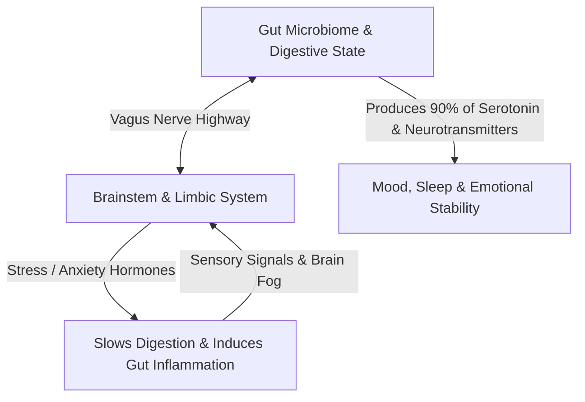

This communication is not a one-way street:
1. **The Top-Down Pathway**: When you experience psychological stress, acute worry, or anger, your brain releases adrenaline and cortisol. This slows down digestive motility, reduces blood flow to the stomach, and weakens the protective mucosal lining.
2. **The Bottom-Up Pathway**: More surprisingly, roughly **80% to 90% of the nerve fibers in the vagus nerve send signals *from* the gut *to* the brain**, not the other way around. An irritated, inflamed, or sluggish gut constantly fires distress signals upward, which your conscious mind interprets as anxiety, low mood, or general unease.

---

### The Neurochemical Factory: Where Mood is Made

A common misconception is that emotional neurochemicals are manufactured primarily in the brain. In reality:

* **Serotonin (The Stability Molecule)**: Around 90% of your body’s total serotonin is produced by specialized cells in the gut and modulated by your gut bacteria. Serotonin governs mood balance, sleep cycles, and feelings of satisfaction.
* **GABA (The Calming Molecule)**: Healthy strains of gut bacteria produce GABA (gamma-aminobutyric acid), a natural tranquilizer that prevents the nervous system from becoming overstimulated.
* **Dopamine (The Drive Molecule)**: Approximately 50% of the body's dopamine is synthesized in the gut environment, directly influencing baseline motivation and energy levels.

When the bacterial ecosystem in the digestive tract is disrupted, your production of these stabilizing chemicals plummets. This is why chronic digestive discomfort is almost universally accompanied by brain fog, lethargy, and erratic emotional swings.

---

### The Two Roots of Mental Fog: Inflammation & Leaky Barriers

When people report struggling with focus, mental sluggishness, or memory recall, the root cause is frequently biochemical irritation rather than a lack of mental discipline.

#### 1. The Broken Barrier
The lining of your intestine is only one cell layer thick. It acts like a high-security border control: absorbing broken-down nutrients into the bloodstream while keeping out undigested food particles, toxins, and pathogenic bacteria.

When this barrier becomes irritated (through ultra-processed food, chronic unmanaged stress, or prolonged antibiotic exposure), microscopic gaps form. Undigested particles leak into the bloodstream.

#### 2. The Fire in the Brain
The immune system immediately attacks these foreign particles, triggering systemic, low-grade inflammation. Inflammatory molecules travel through the blood and cross the blood-brain barrier. 

In the brain, this inflammation slows down synaptic transmission. The subjective experience of this biological event is what we call **"brain fog"**—an inability to focus, slow decision-making, and mental exhaustion.

---

### Core Principles for Restoring Gut-Mind Harmony

To maintain sustained mental energy and emotional composure, your daily lifestyle should protect the digestive ecosystem through four simple rules:

#### 1. Establish Rhythm in Meal Timing
The gut has its own cleansing cycle called the *Migrating Motor Complex* (MMC). This cleaning wave only activates when your stomach has been completely empty for 3 to 4 hours. Constant snacking interrupts this natural self-cleaning process, causing fermentation, bloating, and sluggishness. Allow clean fasting windows between meals.

#### 2. Diversify Whole-Plant Fibers
Your beneficial bacteria feed on prebiotic fiber that your own stomach enzymes cannot break down. A diet rich in diverse whole foods, leafy greens, legumes, and fermented items creates a resilient bacterial colony that produces short-chain fatty acids (which repair the gut wall and reduce brain inflammation).

#### 3. Practice Pre-Meal Nervous System Down-Regulation
Eating while stressed, distracted, or working forces your body into a sympathetic ("fight-or-flight") state. In this state, your stomach produces significantly less digestive acid and enzymes. Taking three deep, slow breaths before eating flips the nervous system into the parasympathetic ("rest-and-digest") state, ensuring complete digestion without metabolic waste.

---

### The Core Takeaway to Remember
> Your mental clarity is not isolated to your thoughts. When the gut is inflamed, the mind feels anxious and foggy; when the gut is nourished and calm, the mind naturally returns to ease, focus, and sustained energy.

---

## Chapter 2: The Neurochemistry of Focus & Dopamine Loading

Modern culture treats chronic distraction as a personal failure of discipline. In cognitive neurobiology, distraction is actually a **neurochemical miscalibration** of the brain's anticipation and reward circuitry.

Your ability to sustain deep focus, resist instant gratification, and feel genuine satisfaction is governed by three primary neurotransmitters: **Dopamine** (the molecule of pursuit and anticipation), **Serotonin** (the molecule of presence and emotional stability), and **Oxytocin** (the molecule of safety and connection).

Understanding the interplay between these chemicals allows you to transition your nervous system from frenetic, shallow stimulation into calm, sustained concentration.

---

### The Neurochemical Triad of Attention

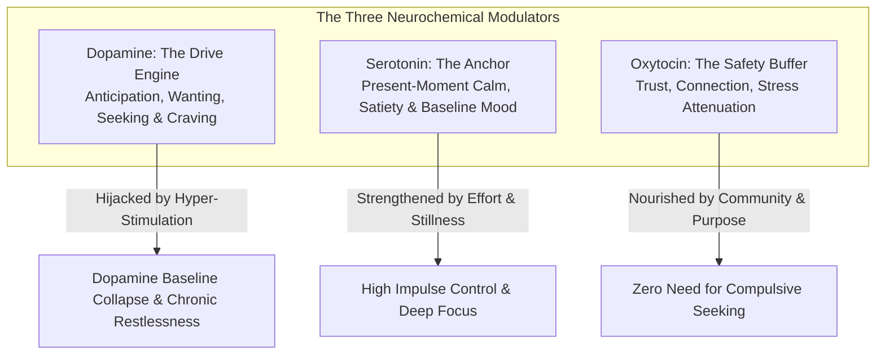

---

### The Dopamine Paradox: Wanting vs. Liking

A foundational discovery of modern neuroscience is that **dopamine is not the molecule of pleasure; it is the molecule of anticipation and pursuit**.

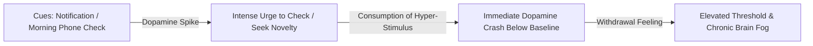

1. **The Pursuit Circuit**: Dopamine surges when your brain expects a potential reward (such as seeing a notification badge or scrolling a new video feed). It generates an acute, energetic feeling of *wanting*.
2. **The Post-Spike Deficit**: The moment you consume high-stimulation, low-effort content, the dopamine spike immediately collapses **below your original baseline**.
3. **The Restless Loop**: This deficit creates an uncomfortable biological state of restlessness and subtle agitation. Your brain interprets this discomfort as a signal to seek another rapid hit, locking you into a continuous cycle of compulsive distraction.

---

### The "Dopamine Loading" Method (Hard Work First)

The single greatest mistake in daily cognitive management is **front-loading high-dopamine inputs into the morning**.

```mermaid
graph TD
    subgraph Toxic Sequence: Morning Hyper-Stimulation
        T1[Wake Up & Check Social Media / Videos] 
        --> T2[Artificial Dopamine Peak Established]
        --> T3[Normal Study / Analytical Work Feels Painfully Boring]
        --> T4[Severe Attention Fragmentation All Day]
    end

    subgraph Sovereign Sequence: Dopamine Loading via Effort
        S1[Wake Up & 2-Hour Digital Blackout]
        --> S2[Deep Analytical Block on Cold Baseline]
        --> S3[Dopamine Released Through Effort & Mastery]
        --> S4[High Energy & Natural Focus Sustained]
    end
```

* **The Threshold Effect**: If you expose your brain to ultra-high stimulation (videos, social feeds, news feeds) within the first hour of waking, you set an artificially elevated dopamine baseline. All subsequent low-stimulation, high-friction cognitive work (reading dense chapters, writing code, solving math) will be perceived by the brain as an intolerable "dopamine desert."
* **The Dopamine Loading Protocol**: Protect your baseline by enforcing a **2-Hour Digital Blackout** upon waking. When you tackle your most demanding analytical problems on a cold, quiet baseline, the brain experiences an *endogenous dopamine surge* born out of problem-solving and competence. This turns challenging study into an intrinsically engaging, addictive state.

---

### The Micro-Milestone Dopamine Cascade

Large, monolithic study goals (e.g., *"Study quantitative aptitude for 6 hours"*) trigger immediate limbic resistance and procrastination.

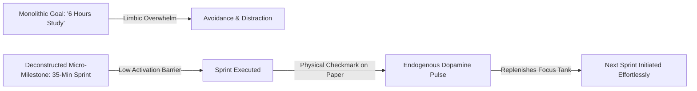

1. **Break Sessions into 30 to 45-Minute Sprints**: Give each sprint one discrete, measurable objective (e.g., *"Solve 15 probability questions"*).
2. **Physical Checkmark Logging**: Keep a physical notebook beside your desk and draw an ink checkmark the moment a sprint ends. The tactile physical act of checking off a completed milestone triggers a micro-pulse of dopamine that recharges cognitive stamina for the next block.

---

### The Protected Evening Reward Window

Discipline is not about ascetic deprivation; it is about **temporal quarantine**.

* **The Pavlovian Contract**: Quarantine all high-dopamine recreation (gaming, watching shows, social communication) to a strictly bounded **evening window (e.g., 8:00 PM – 10:00 PM)**.
* **The Psychological Effect**: When the brain knows that guaranteed, guilt-free relaxation awaits at night, daytime resistance diminishes. You no longer need to sneak micro-distractions during deep-work blocks because your reward is guaranteed upon completion of the day's commitments.

---

### Attention Residue & The Myth of Context Switching

Every time you glance away from deep work to check a notification for 5 seconds, your attention does not switch cleanly.

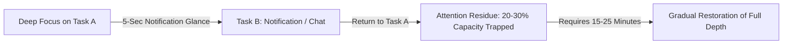

* **The Research**: Studies in cognitive science demonstrate that a substantial portion of your prefrontal processing power remains "stuck" on the interrupted stimulus (**Attention Residue**).
* **The Cost**: Jumping between messages and deep study reduces effective cognitive IQ, creates rapid mental exhaustion, and prevents the brain from entering theta/gamma synchrony (the flow state).

---

### Non-Sleep Deep Rest (NSDR): Restoring Striatal Dopamine

When mental fatigue accumulates in the afternoon, most people turn to caffeine or digital scrolling, which further depletes the nervous system.

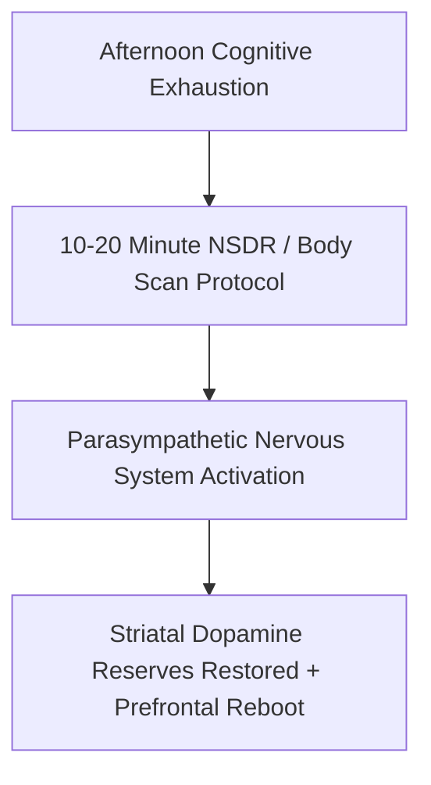

* **The Biological Mechanism**: Non-Sleep Deep Rest (NSDR / Yoga Nidra) is a structured 10 to 20-minute protocol of sensory withdrawal, slow rhythmic breathing, and progressive body scanning.
* **The Neurochemical Yield**: Clinical imaging reveals that 20 minutes of NSDR restores striatal dopamine reserves and resets prefrontal cognitive stamina without the sleep inertia or grogginess of daytime naps.

---

### The Gap Protocol: Breaking Neural Shortcuts

Whenever you finish a demanding task or experience a brief pause in your day, notice the instinctive reflex to grab your phone for immediate relief.

* **The Mechanism**: This reflex reinforces a neural shortcut that pairs any minor cognitive discomfort with instant digital stimulation.
* **The Practice**: Insert an intentional **60-to-120-second "gap of zero input"** before transitioning between tasks. Stare at a wall, breathe, or stretch without consuming any information. This brief pause allows your dopamine receptors to reset without triggering a sharp deficit.

---

### The Three Laws of Sustainable Attention

1. **Decouple Effort from Instant Payoffs**: Train yourself to enjoy the friction of the process rather than relying on external rewards. When you attach reward to the effort itself, dopamine is released during the work, providing infinite internal fuel.
2. **Eliminate Variable-Reward Traps**: Social media feeds and algorithmic platforms use variable-ratio reinforcement schedules (the same mechanic as slot machines). Remove infinite scroll feeds from your primary work devices.
3. **Embrace Low-Stimulation Stillness**: Allow yourself to experience pure boredom for 10 minutes every day. Boredom is not wasted time; it is the biological incubation chamber where dopamine sensitivity is restored and creative insights emerge.

---

### The Core Takeaway to Remember
> Distraction is not a character flaw; it is an addiction to dopamine anticipation. Sequence your day with effort first, isolate the morning from digital inputs, load your dopamine through micro-milestones, restore your reserves through NSDR, and quarantine high-stimulation rewards to a protected evening window.

---

## Chapter 3: Supernormal Stimuli & Urge Surfing

The human brain evolved in an ancestral environment of scarcity. For hundreds of thousands of years, high-calorie food, social approval, and reproductive opportunities required immense physical exertion and patience.

In the modern digital landscape, the brain encounters **Supernormal Stimuli**—artificial, hyper-concentrated sources of stimulation (such as infinite short-form video, hyper-palatable processed food, and digital pornography) that deliver neurochemical surges far exceeding anything found in nature.

Simultaneously, the brain encounters **The Friction Paradox**: demanding cognitive work (studying complex theory, deep analytical writing, building systems) generates immediate internal discomfort.

The modern mind is caught between two complementary impulses:
1. **The Compulsive Pull (Addiction)**: The urge to seek an effortless, immediate dopamine surge.
2. **The Avoidance Push (Procrastination)**: The urge to escape immediate cognitive discomfort and friction.

Both challenges share the exact same neurobiological mechanism. Mastering them requires the singular metacognitive skill of **Urge Surfing**.

---

### The Dual-Front Mechanism of Impulse Control

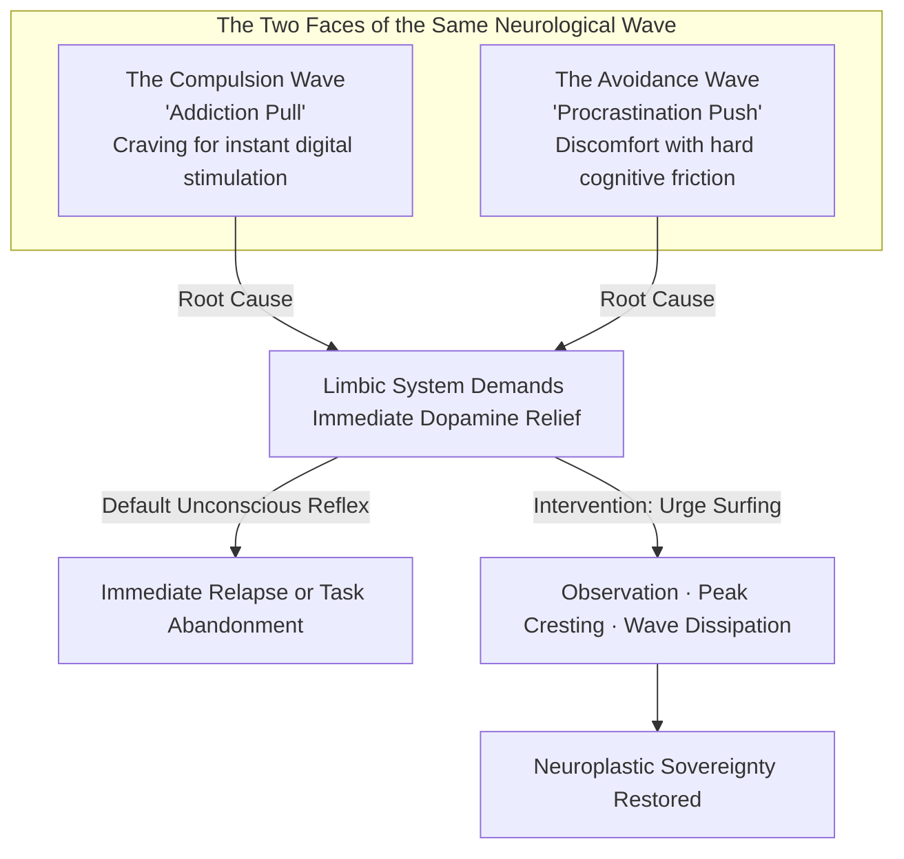

---

### The Fallacy of White-Knuckle Suppression

The most common mistake when attempting to break a compulsive habit or force focus is **brute-force thought suppression** (*"I must not look at my phone"* or *"I must force myself to like this hard task"*).

* **The Ironic Process Theory**: When you consciously try *not* to think about an impulse, your brain must constantly scan your subconscious to check whether you are thinking about it. This paradoxical monitoring keeps the neural circuit in a state of high arousal.
* **The Shame-Relapse Cycle**: Suppressing urges with self-criticism and guilt increases psychological stress (cortisol). Because your brain was conditioned to use the compulsive behavior to soothe stress in the first place, guilt directly accelerates the next relapse or distraction loop.

---

### The Unified Technique of Urge Surfing

Developed in clinical addiction psychology by Dr. Alan Marlatt, **Urge Surfing** approaches physical and mental cravings not as commands to obey or enemies to fight, but as **transient physiological waves**.

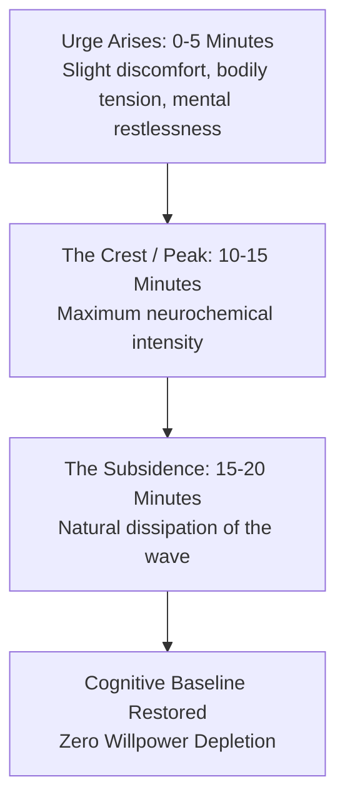

An urge is not an infinite upward climb; it is an ocean wave that peaks within **10 to 15 minutes** (for compulsive cravings) or **3 to 5 minutes** (for procrastination friction) and naturally subsides if it is not fed by mental fantasy or physical action.

#### The 3-Step Urge Surfing Protocol:
1. **Shift to the Observer Stance**: The moment a craving or procrastination aversion strikes, mentally step back. Say to yourself: *"My brain is experiencing a dopamine wave; I am the observer watching this wave, not the wave itself."*
2. **Body Scan Localization**: Locate where the physical sensation of the urge is living in your body (tightness in the chest, heat in the stomach, restlessness in the hands, tension behind the eyes).
3. **Breathe into the Sensation**: Instead of resisting or grabbing your phone for immediate escape, breathe deeply into that physical sensation with neutral curiosity. Watch the intensity rise, peak, and dissolve.

---

### Applying Urge Surfing to Overcome Procrastination

When sitting down to study or do deep work, notice that the desire to check notifications or abandon the desk is at its **maximum intensity during the first 3 minutes**.

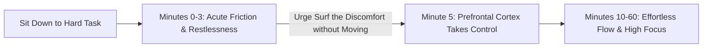

* **The Friction Wave**: The initial discomfort is not permanent; it is simply the friction of shifting neural gears from passive consumption to active calculation.
* **The 3-Minute Rule**: Agree to sit with the physical friction for just 180 seconds without touching another tab or device. Once the initial friction wave crests, the brain slips into deep immersion.

---

### The HALT Diagnostic: Unmasking Emotional Triggers

Compulsive digital consumption and procrastination are rarely about the task or stimulus itself; they are almost always **unconscious coping mechanisms** for underlying unmet biological deficits.

| State | Underlying Deficit | The True Physical Solution |
| :--- | :--- | :--- |
| **H — Hungry** | Low blood glucose & metabolic fatigue | Eat a nutrient-dense whole-food meal |
| **A — Angry / Anxious** | Elevated cortisol & sympathetic stress | 5-minute box breathing or physical walk |
| **L — Lonely** | Oxytocin deficit & social isolation | Reach out to a friend or work in a shared space |
| **T — Tired / Bored** | Prefrontal cortex depletion | Sleep, rest, or step away from all screens |

---

### The Receptor Restoration Timeline

When you consistently urge-surf rather than surrender to supernormal stimuli, the brain undergoes a predictable neuroplastic reset:

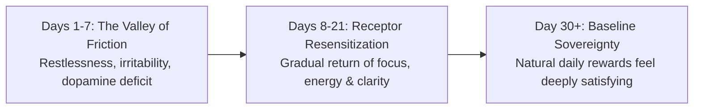

1. **The Friction Phase (Days 1–7)**: As the brain adapts to the absence of hyper-stimulation, you will experience transient boredom and lethargy. This is the physiological signature of healing.
2. **The Resensitization Phase (Days 8–21)**: D2 dopamine receptors in the striatum begin to multiply and regain sensitivity.
3. **The Emergence of Natural Reward (Day 30+)**: Normal activities—reading a book, having a deep conversation, exercising, or solving a hard problem—begin to feel intrinsically engaging and deeply rewarding again.

---

### The Core Takeaway to Remember
> Cravings and procrastination are not character flaws; they are transient neurochemical waves. You do not need to fight the wave or obey it—simply observe it without judgment, let it crest and subside, and allow your brain's natural sovereignty to return.

---

## Chapter 4: The Neurobiology of Meditation & Structural Rewiring

Meditation is often misunderstood as an esoteric, mystical ritual or a passive attempt to "empty the mind of all thoughts."

In cognitive neuroscience and brain imaging, meditation is an **empirical strength-training regimen for the prefrontal cortex**. It is a structured practice of attentional calibration that produces measurable, permanent changes in brain structure and functional connectivity.

When an untrained individual goes through the day, their brain is dominated by the **Default Mode Network (DMN)**—a circuit responsible for chronic rumination, ego defensiveness, and time-traveling between past regrets and future anxiety. Regular meditation mechanically quiets this network while physically restructuring the brain's emotional and executive centers.

---

### The Neuroplastic Transformation (What Happens to Brain Structure)

MRI brain imaging studies (such as landmark research from Harvard neuroscientist Dr. Sara Lazar) reveal that just **8 weeks of consistent 15-minute daily meditation** alters gray matter density in three distinct brain regions:

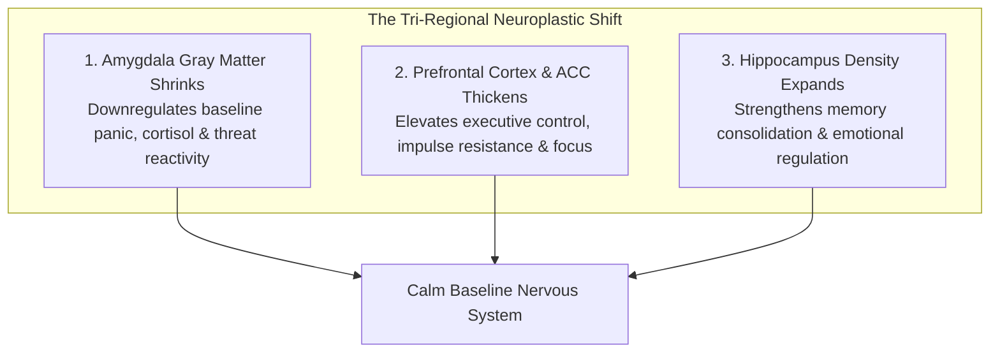

1. **The Amygdala (The Threat Center) Shrinks**: The physical size and cellular density of the amygdala decreases. As a result, daily stressors that previously triggered anger, panic, or avoidance no longer hijack the nervous system.
2. **The Prefrontal Cortex (PFC) & Anterior Cingulate Cortex (ACC) Thicken**: Gray matter volume increases in the areas governing working memory, decision-making, and deliberate focus.
3. **The Hippocampus (The Memory Hub) Expands**: Synaptic density increases in the hippocampus, boosting the consolidation of complex concepts and resilience against chronic stress.

---

### The 4-Step Attentional Loop (The "Bicep Curl" of the Mind)

The single greatest misconception beginners have is believing that a successful meditation session requires 15 minutes of perfect, uninterrupted silence.

When your mind inevitably drifts into thoughts about exams, meals, or memories, beginners feel frustrated and conclude: *"I am terrible at meditating."* In cognitive neuroscience, **mind-wandering is not a failure—it is the prerequisite for neuroplastic growth**.

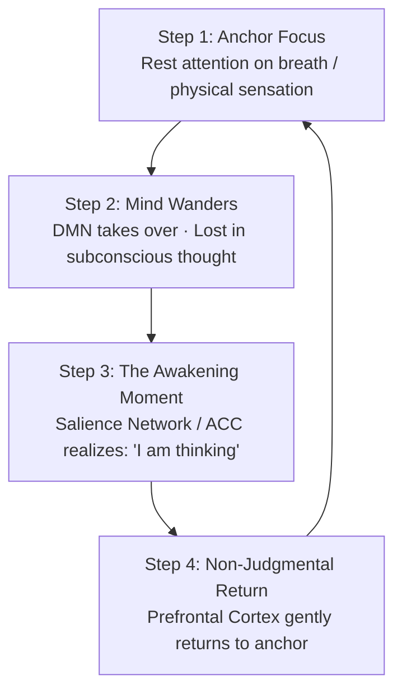

* **The Neural Mechanism**: The entire neuroplastic benefit occurs in the transition between **Step 3 and Step 4**.
* **The Resistance Metaphor**: Just as a muscle fiber grows only when you lift a physical weight against gravity, your attention network strengthens only when you catch the wandering mind and intentionally redirect it back to the anchor.
* If your mind wanders 50 times in a session and you gently bring it back 50 times, you have executed **50 neural bicep curls**.

---

### The SOAR Protocol: Bringing Meditation into Daily Action

The ultimate objective of meditation is not to remain calm in a quiet room on a cushion; it is to maintain **cognitive sovereignty in the middle of high-stakes pressure**.

Whenever an acute distraction, anxiety spike, or procrastination urge strikes during your workday or study block, execute the **SOAR Protocol**:

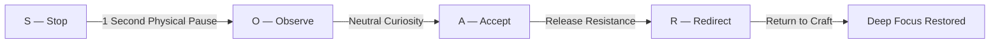

1. **S — Stop**: The moment you feel emotional agitation or the reflex to check your phone, physically pause for 1 second. Do not move your hands.
2. **O — Observe**: Witness the physiological sensation in your body (tightness in the throat, chest constriction, or restlessness). Name it neutrally: *"My brain is experiencing an urge spike."*
3. **A — Accept**: Allow the uncomfortable sensation to exist in the body without judging yourself or fighting the feeling.
4. **R — Redirect**: Take one slow exhalation and redirect 100% of your prefrontal attention back to the single next sentence, formula, or problem in front of you.

---

### The Core Takeaway to Remember
> Meditation is not about stopping thoughts; it is about changing your relationship to them. Every time you notice your mind has wandered and calmly return to the present moment, you physically rewire your brain—shrinking fear, strengthening focus, and building an unshakeable inner anchor.

---

## Chapter 5: The Hydraulic Mind — Indiscipline as Misdirected Energy

When people struggle with chronic distraction, afternoon lethargy, or lack of discipline, they almost universally diagnose themselves with an **energy deficit**: *"I just don't have enough drive, energy, or stamina to do what needs to be done."*

In cognitive neurobiology and psychodynamics, this diagnosis is fundamentally false. **The human nervous system is rarely depleted of energy; it is suffering from an energy direction failure and invisible micro-thefts.**

Consider what happens when an "undisciplined" individual is given a hyper-stimulating video game, an intense online debate, or an engaging movie: they can effortlessly expend massive amounts of cognitive focus, strategic calculation, and emotional energy for six continuous hours without a single trace of fatigue. The biological power plant is functioning at maximum capacity, but the current is being drained by **parasitic energy sinkholes and subconscious leaks**.

---

### The Conservation Law of Psychic Energy

Just as the First Law of Thermodynamics states that energy cannot be created or destroyed—only transformed from one form to another—the human mind operates under a **hydraulic energy model**:

```mermaid
graph TD
    subgraph Raw Biological Energy Potential
        E[Daily Neurochemical & Metabolic Wattage]
    end

    subgraph The Invisible Thieves & Parasitic Leaks
        T1[1. Open Loop Bleed: Unclosed tasks draining subconscious RAM]
        T2[2. Emotional Shame Debt: Guilt over past procrastination]
        T3[3. Blood Glucose Volatility: High-glycemic crashes]
        T4[4. Rumination & Social Drama: Simulating unresolvable conflicts]
    end

    subgraph The Sovereign Channel (High-Yield Output)
        C[Monastic Deep Work · Creative Synthesis · Physical Vitality]
    end

    E -->|Default Subconscious Leakage| T1 & T2 & T3 & T4
    E ==>|Hydraulic Canalization & Leak Patching| C
```

* **The River Principle**: Your mental energy is like a rushing mountain river. You cannot stop the river by building a fragile wall of brute willpower—the water pressure will simply build up, breach the dam, and cause an explosive relapse into distraction.
* **Canalization over Suppression**: You do not suppress psychic energy; you **dig new irrigation canals** and patch the invisible leaks so that the natural current has nowhere to flow except through meaningful, high-leverage craft.

---

### The Four Invisible Thieves Stealing Your Energy

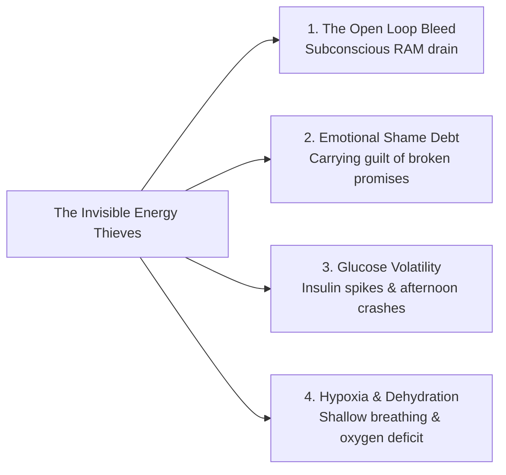

1. **The Open Loop Bleed (Subconscious RAM Drain)**:
   * Every unfinished task, unreplied email, delayed chore, or postponed decision does not vanish when ignored. It continues to run as a **background process in working memory** (the Zeigarnik effect), silently consuming up to 30% of your prefrontal processing power.
2. **Emotional Shame Debt (The Guilt Tax)**:
   * When you procrastinate and spend 3 hours beating yourself up with internal self-criticism, you expend more metabolic energy on *self-loathing* than the actual work would have taken. Guilt is the heaviest emotional tax on biological vitality.
3. **The Blood Glucose Rollercoaster (Metabolic Theft)**:
   * Consuming high-sugar snacks, refined carbs, or heavy processed meals spikes blood glucose, triggering massive insulin surges followed by reactive hypoglycemia. The brain interprets this sudden glucose drop as an emergency, inducing severe brain fog, sleepiness, and panic cravings.
4. **Chronic Sub-Clinical Hypoxia & Micro-Dehydration**:
   * Sitting hunched over a desk induces shallow, rapid chest breathing and mild dehydration. A 2% drop in cellular hydration and chronic shallow breathing reduces cerebral blood oxygenation by 15% to 20%, mimicking clinical exhaustion.

---

### The Principle of Sublimation: Channeling Raw Drive

In analytical psychology, **Sublimation** is the mature psychological defense mechanism whereby primal, raw biological drives (restlessness, anxiety, anger, sexual energy, obsessive focus) are transmuted into socially productive, intellectually demanding activities.

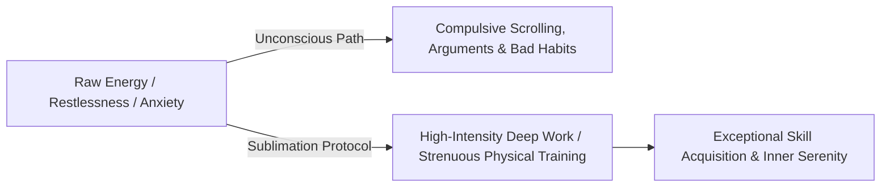

* When you feel intensely restless, agitated, or anxious, do not attempt to force yourself into passive stillness.
* **Convert the state kinetically**: Channel that high-arousal energy into a demanding physical workout, a timed problem-solving sprint, or a structured architectural brainstorm. Restlessness is simply unexpressed power looking for a conduit.

---

### The Protocols for Total Energy Sovereignty

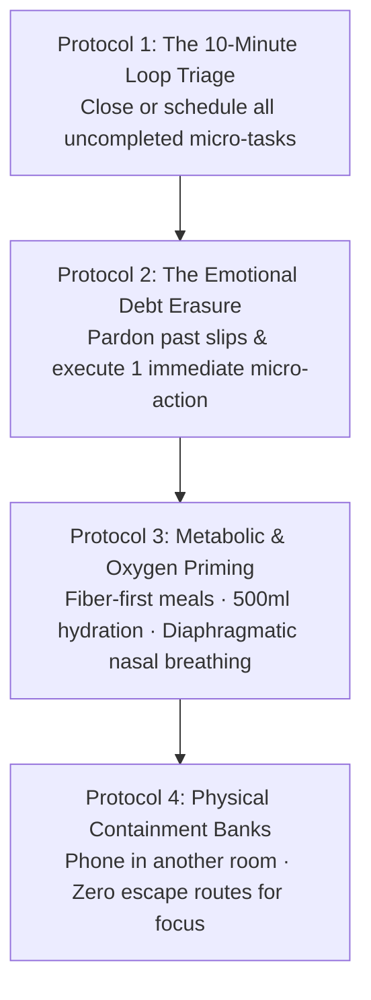

#### 1. The 10-Minute Loop Triage (RAM Cleanup)
* Sit with a blank sheet of paper and write down every single uncompleted task or half-made decision bouncing around in your head.
* Apply a 2-minute rule: either execute it immediately, delegate it, schedule an exact calendar time for it, or delete it permanently. Once working memory knows the task is safely externalized, the subconscious background process terminates.

#### 2. Emotional Debt Erasure (Forgive the Past)
* Recognize that guilt does not produce discipline; guilt produces dopamine seeking.
* Mentally forgive yesterday's procrastination with complete finality. Wipe the psychological ledger clean and deposit proof into your identity bank through a single 5-minute work sprint right now.

#### 3. Metabolic & Respiratory Priming
* Prioritize whole foods, fiber, and clean protein before complex study blocks to maintain a smooth, flat glucose curve.
* Every 60 minutes, take 5 slow, deep physiological sighs (double inhale through the nose, long extended exhale through the mouth) to instantly re-oxygenate neural tissues and reset vagal tone.

#### 4. Build Physical Containment Banks
* A river stays powerful only when constrained between two narrow, rigid riverbanks.
* Lock the phone in another room, close all unrelated tabs, and clear the physical desk. When energy has zero escape routes, it naturally pours into the craft directly in front of you.

---

### The Core Takeaway to Remember
> You are not lazy, broken, or lacking in energy. You are an energetic powerhouse being quietly drained by open loops, emotional guilt, metabolic crashes, and unmanaged plumbing. Patch the invisible leaks, clear your subconscious RAM, build unbreakable environmental riverbanks, and direct your full wattage into deep, transformative craft.

---

# Volume 2: Daily Systems & Habit Architecture

## Chapter 6: The Circadian Architecture & Early Waking

Waking up early is almost universally framed as a test of raw willpower and moral discipline: *"You just have to force yourself out of bed."*

In chronobiology and neuroscience, **waking up at 4:30 AM is not a willpower contest; it is a circadian and systems engineering problem**. If you attempt to conquer your mornings without managing your evening biological de-escalation, you are fighting millions of years of evolutionary physiology—and your primal brain will choose comfort every single time.

Waking up effortlessly requires aligning three interrelated biological systems: **the Adenosine Sleep-Drive Curve**, **the Evening Melatonin Release Window**, and **the Morning Cortisol Awakening Response (CAR)**.

---

### The Biological Engine: The Circadian Cycle

```mermaid
graph TD
    subgraph Phase 1: Evening De-escalation (9:00 PM - 10:00 PM)
        E1[Light Dimmed · Blue Light Eliminated] --> E2[Melatonin Surge & Core Body Temp Drops]
        E2 --> E3[Progressive Muscle Relaxation / PMR & NSDR]
        E3 --> E4[Rapid Sleep Onset & Deep Delta Waves]
    end

    subgraph Phase 2: Adenosine Clearance (10:00 PM - 4:30 AM)
        A1[Glymphatic System Clears Metabolic Waste & Adenosine]
        --> A2[Restorative Sleep Cycles Completed]
    end

    subgraph Phase 3: Morning Ignition (4:30 AM - 5:30 AM)
        M1[Alarm-Action Chain: Feet on Floor] --> M2[500ml Hydration + Bright Photon Exposure]
        M2 --> M3[Melatonin Crushed · Cortisol Awakening Response Channels into Deep Craft]
    end

    Phase 1 --> Phase 2 --> Phase 3
```

---

### Why Early Waking Fails: The Evening Root Cause

The fatal mistake most people make is focusing 100% of their discipline on the morning alarm while completely ignoring the preceding night. **Your 4:30 AM morning is biologically determined by 9:30 PM the night before.**

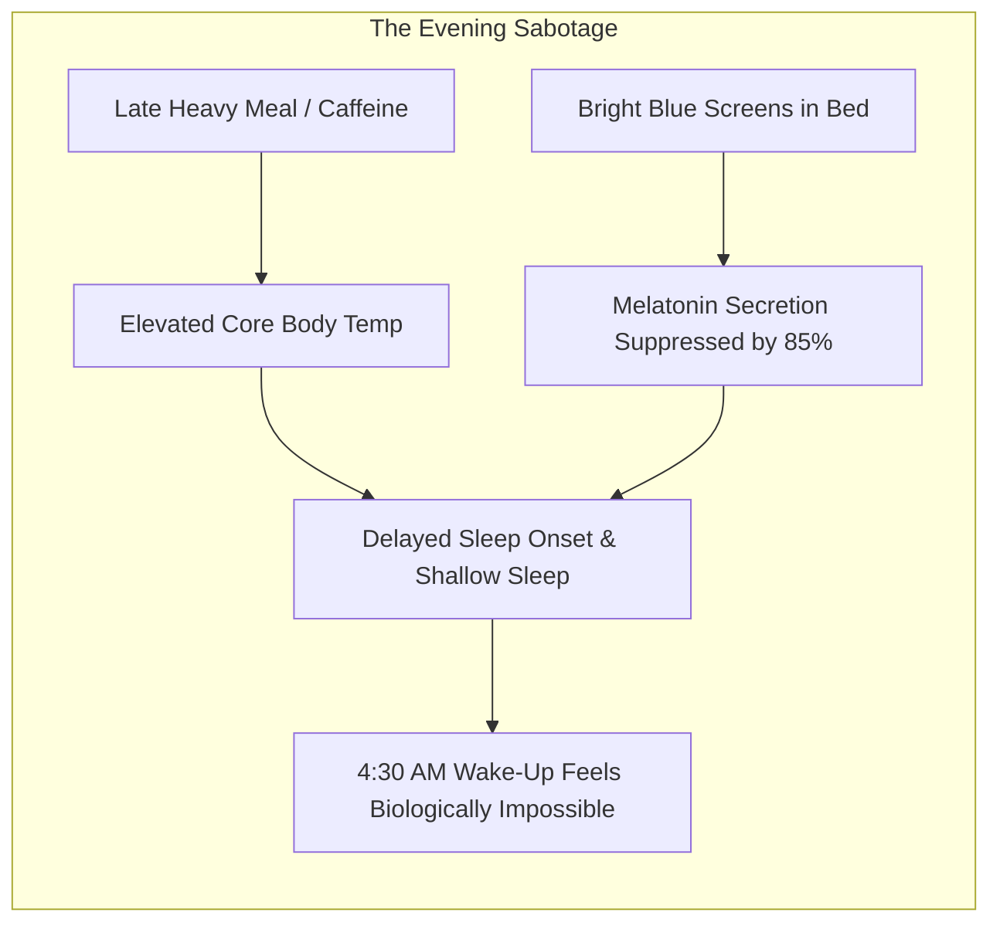

1. **The Screen & Light Trap**: Exposure to blue and white LED light after 9:00 PM tricks the suprachiasmatic nucleus (the brain's master clock) into believing it is midday, suppressing melatonin secretion by up to 85%.
2. **The Thermal Barrier**: To initiate deep sleep, your core body temperature must drop by approximately $1^\circ\text{C}$ ($2^\circ\text{F}$). Late-night digestion of heavy meals or intense late-night workouts keeps core temperature elevated, preventing rapid sleep onset.
3. **The Multi-Alarm Pathology**: Setting 5 recurring alarms at 5-minute intervals (e.g., 4:30, 4:35, 4:40, 4:45) is neurological self-sabotage. It trains your subconscious brain to treat your alarm as optional background noise rather than an immediate non-negotiable command.

---

### The Evening De-escalation Protocol (The 30-Minute Anchor)

To guarantee effortless early waking, install a strict 30-minute wind-down ritual before sleep:

```mermaid
graph TD
    W1[30 Minutes Before Bed: Digital Blackout<br>Devices plugged in outside the bedroom]
    --> W2[Progressive Muscle Relaxation / PMR<br>Systematically tense and release muscle groups from toes to face]
    --> W3[NSDR / Slow Physiological Sighs<br>Activates parasympathetic vagal tone and lowers heart rate]
    --> W4[Sleep Onset within 10 Minutes]
```

* **The Digital Airgap**: Charge your phone across the room or in another room. This eliminates late-night blue light and forces you out of bed to turn off your morning alarm.
* **Progressive Muscle Relaxation (PMR)**: For those with racing bedtime thoughts, systematically tense each muscle group for 5 seconds and release for 10 seconds. This forces physical relaxation signals up the spinal cord to the brain, halting cognitive rumination.
* **NSDR (Non-Sleep Deep Rest)**: A 10-minute session of slow diaphragmatic breathing and sensory release drops brainwave activity into the restorative theta/delta boundary.

---

### The Morning Ignition System: The 5-Step Chain

The moment your alarm rings at 4:30 AM, you have a 3-second neurobiological window to initiate the **Alarm-Action Chain**:

```mermaid
graph LR
    A1[Step 1: 3-Second Rule<br>Feet hit floor immediately] 
    --> A2[Step 2: Physical Disconnect<br>Walk across room to silence alarm]
    --> A3[Step 3: Lights On<br>Flood eyes with photons]
    --> A4[Step 4: 500ml Water<br>Electrolyte cellular hydration]
    --> A5[Step 5: Cold Baseline Sprint<br>Immediate deep work]
```

1. **The 3-Second Launch**: Count *3... 2... 1...* and swing your feet onto the floor before your limbic system can rationalize staying under the blankets.
2. **Single-Alarm Commitment**: Delete all secondary alarms. Treat your single alarm with absolute finality.
3. **Photon Inundation**: Turn on overhead lights immediately. Bright light striking your retinal ganglion cells instantly signals the brainstem to suppress any remaining melatonin and trigger wakefulness.
4. **Hydration Ignition**: Drink 500ml of room-temperature water with a pinch of sea salt to rehydrate tissues and kickstart digestive motility.
5. **The Cold Baseline Deep Sprint (The Sanctuary)**: Protect the first 60 minutes from digital feeds and begin your single highest-priority cognitive task while your executive focus is unpolluted.

---

### The Core Takeaway to Remember
> Early waking is an engineering problem, not a character test. Win the evening by clearing blue light and dropping your core temperature, eliminate the snooze trap with a single across-the-room alarm, ignite your biology with light and water, and turn the quiet morning hours into your unfair competitive advantage.

---

## Chapter 7: The High-Agency Reset — The Monk Mode Blueprint

Most human lives are not governed by conscious choice; they are governed by **subconscious inertia, algorithmic conditioning, and default drift**.

When you wake up and immediately react to notifications, drift through workday obligations, consume hyper-stimulating entertainment in the evening, and sleep without reflection, your brain operates inside the **Autopilot Trap** (excessive dominance of the Default Mode Network).

To break free from reactive drift, you do not need chaotic, emotional motivation. You need **Monk Mode: a deterministic, high-agency operating system** that systematically recalibrates your dopamine sensitivity, executive focus, physical baseline, and skill trajectory.

---

### The Monk Mode Architecture: The 5 Non-Negotiable Pillars

```mermaid
graph TD
    subgraph The Monk Mode Pentad
        P1[Pillar 1: Digital Blackout & Dopamine Fasting<br>Zero cheap algorithmic stimulation · Social media purge]
        P2[Pillar 2: Monastic Deep Work<br>90-120 Min unbroken single-task cognitive sprints]
        P3[Pillar 3: Physical Conditioning & Hormesis<br>Daily resistance/cardio · Cold exposure · Vagal reset]
        P4[Pillar 4: Metabolic & Circadian Discipline<br>Whole-food nutrition · Fasting windows · 10 PM sleep anchor]
        P5[Pillar 5: Stillness & Reflective Synthesis<br>15 Mins seated meditation · Evening journaling ledger]
    end

    P1 -->|Restores Dopamine Baseline for| P2
    P2 -->|Compounds Practical Mastery via| P3
    P3 -->|Stabilizes Biology & Energy through| P4
    P4 -->|Deepens Mental Clarity for| P5
    P5 -->|Protects Sovereignty & Feeds back into| P1
```

---

### Pillar 1: Digital Blackout & Dopamine Fasting (Signal Calibration)
* **The Problem**: Constant micro-stimulation desensitizes striatal dopamine receptors, making deep study feel painfully boring.
* **The Non-Negotiable**: Enforce a total blackout on algorithmic short-form video, video games, and frivolous group chats throughout the Monk Mode sprint. High-dopamine inputs are quarantined or eliminated entirely.
* **The Yield**: Baseline dopamine sensitivity recovers, restoring intrinsic fascination with difficult books, complex problems, and quiet crafts.

---

### Pillar 2: Monastic Deep Work (Cognitive Capital)
* **The Problem**: Shallow work (checking emails, jumping across tabs, superficial reading) gives the illusion of productivity while building zero career leverage.
* **The Protocol**: Complete at least one **90 to 120-minute unbroken cognitive block** every morning before the world begins demanding your attention.
* **The Rule**: A single tab open, phone isolated in another room, and zero communication tools running.

---

### Pillar 3: Physical Conditioning & Hormesis (The Biological Anchor)
* **The Problem**: A sedentary body traps chronic cortisol in tissues and depresses prefrontal blood circulation.
* **The Practice**: 30 to 45 minutes of daily resistance training, high-intensity intervals, or brisk outdoor movement combined with cold showers.
* **The Mechanism**: Physical exertion spikes Brain-Derived Neurotrophic Factor (BDNF) and endocannabinoids, eliminating mental restlessness and anchoring emotional stability.

---

### Pillar 4: Metabolic & Circadian Discipline (Clean Cellular Fuel)
* **The Problem**: Heavy processed carbohydrates, late-night meals, and erratic sleep cycles induce systemic brain inflammation and afternoon crashes.
* **The Standard**:
  1. Eat nutrient-dense whole foods with zero refined sugars.
  2. Maintain a consistent 8-hour sleep window anchored at 10:00 PM.
  3. Hydrate immediately upon waking with 500ml of mineralized water.

---

### Pillar 5: Daily Stillness & Reflective Synthesis (Wisdom Ledger)
* **The Problem**: Without reflection, mistakes are repeated daily and mental loops remain unclosed.
* **The Practice**:
  * **Morning Stillness**: 10 to 15 minutes of seated mindfulness/breath observation to expand the gap between stimulus and response.
  * **Evening Ledger**: 5 minutes before bed recording:
    1. *Where did I execute with high agency today?*
    2. *Where did I experience resistance or leaks?*
    3. *What is my single non-negotiable lead priority for tomorrow?*

---

### The Three Operational Rules of Monk Mode

```mermaid
graph LR
    A[Monk Mode Rules] --> R1[1. Binary Execution<br>Non-negotiables are 100% done or 0% done · No grey compromises]
    A --> R2[2. Bounded Sprints<br>Operate in 21 to 60-day cycles]
    A --> R3[3. Controlled Decompression<br>Never celebrate completion with a dopamine binge]
```

1. **Binary Execution (Zero Negotiation)**: Non-negotiables have no middle ground. An action is either executed or not. This eliminates the energy-draining mental debate (*"Should I study today or rest?"*).
2. **Bounded Sprint Horizon**: Monk Mode is not a perpetual ascetic sentence; it is a **21 to 60-day high-intensity sprint** designed to create a quantum leap in skill, rank, or health.
3. **Controlled Decompression (The Rebound Defense)**: The biggest trap of Monk Mode is bingeing on dopamine the day after completion. Transition smoothly into a sustainable high-standard baseline.

---

### The 21-Day Neuroplastic Transformation Curve

```mermaid
graph LR
    D1[Days 1-7: The Valley of Friction<br>Old dopamine habits fight for comfort · Boredom & resistance] 
    --> D2[Days 8-14: The Stabilization Phase<br>Routines become smooth · Focus stamina doubles] 
    --> D3[Days 15-21+: The Quantum Baseline<br>High-agency focus becomes your effortless default state]
```

* **The Friction Hurdle**: During the first 7 days, your subconscious will generate dozens of excuses to break the protocol.
* **The Breakthrough**: By day 21, previous dopamine pathways atrophy, prefrontal control becomes second nature, and monastic focus feels calm, natural, and deeply empowering.

---

### The Core Takeaway to Remember
> Monk Mode is not about punishment; it is about reclaiming your sovereignty. Eliminate cheap stimulation, guard your morning deep work, train your physical body, fuel your biology, and close every day with honest reflection. When you master your daily non-negotiables, mental rebirth is the inevitable result.

---

## Chapter 8: The Diderot Effect & Habit Cascades

Most people treat their habits as isolated events. You might believe that eating junk food, skipping a workout, mindlessly scrolling social media, and staying up late are four distinct problems requiring four separate battles of willpower. 

In behavioral psychology, human actions rarely occur in isolation. Instead, they operate as **interconnected behavioral cascades**—where a single initial choice triggers an involuntary chain reaction of complementary behaviors. 

This psychological mechanism is known as the **Diderot Effect**.

---

### The Origin of the Spiral: The Scarlet Dressing Gown

In the 18th century, the French philosopher Denis Diderot lived in modest circumstances. Upon receiving an exquisite scarlet dressing gown as a gift, he noticed a sudden psychological discord: the elegance of his new gown made his existing wooden desk, tattered chair, and simple tapestries appear shabby. 

Compelled to match the standard set by the gown, Diderot purchased a new leather chair, replaced his desk with expensive furniture, bought new artwork, and eventually spiraled into heavy debt. He wrote: *"I was the absolute master of my old robe; I have become the slave of the new one."*

```mermaid
graph TD
    A[Single New Stimulus / Action] --> B[Cognitive Discord with Surrounding Context]
    B --> C[Drive to Create Environmental Harmony]
    C --> D[Cascade of Complementary Actions & Desires]
    D --> E[Emergence of a New Behavioral Baseline]
```

---

### The Two Directions of Behavioral Cascades

The Diderot Effect governs both destruction and mastery in daily life:

```mermaid
graph LR
    subgraph The Downward Spiral
        D1[Domino 1: Eat sugary breakfast] --> D2[Blood sugar crash & lethargy]
        D2 --> D3[Skip afternoon workout]
        D3 --> D4[Late-night dopamine binge & poor sleep]
    end

    subgraph The Upward Spiral
        U1[Domino 1: 5-minute morning walk] --> U2[Calibrated circadian rhythm & alert focus]
        U2 --> U3[High-agency decision making]
        U3 --> U4[Deep evening rest & recovery]
    end
```

#### 1. The Downward Cascade (Negative Feedback Loops)
A single compromise at the beginning of the day lowers your internal identity baseline. Once the first domino falls, your brain rationalizes subsequent bad choices to maintain cognitive consistency with your current compromised state (*"I've already ruined my morning, so I might as well skip the gym and order takeout"*).

#### 2. The Upward Cascade (Positive Habit Stacking)
Conversely, one intentional, high-standard anchor action sets a high psychological baseline for the day. Cleaning your desk or completing a brief morning workout creates a standard of excellence that naturally repels low-agency behaviors throughout the afternoon.

---

### How to Master Habit Cascades: Three Core Protocols

To harness the Diderot Effect and prevent destructive domino chains, implement three structural protocols:

#### 1. Identify and Defend the "Lead Domino" (Keystone Trigger)
Never fight habits at the end of the chain. If you struggle with late-night binge-eating or phone addiction in bed, the real battle is not happening at 11:00 PM—it was decided at 7:00 PM when you brought your charger into the bedroom or skipped an evening meal.
* **Audit the Sequence**: Trace every recurring bad habit backward to identify the specific initial trigger (*The Lead Domino*).
* **Concentrate Defense**: Direct 100% of your conscious discipline solely to defending that first trigger. If the first domino never falls, the remaining ten downstream habits are never activated.

#### 2. Install Artificial Circuit Breakers (The "Never Twice" Rule)
When a negative lead domino inevitably falls, the goal is not perfection—it is **chain termination**.

```mermaid
graph LR
    A[Slip Occurs: Initial Bad Choice] --> B{Circuit Breaker Activated?}
    B -->|Yes: Immediate Physical Reset| C[Chain Terminated at Domino 1]
    B -->|No: Emotional Self-Criticism| D[Complete Downward Cascade]
```

* Establish a strict rule: **A bad choice is an accident; a second consecutive bad choice is the start of a new habit cascade.**
* If you eat poorly or get distracted, execute an immediate physical circuit breaker (e.g., wash your face with cold water, take a 5-minute walk outside, or step away from screens) to reset your nervous system baseline immediately.

#### 3. Identity Anchoring through Environmental Harmony
Your physical environment constantly whispers to you about who you are.
* If your physical workspace is cluttered with snack wrappers, open tabs, and chaotic cables, your environment invites scattered, undisciplined behavior.
* When you curate an environment of absolute cleanliness, minimalist order, and functional tools, your subconscious mind naturally aligns its actions with that elevated standard.

---

### The Core Takeaway to Remember
> You rarely have ten separate habit problems; you usually have one fragile lead domino. Protect your initial daily anchor, install circuit breakers when you stumble, and let positive behavioral cascades elevate your default standard of living.

---

## Chapter 9: The Anatomy of Indiscipline & Identity Anchors

Chronic indiscipline is almost never caused by a lack of information.

In the modern era, nearly everyone knows what they *should* do: eat nourishing foods, exercise regularly, read deeply, avoid compulsive screen time, and execute focused daily work. The crisis of indiscipline is a **failure of the translation layer between intent and immediate physical action**.

When an individual allows repeated micro-compromises in daily life, they are not merely losing time; they are **subconsciously retraining their brain to treat their own commitments as optional**.

Understanding the neurological anatomy of indiscipline allows you to dismantle the excuse-generating engine and install unbreakable identity anchors.

---

### The Three Stages of Subconscious Decay

Indiscipline does not begin with dramatic, catastrophic failures; it begins with an almost imperceptible three-stage sequence:

```mermaid
graph TD
    S1[Stage 1: The Micro-Compromise<br>'Just 5 minutes of scrolling' · 'I will start tomorrow'] 
    --> S2[Stage 2: Cognitive Rationalization<br>Brain manufactures logical justifications to ease guilt]
    --> S3[Stage 3: The Subconscious Baseline Shift<br>The compromise becomes the new normal standard]
    S3 --> S1
```

1. **The Micro-Compromise**: An intentional agreement with yourself is broken for momentary comfort.
2. **The Rationalization Engine**: To eliminate the uncomfortable sensation of cognitive dissonance (the gap between who you want to be and what you just did), your prefrontal cortex manufactures a convenient lie (*"I had a tiring day,"* *"One day won't make a difference,"* or *"I work better under pressure later"*).
3. **The Baseline Shift**: Because the brain survived the compromise with zero immediate physical consequence, the subconscious lowers its operational standard. What was once an unthinkable breach becomes the default habit.

---

### The Mathematics of Compound Action

Human behavior is governed by exponential power laws. A single compromise or disciplined action appears completely inconsequential in isolation, but over a 365-day horizon, the compounding effect is mathematically devastating:

$$\text{Compound Neglect: } (0.99)^{365} \approx 0.03 \quad (\text{97\% Degradation})$$

$$\text{Compound Discipline: } (1.01)^{365} \approx 37.8 \quad (\text{37x Exponential Growth})$$

```mermaid
graph LR
    subgraph 365-Day Trajectory
        D_Neglect[0.99 Daily Trajectory: Quiet Decay to 0.03]
        D_Growth[1.01 Daily Trajectory: 37.8x Sovereign Compounding]
    end
```

* **The Illusion of Symmetry**: A 1% improvement and a 1% compromise feel identical on any given Tuesday afternoon.
* **The Reality of Divergence**: Over a year, the individual who maintains 1% discipline becomes **more than 1,000 times more capable** than the individual who surrendered to 1% neglect.

---

### The 3-Second Rule: Bypassing the Limbic Hesitation Trap

When your conscious mind recognizes an action that must be taken (e.g., getting out of bed, opening a difficult textbook, shutting down a digital distraction), you have a **3-second neurobiological window** before your emotional limbic system generates friction.

```mermaid
graph LR
    A[Conscious Intent Arises] --> B{Action within 3 Seconds?}
    B -->|Yes: Immediate Physical Movement| C[Prefrontal Control Sustained · Momentum Activated]
    B -->|No: Hesitation > 3 Seconds| D[Limbic Threat System Generates Excuses & Doubt]
```

* **The Science of Hesitation**: The human brain interprets hesitation as a signal of potential threat. If you pause and think for more than 3 seconds, the brain immediately releases micro-signals of anxiety and provides logical excuses to keep you in comfort.
* **The Execution Protocol**: The moment the thought of execution enters your consciousness, count down **3... 2... 1...** and move your physical body immediately. Do not debate, do not negotiate, and do not consult your emotional state.

---

### Identity-Based Anchoring: From Goals to Non-Negotiables

Most people fail to maintain discipline because their efforts are anchored only to **outcome-based goals** (*"I want to lose 5 kg"* or *"I want to clear an exam"*).

```mermaid
graph TD
    subgraph Outcome-Based Motivation (Fragile)
        O1[Outcome Goal] -->|Subject to Daily Emotional Fluctuations| O2[Inconsistent Effort & Frequent Relapse]
    end

    subgraph Identity-Based Anchoring (Unshakeable)
        I1[Core Identity Non-Negotiable] -->|Governs Behavior Irrespective of Mood| I2[Predictable, Relentless Daily Execution]
    end
```

1. **The Outcome Trap**: When you are tired, demotivated, or anxious, an abstract goal six months in the future lacks the immediate neurochemical power to compete with instant dopamine.
2. **The Identity Anchor**: Shift your self-definition from what you want to achieve to **who you are**.
   * Instead of: *"I am trying to study 4 hours today."*
   * Shift to: *"I am a craftsman who never negotiates with his morning deep-work block, regardless of how I feel."*
3. **The Non-Negotiable Rule**: Identify **1 to 2 core anchor behaviors** in your day that are completely non-negotiable. Whether you are inspired, exhausted, traveling, or stressed, these anchors are executed without emotional debate.

---

### The Core Takeaway to Remember
> Indiscipline is not a lack of knowledge; it is a habit of negotiating with your own standards. Never hesitate longer than 3 seconds, anchor your discipline to your identity rather than fleeting emotions, and recognize that small daily compromises compound into massive lifetime decay.

---

## Chapter 10: The Philosophy of Day One & The Streak Fallacy

One of the most dangerous psychological traps in personal development is the **Obsession with the Streak**.

When individuals embark on building a habit, studying for a major exam, or overcoming a compulsive addiction, they typically measure success by counting consecutive days (*"I am on Day 30"* or *"I haven't missed a study session in 6 weeks"*).

While streaks initially provide gamified motivation, they introduce a catastrophic psychological vulnerability: the moment a single slip occurs, the brain experiences the **"What-the-Hell Effect"** (catastrophic surrender). Because the streak is broken from 30 back to 0, the individual feels that all previous progress has been wiped out, spiraling into days or weeks of bingeing and self-loathing.

To achieve permanent mastery, you must replace streak accounting with the **Philosophy of "Always Day 1"**.

---

### The Pathology of Day Two (Complacency & Decay)

In organizational systems and cognitive psychology, **"Day 2"** represents the arrival of stasis, entitlement, and creeping complacency.

```mermaid
graph TD
    subgraph The Trap of Day 2 Thinking
        D2[Day 2 Mentality: Resting on Past Momentum] 
        --> C1[Complacency & Entitlement: 'I worked hard all week, I can slack today']
        --> C2[Vulnerability to Slips]
        --> C3[Catastrophic Guilt when Streak Breaks]
    end

    subgraph The Sovereignty of Always Day 1
        D1[Day 1 Mentality: Beginner's Mind / Shoshin]
        --> S1[Zero Entitlement · Pure Presence · Absolute Diligence]
        --> S2[Slips are Isolated Data Points, Not System Collapse]
        --> S3[Perpetual Adaptation & Calm Focus]
    end
```

* **The Illusion of Accumulated Credit**: On "Day 40," the ego whispers that you have banked enough discipline to afford a micro-compromise. This subtle entitlement is the exact crack through which indiscipline enters.
* **The Day 1 Posture**: On Day 1, there is no past glory to justify laziness, and no past momentum to coast upon. Day 1 is characterized by humility, alertness, fierce intention, and a clean slate.

---

### The "What-the-Hell" Effect vs. The Percentage Paradigm

When an individual views progress as an all-or-nothing streak, a single mistake destroys the entire psychological structure:

```mermaid
graph LR
    subgraph The Streak Fragility
        A1[Day 29 Clean] --> A2[Single Slip on Day 30] 
        --> A3[Perception: 'Reset to 0, I Failed'] 
        --> A4[Severe Relapse Spiral]
    end

    subgraph The Statistical Reality
        B1[29 Out of 30 Days Executed] 
        --> B2[Single Slip Analyzed] 
        --> B3[Truth: 96.7% Success Rate] 
        --> B4[Immediate Day 1 Reset]
    end
```

* **The Mathematical Reality**: If you execute a habit 29 out of 30 days and stumble once, your biological and neurological progress is **96.7% intact**. Your synaptic pathways did not vanish overnight.
* **The Psychological Lie**: Streak thinking tells you that you are back at square one. This false despair is what causes the multi-day relapse, not the slip itself.

---

### The Three Tenets of the "Always Day 1" Operating System

```mermaid
graph TD
    T1[Tenet 1: Zero Entitlement<br>Yesterday's discipline earns no free pass today]
    --> T2[Tenet 2: Zero Burden of Failure<br>Yesterday's mistake cannot poison today's clean slate]
    --> T3[Tenet 3: The 24-Hour Bounded Horizon<br>Win only the single day directly in front of you]
```

1. **Zero Entitlement (Humble Diligence)**: It does not matter if you studied 10 hours yesterday or worked out for 6 months straight. Today requires its own execution on its own terms.
2. **Zero Burden of Failure (Instant Slate Cleansing)**: If you slipped, procrastinated, or ate poorly yesterday, carrying shame into today does not build discipline—it only fuels the next dopamine craving. Acknowledge the error, extract the diagnostic lesson, wipe the emotional ledger clean, and treat today as your very first day.
3. **The 24-Hour Bounded Horizon**: You do not need to figure out how you will maintain discipline for the next 10 years or the next 6 months. You only have to govern the **next 12 to 16 waking hours**. When you shrink the temporal horizon to today alone, cognitive overwhelm dissolves.

---

### The Beginner's Mind (Shoshin) in Daily Craft

In Zen philosophy, the concept of **Shoshin** (*The Beginner's Mind*) asserts that *"in the beginner's mind there are many possibilities, but in the expert's mind there are few."*

* When you approach your study material, your craft, or your workout with the arrogance of an expert, you stop observing nuances and become blind to fundamental errors.
* When you sit down as a beginner on Day 1, you bring fresh curiosity, acute observation, and zero ego. You notice the subtle details and execute fundamentals with absolute precision.

---

### The Core Takeaway to Remember
> Do not live for the streak; live for the standard. Yesterday's victory cannot carry you, and yesterday's defeat cannot bind you. Every sunrise is Day 1—step onto the field with humility, focus purely on the next 24 hours, and execute your craft from a clean slate.

---

# Volume 3: Dismantling Internal Saboteurs

## Chapter 11: The Architecture of Action & Procrastination Equation

Procrastination is almost universally misunderstood as laziness or a deficiency of willpower. In cognitive psychology and behavioral economics, procrastination is a **mathematically predictable output of human motivation mechanics** combined with an **activation energy barrier**.

When you face a large, ambiguous, or distant task, the limbic system (the emotional threat center of the brain) perceives discomfort, uncertainty, or fear of failure. It immediately prompts you to seek instant dopamine relief through low-effort distractions.

To permanently defeat procrastination, you do not fight your feelings with brute willpower; you systematically manipulate the variables of the **Procrastination Formula** and re-engineer the **physics of starting**.

---

### The Procrastination Equation (Temporal Motivation Theory)

Formulated by behavioral psychologist Dr. Piers Steel, human motivation to execute any task is modeled by four interacting variables:

$$\text{Motivation} = \frac{\text{Expectancy} \times \text{Value}}{\text{Impulsiveness} \times \text{Delay}}$$

```mermaid
graph TD
    subgraph The Motivators (Numerator - Maximize These)
        E[Expectancy: Belief & Confidence in Successful Execution]
        V[Value: Perceived Meaning & Reward of Completion]
    end

    subgraph The Saboteurs (Denominator - Minimize These)
        I[Impulsiveness: Susceptibility to Distraction & Novelty]
        D[Delay: Time Horizon until the Ultimate Payoff]
    end

    E & V -->|Multiplies Forward Drive| M[Total Motivation to Act]
    I & D -->|Suppresses & Delays Action| M
```

1. **Expectancy ($\uparrow$)**: If you believe a task is too difficult, ambiguous, or confusing, expectancy drops to zero, triggering instant paralysis. *Solution: Break the task into micro-steps where success is guaranteed.*
2. **Value ($\uparrow$)**: If the task feels meaningless, boring, or disconnected from your core identity, perceived value remains low. *Solution: Connect the task to high-stakes mastery or gamify progress.*
3. **Impulsiveness ($\downarrow$)**: If you have high sensitivity to digital distractions and low frustration tolerance, impulsiveness balloons the denominator. *Solution: Remove environmental cues and apply friction inversion.*
4. **Delay ($\downarrow$)**: If the final exam, product launch, or deadline is 6 months away, the temporal discount factor makes the urgency feel non-existent. *Solution: Create artificial 24-hour micro-deadlines.*

---

### Collapsing Activation Energy: The 5-Minute Micro-Contract

In chemistry, **activation energy** is the minimum energy required to initiate a reaction. Once the reaction starts, it often becomes self-sustaining. Human behavior follows the exact same thermodynamic law.

```mermaid
graph LR
    A[Perception of Massive Project] -->|Triggers Limbic Threat| B[Severe Task Aversion & Avoidance]
    C[5-Minute Micro-Contract] -->|Bypasses Threat Radar| D[Action Initiated]
    D -->|Zeigarnik Effect Activated| E[Effortless Sustained Momentum]
```

* **The Cognitive Mistake**: When you think, *"I must sit down and finish this entire massive project,"* your brain calculates the immense cumulative energy cost and triggers acute task aversion.
* **The Micro-Contract Protocol**: Make an unconditional agreement with yourself to work on the task for **exactly 5 minutes**, with absolute permission to stop when the timer rings.
* **The Neural Shift**: Five minutes is too small for the brain's threat radar to trigger avoidance. Once you cross the 5-minute threshold, the *Zeigarnik Effect* (the psychological drive to complete an already-started task) takes over, and momentum carries you forward effortlessly.

---

### Friction Engineering & The 2-Minute Pre-Flight

Discipline is heavily dictated by physical proximity and environmental friction.

```mermaid
graph TD
    A[Work Space Preparation] --> B[Add Friction to Distractions<br>Phone in another room / Blockers active]
    A --> C[Remove Friction from Work<br>Open editor / Clean desk / Tools ready]
    B & C --> D[Effortless Focus Transition]
```

Before engaging with the task, execute a **2-minute environmental reset**:
1. **Friction Inversion**: Place your smartphone in another room or inside a drawer. Every additional physical step required to reach a distraction acts as a cognitive speed bump that breaks subconscious autopilot.
2. **Workspace Priming**: Clear all unrelated visual clutter from your desk and open only the single software window or notebook page needed for the immediate task.

---

### Choice Nudging & Constraint Narrowing

When the initial 5 minutes expire, never ask yourself an open-ended binary question: *"Do I want to keep working?"* An open question forces your brain into decision fatigue, and comfort-seeking impulses will usually vote to stop.

Instead, apply **Choice Nudging (Bounded Selection)**:
* Ask yourself: *"Will I do another 15 minutes or 25 minutes?"*
* By narrowing the choice between two productive options rather than between work and escape, your brain naturally selects one of the bounded work blocks without cognitive rebellion.

---

### The Zeigarnik Close-Out Ritual

How you finish a work session dictates how easy it will be to start tomorrow. When work stops abruptly in chaos, the brain encodes the memory of the session with frustration and mental exhaustion.

```mermaid
graph TD
    S[Session Conclusion] --> R1[Step 1: Physical Stop<br>Acknowledge work done]
    R1 --> R2[Step 2: Clear Desk & Set Tomorrow's Starting Anchor]
    R2 --> R3[Step 3: Positive Reinforcement Note<br>Record 3-5 insights or wins]
    R3 --> End[Rest with Zero Cognitive Residue]
```

To close out a session cleanly:
1. **Define the Tomorrow Anchor**: Write down the exact first micro-step for your next session (e.g., *"Open document and write section 3 heading"*). This eliminates startup ambiguity for the next day.
2. **Positive Neuro-Encoding**: Take 30 seconds to jot down 3 to 5 small wins, interesting insights, or positive moments from the session. This trains the reward circuitry to associate deep work with genuine satisfaction rather than pain.

---

### The Core Takeaway to Remember
> Motivation does not precede action; action produces motivation. Maximize expectancy and value, crush impulsiveness and delay, lower your activation barrier to 5 minutes, and let momentum do the heavy lifting.

---

## Chapter 12: The Action Paradox — The Preparation Trap, The Choice Point & The Four 'Playing-It-Safe' Saboteurs

In the digital era, one of the most insidious forms of procrastination does not disguise itself as video games or television. It disguises itself as **self-improvement and "careful preparation."**

Millions of people spend hours every week consuming productivity videos, researching strategies, organizing templates, and endlessly tweaking plans. While this behavior feels virtuous and responsible, clinical psychology and behavioral science reveal that excessive preparation often functions as a **subconscious anxiety-avoidance mechanism**.

When you over-prepare or ruminate, your brain experiences **Vicarious Accomplishment**—it mistaking the *simulation of growth* for the *reality of execution*.

Understanding the **Action Paradox** and mastering the **Acceptance and Commitment (ACT) Choice Point** allows you to dismantle the four "playing-it-safe" saboteurs and anchor your life in values-driven execution.

---

### The Anatomy of Vicarious Accomplishment

```mermaid
graph TD
    subgraph The Self-Help & Preparation Trap
        C1[Encounter Fear of Failure / Uncertainty] 
        --> C2[Engage in 'Playing-It-Safe' Behaviors: Over-Research & Polish]
        --> C3[Temporary Drop in Anxiety · Illusion of Progress]
        --> C4[Zero Real-World Exposure · Shrinking Self-Efficacy]
        --> C5[Anxiety Returns Stronger When Deadlines Approach]
        C5 --> C1
    end

    subgraph The Sovereign Action Path
        A1[Encounter Fear / Uncertainty]
        --> A2[The Choice Point: Execute 'Towards Move' Despite Discomfort]
        --> A3[Direct Physical Exposure & Friction]
        --> A4[Empirical Skill Deposit & Unshakeable Self-Trust]
    end
```

---

### The Four "Playing-It-Safe" Saboteurs

Human beings do not procrastinate because they are lazy; they engage in **"Playing-It-Safe" behaviors** to temporarily soothe unhandled anxiety:

```mermaid
graph TD
    subgraph The Four Playing-It-Safe Saboteurs
        S1[1. Chronic Rumination: Treating mental looping as real-world action]
        S2[2. Perfectionistic Over-Preparation: Endlessly polishing to delay exposure]
        S3[3. Reassurance Seeking: Demanding 100% guarantees before starting]
        S4[4. People-Pleasing & Conflict Avoidance: Suppressing boundaries to stay safe]
    end
```

1. **Chronic Rumination (The Simulation Trap)**: Believing that thinking through 50 worst-case scenarios is equivalent to solving a problem. Rumination is passive mental looping that drains glucose without producing a single physical result.
2. **Perfectionistic Over-Preparation (Ego Shield)**: Reading five more books, watching three more courses, or color-coding notes to delay putting your work into the real world where it can be judged.
3. **Reassurance Seeking**: Demanding constant validation from mentors, peers, or checklists before making a decision.
4. **The Short-Term Tradeoff**: Playing-it-safe behaviors work brilliantly in the short term because they lower your immediate anxiety. But they construct a long-term psychological prison, trading acute discomfort for chronic stagnation.

---

### The ACT Choice Point: "Away Moves" vs. "Towards Moves"

Whenever you sit down to work and feel the sting of uncertainty, self-doubt, or difficulty, you arrive at a **Choice Point**:

```mermaid
graph LR
    CP["[THE CHOICE POINT]<br>Trigger: Anxiety, Boredom, Difficulty"]
    -->|AWAY MOVE: Soothe Short-Term Discomfort| AM["[Away Moves]<br>Checking social media · Researching more tips · Tweaking templates<br>Outcome: Guilt & Stagnation"]
    
    CP -->|TOWARDS MOVE: Values-Driven Action| TM["[Towards Moves]<br>Solving the hard math problem · Writing the draft · Facing the cold page<br>Outcome: Real Growth & Mastery"]
```

* **Away Moves**: Any behavior driven by the desire to escape internal discomfort (scrolling, researching, tweaking templates, snacking). It moves you away from your values and latent potential.
* **Towards Moves**: Any action aligned with your core values and mission, executed **in the presence of internal discomfort**.
* **The Principle of Willingness**: You do not need to wait until fear, self-doubt, or resistance vanishes before taking action. You only need the **willingness** to allow the uncomfortable physical sensations to exist while your hands continue to execute your Towards Moves.

---

### Motion vs. Action: The Critical Distinction

```mermaid
graph LR
    subgraph Motion (Low Stakes · Zero Progress)
        M1[Color-coding schedules]
        M2[Organizing Notion templates]
        M3[Watching study method videos]
        M4[Debating study strategies]
    end

    subgraph Action (High Stakes · Asymmetric Progress)
        A1[Solving 20 hard practice questions]
        A2[Writing 1,000 words of synthesis]
        A3[Active blank-page recall drill]
        A4[Submitting your work in public]
    end

    M1 & M2 & M3 & M4 -.->|Can NEVER deliver an outcome alone| ZERO[Zero Result]
    A1 & A2 & A3 & A4 ==>|Directly creates tangible reality| VALUE[Breakthrough Result]
```

* **Motion**: Actions that prepare, plan, or organize for a task. Motion feels productive and carries zero risk of failure, but it will never produce an outcome on its own.
* **Action**: Direct, friction-filled execution that delivers a measurable result. Action exposes you to the possibility of error, which is why the comfort-seeking brain constantly attempts to substitute Motion for Action.

---

### The Protocols for Restoring Action Sovereignty

```mermaid
graph TD
    P1[Protocol 1: The Choice Point Pause<br>Label the urge: 'Is this an Away Move or a Towards Move?']
    --> P2[Protocol 2: The 1:6 Rule of Consumption<br>10 mins of intake requires 60 mins of unbroken work]
    --> P3[Protocol 3: Just-In-Time Learning<br>Seek advice ONLY when physically blocked by a specific problem]
```

#### 1. The Choice Point Micro-Pause
When you feel the sudden impulse to switch tabs, read another article, or reorganize your workspace, pause for 3 seconds and ask:
> *"Is this action an Away Move to soothe my temporary anxiety, or a Towards Move that builds my craft?"*

#### 2. The 1:6 Consumption-to-Execution Ratio
For every 10 minutes of educational or tactical advice you consume, you must invest at least **60 minutes of active, distraction-free execution** before consuming another byte.

#### 3. Just-In-Time Learning
Shift from *Just-In-Case Information Hoarding* to *Just-In-Time Learning*: Consume information **only when you are currently sitting at your desk and hit a concrete, technical bottleneck**. Find the specific answer, close the browser, and return to execution.

---

### The Core Takeaway to Remember
> Stop using preparation as a shield against the vulnerability of action. Recognize the four playing-it-safe saboteurs, pause at the Choice Point, develop the willingness to carry discomfort, and execute your Towards Moves with relentless devotion to your craft.

---

## Chapter 13: The Perfectionism Paradox & Ego Armor

Perfectionism is perhaps the only psychological dysfunction that people wear as a badge of honor.

In interviews, academic discussions, and daily life, individuals frequently disguise perfectionism as evidence of a superior work ethic: *"I just have extremely high standards"* or *"I am too much of a perfectionist to do sloppy work."*

In cognitive psychology and behavioral neuroscience, **perfectionism is not a pursuit of excellence; it is an anxiety-driven avoidance mechanism designed to protect a fragile ego from vulnerability and judgment**.

When you spend hours color-coding study notes, rewriting an introductory paragraph ten times, or abandoning a practice test the moment you get two questions wrong, you are not being "hardworking." You are using meticulous busywork as **an emotional shield against real-world feedback**.

---

### Excellence vs. Neurotic Perfectionism

To escape this trap, you must first distinguish between genuine high standards and neurotic perfectionism:

```mermaid
graph TD
    subgraph Genuine Excellence (Healthy High Standards)
        E1[Focus: Growth & Learning] --> E2[Embraces Messy Drafts & Friction]
        E2 --> E3[Iterates Based on Real Feedback]
        E3 --> E4[Rapid Output & High Agency]
    end

    subgraph Neurotic Perfectionism (Fear Armor)
        P1[Focus: Ego Defense & Image] --> P2[Demands Flawless Starting Conditions]
        P2 --> P3[Paralysis & Endless Cosmetic Polishing]
        P3 --> P4[Avoids Testing to Protect Self-Image]
    end
```

* **The Striving for Excellence**: Focuses on the *process* and maximizing value. Mistakes are welcomed as necessary diagnostic data points for iteration.
* **Neurotic Perfectionism**: Focuses on *perception* and avoiding embarrassment. Any flaw is perceived as an existential indictment of personal intelligence and worth.

---

### The Three Pathologies of the Perfectionist

```mermaid
graph LR
    A[The Perfectionist Trap] --> P1[1. Startup Paralysis<br>Waiting for ideal conditions & mood]
    A --> P2[2. The Polish Trap<br>Spending 80% energy on cosmetic details]
    A --> P3[3. Premature Abandonment<br>Quitting when the streak or test isn't flawless]
```

1. **Startup Paralysis (The Ideal Conditions Myth)**:
   * The perfectionist delays starting until everything is "ready": the room is clean, the perfect playlist is playing, and four uninterrupted hours are available. Because ideal conditions rarely exist, action is perpetually postponed.
2. **The Polish Trap (Friction Avoidance via Cosmetic Busywork)**:
   * The perfectionist spends hours formatting note templates, reorganizing folders, or rewriting clean copies of notes. This provides the *feeling* of hard work while avoiding the raw cognitive strain of solving hard diagnostic problems.
3. **Premature Abandonment (All-or-Nothing Sabotage)**:
   * If a study session starts 15 minutes late or a test begins with three incorrect answers, the perfectionist abandons the entire session (*"Today is already ruined, I will start fresh tomorrow"*).

---

### The Root Cause: The Shield of the "Unfinished Masterpiece"

Why does the subconscious brain prefer endless perfectionist delay over direct completion?

```mermaid
graph TD
    A[Unsubmitted / Unfinished Task] 
    --> B[Preserves Fantasy: 'I could be brilliant if I finished']
    C[Completed & Submitted Task] 
    --> D[Exposes True Current Competence to Reality]
    D -->|Perceived Threat to Ego| E[Brain Chooses Perfectionist Delay as Defense]
```

* **The Psychological Payoff**: As long as your project, essay, or exam preparation remains "in progress" and unexposed, you preserve the internal illusion: *"If I actually finished this, it would be a masterpiece."*
* **The Fear of Exposure**: The moment you finish and submit your work to a timed test or public evaluation, your true current capability is measured objectively. Perfectionism is the subconscious mechanism that protects you from discovering that your current skill level is merely average.

---

### The Three Protocols for Action-First Excellence

```mermaid
graph TD
    P1[Protocol 1: The 'Ugly First Draft' Rule<br>Give yourself unconditional permission to produce a crude scaffold]
    --> P2[Protocol 2: The 80% Completion Rule<br>Ship and test when work reaches 80% functional quality]
    --> P3[Protocol 3: Decouple Identity from Output<br>Your work is a prototype under construction, not your human worth]
```

#### 1. The "Ugly First Draft" Rule (The Scaffold Phase)
Never attempt to make something good on the first attempt; make it **exist** first.
* When writing an essay, synthesis note, or code architecture, produce a crude, unformatted scaffold as rapidly as possible.
* Once a tangible object exists in physical reality, your prefrontal cortex can edit and refine it with ease. Editing is metabolically cheap; creating from a blank page is expensive.

#### 2. The 80% Completion Rule (The Law of Diminishing Polish)
* The first 80% of effort captures almost all functional utility. The final 20% spent chasing cosmetic perfection consumes four times the time with near-zero added learning value.
* Establish a standard: **When a study note, solution, or system is 80% clear and functionally complete, stop polishing and move immediately to the next challenge.**

#### 3. Decouple Identity from Performance
* A poor test score or clumsy draft does not mean *you* are incompetent; it simply means your *current method* requires a 15-degree calibration.
* Approach your craft like a scientist observing an experiment in a laboratory: with neutral curiosity, relentless execution, and zero emotional fragility.

---

### The Core Takeaway to Remember
> Perfectionism is fear disguised as virtue. Stop hiding behind endless preparation and cosmetic polishing. Give yourself permission to produce messy first drafts, execute at 80% completeness, and realize that real competence is forged through fast, imperfect iterations in the real world.

---

## Chapter 14: The Architecture of Metacognition & Overthinking

Most people believe that overthinking is simply an excess of intelligence or analytical rigor.

In cognitive neuroscience and clinical psychology, **overthinking is not thinking at all—it is a closed neurological loop (rumination)**.

True thinking is **convergent, linear, and actionable**: it moves systematically from an open question to a hypothesis, reaches a decision, and terminates in immediate physical execution.

Overthinking, by contrast, is **circular, divergent, and paralyzed**: it traps the mind in endless catastrophic simulations, burns massive amounts of glucose in the prefrontal cortex, floods the nervous system with cortisol, and produces zero forward progress.

Understanding the mechanics of the overthinking loop allows you to dismantle the illusion of control and regain mental stillness.

---

### The Fundamental Divergence: Thinking vs. Looping

```mermaid
graph TD
    subgraph Constructive Thinking (Convergent Engine)
        T1[Problem Identified] --> T2[Evaluate Variables & Options]
        T2 --> T3[Make Concrete Decision]
        T3 --> T4[Execute Physical Action]
        T4 --> T5[Cognitive Loop Closed · Mental Peace]
    end

    subgraph The Overthinking Loop (DMN Rumination)
        L1[Trigger / Uncertainty] --> L2[Simulate Catastrophic Scenarios]
        L2 --> L3[Paralysis & Acute Anxiety]
        L3 --> L4[Re-Analyze Past Scenarios]
        L4 --> L5[Doubt & Decision Avoidance]
        L5 --> L1
    end
```

* **The Illusion of Control**: The chronic overthinker believes that by mentally rehearsing every potential disaster a thousand times, they are protecting themselves from failure. In reality, catastrophe simulation does not prepare the nervous system; it merely exhausts it before the challenge even begins.
* **The Termination Criteria**: If a train of thought does not end in a tangible decision or physical action within 5 minutes, it is no longer analysis—it has degenerated into an anxiety loop.

---

### The Default Mode Network & Working Memory Bleed

When you are trapped in an overthinking loop, your brain exhibits hyper-synchrony in the **Default Mode Network (DMN)**—the neural network responsible for self-referential thought, ego protection, and future dread.

```mermaid
graph LR
    A[Unwritten Worries Trapped in Working Memory] 
    --> B[DMN Hyper-Activation & Cortisol Surge]
    --> C[Prefrontal Bandwidth Exhaustion]
    --> D[Brain Fog, Fatigue & Procrastination]
```

* **Working Memory Capacity**: The human working memory can hold only roughly **4 to 7 discrete chunks of information** simultaneously.
* **The Cognitive Jam**: When unwritten worries, future deadlines, and social anxieties bounce around inside working memory, they occupy 100% of your cognitive RAM. You cannot focus on studying, reading, or deep work because the processor is fully consumed by the background loop.

---

### Three Master Protocols to Break Cognitive Loops

```mermaid
graph TD
    P1[Protocol 1: Cognitive Offloading<br>Never solve a loop in your head · Write it onto paper]
    --> P2[Protocol 2: The 70% Decision Rule<br>Classify Type 1 vs Type 2 decisions & act on 70% data]
    --> P3[Protocol 3: The Somatic Sensory Reset<br>Force neural activity from DMN into physical senses]
```

---

#### 1. Cognitive Offloading (The Pen-and-Paper Test)
An overthinking loop cannot survive when it is forced out of the head and onto a physical page. The moment you write, the linear nature of language destroys the circular nature of the loop.

Whenever you find your mind spinning, immediately write down three answers:
1. *What is the exact, specific problem in one sentence?*
2. *What single variable in this problem is within my direct control today?*
3. *What is the very next physical action I will take in the next 10 minutes?*

---

#### 2. The 70% Decision Heuristic (Type 1 vs. Type 2 Decisions)
Most overthinking stems from treating every minor life decision as an irreversible catastrophe.

```mermaid
graph TD
    D[Incoming Decision / Problem] --> C{Is the Decision Irreversible?}
    C -->|Type 1: Irreversible / High Stakes| R1[Take time · Gather deep data · Deliberate]
    C -->|Type 2: Reversible / Two-Way Door| R2[Decide at 70% Information · Course-Correct in Action]
```

* **Type 1 Decisions (Irreversible)**: Rare choices that cannot be undone (e.g., signing a 30-year high-interest loan). These warrant deep, slow deliberation.
* **Type 2 Decisions (Reversible)**: Over 95% of daily dilemmas (how to outline a chapter, which study topic to begin with, how to format a project). The cost of delaying a Type 2 decision is always far greater than the cost of making a imperfect choice and calibrating on the fly. Make the call the moment you have **70% certainty**.

---

#### 3. The Somatic Sensory Reset (Grounding Circuit Breaker)
You cannot use the thinking mind to solve the problems of an overthinking mind. When the cognitive engine is redlining, you must bypass thoughts entirely and drop into the **somatosensory cortex**.

* **The 5-4-3-2-1 Sensory Grounding Technique**:
  * Identify **5** things you can visually see in your room.
  * Identify **4** physical textures you can feel with your skin (desk, clothing, feet on floor).
  * Identify **3** distinct ambient sounds you can hear.
  * Identify **2** distinct scents in the air.
  * Take **1** deep physiological sigh (two sharp inhales through the nose, one long exhale through the mouth).
* **The Biological Shift**: Forcing sensory processing instantly draws blood flow away from the anxious Default Mode Network and returns your neurology to present-moment baseline calm.

---

### The Core Takeaway to Remember
> Analysis that leads to action is wisdom; analysis that leads to more analysis is a prison. Never solve worries inside your head—write them down, make the call at 70% certainty, ground your body in physical reality, and let execution silence the noise.

---

## Chapter 15: The Architecture of Cognitive Biases & Distortions

One of the greatest milestones in mental maturity is the realization that **not every thought that arises in your mind is true**.

The human brain did not evolve to deliver objective reality, philosophical truth, or long-term fulfillment. It evolved in an environment of extreme ancestral scarcity with two primary directives: **conserve metabolic energy and survive perceived threats**.

To achieve this, the brain operates as an aggressive simulation and shortcut machine. It routinely distorts reality, amplifies fear, invents convenient rationalizations, and mispredicts future feelings. When you treat every incoming thought as a factual verdict, you become the prisoner of your own evolutionary programming. When you understand the **Master Cognitive Distortions**, you develop the meta-cognitive ability to observe the mind without being governed by its illusions.

---

### The Architecture of the Deceptive Mind

```mermaid
graph TD
    subgraph The Ancestral Directives
        D1[Directive 1: Minimize Caloric / Metabolic Expenditure]
        D2[Directive 2: Assume Maximum Threat / Negativity Bias]
    end

    D1 & D2 --> B[The Subconscious Brain]
    B --> L1[1. Affective Forecasting Error<br>'If I feel tired now, work will be agony']
    B --> L2[2. Mind Reading & Personalization<br>'They are judging and rejecting me']
    B --> L3[3. Catastrophizing & Fortune Telling<br>'This single mistake will ruin my entire future']
    B --> L4[4. All-or-Nothing Splitting<br>'If it is not flawless, it is a complete failure']
    B --> L5[5. Left-Brain Rationalization<br>Fabricates clever excuses for comfort-seeking]

    L1 & L2 & L3 & L4 & L5 --> C[The Conscious Observer<br>Holds the power to audit, cross-examine and override]
```

---

### The Five Daily Cognitive Distortions

---

#### 1. The Affective Forecasting Error (The Projection Fallacy)
* **The Illusion**: When you feel lethargic or unmotivated before sitting down to study or exercise, your brain projects that current emotional state forward, warning you: *"If you work for the next 2 hours, it will be torturous."*
* **The Neurobiological Truth**: Mood is **dynamic, not static**. The neurotransmitter cocktail in your brain changes within **180 seconds of physical action**. The discomfort you feel *before* starting has zero predictive power over how you will feel once momentum is activated.

---

#### 2. Mind Reading & Personalization (The Egocentric Threat Trap)
* **The Distortion**: Assuming you know what other people are thinking—almost universally projecting disapproval, judgment, or hostility without a shred of empirical evidence.
* **The Reality**: Human beings are deeply self-absorbed; they are not spending their cognitive bandwidth scrutinizing your flaws. Assuming silence or brief responses mean rejection is a narcissistic distortion of the threat radar.

---

#### 3. Catastrophizing & Fortune Telling (The Disaster Engine)
* **The Evolutionary Origin**: In the ancestral wild, anticipating worst-case scenarios kept you alive against predators.
* **The Modern Pathology**: Treating an unmastered concept, an awkward conversation, or an exam setback as an existential life-or-death catastrophe. Catastrophizing floods the bloodstream with cortisol and paralyzes the prefrontal cortex.

---

#### 4. All-or-Nothing / Black-and-White Thinking (Splitting)
* **The Trap**: Viewing reality in extreme binaries: 100% perfection or total worthlessness.
* **The Result**: If you plan to study 4 hours and only study 3, or miss 1 question on a practice test, the brain declares the entire endeavor a failure. This binary perfectionism triggers the "What-the-Hell Effect," causing complete surrender.

---

#### 5. The Left-Brain Narrative Interpreter (Post-Hoc Rationalization)
In landmark split-brain neuroscience research by Dr. Michael Gazzaniga, scientists discovered that the left hemisphere of the brain contains an automatic **"Interpreter Module."**

```mermaid
graph LR
    A[Subconscious Impulse: Desire for Sugar / Avoidance] 
    --> B[Action Taken: Grabbing Snack / Phone]
    --> C[Left-Brain Interpreter Module Activated]
    --> D[Fabricates Plausible Story: 'I needed the glucose for brainpower']
```

* **The Mechanism**: The moment your primal emotional brain makes an impulsive, comfort-seeking choice, the left-brain interpreter immediately manufactures a clever, intellectual story to justify it.
* **The Rule**: Never debate your own rationalizations; recognize that your intellect is often acting as a defense attorney for your comfort-seeking impulses.

---

### The Cognitive Restructuring Protocol: The Courtroom Test

```mermaid
graph TD
    S1[Step 1: Catch the Automatic Thought<br>Identify the distortion: Mind reading, catastrophizing, or all-or-nothing]
    --> S2[Step 2: The Cross-Examination<br>Demand hard empirical evidence · What is fact vs. emotional fantasy?]
    --> S3[Step 3: The Balanced Alternative<br>Construct an objective, grounded replacement hypothesis]
    --> S4[Step 4: Action-First Inversion<br>Move physical body immediately into craft]
```

1. **The Observer Separation**: You are not the thoughts produced by your brain; you are the **conscious awareness observing them**. Replace *"I am a failure"* with *"I notice my brain is generating an all-or-nothing distortion."*
2. **The Cross-Examination**: Ask: *“If this case were presented to an objective judge in a court of law, would my emotional assumption hold up as undeniable fact, or is it pure speculation?”*
3. **The Balanced Alternative**: Replace the catastrophic thought with an objective statement: *“I struggled with this practice set, which simply highlights 2 specific formulas I need to review today.”*
4. **Action-First Inversion**: **Act the way you want to feel, rather than waiting to feel the way you want to act.** Move your physical body into position, open the page, and let your neurochemistry follow your behavior.

---

### The Core Takeaway to Remember
> Your brain is a survival engine, not a truth teller. It exaggerates fear, projects negative judgments, and invents catastrophic futures to keep you safe in comfort. Do not believe everything you think—cross-examine your distortions with courtroom evidence, and let disciplined physical action lead the way.

---

## Chapter 16: The Cognitive Firewall — Epistemic Razors & Fallacy Detection

Clear thinking is not an innate gift; it is an active defense system.

The human brain is naturally vulnerable to emotional reactivity, logical shortcuts, cognitive biases, and manipulative rhetoric. In the absence of an explicit intellectual toolkit, we routinely fight straw men, assume malice in others, throw good energy after bad investments, and force nuanced situations into rigid binaries.

By installing the **Cognitive Firewall**—a suite of philosophical razors, formal fallacies, and the Principle of Charity—you insulate your mind against bad reasoning, dramatically sharpen your problem-solving, and make high-stakes decisions with mathematical composure.

---

### The Cognitive Firewall Architecture

```mermaid
graph TD
    A[Incoming Claim / Conflict / Dilemma] 
    --> B[Run the 4-Layer Cognitive Firewall]
    
    B --> L1[Layer 1: The Principle of Charity<br>Steel-man opposing views to their strongest form]
    B --> L2[Layer 2: The Epistemic Razors<br>Occam's & Hanlon's: Cut away assumed complexity & malice]
    B --> L3[Layer 3: The Binary Trap Detector<br>Reject false dilemmas & excluded middles]
    B --> L4[Layer 4: Sunk Cost & Opportunity Cost Razor<br>Evaluate decisions strictly on forward-looking ROI]
    
    L1 & L2 & L3 & L4 --> C[Clean Diagnostic Truth & High-Leverage Action]
```

---

### The Four Layers of the Cognitive Firewall

---

#### 1. The Principle of Charity & Steel-Manning
* **The Classical Fallacy**: *The Straw-Man Fallacy*—distorting, exaggerating, or simplifying an opponent's argument so it is easy to defeat.
* **The Intellectual Law**: The **Principle of Charity** requires that you interpret an opposing argument or contrary evidence in its **strongest, most rational, and most compelling form** before attempting to critique it.
* **Why It Matters**: Attacking a weak caricature of an idea makes you feel intellectually superior while leaving you practically ignorant. When you "steel-man" opposing viewpoints, you either discover a profound truth you were blind to, or your own position becomes indestructible because it has survived the ultimate test.

---

#### 2. The Epistemic Razors: Cutting Through Illusion
A "philosophical razor" is a mental tool that allows you to shave off unnecessary explanations or improbable hypotheses.

```mermaid
graph LR
    subgraph Occam's Razor
        O1[Multiple Competing Hypotheses] --> O2[Select the explanation with fewest unproven assumptions]
    end

    subgraph Hanlon's Razor
        H1[Encounter Hurtful / Frustrating Behavior] --> H2[Never attribute to malice what is explained by friction/fatigue]
    end
```

* **Occam’s Razor**: When presented with competing explanations for an event, select the one that makes the fewest assumptions. Complexity is often a disguise for confusion.
* **Hanlon’s Razor**: *"Never attribute to malice that which is adequately explained by ignorance, carelessness, or fatigue."* When someone ignores your message, makes a mistake, or cuts you off in traffic, assume they are overwhelmed or distracted rather than scheming against you. This single heuristic destroys 90% of interpersonal stress.

---

#### 3. The False Dilemma (Fallacy of the Excluded Middle)
* **The Distortion**: Forcing reality into an artificial "either/or" choice when a rich spectrum of alternatives exists.
  * *"Either I clear this exam in my first attempt, or my entire youth is wasted."*
  * *"Either I work 16 hours a day without sleep, or I am undisciplined."*
* **The Firewall Protocol**: Whenever you hear yourself thinking in extremes, ask: **"What is the Third Path?"** Almost every sustainable victory in career and craft lies in the deliberate, high-leverage middle ground.

---

#### 4. The Sunk Cost Fallacy & The Opportunity Cost Razor
* **The Psychological Trap**: Continuing a failing strategy, a dead-end project, or a toxic commitment simply because you have already invested immense time, money, or emotional pride into it.
* **The Economic Law**: Past costs are **sunk and unrecoverable**. They have zero relevance to the future.
* **The Forward-Looking Test**:
  * Ask: *"If I woke up today with zero previous history in this project, would I invest my next 100 hours into it right now?"*
  * If the honest answer is **No**, abandon the sunk cost immediately. Your most precious non-renewable asset is **future opportunity cost**.

---

### The 4-Step Decision Checklist

```mermaid
graph TD
    S1[1. Steel-Man: Have I stated the opposing reality in its strongest form?]
    --> S2[2. Shave: Am I inventing conspiracy/malice where simple fatigue explains it?]
    --> S3[3. Expand: Am I trapped in a false binary choice?]
    --> S4[4. Invert: Am I clinging to sunk costs rather than future ROI?]
```

---

### The Core Takeaway to Remember
> Clear thinking is not the absence of emotion; it is the discipline of razor-sharp logic. Steel-man the ideas you disagree with, cut away assumed malice, reject false binaries, and never sacrifice your future on the altar of sunk costs. Let the cognitive firewall guard your clarity.

---

## Chapter 17: The Anatomy of Social Comparison & Backstage Fallacy

Social comparison is one of the deepest drivers of human anxiety, imposter syndrome, and emotional exhaustion.

Even high-functioning individuals who are making steady, disciplined progress often experience sudden waves of inadequacy when they see a peer succeed, get promoted, or announce a major milestone. A quiet inner voice whispers: *"You are falling behind in life."*

In evolutionary psychology and cognitive science, social comparison is not a personal character flaw; it is an **ancestral survival algorithm operating in a severely distorted modern environment**. When you understand the evolutionary mechanics of comparison and apply the **Complete Package Trade Heuristic**, you permanently disconnect your self-worth from external scoreboards.

---

### The Evolutionary Mismatch of Comparison

For hundreds of thousands of years, the human brain evolved in small ancestral tribes of 50 to 150 people.

```mermaid
graph TD
    subgraph Ancestral Environment (Calibrated & Local)
        A1[Small Tribe: 50-150 People] --> A2[Visible, Realistic Local Comparisons]
        A2 --> A3[Clear, Stable Social Hierarchy]
    end

    subgraph Modern Digital Environment (Hyper-Distorted)
        M1[Global Digital Algorithms] --> M2[Exposed to Top 0.01% Worldwide Daily]
        M2 --> M3[Brain Interprets Global Elite as Immediate Tribe Rivals]
        M3 --> M4[Chronic Feeling of Defeat & Inadequacy]
    end
```

* **The Ancestral Purpose**: In a small band of hunter-gatherers, monitoring your standing relative to immediate peers was essential for survival and resource distribution.
* **The Modern Distortion**: Today, your ancient tribal brain is exposed daily to the curated highlight reels of millions of people worldwide. The brain mistakenly treats the top 0.01% of global performers as its immediate local competitors, triggering an ongoing subconscious alarm that you are at the bottom of the tribe.

---

### The Backstage Fallacy (Asymmetric Information Trap)

The fundamental cognitive error in social comparison is the **Asymmetric Information Trap**:

```mermaid
graph LR
    A[Your Internal Reality<br>All your private doubts, clumsy mistakes, messy drafts & fears] 
    vs
    B[Their Curated Front Stage<br>Polished results, triumphant announcements & clean highlights]
    
    A -.->|Unfair Perceptual Bias| C[The Illusion: 'Everyone is thriving except me']
```

* You compare your **entire internal raw backstage** (every moment of laziness, confusion, awkwardness, and self-doubt) against another person's **carefully curated front stage** (their filtered accomplishments, awards, and victories).
* You judge yourself on how you *feel* inside, while judging everyone else on how they *look* outside.

---

### The Complete Package Trade Heuristic (The Inversion Test)

Whenever you experience a pang of envy toward someone else's success, wealth, score, or physical appearance, run the **Complete Package Trade Heuristic**:

```mermaid
graph TD
    A[Envy Trigger: Desiring Someone's Specific Attribute / Result]
    --> B{The Inversion Question:<br>'Am I willing to trade 100% of my life for 100% of theirs?'}
    B -->|Must Take Everything: Their Insecurities, Health, Childhood & Anxieties| C[Immediate Refusal]
    C --> D[Envy Dissolves into Neutral Clarity]
```

1. **The Pick-and-Choose Myth**: Envy assumes you can selectively extract someone else's single desirable trait (e.g., their exam rank or wealth) while retaining your own mind, family, relationships, and identity.
2. **The Reality of Human Existence**: Every human life is an indivisible, whole package containing unique traumas, private illnesses, relationship strains, and mental burdens.
3. If you would not trade your entire life—your soul, your memories, your body, your struggles—for theirs, then **desiring any isolated piece of their outcome is mathematically irrational**.

---

### The Three Protocols for Sovereign Self-Calibration

```mermaid
graph TD
    P1[Protocol 1: The Longitudinal Self-Audit<br>Compare today's self strictly against yourself 6 months ago]
    --> P2[Protocol 2: Status Games vs. Craft Games<br>Shift from zero-sum hierarchy to infinite-sum personal mastery]
    --> P3[Protocol 3: Digital Diet Sanitization<br>Mute or unfollow curated triggers of artificial comparison]
```

#### 1. The Longitudinal Self-Audit (You vs. You-6-Months-Ago)
* The only statistically valid baseline for measuring progress is your own historical coordinate.
* Ask: *Are my focus, understanding, and emotional composure better than they were 6 or 12 months ago?* If yes, the compounding engine is functioning flawlessly.

#### 2. Shift from Status Games to Craft Games
* **Status Games (Zero-Sum)**: Require someone else to lose for you to win (ranking higher than someone else). They breed paranoia, envy, and fragile egos.
* **Craft Games (Infinite-Sum)**: Focus entirely on solving hard problems, mastering principles, and deepening knowledge. The excellence of another person does not diminish your ability to master your craft; it provides proof of what is possible.

#### 3. Environmental & Digital Sanitization
* The brain cannot resist comparison if it is continuously fed algorithmic stimulation designed to trigger inadequacy.
* Ruthlessly prune your information diet. Mute, unfollow, or remove feeds that trigger cheap upward comparison, and protect your mental bandwidth for deep work.

---

### The Core Takeaway to Remember
> Social comparison is comparing your raw internal backstage with someone else's curated front stage. You cannot trade for someone's victory without adopting their entire life and struggle. Step out of the status game, measure yourself strictly against your past baseline, and let deep craft be your only scoreboard.

---

# Volume 4: High-Velocity Execution & Asymmetric Leverage

## Chapter 18: The Pathology of Comfort — Homeostasis, The Paradox of Safety & Progressive Friction

Most people who believe they are "lazy" are suffering from a biological misdiagnosis.

What you experience as laziness is not a character flaw or a deficiency of moral character. It is your ancient mammalian brain executing its default evolutionary directive: **energy conservation, risk minimization, and homeostasis**.

For hundreds of thousands of years, conserving calories and avoiding unknown risks were essential for biological survival. In the modern world—where calories, entertainment, and climate-controlled shelter are instantly accessible—the brain's instinct for safety becomes an **incubator of cognitive and existential atrophy**.

True growth occurs only when you understand that **"playing it safe" is the single greatest risk in human existence**, dismantle false humility, and systematically administer **Progressive Friction**.

---

### The Three Concentric Zones of Human Capacity

Human performance and neuroplastic adaptation are governed by the **Yerkes-Dodson Law of Optimal Arousal**:

```mermaid
graph TD
    subgraph Zone 1: The Comfort Perimeter
        Z1[Comfort Zone: Low Arousal · Predictable Loops<br>Zero Learning · Cognitive Atrophy · Existential Regret]
    end

    subgraph Zone 2: The Optimal Growth Envelope
        Z2[The Stretch Zone: Calibrated Friction & Asymmetric Risk<br>Maximum Neuroplasticity · Flow State · Rapid Evolution]
    end

    subgraph Zone 3: The Danger Perimeter
        Z3[The Panic Zone: Overwhelming Stress & Threat<br>Cortisol Flooding · Prefrontal Shutdown · Paralysis]
    end

    Z1 ==>|Administer Progressive Friction & Audacious Action| Z2
    Z2 -->|Avoid Premature Leap into| Z3
```

1. **The Comfort Zone (Stagnation & Atrophy)**: A state of psychological and biological security where behavior is automatic and predictable. Because there is zero discrepancy between expectation and reality, the brain produces no *Error-Related Negativity (ERN)* signals, and neural pathways remain static.
2. **The Stretch Zone (Peak Adaptation)**: The precise boundary where a task exceeds current capability by roughly **10% to 15%**. In this zone, the nervous system is stimulated enough to trigger focused alertness (norepinephrine) and dopamine anticipation without overwhelming the prefrontal cortex.
3. **The Panic Zone (Burnout & Paralysis)**: When the challenge is excessively overwhelming, the amygdala activates fight-or-flight chemistry, shutting down higher-order problem-solving.

---

### The Paradox of Safety & False Humility

```mermaid
graph LR
    subgraph The Illusion of Safety (Guaranteed Decay)
        S1['Playing It Safe' / Risk Avoidance] 
        --> S2[Cloaked in 'False Humility' & 'Realism'] 
        --> S3[Guaranteed Long-Term Regret & Shrinking Capacity]
    end

    subgraph The Sovereign Leap (High Agency)
        L1[Audacious Asymmetric Action] 
        --> L2[Embraces Temporary Discomfort] 
        --> L3[Exponential Growth & Self-Transcendence]
    end
```

#### 1. The Paradox of "Playing It Safe"
* We avoid bold moves because we fear failure, looking foolish, or experiencing financial/social friction.
* **The Reality**: Playing it safe does not eliminate risk; it merely exchanges sharp, short-term discomfort for **a guaranteed lifetime of quiet regret and unfulfilled potential**. Playing it safe is the highest-risk strategy in life because its downside is absolute mediocrity.

#### 2. The Cloak of False Humility
* Society conditions individuals to disguise fear of judgment as "humility," "caution," or "being realistic."
* Saying *"I am not ready"* or *"I'm just being humble"* is often ego-armor protecting against the vulnerability of putting your work in public.
* **The Sovereign Reframe**: True humility is seeing reality objectively and acting with maximum effort regardless of outcome; false humility is cowardice masquerading as virtue.

---

### The Hidden Danger of Prolonged Comfort

When an individual remains inside the comfort zone for months or years, the perimeter does not stay fixed—**it shrinks**:

```mermaid
graph LR
    A[Prolonged Avoidance of Friction] 
    --> B[Nervous System Desensitization to Stress]
    --> C[Minor Challenges Perceived as Major Threats]
    --> D[The Comfort Perimeter Shrinks Continuously]
    --> E[Chronic Baseline Anxiety & Low Self-Efficacy]
```

* **Stress Intolerance**: The less voluntary discomfort you experience, the lower your threshold for adversity becomes. Ordinary life demands begin to trigger acute panic.
* **The Existential Penalty**: Deep within your consciousness, you know what you are capable of achieving. When your daily actions fail to match your latent capacity, your subconscious registers chronic guilt and self-betrayal, eroding baseline self-worth.

---

### The Law of Hormesis: Strength Through Calibrated Poison

In toxicology and physiology, **Hormesis** is the biological phenomenon whereby a beneficial effect (improved health, stress resistance, longevity) results from exposure to low, intermittent doses of an otherwise toxic or stressful agent.

```mermaid
graph TD
    S[Administer Controlled Micro-Stressor] 
    --> A[Transient Cellular / Cognitive Disruption]
    --> B[Overcompensatory Repair Mechanism]
    --> C[Elevated Baseline Capacity & Resilience]
```

* **Physical Hormesis**: Weight training micro-tears muscle fibers; the body repairs them stronger. Fasting stresses cells; the body activates autophagy. Cold exposure spikes norepinephrine; the body increases mitochondrial density.
* **Cognitive Hormesis**: Engaging with hard, confusing problems produces temporary mental frustration; the brain responds by thickening synaptic myelination, making that complex domain intuitive over time.

---

### The 3-Step Progressive Friction Protocol

To systematically expand your comfort perimeter without triggering panic paralysis, implement the **Progressive Friction Protocol**:

```mermaid
graph TD
    P1[Step 1: The Daily Micro-Discomfort Anchor<br>Complete 1 intentional physical/mental friction task daily]
    --> P2[Step 2: The 10% Stretch Rule<br>Calibrate difficulty so tasks are 10-15% beyond current ease]
    --> P3[Step 3: Reframe Discomfort as the Bio-Signal of Evolution<br>Shift internal interpretation from 'threat' to 'growth']
```

#### 1. The Daily Micro-Discomfort Anchor
Every morning, deliberately introduce **one non-negotiable point of friction** that your primal brain wishes to avoid:
* A 60-second ice-cold shower at the end of your wash.
* Tackling the hardest analytical problem or chapter before checking any notifications.
* Performing a set of strenuous physical exercises immediately upon waking.
* *The Result*: Conquering friction within the first hour inoculates your nervous system against reactive comfort-seeking for the rest of the day.

#### 2. The 10% Stretch Rule
Never attempt a chaotic, 100% lifestyle overhaul that throws you directly into the Panic Zone. Always target the immediate perimeter of your current capability. If you study for 2 hours daily, stretch to 2 hours and 20 minutes; if you solve level-1 problems, attempt level-2 problems.

#### 3. Cognitive Re-framing of Internal Resistance
When you feel the physical sensation of dread, awkwardness, or strain, immediately label it accurately:
> *"This physical resistance is not a signal that something is wrong; it is the biological sensation of my capacity expanding."*

---

### The Core Takeaway to Remember
> Comfort is not peace; comfort is the quiet decay of your potential. Playing it safe is the single greatest risk you can take with your finite existence. Strip away the cloak of false humility, administer voluntary friction daily, lean into the stretch zone, and watch your boundaries expand.

---

## Chapter 19: The Neurobiology of Growth & Fixed Mindset

Human development is rarely constrained by biological limits; it is constrained by **implicit psychological models of capability**.

When an individual encounters difficulty, confusion, or public failure, their brain makes a subconscious interpretation: *Does this struggle mean I lack the innate talent for this domain, or does it mean my brain is currently building new synaptic connections?*

This single distinction separates the **Fixed Mindset** (the belief that intelligence, talent, and personality are static traits) from the **Growth Mindset** (the empirical reality that cognitive capacity is an expandable neurobiological system). Understanding the psychological architecture behind stagnation is the key to unlocking perpetual adaptation.

---

### The Dual Mindset Divergence

```mermaid
graph TD
    subgraph Core Belief
        F_Belief[Fixed Mindset: Ability is Fixed & Inherited]
        G_Belief[Growth Mindset: Ability is Malleable & Developed]
    end

    F_Belief --> F_Effort[Effort = Proof of Inadequacy<br>'If I were smart, this would be easy']
    F_Belief --> F_Fail[Failure = Permanent Identity Flaw<br>Triggers shame, concealment & withdrawal]
    F_Belief --> F_Feedback[Feedback = Ego Attack<br>Ignored or met with defensive hostility]

    G_Belief --> G_Effort[Effort = Synaptic Growth Engine<br>'Struggle is the feeling of learning']
    G_Belief --> G_Fail[Failure = Diagnostic Data<br>Isolates what to calibrate next]
    G_Belief --> G_Feedback[Feedback = Free Optimization Code<br>Welcomed with neutral curiosity]
```

---

### The Four Pathologies of Cognitive Stagnation

Why do capable people plateau and spend decades trapped in low-agency patterns?

#### 1. The Fallacy that "Effort Equals Incompetence"
In a fixed mindset, effortless performance is worshiped as the sole hallmark of genius. The moment an endeavor requires grinding repetition, the fixed mindset registers embarrassment. High performers in contrast understand that **friction is the biological requirement for myelination** (the insulating sheath that makes neural pathways fast and efficient).

#### 2. The Identity Threat of Failure
When your identity is tied to being "the smart one" or "the natural talent," every mistake threatens your self-worth. To preserve the illusion of competence, the individual subconsciously restricts themselves only to tasks they already know how to do, forfeiting long-term evolution.

#### 3. Defensive Feedback Rejection
When corrective criticism is provided, the fixed mind hears an existential verdict (*"You are flawed"*), triggering fight-or-flight defensiveness. The growth mind hears algorithmic optimization (*"This specific technique needs a 15-degree adjustment"*).

#### 4. The Threat of Others' Excellence
Because the fixed mindset views ability as a fixed pie, the success of peers triggers envy, cynicism, or dismissal (*"They just got lucky"* or *"They have connections"*), closing the door to learning from others.

---

### The Neurobiology of the Learning Error

When neuroscientists measure brain activity during mistakes using EEG, they observe a rapid electrical spike called the **Error-Related Negativity (ERN)** wave:

```mermaid
graph LR
    A[Mistake / Breakdown Occurs] --> B{Mindset Orientation}
    B -->|Fixed Mindset: Threat Response| C[Brain Shuts Down Engagement<br>DMN Rumination & Shame]
    B -->|Growth Mindset: Diagnostic Focus| D[Pe-Wave Activation & Focused Attention<br>Immediate Dendritic Branching]
```

* **Fixed Brains during Errors**: Show minimal Pe-wave activity (the electrical wave associated with conscious attention to mistakes). The brain tries to turn away from the error as quickly as possible to protect the ego.
* **Growth Brains during Errors**: Show massive Pe-wave surges. The brain leans *into* the error, treating the discrepancy between expectation and reality as the exact coordinate where neuroplastic rewiring must occur.

---

### The 3-Step Mindset Recalibration Protocol

To systematically transition your operating psychology from stagnation to relentless growth:

```mermaid
graph TD
    S1[Step 1: Install the 'Yet' Linguistic Modifier<br>Replace 'I can't do this' with 'I haven't mastered this yet']
    --> S2[Step 2: Reward Process over Raw Outcome<br>Praise effort, strategy & persistence, never innate trait]
    --> S3[Step 3: Seek Calibrated Desirable Difficulty<br>Target tasks where failure rate is roughly 15-20%]
```

1. **The "Yet" Cognitive Modifier**: Whenever your internal monologue asserts *"I am not good at mathematics/public speaking/managing capital,"* immediately append the word **"Yet."** This simple linguistic shift shifts your neurology from a permanent verdict to a temporary stage of development.
2. **Shift Praise from Traits to Systems**: Never praise yourself or others for being "smart" or "naturally gifted." Reward the depth of concentration, the willingness to endure difficulty, and the iterative strategy used.
3. **The 85% Sweet Spot (Desirable Difficulty)**: If you succeed 100% of the time, you are not learning; you are merely performing. Calibrate your practice so that you succeed roughly **85% of the time and struggle 15% of the time**. This is the exact mathematical sweet spot for maximizing neuroplastic adaptation.

---

### The Core Takeaway to Remember
> Intelligence and talent are not fixed biological ceilings; they are starting points. Embrace the friction of confusion, treat every mistake as diagnostic data, and realize that your brain's capacity expands precisely where the challenge begins.

---

## Chapter 20: The Architecture of Memory & Active Recall

There is a widespread misconception that elite performers and top exam scorers possess exceptional photographic memory or spend 14 exhausting hours a day chained to a desk.

In cognitive psychology and neuroscience, **top scorers do not study more hours—they remember more per unit of time**.

When an average student studies, they rely on **passive review**: highlighting textbooks, re-reading highlighted notes, and watching recorded lectures. This produces the **Illusion of Competence** (the fluency trap). Because the information is directly in front of their eyes, recognition requires zero metabolic effort. The brain mistakes the ease of *recognition* for the capacity to *retrieve and apply* the concept independently.

True retention is an **active construction and spatial encoding network**. By understanding the biological mechanics of memory, you can double your retention while cutting study hours in half.

---

### The Two Pathways of Learning

```mermaid
graph TD
    subgraph Passive Review: The Fluency Trap
        P1[Read / Highlight Notes] --> P2[Low Cognitive Effort & High Comfort]
        P2 --> P3[Recognition Only 'Looks Familiar']
        P3 --> P4[Rapid Memory Decay: 80% Lost in 48 Hours]
    end

    subgraph Active Retrieval & Spatial Architecture
        A1[Close Notes & Force Retrieval from Scratch] --> A2[High Cognitive Friction & Calibrated Struggle]
        A2 --> A3[Synaptic Consolidation & Myelination]
        A3 --> A4[Permanent Neural Storage & Instant Recall]
    end
```

---

### The Cognitive Science of Retrieval: The Testing Effect

In landmark clinical trials by cognitive psychologists Henry Roediger and Jeffrey Karpicke, students were divided into two groups:
* **Group A (Repeated Study)**: Read material four times consecutively.
* **Group B (Active Testing)**: Read material once and spent the remaining time taking practice recall tests without looking at the text.

```mermaid
graph LR
    subgraph Immediate Test
        A_Imm[Group A: High Confidence & Immediate Recall]
        B_Imm[Group B: Moderate Immediate Recall]
    end

    subgraph After 1 Week
        A_Week[Group A: Catastrophic Forgetting > 60% Lost]
        B_Week[Group B: Over 80% Retention & Robust Application]
    end
```

* **The Finding**: While repeated reading produced temporary confidence immediately after studying, **Group B outperformed Group A by more than 50% after one week**.
* **The Biological Mechanism**: The act of struggling to extract a half-forgotten fact from your memory sends an intense electrical signal to the hippocampus and prefrontal cortex. This friction triggers **synaptic consolidation** and thickens the myelin sheath around that neural circuit.

---

### The Four Engines of Elite Retention

```mermaid
graph TD
    E1[Engine 1: The Serial Position Multiplier<br>Break marathon study into 50-min blocks to multiply Primacy & Recency windows]
    --> E2[Engine 2: Cognitive Chunking & Schemas<br>Compress 10 individual facts into 1 conceptual structure]
    --> E3[Engine 3: Dual-Coding & Spatial Anchoring<br>Bind abstract text to spatial maps & visual metaphors]
    --> E4[Engine 4: The 80/20 High-Yield Focus<br>Master core fundamental mechanisms before edge cases]
```

---

#### 1. The Serial Position Multiplier (Primacy & Recency)
The human brain does not remember information evenly across a study session. Due to the **Primacy and Recency Effects**, the brain naturally remembers what happens in the first 10 minutes (Primacy) and the last 10 minutes (Recency), while the middle 2 hours degenerate into a "retention sinkhole."

```mermaid
graph LR
    subgraph 3-Hour Marathon Block (2 Retention Windows)
        M1[Start: High Primacy] --> M2[Middle 2.5 Hours: Low Retention Valley] --> M3[End: High Recency]
    end

    subgraph Three 50-Minute Segmented Blocks (6 Retention Windows)
        S1[Block 1: Start/End] --> S2[Block 2: Start/End] --> S3[Block 3: Start/End]
    end
```

* **The Tactical Shift**: Instead of studying for 3 unbroken hours, divide your session into **three 50-minute blocks with 5-minute cognitive pauses**. This simple adjustment triples your high-retention windows from 2 to 6 with zero extra effort.

---

#### 2. Cognitive Chunking & Schemas (Overcoming the 4-Slot RAM Limit)
Human working memory can hold only **4 to 7 discrete items** at once.

* **The Novice Mistake**: Treating every formula, date, and definition as an isolated fact, which instantly overloads cognitive capacity.
* **The Master's Chunking**: Grouping interrelated facts under an overarching conceptual framework (schema). When 10 isolated facts are synthesized into 1 unified mental model, they occupy only **1 slot in working memory**, allowing the brain to manipulate complex problems effortlessly.

---

#### 3. Dual-Coding & Spatial Anchoring (The Method of Loci)
For hundreds of thousands of years, the human brain evolved for **spatial navigation and visual terrain memory**, not for reading abstract printed symbols on a screen.

* **The Mechanism**: Abstract words and numbers are biologically difficult for the brain to grip. When you pair an abstract concept with a vivid spatial diagram, flowchart, or physical location (*The Method of Loci*), you activate both the visual cortex and the semantic hippocampus.
* **Dual Retrieval Pathways**: If the verbal memory pathway falters during an exam, the visual-spatial pathway immediately steps in to reconstruct the concept.

---

#### 4. The Pareto Memory Rule (80/20 Core Mastery)
In any major syllabus, 80% of exam marks test roughly 20% of fundamental mechanisms.

* Elite students spend the majority of their active retrieval energy testing the **core 20% high-frequency principles** until recall is instantaneous.
* Once the foundation is unshakeable, marginal details effortlessly latch onto the existing conceptual framework.

---

### The Three Master Active Recall Protocols

```mermaid
graph TD
    M1[Protocol 1: The Blank Page Protocol<br>Read a section · Close book · Write/Diagram from scratch]
    --> M2[Protocol 2: The Feynman Retrieval Loop<br>Teach the core mechanism to a beginner without jargon]
    --> M3[Protocol 3: Question-Based Inverted Notes<br>Convert notes into interrogative flashcard prompts]
```

1. **The Blank Page Protocol (The Blurting Method)**: Read for 20 minutes. Close the book and diagram everything you remember on a blank sheet. Open the notes and fill what you missed in red ink to instantly reveal neural gaps.
2. **The Feynman Retrieval Loop**: Explain the mechanism out loud in simple terms without notes. The moment you hesitate or use complex jargon as a crutch, you have isolated an explanatory flaw to repair.
3. **Question-Based Note Taking (Inverted Notes)**: Replace passive bullet points with sharp interrogative questions (e.g., *"Why does chunking expand functional working memory?"*). Test yourself before looking at the answer.

---

### The Rule of Desirable Difficulty

When practicing Active Recall, your brain will feel tired, frustrated, and slow.

```mermaid
graph LR
    A[Feeling of Cognitive Friction & Strain] --> B{Subconscious Interpretation}
    B -->|Fixed Mindset: 'I am bad at this'| C[Open Notes Immediately & Return to Passive Reading]
    B -->|Growth Mindset: 'My brain is rewiring'| D[Hold the Friction for 60 Seconds & Force Retrieval]
```

* **Effort is the Engine of Retention**: The harder it is to retrieve a piece of information, the more permanent that memory becomes once successfully reconstructed.
* **Never Peek Prematurely**: When you cannot remember an answer, spend at least **45 to 60 seconds straining your memory** before consulting the reference. That period of strain primes your brain to absorb the correct answer with maximum salience.

---

### The Core Takeaway to Remember
> High-yield learning is not a contest of endurance; it is a discipline of cognitive retrieval. Multiply your retention windows through segmented sessions, chunk complex details into unified schemas, anchor ideas visually, and test your mind against the blank page.

---

## Chapter 21: The Anatomy of Consistency & Forced Action

Every major human pursuit—whether preparing for a career-defining competitive examination, mastering an advanced domain, or building an enterprise—follows a predictable **tri-phasic psychological curve**.

Most people begin with intense excitement, only to experience an agonizing decline in motivation within weeks. They mistakenly interpret this decline as a loss of passion, lack of capability, or personal failure.

In reality, motivation is a temporary neurochemical catalyst, not a long-term strategy. When you understand the **Three Phases of Long-Term Pursuits** and install the **Triad of Forced Execution**, you develop the capacity to sit down and execute high-friction work regardless of emotional resistance.

---

### The Tri-Phasic Psychological Arc of Long-Term Pursuits

```mermaid
graph LR
    subgraph Phase 1: Novelty Euphoria (Days 1-14)
        P1[High Dopamine Anticipation<br>Clean desk · Grand plans · Effortless start]
    end

    subgraph Phase 2: The Valley of Attrition (Weeks 3-16)
        P2[Novelty Evaporates · Friction Spikes<br>Latent Plateau · Invisible gains · 80% Quit Here]
    end

    subgraph Phase 3: The Deadline Pressure (Final Weeks)
        P3[Cortisol Surge · Acute Urgency<br>Systems built in Phase 2 dictate final outcome]
    end

    P1 ==>|Novelty fades into routine| P2
    P2 ==>|Approaching final milestone| P3
```

---

#### Phase 1: The Novelty Euphoria (Days 1–14)
* **The Neurobiology**: When embarking on a new endeavor, the brain experiences a massive surge of baseline dopamine. Everything feels fresh, possible, and exciting.
* **The Dangerous Trap**: Beginners mistake this cheap, novelty-driven energy for true discipline. They build unsustainable schedules (e.g., studying 12 hours a day immediately), setting themselves up for systemic burnout the moment novelty wears off.

---

#### Phase 2: The Valley of Attrition / The Muddy Middle (Weeks 3–16)
* **The Reality**: Novelty is gone; the daily work is repetitive, difficult, and lonely. Progress is subterranean and invisible (The Latent Plateau).
* **The Crisis**: The ancient comfort-seeking brain, starved of novel dopamine, begins manufacturing rationalizations: *"Maybe this isn't for me,"* *"I will take a short break and restart next week,"* or *"I need a new strategy."*
* **The Law**: **Eighty percent of aspirants and creators quit in Phase 2.** True competitive advantage is not built in Phase 1; it is won by the sovereign execution of unexciting fundamentals in the middle of Phase 2.

---

#### Phase 3: The Deadline Squeeze (Final Weeks)
* **The Pressure**: As the ultimate test or launch approaches, temporal urgency spikes adrenaline and cortisol.
* **The Outcome**: Those who relied solely on feelings in Phase 2 experience acute panic and breakdown. Those who built rigid, automatic systems in Phase 2 execute with calm, surgical precision.

---

### The Triad of Forced Execution (How to Move Without Motivation)

When emotional resistance is high, relying on willpower alone causes cognitive exhaustion. Apply the three structural levers:

```mermaid
graph TD
    subgraph The Triad of Forced Execution
        T1[Lever 1: Autonomy Reframing<br>Eliminate Psychological Reactance]
        T2[Lever 2: The 10-Minute Friction Ramp<br>Cross the Prefrontal Gear-Shift Window]
        T3[Lever 3: Micro-Victory Logging<br>Internal Dopamine Recycling Engine]
    end

    T1 -->|Removes Internal Rebellion| WORK[Effortless Sustained Craft]
    T2 -->|Collapses Startup Resistance| WORK
    T3 -->|Provides Continuous Forward Fuel| WORK
```

---

#### 1. Autonomy Reframing (Dismantling Psychological Reactance)
Whenever you tell yourself, *"I HAVE to study,"* *"I MUST do this,"* or *"I SHOULD work,"* your brain registers internal coercion.
* **Psychological Reactance**: The human subconscious automatically rebels against perceived loss of freedom, generating feelings of stubborn resistance, lethargy, and resentment.
* **The Linguistic Shift**: Replace all coercive language with autonomous sovereignty:
  * Instead of: *"I have to sit here and solve 50 problems."*
  * Say: *"I am freely CHOOSING to master these 50 problems today because it aligns with my personal standard of excellence."*
* Reframing action as an act of personal freedom instantly dissolves subconscious rebellion.

---

#### 2. The 10-Minute Friction Ramp (The Gear-Shift Window)
The brain experiences its absolute peak resistance during the transition from rest to deep calculation.
* **The Mechanism**: Shifting neural blood flow from the Default Mode Network into the Dorsolateral Prefrontal Cortex requires roughly 600 seconds (10 minutes).
* **The Protocol**: Make a non-negotiable pact to engage with the task for **exactly 10 minutes with zero expectation of high performance**. Once the 10-minute gear-shift is complete, cognitive inertia flips from resistance to effortless immersion.

---

#### 3. Micro-Victory Logging (Internal Dopamine Recycling)
When tasks are large and distant, the brain receives zero reward feedback, causing rapid motivation depletion.
* **The Method**: Deconstruct a 3-hour work block into **three 45-minute micro-sprints**, each with a singular, clearly defined physical output (e.g., *"Summarize Chapter 4"* or *"Solve questions 1 through 15"*).
* **The Dopamine Strike**: Physically check off each micro-milestone on paper upon completion. This deliberate acknowledgment closes the cognitive feedback loop, releasing a micro-dose of dopamine that fuels the next sprint from within the craft itself.

---

### The Core Takeaway to Remember
> Motivation is a visitor that arrives only after the work has begun. Do not wait for excitement to return in the muddy middle—reframe your work as sovereign choice, survive the first 10 minutes of friction, log your micro-victories, and let consistent systems carry you across the finish line.

---

## Chapter 22: Asymmetric Leverage & The Pareto Principle

In modern society, exhaustion is often mistaken for productivity. We are culturally conditioned to believe that linear results require linear effort: *if 4 hours of study or work produces X, then 8 hours must produce 2X*.

In real-world non-linear systems, effort and outcome almost never exist in a 1:1 ratio. Instead, reality is governed by **Power Laws and Asymmetric Leverage**, formalized as the **Pareto Principle (The 80/20 Rule)**: roughly **80% of your meaningful outcomes stem from 20% of your critical inputs**.

Mastery is not about working harder or filling every waking hour with frantic activity; it is the rigorous, continuous identification of the **"Vital Few"** and the ruthless elimination of the **"Trivial Many."**

---

### The Power Law Distribution of Effort and Yield

```mermaid
graph TD
    subgraph Input Distribution (100% Effort)
        V[The Vital 20%<br>High-leverage core concepts, key problems, critical relationships]
        T[The Trivial 80%<br>Formatting, minor details, shallow busywork, low-yield browsing]
    end

    subgraph Output Distribution (100% Results)
        R_Major[80% of Real Breakthroughs, Exam Marks & Long-Term Value]
        R_Minor[20% of Marginal Gains & Cosmetic Polish]
    end

    V ==>|Generates Massive Asymmetric Yield| R_Major
    T -->|Consumes Majority of Time & Energy| R_Minor
```

---

### The Pathology of "Fake Work" (The Linear Effort Illusion)

Why do high-effort individuals frequently fail to achieve breakthrough results?

1. **The Comfort of Low-Leverage Busywork**: High-leverage work (e.g., solving hard diagnostic problems, writing original synthesis, cold outreach) involves intense cognitive friction and fear of failure. Low-leverage work (e.g., color-coding notes, reorganizing files, endless superficial reading) feels productive while avoiding real challenge.
2. **Diminishing Marginal Returns**: The first 20% of concentrated effort captures 80% of the core understanding. Spending the remaining 80% of your time trying to achieve cosmetic perfection yields rapidly diminishing returns while causing severe mental fatigue.

---

### The 80/20 Audit across Life Domains

```mermaid
graph LR
    A[Domain: Academic & Competitive Exams] --> B[Core 20%: High-yield previous year patterns & active mock testing]
    C[Domain: Skill & Craft Mastery] --> D[Core 20%: Real-world building & rapid feedback loops]
    E[Domain: Energy & Health] --> F[Core 20%: Sleep quality, whole-food nutrition & daily movement]
```

#### 1. In Learning & Competitive Studies
* **The 80% Trap**: Reading textbooks cover-to-cover passively, highlighting endless paragraphs, and watching dozens of superficial review lectures.
* **The 20% Engine**: Mastering core fundamental formulas/theorems, analyzing past 5 years of exam question patterns, and practicing active retrieval via timed drills.

#### 2. In Work & Professional Output
* **The 80% Trap**: Replying instantly to every email, attending status meetings, and tweaking slide presentations.
* **The 20% Engine**: Building the core product architecture, closing lead clients, or mastering a high-demand technical skill.

#### 3. In Social & Mental Energy
* **The 80% Trap**: Maintaining dozens of shallow, energy-draining acquaintances and doom-scrolling social feeds.
* **The 20% Engine**: Investing deeply in 3 to 5 high-trust, growth-oriented relationships that provide emotional grounding.

---

### The 3-Step Asymmetric Execution Protocol

To shift from exhausting linear hustle to asymmetric high-yield execution:

```mermaid
graph TD
    S1[Step 1: The Ruthless Diagnostic Audit<br>List every daily task and rank its direct contribution to the core goal]
    --> S2[Step 2: The Double 80/20 Zoom<br>Find the 4% that produces 64% of the yield]
    --> S3[Step 3: The Defensive Moat<br>Protect the Vital 20% with morning deep-work blocks]
```

1. **The Ruthless 80/20 Audit**: Write down all tasks performed in the last 7 days. Ask: *"If I could only accomplish two items from this list, which two would generate almost all of my forward progress?"*
2. **The Fractal Zoom (The 4/64 Law)**: The Pareto Principle is fractal. Within the top 20% of vital tasks, another 80/20 rule applies ($0.20 \times 0.20 = 0.04$, producing $0.80 \times 0.80 = 0.64$). Roughly **4% of your specific daily actions generate nearly two-thirds of your entire lifetime impact**. Identify that 4% and give it your absolute peak mental hours.
3. **Say 'No' by Default**: Every time you say "yes" to a low-leverage request or task, you are subconsciously saying "no" to your vital 20%. Guard your cognitive bandwidth aggressively.

---

### The Core Takeaway to Remember
> Doing more is not the path to greatness; doing the vital few with uncompromised depth is. Strip away the trivial 80%, concentrate your firepower on the asymmetric 20%, and achieve effortless leverage.

---

## Chapter 23: The Architecture of Marginal Gains & Compounding

The popular aphorism *"get 1% better every day"* is frequently dismissed as motivational fluff.

To the untrained mind, the concept sounds mathematically absurd or unsustainable: if you study for 8 hours today, does 1% improvement mean studying for 8 hours and 5 minutes tomorrow, compounding until you study 24 hours a day?

This skepticism stems from a fundamental misunderstanding of **Linear Addition vs. Multiplicative Systems Engineering**.

The **Aggregation of Marginal Gains** is not about pushing harder on a single metric until physical exhaustion. It is the practice of **deconstructing a complex endeavor into its underlying components, optimizing each component by a tiny fraction, and letting them multiply across the system**.

---

### Linear Effort vs. Multiplicative Systems

```mermaid
graph TD
    subgraph The Linear Trap (Additive Hustle)
        L1[Push 10% Harder on Raw Work Hours] 
        --> L2[Accumulated Fatigue & Cognitive Burnout]
        --> L3[Diminishing Returns & System Breakdown]
    end

    subgraph Multiplicative Compounding (Systems Optimization)
        M1[Optimize Sleep Hygiene by 3%]
        M2[Reduce Environmental Distraction by 5%]
        M3[Upgrade Active Recall Technique by 5%]
        M4[Stabilize Nutrition & Blood Sugar by 3%]
        M1 & M2 & M3 & M4 --> M_Yield[Multiplicative Exponential Surge in Output & Clarity]
    end
```

When you treat your life or study as a single monolithic block, progress is slow and exhausting. When you deconstruct your life into distinct interrelated sub-systems, tiny micro-calibrations create massive asymmetric breakthroughs:

$$\text{System Yield} = (\text{Sleep}) \times (\text{Focus Environment}) \times (\text{Retrieval Method}) \times (\text{Emotional Equanimity})$$

* If each variable is improved by just 5%, the result is not an additive $+20\%$, but a multiplicative explosion:
  $$(1.05)^4 \approx 1.2155 \quad (+21.6\% \text{ total systemic leverage})$$
* Conversely, a **single neglected leak multiplies downward**: if poor sleep degrades your cognitive baseline by 20%, every subsequent hour of study is cut by a 0.8 multiplier, regardless of how much willpower you exert.

---

### The Latent Plateau & The Iceberg of Delayed Results

The most common reason people abandon systematic improvement is the **Valley of Disappointment (The Latent Plateau)**.

```mermaid
graph LR
    subgraph The Iceberg Phase
        T1[Day 1-30: Micro-Gains Deposited] 
        --> T2[Zero Visible External Change] 
        --> T3[Perceived Failure: 'This isn't working']
    end

    subgraph The Phase-Change Threshold
        T3 --> T4[Threshold Crossed: Sudden Exponential Manifestation]
        T4 --> T5[External World Sees 'Overnight Success']
    end
```

* **The Melting Ice Cube Metaphor**: Imagine an ice cube sitting in a cold room at $-5^\circ\text{C}$. You heat the room to $-4^\circ\text{C}$, then $-3^\circ\text{C}$, then $-1^\circ\text{C}$. To an untrained observer, nothing has happened; the ice is still solid. But at $0^\circ\text{C}$, a dramatic phase change occurs and the ice turns to liquid water. The energy was not wasted; it was **accumulating latent potential**.
* **The Compounding Curve**: In human skill acquisition and competitive exam preparation, the first 60 to 90 days of disciplined execution often show zero dramatic outward markers. The brain is quietly laying down myelin and synaptic density. Those who understand the latent plateau endure the quiet phase and reap the exponential reward.

---

### The Three Protocols for Operationalizing Marginal Gains

```mermaid
graph TD
    P1[Protocol 1: Deconstruct the System Stack<br>Isolate 5 to 7 independent operational variables]
    --> P2[Protocol 2: Micro-Friction Inversion<br>Subtract 1 step from positive habits · Add 1 step to negative triggers]
    --> P3[Protocol 3: Eliminate Multiplicative System Leaks<br>Patch energy drains before seeking more input volume]
```

---

#### 1. Deconstruct the System Stack
Never try to "fix your entire life" at once. Isolate your daily craft into 5 distinct operational layers:
1. **Biological Input**: Sleep consistency, hydration, morning sunlight exposure.
2. **Environmental Friction**: Physical isolation of the smartphone, clean visual desk space.
3. **Information Intake**: High-yield source selection vs. low-yield noise filtering.
4. **Cognitive Processing**: Active retrieval loops and blank-page testing instead of passive re-reading.
5. **Recovery & Synthesis**: NSDR protocols and evening reflection to consolidate learning.

Optimize one variable by 1% each week.

---

#### 2. Micro-Friction Inversion
Human behavior follows the path of least mechanical resistance.

* **Positive Habits**: Remove just 1 physical barrier (e.g., have your textbook already opened to tomorrow's page and your notebook pen uncapped before going to sleep).
* **Negative Habits**: Add just 1 physical barrier (e.g., place website blocker passwords on a separate piece of paper in another room). That 5-second delay is enough for the prefrontal cortex to intercept the impulse.

---

#### 3. Patch the Downstream Multiplicative Leaks
Before adding more hours to your study or work schedule, find and eliminate the negative multipliers:
* A 30-minute late-night social media binge creates a **0.8 multiplier** on tomorrow's deep work capacity.
* A sugary breakfast creates a mid-day glucose crash that acts as a **0.7 multiplier** on analytical problem-solving.
* Eliminating one negative leak delivers greater performance returns than adding two extra hours of exhausted studying.

---

### The Core Takeaway to Remember
> True mastery is not the result of one heroic leap; it is the aggregation of countless invisible micro-calibrations. Deconstruct your system, eliminate hidden leaks, trust the latent plateau, and allow the mathematics of compounding to elevate your life.

---

## Chapter 24: The Physics of Outworking & First-Principles Execution

In modern culture, the concept of hard work is often debated through polar extremes: either praised blindly as mindless hustle or dismissed as inefficient burnout.

In systems engineering and mathematical strategy, **relentless effort is an asymmetric multiplier of iteration velocity**. Talent, luck, and intelligence are valuable assets, but they are static initial conditions. The speed at which you test reality, absorb corrective feedback, and build physical prototypes is a direct mathematical function of your **focused weekly hours and iteration frequency**.

When you combine **First-Principles Thinking** (reasoning from fundamental truths rather than analogy) with **Uncompromising Execution Volume**, you compress years of career and cognitive growth into months.

---

### The Mathematics of Iteration Velocity

```mermaid
graph TD
    subgraph Competitor A (Standard 40-Hour Week)
        A1[40 Hours Focused Execution / Week] 
        --> A2[2,000 Hours / Year]
        --> A3[50 Iteration Loops / Year]
        --> A4[Baseline Linear Growth]
    end

    subgraph The Asymmetric Performer (80-Hour Focused Block)
        B1[80 Hours Monastic Execution / Week]
        --> B2[4,000 Hours / Year]
        --> B3[100+ Iteration Loops / Year]
        --> B4[2x Compound Velocity Every 365 Days]
    end
```

* **The Compression Law**: If two entities start with identical capabilities, and Entity B executes twice as many focused hours as Entity A, Entity B accomplishes in **six months what takes Entity A an entire year**.
* **Compounding Iterations**: Output is not merely additive. Every completed iteration produces proprietary diagnostic data that makes the next iteration smarter and faster. Over a 5-year window, a 2x work volume leads to a **10x divergence in real-world mastery and market leverage**.

---

### First-Principles Thinking vs. Reasoning by Analogy

The primary obstacle to extraordinary execution is **Reasoning by Analogy**: copying what everyone else is doing with slight cosmetic variations (*"We should study/build this way because that is how it has always been done"*).

```mermaid
graph LR
    subgraph Reasoning by Analogy (Low Leverage)
        A1[Look at Peer Methods] --> A2[Copy Existing Flaws & Conventions] --> A3[Mediocre Incremental Result]
    end

    subgraph First-Principles Reasoning (Quantum Leverage)
        F1[Boil Problem to Core Fundamental Truths] 
        --> F2[Strip Away Inherited Assumptions] 
        --> F3[Reason Upward from Physics / Core Mechanics] 
        --> F4[Breakthrough Architecture & Extreme Speed]
    end
```

1. **Deconstruct to Bedrock Truths**: What are the absolute, undeniable constraints of the problem? (e.g., *“What does this exam actually test?”* or *“What is the raw material cost of this system?”*).
2. **Eliminate Consensus Dogma**: Discard traditional advice that exists solely due to institutional inertia.
3. **Build Upward from Zero**: Construct your study system, product, or workflow from pure logic and empirical testing.

---

### The Architecture of the Rapid Feedback Loop

True "outworking" is not staring blankly at a screen until exhaustion; it is maximizing the frequency of **tight, closed feedback loops**.

```mermaid
graph TD
    S1[Step 1: Rapid Prototype / Attempt<br>Produce crude solution fast]
    --> S2[Step 2: Stress-Test Against Cold Reality<br>Expose to timed mock / market / diagnostics]
    --> S3[Step 3: Extract Diagnostic Error<br>Identify the exact point of breakdown]
    --> S4[Step 4: Immediate 15-Degree Calibration<br>Rework core mechanism and launch next loop]
    S4 --> S1
```

* **The Velocity Advantage**: The person who makes 100 imperfect attempts and corrects each error in real-time will always demolish the perfectionist who spends six months polishing a single untested plan.
* **Embrace the Friction of Reality**: Seek out harsh, objective feedback early. A failed test score or broken prototype is the fastest way to download reality's source code.

---

### The Protocols for Sustainable Extreme Execution

```mermaid
graph TD
    P1[Protocol 1: Strip Secondary Overhead<br>Eliminate all non-essential lifestyle friction]
    --> P2[Protocol 2: Monastic Energy Windows<br>Structure days into four 2-hour deep sprints]
    --> P3[Protocol 3: The Cold Feedback Engine<br>Measure daily output strictly by completed iteration loops]
```

#### 1. Strip Secondary Overhead
* High-volume execution requires ruthless lifestyle simplicity. Automate food choices, eliminate trivial social obligations, and remove decorative busywork so that 100% of cognitive RAM is reserved for core craft.

#### 2. Monastic Energy Windows
* Do not attempt to work 12 hours in a chaotic, unstructured blur. Segment your day into **four distinct 90-to-120 minute monastic deep-work blocks**, separated by physical walks, hydration, and short NSDR resets.

#### 3. The Cold Feedback Metric
* At the end of the day, do not measure hours spent sitting in a chair. Ask: **"How many complete iteration loops did I close today? How much closer to bedrock truth is my understanding?"**

---

### The Core Takeaway to Remember
> Talent sets the floor; iteration velocity dictates the ceiling. Strip away the consensus dogma, boil every challenge down to its first principles, out-iterate the competition with relentless execution volume, and let the compounding mathematics of hard work do the rest.

---

# Volume 5: The Architecture of Social Sovereignty

## Chapter 25: The Social Fiction Matrix — The Thomas Theorem & Demystifying Status Games

One of the most liberating cognitive breakthroughs in adulthood is the realization that **most of what human beings stress over is socially constructed**.

Physical reality consists of gravity, atoms, biology, hunger, and climate. Social reality, by contrast, consists of paper money, corporate hierarchies, prestige brands, job titles, social etiquette, and institutional ranks. These things do not exist in nature; they are **collective psychological fictions** that humans have agreed to treat as real.

When you fail to distinguish between physical reality and social reality, you become the victim of invisible social scripts. When you understand the **Social Fiction Matrix**, you acquire the ability to participate in social games effectively without ever mistaking them for ultimate truth.

---

### The Thomas Theorem: The Mechanics of Social Reality

Formulated by sociologists W.I. Thomas and Dorothy Swaine Thomas, the **Thomas Theorem** defines the operating law of human society:

> *"If human beings define situations as real, they are real in their consequences."*

```mermaid
graph TD
    A[Shared Social Agreement / Belief] 
    --> B[Collective Human Behavior Conforms]
    --> C[Tangible Physical & Economic Consequences]
    --> D[Reinforces the Illusion that the Construct is Physical Law]
```

* **The Currency Example**: A piece of paper currency has zero intrinsic physical value. But because millions of people share the psychological agreement that it represents purchasing power, you can exchange it for physical food and shelter. The moment collective belief collapses (hyperinflation), the paper returns to its physical reality: worthless wood pulp.
* **The Status Example**: A corporate title or luxury brand logo carries zero biological significance. Yet, because society assigns prestige to it, people endure decades of chronic stress and debt to obtain it.

---

### The Two Modes of Social Engagement

```mermaid
graph LR
    subgraph The Hypnotized Player (Unconscious Conformist)
        H1[Believes Social Hierarchy is Cosmic Truth]
        --> H2[Fragile Self-Worth Tied to External Rank]
        --> H3[Chronic Status Anxiety & Envy]
    end

    subgraph The Sovereign Player (Conscious Craftsman)
        S1[Recognizes Social Game as an Invented Ruleset]
        --> S2[Plays Skillfully to Gain Leverage]
        --> S3[Retains Total Internal Freedom & Detachment]
    end
```

1. **The Hypnotized Player**: Takes every institutional rule, status marker, and social expectation with deadly seriousness. When they lose a job title, fail an exam, or lack a status symbol, their core identity collapses because they believe their worth *is* the social label.
2. **The Sovereign Player**: Treats human society like a strategic board game. They learn the rules, dress appropriately, communicate with high competence, and earn capital—but internally, they remain 100% detached. They know the game is an artificial construct.

---

### The Demystification Protocol: Testing Social Reality

Whenever you feel intimidated by an authority figure, an elite institution, or a high-status room, run the **3-Question Demystification Test**:

```mermaid
graph TD
    Q1[1. The Biological Reduction<br>Strip away titles: What is the raw physical reality here?]
    --> Q2[2. The Historical Arbitrariness Check<br>Did this rule/hierarchy exist 200 years ago? Will it exist in 200 years?]
    --> Q3[3. The Utility Audit<br>Does playing this specific social game serve my mission, or am I copying the crowd?]
```

1. **The Biological Reduction**: Strip away the tailored suits, fancy titles, and mahogany desks. What remains is a biological mammal with insecurities, digestion, and a finite lifespan just like you. Intimidation evaporates when you see through the costume.
2. **The Historical Arbitrariness Check**: Most "unbreakable" social customs and career prestige ladders are less than a century old. Realizing how arbitrary they are prevents you from sacrificing your life to satisfy someone else's temporary tradition.
3. **The Utility Audit**: Never play a status game simply because everyone around you is playing it. Only engage with social games that provide direct asymmetric leverage for your true craft and family.

---

### The Core Takeaway to Remember
> Social hierarchies, corporate titles, and prestige symbols are shared human fictions, not laws of physics. Learn their mechanics, respect their real-world consequences, and play the game skillfully—but never surrender your inner sovereignty to a game invented by someone else.

---

## Chapter 26: The Three Currencies — Leveraging Economic, Cultural & Social Capital

Most people believe that the game of life and career is governed by a single metric: **money (financial wealth)**.

In deep sociological analysis, French sociologist Pierre Bourdieu demonstrated that human society actually runs on **three convertible currencies of power and leverage**. When you only focus on financial income, you miss the hidden mechanisms through which influence, opportunity, and mobility are truly won.

By mastering the **Three Forms of Capital**, you learn how to start with zero financial wealth, rapidly build intellectual and social assets, and systematically convert them into asymmetric career mobility and economic freedom.

---

### The Architecture of the Three Capitals

```mermaid
graph TD
    subgraph The Three Currencies
        EC[1. Economic Capital<br>Cash, investments, equity & physical property]
        CC[2. Cultural Capital<br>Knowledge, articulation, taste, skills & credentials]
        SC[3. Social Capital<br>High-trust networks, mentors & reputation]
    end

    CC -->|Converted into high-value output & credibility| SC
    SC -->|Unlocks insider deals, jobs & partnerships| EC
    EC -->|Reinvested in elite training & reading| CC
```

---

### Deconstructing the Three Currencies

#### 1. Economic Capital (The Tangible Fuel)
* **What It Is**: Bank balances, shares, real estate, and hard monetary assets.
* **Its Nature**: It is the most liquid and immediately spendable form of power, but also the most vulnerable to taxes, market volatility, and envy.

#### 2. Cultural Capital (The Embodied Leverage)
Bourdieu revealed that cultural capital exists in three distinct states:
* **The Embodied State**: How you think, your communication precision, your vocal composure under pressure, and your mental schemas. This is permanently etched into your nervous system and can never be stolen or confiscated.
* **The Objectified State**: The books in your library, the tools in your workspace, and the intellectual artifacts you produce.
* **The Institutionalized State**: Degrees, professional certifications, and institutional accreditations that signal competence to the marketplace.

#### 3. Social Capital (The Network Multiplier)
* **What It Is**: The aggregate of actual or potential resources linked to possession of a durable network of high-trust relationships.
* **Its Nature**: Social capital is not handing out business cards at networking events. It is building genuine, unshakeable trust with a small group of high-integrity individuals who vouch for your character and competence when you are not in the room.

---

### The Capital Conversion Engine

The true master of strategy does not obsess over accumulating only one currency; they understand the **Cycle of Capital Conversion**:

```mermaid
graph LR
    A[Phase 1: Starting at Zero<br>Massive Investment in Embodied Cultural Capital] 
    --> B[Phase 2: Public Demonstration<br>Writing, building & solving real problems for others] 
    --> C[Phase 3: Social Capital Accumulation<br>Attracting elite mentors & high-trust allies] 
    --> D[Phase 4: Economic Capital Monetization<br>Asymmetric career leaps & capital compounding]
```

1. **Step 1 (The Cultural Foundation)**: When you have zero money and zero connections, 100% of your energy must go into **Embodied Cultural Capital**—reading deeply, mastering technical fundamentals, speaking with clarity, and building rare craftsmanship.
2. **Step 2 (The Social Transmutation)**: Take your embodied skills and use them generously to solve painful problems for high-leverage people without asking for immediate payment. This converts cultural capital into immense **Social Goodwill & Trust**.
3. **Step 3 (The Economic Harvest)**: High-trust networks inevitably open doors to asymmetric career opportunities, investments, and partnerships that generate durable **Economic Capital**.

---

### The Core Takeaway to Remember
> Do not be deceived into thinking you are powerless just because your bank account is modest. Financial wealth is only one currency. Build rare embodied cultural capital through intense study and craft, convert it into unshakeable social trust, and the economic rewards will follow with mathematical certainty.

---

## Chapter 27: The Front Stage Fallacy — Erving Goffman & Dismantling Imposter Syndrome

Almost every ambitious person suffers from a recurring psychological infection: **Imposter Syndrome**—the persistent fear that they are an unqualified fraud about to be exposed by their peers.

In 1959, sociologist Erving Goffman published a revolutionary framework in *The Presentation of Self in Everyday Life* known as the **Dramaturgical Model of Social Interaction**. 

Goffman revealed that human social life is structurally identical to a theatrical stage production. When you understand the profound difference between the **Front Stage** and the **Back Stage**, imposter syndrome and social intimidation dissolve completely.

---

### The Dramaturgical Division: Front Stage vs. Back Stage

```mermaid
graph TD
    subgraph The Front Stage (The Public Performance)
        F1[Polished Appearance & Rehearsed Composure]
        F2[Mask of Total Competence & Confidence]
        F3[Carefully Filtered for Social Audience]
    end

    subgraph The Back Stage (The Private Reality)
        B1[Messy Doubts, Exhaustion & Confusion]
        B2[Rehearsing, Stumbling & Adjusting Props]
        B3[Raw Biological & Emotional Humanity]
    end

    F1 & F2 & F3 -.->|What the World Sees| OBS[The Public Spectator]
    B1 & B2 & B3 -.->|What Only the Individual Sees| SLF[Internal Consciousness]
```

* **The Front Stage**: The physical and behavioral setting where an individual performs a curated social role (an employee in a meeting, a student during a viva, a speaker on a podium, or a creator posting on social media). On the front stage, props are arranged, mistakes are hidden, and confidence is broadcast.
* **The Back Stage**: The private dressing room where the performer steps out of character. Here, every human being experiences self-doubt, fatigue, messy emotional drafts, digestive discomfort, and hesitation.

---

### The Anatomy of the Imposter Fallacy

```mermaid
graph LR
    A[Your Internal Back Stage<br>Aware of 100% of your private flaws, fears & confusion] 
    -->|Asymmetric Toxic Comparison| B[Their External Front Stage<br>Curated mask of effortless confidence & mastery]
    --> C[Neurotic Conclusion: 'Everyone else is competent; I am a fraud']
```

* **The Asymmetric Information Trap**: You have 24/7 insider access to your own Back Stage—you know every insecurity, every unread chapter, and every moment of fear. But you only ever see the polished Front Stage performance of other people.
* **The Inevitable Distortion**: When you compare your raw, unedited interior with someone else's highlight reel or professional persona, you will *always* feel like an imposter.

---

### The Three Protocols for Demystifying the Stage

```mermaid
graph TD
    P1[Protocol 1: The Dressing Room Realization<br>Recognize that EVERY human has a chaotic back stage]
    --> P2[Protocol 2: Treat the Mask as a Tool, Not Your Identity<br>Perform your role with excellence without confusing the role for the soul]
    --> P3[Protocol 3: The Transparency Inversion<br>Embrace humble honesty about what you do not know]
```

1. **The Dressing Room Realization**: The CEO, the exam topper, the decorated professor, and the industry titan all have messy, confused, doubting Back Stages. They are not demigods; they are actors doing their best under the spotlight.
2. **Role Distance**: Never confuse your social costume with your true essence. Wear the uniform of your profession or role with total discipline and care, but retain the quiet awareness of the unattached observer.
3. **The Transparency Inversion**: Paradoxically, the fastest way to kill imposter syndrome is to openly admit what you don't know: *"I don't have that answer yet, but I will research the exact mechanics and report back by 4:00 PM."* The moment you stop pretending to be omniscient, you can never be "exposed."

---

### The Core Takeaway to Remember
> You feel like an imposter only because you are comparing your chaotic, unedited backstage with everyone else's rehearsed front-stage performance. Strip away the theatrical props: every human is figuring it out in real time. Deliver your performance with focus, shed the mask when the curtain falls, and walk with quiet peace.

---

## Chapter 28: The Sociological Imagination — Personal Troubles vs. Systemic Realities

When things go wrong in life—when a job search stalls, when focus feels impossible in an app-saturated world, or when cost-of-living pressures squeeze your budget—the modern culture teaches you to turn 100% of the blame inward.

You are told that every failure is purely a personal defect of willpower, mindset, or ambition. While personal agency is essential, excessive self-blame leads to demoralization and chronic burnout.

In 1959, sociologist C. Wright Mills introduced a foundational cognitive framework known as **The Sociological Imagination**. It provides the intellectual toolkit to clearly separate **Personal Troubles** from **Public Issues**, granting you both radical personal accountability and cold, objective structural clarity.

---

### Personal Troubles vs. Public Issues

```mermaid
graph TD
    subgraph The Two Dimensions of Friction
        PT[Personal Trouble<br>Friction occurring within the character and direct scope of the individual]
        PI[Public Issue / Structural Reality<br>Broad institutional, economic, or technological forces shaping millions]
    end

    PT --> ACT[Requires: Radical Personal Discipline & Skill Acquisition]
    PI --> STR[Requires: Strategic Navigation, Macro-Awareness & Tactical Pivots]
```

* **The Unemployment Diagnostic**:
  * If in a city of 100,000 people, only 1 person is unemployed, that is a **Personal Trouble** (an issue of individual skill, work ethic, or personal choices).
  * If in a nation of 50 million workers, 15 million are unemployed due to automation or macroeconomic recession, that is a **Public Issue / Structural Reality**. To tell those 15 million people that their struggle is purely an "individual mindset defect" is a toxic misdiagnosis.
* **The Attention Economy Diagnostic**:
  * If you cannot concentrate because you stayed up gaming until 3:00 AM, that is a **Personal Trouble**.
  * If billions of people find their attention spans shattered because trillion-dollar tech corporations employ thousands of neuroscientists to weaponize algorithmic feeds, that is a **Public Issue**.

---

### The Power of Structural Realism

```mermaid
graph LR
    subgraph The Naive Self-Blamer
        N1[Encounter Structural Friction] --> N2[Internalize as Moral Inadequacy] --> N3[Shame, Despair & Paralysis]
    end

    subgraph The Strategist (Sociological Imagination)
        S1[Encounter Structural Friction] --> S2[Diagnose the Macro Forces at Play] --> S3[Execute Asymmetric Micro-Tactics with Zero Shame]
    end
```

1. **Eliminating Paralyzing Shame**: When you understand the broader structural forces (inflationary dynamics, hyper-competitive exam funnels, algorithmic attention hooks), you stop treating friction as proof of personal brokenness.
2. **Clear-Eyed Strategic Navigation**: You cannot solve a structural problem with sentimental self-help mantras. You solve it by seeing the structural terrain clearly and deploying tactical countermeasures (e.g., airgapping your devices, building asymmetric skills, or positioning yourself in growing sectors).

---

### The Dual-Axis Operating Protocol

To achieve supreme mastery over your life, operate across two concurrent axes:

```mermaid
graph TD
    A1[Axis 1: Absolute Micro-Accountability<br>'I control 100% of my inputs, discipline, and daily execution']
    --> A2[Axis 2: Cold Macro-Realism<br>'I see the external market and institutional terrain without illusions']
    --> OUT[Unshakeable Strategic Clarity]
```

1. **Micro-Accountability**: Never use structural forces as an excuse for personal lethargy. Control your sleep, your focus blocks, your books, and your physical health with absolute discipline.
2. **Macro-Realism**: Never assume the world is a fair playground. Understand the incentives of institutions, the tides of macroeconomics, and the architectural design of modern platforms so you can position your efforts where they have the highest mathematical probability of success.

---

### The Core Takeaway to Remember
> Do not internalize the pathologies of a broken system as personal moral flaws. Take radical responsibility for your own effort, but view the external world through the lens of structural realism. Master your inner craft, navigate the outer terrain with sharp awareness, and execute with quiet confidence.

---

## Chapter 29: The Iron Cage & Anomie — Navigating Sterile Systems & Chosen Constraints

Modern civilization presents human beings with two opposing psychological hazards:
1. **The Iron Cage of Rationalization** (Max Weber): Being trapped in hyper-bureaucratic, sterile institutions that treat humans as disposable cogs in an efficiency calculation machine.
2. **Anomie or Normlessness** (Émile Durkheim): Being paralyzed by boundless, infinite choices and the total absence of meaningful rules, leading to aimlessness and existential despair.

When you master the dynamic between the **Iron Cage** and **Anomie**, you unlock the secret to lasting psychological peace: **the deliberate construction of sacred, self-chosen constraints**.

---

### The Two Pathologies of Modern Society

```mermaid
graph TD
    subgraph Path 1: The Iron Cage (Hyper-Control)
        W1[Max Weber's Iron Cage]
        --> W2[Hyper-rationalization, bureaucratic checklists & sterile metrics]
        --> W3[Loss of Human Soul, Meaning & Passion]
    end

    subgraph Path 2: Anomie (Boundaryless Chaos)
        D1[Émile Durkheim's Anomie]
        --> D2[Collapse of shared norms, infinite options & zero structure]
        --> D3[Paralysis of Choice, Existential Dread & Isolation]
    end

    W3 & D3 --> SOL[The Sovereign Solution: Self-Chosen Monastic Order]
```

---

### 1. Weber's Iron Cage: Surviving Institutional Sterility
* **The Mechanism**: Modern corporations and government institutions operate through cold, impersonal logic. They optimize exclusively for **calculability, efficiency, and predictability**.
* **The Trap**: If you look to your corporate job or academic institution to supply you with deep spiritual meaning, fulfillment, or personal love, you will be crushed. The machine is designed to be indifferent.
* **The Countermeasure**: View the institution as an exchange mechanism (your labor for capital and credentials). Keep your core identity, philosophy, and creative fire safely outside the machine.

---

### 2. Durkheim's Anomie: The Tyranny of Infinite Freedom
* **The Mechanism**: Ancient humans were constrained by tight tribal customs and rigid daily rhythms. Modern digital culture offers limitless options: infinite careers, endless entertainment, and infinite lifestyle choices.
* **The Paradox**: Complete freedom without boundaries (*Anomie*) does not create happiness; it creates crippling anxiety. When anything is possible, nothing feels meaningful. The human mind requires constraints to experience flow and purpose.

---

### The Sovereign Synthesis: The Power of Chosen Constraints

The antidote to both the sterile Iron Cage and chaotic Anomie is **Voluntary Monastic Order**:

```mermaid
graph TD
    C1[Step 1: Reject the Involuntary Iron Cage<br>Refuse to define your worth by bureaucratic metrics]
    --> C2[Step 2: Eliminate Chaotic Anomie<br>Impose rigid, voluntary daily non-negotiables]
    --> C3[Step 3: The Sanctuary of Self-Chosen Discipline<br>Daily deep work blocks, cold physical baselines & sacred stillness]
```

1. **Freedom Through Discipline**: Real freedom is not doing whatever you feel like doing on a whim (which is just biological impulsivity). Real freedom is the power to **choose your own master**—committing your energy to a noble craft, a daily routine, and a code of personal honor.
2. **The Daily Non-Negotiable Fence**: When your mornings have a fixed structure (60-minute zero-input window, deep work sprint, physical movement), your brain is protected from the decision fatigue of *Anomie*.

---

### The Core Takeaway to Remember
> Do not let sterile corporate cages define your soul, and do not let boundaryless freedom plunge you into chaos. Build your own fortress of self-chosen discipline. Choose your rules, honor your daily non-negotiables, and discover the deep peace that exists within self-mastered order.

---

## Chapter 30: The Architecture of Resonance — Vocal Mastery, HAIL, Conviction & Conscious Listening

The human voice is the most powerful instrument on earth. It is the sole medium that can start a war, declare love, inspire a generation, or dismantle a career.

Yet, most people move through life completely unaware of the **acoustic, psychological, and relational resonance** of their speech. They obsess over superficial vocabulary while leaking credibility through lack of conviction, or they listen passively without engagement.

When you master the **Architecture of Resonance**, you eliminate corrosive conversational habits, anchor your speech in **Internal Conviction**, calibrate the physical vocal instrument, and master the **Five Daily Protocols of Conscious Listening**.

---

### The Architecture of Powerful Communication

```mermaid
graph TD
    A[The Communication Master Loop] 
    --> B1[1. The Negative Filter: Eliminate the 7 Corrosive Habits]
    --> B2[2. The Moral Anchor: The HAIL Compass & Internal Conviction]
    --> B3[3. The Acoustic Engine: Command the Physical Vocal Toolbox]
    --> B4[4. The Auditory Engine: Master the 5 Listening Protocols & RASA]
    
    B1 & B2 & B3 & B4 --> C[Unshakeable Gravitas, Deep Resonance & High-Trust Influence]
```

---

### The Law of Internal Conviction & Humanizing Shortcomings

```mermaid
graph LR
    subgraph The Incongruence Trap (Weakness)
        P1[Performative Vocabulary / Polish] 
        --> P2[Internal Self-Doubt / Faking] 
        --> P3[Audience's Incongruence Radar Alerts · Trust Dies]
    end

    subgraph The Conviction Engine (Mastery)
        C1[Unshakeable Internal Belief] 
        --> C2[Transparently Humanize Shortcomings] 
        --> C3[Raw Resonance, Authenticity & Deep Respect]
    end
```

1. **The Incongruence Radar**: Human beings possess an evolutionary biological radar for authenticity. If you do not believe in the truth and weight of your message, no amount of polished vocabulary, expensive accent training, or corporate buzzwords will persuade the listener.
2. **Language is Secondary to Transmission**: Fluency is merely the vehicle; **conviction and emotional clarity are the engine**. A speaker using simple, unpretentious words delivered with total conviction commands vastly more authority than a nervous speaker hiding behind dense jargon.
3. **The "Humanize the Shortcoming" Protocol**:
   * When you encounter a limitation—a lack of specialized vocabulary, language friction, or an incomplete dataset—**never fake competence or posture**.
   * Transparently name and humanize the gap: *"I am still mastering the technical terminology of this domain, but here is the core empirical dynamic."*
   * Openly acknowledging a limitation instantly disarms audience skepticism, projects supreme inner confidence, and converts vulnerability into trust.

---

### The Seven Corrosive Habits of Speech

Before you can speak with power, you must systematically eliminate the seven subconscious behaviors that cause people to close their ears:

```mermaid
graph TD
    subgraph The Seven Corrosive Habits
        S1[1. Gossip: Speaking ill of those absent · Destroys trust]
        S2[2. Judging: Evaluating & scolding · Triggers listener defense]
        S3[3. Negativity: Chronic pessimism · Drains collective energy]
        S4[4. Complaining: Viral misery · Focuses on helplessness]
        S5[5. Excuses: Blaming external factors · Abdicates agency]
        S6[6. Exaggeration: Hyperbole · Debases your credibility]
        S7[7. Dogmatism: Confusing personal opinions with objective facts]
    end
```

1. **Gossip**: Speaking poorly of someone who is not present. While it offers a cheap, 2-minute hit of bonding, the listener immediately realizes: *"If they speak this way about others, they speak this way about me when I leave."*
2. **Judging**: Infusing your tone with moral superiority or scrutiny, which instantly puts the listener on the psychological defensive.
3. **Negativity**: Viewing every event through a lens of disaster, broadcasting exhausting emotional friction.
4. **Complaining**: Spreading viral misery without proposing a constructive solution.
5. **Excuses**: Shifting blame to circumstances or other people, signaling an absence of personal sovereignty.
6. **Exaggeration**: Inflating numbers, emotions, or claims. Hyperbole devalues your words like counterfeit currency; eventually, no one trusts your baseline statements.
7. **Dogmatism**: Bombarding the room with personal opinions disguised as undeniable cosmic facts, leaving zero space for collaborative dialogue.

---

### The HAIL Compass: The Four Cornerstones of Resonance

To speak in a way that moves people and stands the test of time, anchor your internal posture in the four cornerstones of **HAIL**:

```mermaid
graph LR
    H[H — Honesty<br>Clear, straightforward truth] 
    --- A[A — Authenticity<br>Standing in your own skin]
    --- I[I — Integrity<br>Being your word · Doing what you say]
    --- L[L — Love / Benevolence<br>Wishing the listener genuine good]
```

* **Honesty (Clear Truth)**: Speaking what is real and true, tempered with wisdom (honesty without love is cruelty; love without honesty is sentimentality).
* **Authenticity (Grounded Self-Possession)**: Shedding performative costumes. People have an uncanny biological radar for phoniness; they relax only when they feel you are comfortable in your own skin.
* **Integrity (The Iron Word)**: Absolute alignment between what you say and what you do. When your word is an unbreakable contract, your speech carries immense natural weight.
* **Love / Benevolence (Service Orientation)**: Entering every dialogue with a genuine desire to bring value, clarity, and well-being to the listener rather than trying to extract validation.

---

### The Vocal Instrument Toolbox (Physical Mechanics)

Your voice is a physical wind instrument. Commanding its acoustic properties transforms ordinary words into resonant communication:

```mermaid
graph TD
    T1[1. Register: Speak from the chest cavity for natural gravitas]
    --> T2[2. Timbre: Cultivate warmth, rich resonance & smooth texture]
    --> T3[3. Prosody: Dynamic vocal melody · Avoid monotonous drone]
    --> T4[4. Pace & Silence: Slow down for emphasis · Strategic pauses]
    --> T5[5. Pitch & Volume: Vary altitude and loudness deliberately]
```

1. **Register (The Seat of Authority)**: Speaking from the throat or nose produces a thin, anxious sound. Speaking from the **chest cavity** deepens your natural register, broadcasting calm biological authority and emotional groundedness.
2. **Prosody (The Music of Meaning)**: Avoid the monotonic flatline that puts listeners to sleep, as well as the juvenile habit of "uptalk" (ending statements with a rising pitch as if asking for permission). Use natural melodic variation.
3. **The Power of the Strategic Pause**: The amateur fears silence and fills gaps with nervous filler words (*"um," "uh," "like," "you know"*). The master embraces the **intentional pause**. A 2-second silence before answering a difficult question signals deep processing, commands total attention, and triples the weight of your words.

---

### The Five Daily Protocols for Conscious Listening

We retain only 25% of what we hear because we live in an increasingly noisy world that fosters passive listening. To restore sensory precision and relational power, train the **Five Listening Protocols**:

```mermaid
graph TD
    L1[1. Three Minutes of Daily Silence<br>Auditory reset · Restores sensory baseline]
    --> L2[2. 'The Mixer' Audio Multi-Tracking<br>Isolate distinct audio channels in noisy rooms]
    --> L3[3. Savoring Mundane Soundscapes<br>Appreciate hidden rhythms in everyday ambient noise]
    --> L4[4. Calibrating Listening Positions<br>Consciously shift filters: Active vs Passive · Empathetic vs Critical]
    --> L5[5. The RASA Relational Loop<br>Receive · Appreciate · Summarize · Ask]
```

1. **Three Minutes of Daily Silence**: Spend 3 minutes every morning in total silence. This acts as an acoustic palate cleanser, recalibrating your auditory cortex to perceive subtle nuances in human speech.
2. **"The Mixer" (Auditory Multi-Tracking)**: In a coffee shop or bustling office, close your eyes and isolate individual sound streams (the hum of the espresso machine, the murmur of the table to your left, the footsteps outside). This dramatically improves your executive focus in complex environments.
3. **Savoring Mundane Soundscapes**: Train aesthetic attention by listening to mundane noises (the rhythm of rain, the hum of air conditioning) as ambient music.
4. **Calibrating Listening Positions (Filter Awareness)**:
   * Most people listen through a fixed, subconscious filter (often critical or defensive).
   * High-agency communicators deliberately shift their listening posture to match the moment:
     * *Empathetic Mode*: Listening purely to understand emotional reality without solving.
     * *Critical Mode*: Listening with epistemic precision to analyze logic and data.
     * *Expansive Mode*: Listening to discover unexpected opportunities and synergies.
5. **The RASA Relational Framework**:
   * **R — Receive**: Turn your torso toward the speaker, make steady eye contact, and eliminate all screens.
   * **A — Appreciate**: Provide subtle micro-signals (*"hmm,"* slight nods) confirming the message is landing.
   * **S — Summarize**: Use the golden bridge: *"So what you're saying is [Core Essence]—is that accurate?"*
   * **A — Ask**: Ask open-ended questions that uncover deeper root causes.

---

### The 6-Step Daily Vocal Conditioning Protocol

Before any high-stakes meeting, interview, or presentation, tune your physical instrument in 2 minutes:

1. **Arms Up & Deep Exhale**: Stretch upward, inhale deeply into the belly, and sigh out with an *"Ahhh"* to release trapped thoracic tension.
2. **Lip Flutter / Trill**: Gently vibrate your lips together (*"Brrr"*) from low pitch to high pitch to warm up vocal cord elasticity.
3. **Tongue Stretch**: Extend your tongue out and upward to release tension at the base of the throat.
4. **The Siren Glide**: Glide smoothly on an *"Oooo"* sound from your lowest chest note to your highest head note and back down.
5. **Jaw Release**: Massage the masseter muscles of your jaw while humming softly.
6. **Consonant Crispness**: Rapidly enunciate *"Ba-Da-Ga-Ta-Ka-Pa"* to sharpen articulatory precision.

---

### The Core Takeaway to Remember
> How you speak determines how the world listens; how you listen determines what the world reveals. Speak with the undeniable fire of internal conviction, humanize your shortcomings with quiet pride, ground your voice in the resonance of the chest, and master the art of conscious listening.

---

## Chapter 31: The Architecture of Spontaneous Communication — Impromptu Clarity, The 60-Second Narrative & Subtractive Articulation

Most human communication does not occur during rehearsed keynote presentations or scripted interviews. It happens **in the wild**: being asked an unexpected question in a meeting, defending a proposal on the spot, explaining a strategy in 60 seconds, or leading through sudden turbulence.

When caught off guard, most people freeze, babble incoherently, or wander through rambling backstories that leak authority and lose the listener's respect.

In executive communication and cognitive science, **articulation is not created by adding complex jargon or performative swagger; it is created through Subtraction (Via Negativa)**.

When you eliminate the five subconscious authority leaks, deploy the **"What? So What? Now What?"** scaffolding, and master the **60-Second Micro-Story Engine**, you articulate your thoughts with effortless precision and executive command.

---

### The Architecture of Spontaneous Speaking & Articulation

```mermaid
graph TD
    A[Impromptu Scenario: Question, Strategy Pitch, or Crisis] 
    --> B1[1. The Subtractive Filter: Plug the 5 Executive Authority Leaks]
    --> B2[2. Mindset Calibration: Shift from Performance to Conversation · 'Dare to be Dull']
    --> B3[3. Analytical Scaffolding: Deploy 'What? So What? Now What?']
    --> B4[4. Narrative Engine: Deploy the 60-Second Micro-Story Architecture]
    
    B1 & B2 & B3 & B4 --> C[Clear, Concise, High-Impact Executive Articulation]
```

---

### Phase 1: The Subtractive Articulation Framework (The 5 Leaks)

Executive presence is built not by what you say, but by **what you deliberately choose NOT to do**:

```mermaid
graph TD
    subgraph The Five Executive Authority Leaks
        L1[1. Over-Explaining: Talking past the sale · Signals internal self-doubt]
        L2[2. Physical Fidgeting: Erratic micro-movements · Signals anxiety]
        L3[3. The Permission Trap: Hedging & apologetic phrasing]
        L4[4. Truth Avoidance: Sugarcoating realities · Erodes long-term trust]
        L5[5. Emotional Volatility: Reactive mood swings · Destroys psychological safety]
    end
```

1. **Stop Over-Explaining (The Economy of Speech)**:
   * Over-explaining makes you appear insecure, as if you are begging the listener to validate your logic.
   * State your point clearly, provide the single strongest reason, and **stop talking**. The smartest individuals in any room use the fewest words.
2. **Stop Fidgeting (Stillness Signals Power)**:
   * Erratic tapping, shifting weight, and hand-wringing broadcast nervous energy that distracts from your message. Adopt intentional stillness.
3. **Stop Asking for Permission (The Hedging Trap)**:
   * Avoid apologetic, weak preambles (*"I was just wondering if maybe we could possibly try..."*).
   * Replace with direct, ownership-anchored statements: *"Here is the proposal, and here is why it solves our core bottleneck."*
4. **Stop Avoiding Difficult Truths**:
   * Amateurs avoid uncomfortable feedback to stay likable in the short term. Leaders are calm truth-tellers; addressing uncomfortable realities directly commands immense respect.
5. **Prioritize Emotional Predictability**:
   * Inconsistency and emotional volatility destroy trust. When your baseline response under stress is calm, measured, and predictable, you create instant psychological safety.

---

### Phase 2: Mindset Calibration ("Dare to be Dull")

```mermaid
graph LR
    subgraph The Performance Trap (Paralysis)
        P1[Aiming for Perfection] --> P2[Massive Cognitive Load] --> P3[Mental Blank & Stumbling]
    end

    subgraph The Conversational Mindset (Flow)
        C1['Dare to be Dull'] --> C2[Maximizes Cognitive Bandwidth] --> C3[Effortless Clarity & Connection]
    end
```

1. **Shift from "Performance" to "Conversation"**:
   * A performance has a right and wrong script; it invites judgment. A conversation is a dynamic, collaborative connection. The moment you treat a meeting or interview as a *conversation*, performance anxiety drops by 70%.
2. **"Dare to be Dull" (The Paradox of Lowering the Bar)**:
   * When an unexpected question is asked, your brain tries to find the "genius, brilliant, perfect" response. This perfectionist filter creates immense cognitive drag, causing your mind to go blank.
   * By giving yourself permission to **deliver a clean, simple, unpretentious answer**, you free up 100% of your working memory to articulate your core truth clearly. Paradoxically, simple clarity sounds brilliant to the listener.

---

### Phase 3: The Universal Message Scaffoldings

When caught off-guard, do not invent a new narrative structure in panic. Rely on one of the **Master Scaffoldings**:

---

#### 1. The Master Framework: "What? So What? Now What?"

```mermaid
graph TD
    W[1. WHAT?<br>State the core fact, problem, concept, or update]
    --> SW[2. SO WHAT?<br>Explain why it matters, the implications & relevance]
    --> NW[3. NOW WHAT?<br>Declare the concrete next action, decision, or direction]
```

* **What? (The Core Truth)**: State the key fact, observation, or answer directly in 1–2 sentences without preamble.
* **So What? (The Significance)**: Explain why this fact is critical for the listener, the team, or the project.
* **Now What? (The Next Step)**: Provide the forward-looking recommendation, question, or action item.
* **Example in Practice**:
  * *What*: *"Our mock test quantitative scores dropped by 8% this week."*
  * *So What*: *"This indicates that while our concept clarity is strong, our speed in arithmetic calculations is creating a bottleneck."*
  * *Now What*: *"Starting tomorrow, we will allocate the first 30 minutes of our morning block exclusively to rapid calculation drills."*

---

#### 2. The 60-Second Micro-Story Engine

```mermaid
graph LR
    H[1. The Hook<br>Start with high-stakes question / counter-intuitive premise]
    --> J[2. Forward Momentum<br>Every sentence advances the action]
    --> C[3. The Conflict Spike<br>Introduce the obstacle / failure]
    --> R[4. The Resolution<br>Satisfying payoff & takeaway]
```

1. **The Hook (Curiosity Gap Opening)**: Open with a provocative question or high-stakes tension (*"What happens when you study 10 hours a day for 6 months, only to realize you were testing yourself on the wrong metrics?"*).
2. **Forward Momentum**: Every sentence advances the action; cut out all deadweight background trivia.
3. **The Conflict Spike**: Reveal the moment of obstacle or mistake. Tension is what locks human attention.
4. **The Resolution**: Deliver the clear lesson and stop.

---

### The 3-Step Impromptu Delivery Protocol

```mermaid
graph TD
    S1[1. The 2-Second Strategic Inhale<br>Never speak on the exhale of panic · Buy time with silence]
    --> S2[2. Select Your Scaffolding<br>Analytical: 'What? So What? Now What?' · Narrative: 60s Micro-Story]
    --> S3[3. Deliver with Landed Conclusiveness<br>End cleanly on the conclusion without trailing off]
```

1. **The 2-Second Inhale**: When asked a question, never blurt out the first reactive thought. Pause, plant your feet, and take a full breath into your belly.
2. **Select the Scaffolding**: Mentally select *"What? So What? Now What?"* for analytical questions, or the *Micro-Story Engine* for narrative prompts.
3. **Stick the Landing**: Deliver the conclusion and **stop talking**. Silence after a clear conclusion projects supreme authority.

---

### The Core Takeaway to Remember
> Clear articulation is an act of subtraction. Eliminate over-explaining, stop asking for permission, anchor your speech in structured scaffolding, and deliver your conclusions with the unshakeable stillness of someone who knows their worth.

---

## Chapter 32: The Architecture of High-Impact Pedagogy & Sovereign Writing — The MIT Formula, Reader-Centric Value & Cognitive Fences

In the modern knowledge economy, the trajectory of your life and influence is heavily dictated by a simple mathematical reality:

$$\text{Realized Leverage} = \text{Quality of Ideas} \times \text{Ability to Write} \times \text{Ability to Speak}$$

If you have world-class insights but zero capacity to transmit them through clear prose and spoken dialogue, your ideas remain inert. Conversely, when you master **High-Impact Pedagogy and Sovereign Writing**, your ability to teach, persuade, and lead scales without friction.

Effective communication is not governed by innate charisma; it is governed by deterministic rules of **Cognitive Compression, Reader-Centric Value Creation, and Structural Architecture**.

---

### The Architecture of Long-Form Transmission

```mermaid
graph TD
    A[The Communication Challenge: Essay, Proposal, or Master Lecture] 
    --> B1[1. The Epistemological Shift: School Writing vs Sovereign Value Creation]
    --> B2[2. The Core Anchor: The Single Sticky Idea vs The Info-Dump Fallacy]
    --> B3[3. The Instability Engine: Status Quo · Tension · Cost · Resolution]
    --> B4[4. The Boundary: Building the Cognitive Fence]
    --> B5[5. Sentence Mechanics: The Topic-Stress Invariant]
    
    B1 & B2 & B3 & B4 & B5 --> C[Irresistible Intellectual Authority & Permanent Retention]
```

---

### The Epistemological Shift: School Writing vs. Sovereign Writing

```mermaid
graph LR
    subgraph The School Writing Model (Compliance)
        S1[Audience: Obligate Reader / Teacher] 
        --> S2[Goal: Display Knowledge / 'Look How Smart I Am'] 
        --> S3[Currency: Rule Following & Info Volume]
    end

    subgraph The Sovereign Writing Model (Value Creation)
        V1[Audience: Busy, Skeptical Reader] 
        --> V2[Goal: Change Reader's Thinking & Solve Problem] 
        --> V3[Currency: Reader Value & Conceptual Clarity]
    end
```

1. **The School Fallacy**: In formal education, the reader (the teacher) is paid to read your work, already knows the answers, and grades you on whether you display knowledge. This conditions people to write long, self-centered explanations designed to prove they studied.
2. **The Sovereign Reality**: In the real world, **no one cares what you think, what you feel, or how hard you worked**. The reader cares exclusively about what *they* think and whether your text helps them solve an acute problem.
3. **The Value Invariant**: Knowledge alone is a cheap commodity. Writing is valuable only when it **changes the reader's perspective and moves their decision forward**.

---

### The Instability Engine: How to Make Ideas Matter

Readers are not moved by raw facts or disconnected truths. They are moved by **Instability and Resolution**:

```mermaid
graph TD
    ST[1. Status Quo: Acknowledge shared understanding & stability]
    --> TN[2. The Destabilizing Flaw: Reveal the hidden contradiction or error]
    --> CS[3. The Cost of Inaction: 'So What?' · Quantify the risk / bottleneck]
    --> RS[4. The Resolution: Deliver the clear, actionable model]
```

* **Step 1 (Status Quo)**: Establish common ground (*"We have long assumed that increasing study hours is the direct path to exam mastery"*).
* **Step 2 (The Destabilizing Flaw)**: Introduce the tension (*"However, cognitive neuroscience reveals that passive repetition beyond 4 hours induces neural fatigue and negative transfer"*).
* **Step 3 (The Cost of Inaction)**: Explain why it hurts (*"Continuing this approach guarantees burnout and lower test-day retention"*).
* **Step 4 (The Resolution)**: Provide the sovereign framework (*"By restructuring into 90-minute ultradian sprint blocks, retention increases by 40%"*).

---

### Sentence Architecture: The Topic-Stress Invariant

Human cognitive processing naturally emphasizes certain positions within a sentence:

```mermaid
graph LR
    TOPIC["[TOPIC POSITION: Beginning]<br>Familiar, Known Context<br>Anchor the reader's mind"] 
    --> TRANSITION["[MIDDLE]<br>Connecting Logic & Verbs"] 
    --> STRESS["[STRESS POSITION: Ending]<br>New, Surprising, Punchy Insight<br>Maximum cognitive impact"]
```

* **The Topic Position (Start with the Known)**: Place familiar concepts at the beginning of the sentence to ground the reader.
* **The Stress Position (End with the Punchline)**: Place the most important, novel, or impactful word at the very end of the sentence. The human brain naturally registers the final word as the climax of the thought.

---

### The Information-Dump Fallacy vs. The Single Sticky Idea

```mermaid
graph LR
    subgraph The Amateur's Info-Dump (Zero Retention)
        A1[17 Complex Tips / Data Points] 
        --> A2[Working Memory Overload] 
        --> A3[Audience Freezes & Forgets Everything Under Pressure]
    end

    subgraph The Master's Cognitive Compression (High Retention)
        M1[One Single Sticky Core Idea] 
        --> M2[Anchored with Story, Analogy & Contrast] 
        --> M3[100% Recall & Real-World Execution]
    end
```

* **The Rookie's Fallacy**: Believing that "more information equals more value." Dumping 15 different techniques onto an audience creates cognitive overload. Under pressure, the brain forgets all 15.
* **The Master's Law of Retention**: **Communication is measured strictly by what the reader/listener retains and can execute under pressure.**
* **The Lead Domino Principle**: Anchor every document, essay, or lecture around **One Single Core Insight**. All secondary points exist solely to reinforce that singular idea.

---

### The Five Master Heuristics of High-Impact Pedagogy

---

#### 1. The Empowerment Promise (The Opening Invariant)
* **The Fatal Mistake**: Starting with pleasantries, background history, or apologies.
* **The Master Heuristic**: Open within the first 15 seconds with the **Empowerment Promise**—an explicit contract declaring what the reader will be able to do:
  * *"In the next 10 pages, you will learn the exact three-part architecture to articulate complex ideas under pressure without freezing."*

---

#### 2. Building the Cognitive Fence
* **The Problem**: When you introduce a novel idea, the human brain automatically tries to map it onto clichés it already knows.
* **The Master Heuristic**: Explicitly define what your idea **IS** and what it **IS NOT**:
  * *"This framework is not about speaking louder or dominating a room; it is strictly about structuring your core argument so that complex ideas become intuitive to a beginner."*

```mermaid
graph TD
    subgraph Cognitive Fence Architecture
        Core["YOUR CORE CONCEPT<br>(Precise, Distinct Idea)"]
        F1["Fence: What It IS NOT<br>Not performative swagger"]
        F2["Fence: What It IS NOT<br>Not shallow memorization"]
        F3["Fence: What It IS NOT<br>Not manipulation or hype"]
        
        F1 & F2 & F3 -.->|Encloses & Protects| Core
    end
```

---

#### 3. Cycling (The Rule of Three Re-Entries)
* Attention is cyclical. Readers and listeners drift.
* **The Master Heuristic**: Cycle through critical ideas at least three times from different vantage points:
  1. *Plain-English Definition*.
  2. *Mechanical Functional Example*.
  3. *Synthesized Big-Picture Takeaway*.

---

#### 4. Verbal & Visual Punctuation (Cognitive Signposts)
* Use explicit landmarks throughout your prose (*"That concludes the biological mechanism. Now we turn to the second pillar: Daily Execution"*). These act as cognitive re-entry ramps.

---

#### 5. The Final Salute: Concluding with Authority
* Never end with a trailing, apologetic *"Thank you for listening"* (which subconsciously signals: *"Thank you for enduring my boring talk"*).
* Deliver your ultimate synthesized takeaway, salute the reader's craft, and stop with absolute stillness.

---

### The Core Takeaway to Remember
> Writing and speaking are not acts of self-expression; they are acts of reader transformation. Strip away the school habit of showing what you know. Create instability by exposing hidden flaws, anchor your sentences in topic-stress alignment, fence your ideas with surgical precision, and deliver sovereign clarity.

---

## Chapter 33: The Architecture of Social Connectivity — Breaking Stranger Friction, The Incomplete Sentence Engine & The Pathology of 'Playing It Cool'

Modern urban life is characterized by a strange psychological paradox: we are surrounded by millions of human beings, yet we live in self-imposed isolation. Conditioned by social anxiety and childhood warnings of *"don't talk to strangers"*, most adults carry an invisible wall of social friction.

Every stranger you pass is a locked library—a potential lifelong collaborator, mentor, friend, or source of life-changing perspective.

In social psychology and conversational dynamics, **rapport is not an accidental spark; it is a predictable sequence of nonverbal readiness, question engineering, strategic levity, active listening for conversational hooks, and radical emotional authenticity**.

When you master the **Architecture of Social Connectivity**, you escape the trap of playing manipulative indifference games, deploy the Incomplete Sentence Hook Engine, and build high-trust relational bridges with anyone you meet.

---

### The Anatomy of Social Rapport

```mermaid
graph TD
    A[The Stranger Frontier: High Initial Social Friction] 
    --> B1[1. The Pre-Verbal Sequence: Proximity & The Eye-Smile Ping]
    --> B2[2. Radical Authenticity: Dismantling the 'Playing It Cool' Fallacy]
    --> B3[3. The Levity Engine: Strategic Humor, Endorphin Bonding & 'Yes, And']
    --> B4[4. The Hook Engine: Mining Incomplete Sentences for Endless Dialogue]
    --> B5[5. Question Engineering: Level 1 Scripted vs Level 2 Meaningful]
    --> B6[6. The Graceful Peak Exit: Leave While Energy is High]
    
    B1 & B2 & B3 & B4 & B5 & B6 --> C[High-Trust Human Connection & Relational Capital]
```

---

### The Pathology of "Playing It Cool" vs. Radical Relational Authenticity

```mermaid
graph LR
    subgraph The Game of Indifference (Insecurity & Scarcity)
        G1[Fear of Vulnerability: 'If they see I care, they will lose interest']
        --> G2[Perform Detachment / Delay Responses / Play Games]
        --> G3[Attracts Avoidant Partners · Fosters Anxious Dynamics]
    end

    subgraph The Sovereign Authenticity Model (Abundance)
        A1[High Self-Worth & Internal Security]
        --> A2[Direct, Warm & Unapologetic Enthusiasm]
        --> A3[Filters for Emotionally Mature Minds & Deep Trust]
    end
```

#### 1. Why People "Play It Cool"
* In modern dating and professional networking, many people deliberately suppress their enthusiasm, delay responses, or pretend not to care.
* **The Root Cause**: Deep-seated attachment insecurity and fear of rejection. Subconsciously, people fear that revealing genuine interest exposes them as "needy" or desperate.
* **The Game**: They manufacture artificial scarcity, attempting to trigger desire through anxiety and uncertainty rather than authentic resonance.

#### 2. The Filter of Emotional Maturity
* Performing indifference is a destructive filter: **it attracts only those who are emotionally unavailable and stimulated by rejection**.
* **The Sovereign Law**: Direct, unhurried clarity (*"I really enjoyed our discussion and would love to collaborate"* or *"I had a wonderful time and want to see you again"*) is the ultimate display of high self-esteem.
* You only need games if you believe your authentic self lacks inherent value. When you possess self-worth, unapologetic enthusiasm becomes your most magnetic asset.

---

### The Incomplete Sentence Engine (How to Never Run Out of Things to Say)

```mermaid
graph LR
    subgraph The Internal Planning Trap (Mental Freeze)
        P1[Other Person Speaks] --> P2[You Panic & Plan Your Next Sentence] --> P3[Missed Cues & Running Out of Words]
    end

    subgraph The Sensory Presence Engine (Endless Flow)
        S1[Other Person Speaks] --> S2[Identify 3 Hidden Branch Hooks] --> S3[Effortless Follow-Up Flow]
    end
```

1. **The Incomplete Sentence Heuristic**:
   * People never communicate 100% of their context in a single statement. Every sentence contains **2 to 3 implicit branching hooks**.
   * *Example Statement*: *"I just got back from a crazy trip to Chicago for a design conference."*
   * *The 3 Embedded Hooks*:
     1. *The Travel Hook*: *"What made the trip so crazy?"*
     2. *The Geographic Hook*: *"Have you spent much time in Chicago before, or was this your first visit?"*
     3. *The Craft Hook*: *"What was the single most surprising insight from the conference?"*
2. **Presence Over Planning**:
   * Running out of things to say happens when you stop listening to plan your next witty remark. When you give 100% of your sensory attention to their words, the conversational path unfolds automatically.
3. **Befriending the Micro-Pause (Comfortable Silence)**:
   * Silence is only awkward when you tense up and treat it as a failure. When a natural lull occurs, remain relaxed, take a breath, and smile. Unhurried comfort in silence signals supreme emotional security.

---

### The Pre-Verbal Sequence & The Graceful Peak Exit

```mermaid
graph LR
    subgraph The Pre-Verbal Signal (Nonverbal Clearance)
        P1[Natural Environmental Proximity] 
        --> P2[The Eye-Smile Ping: 1s Warm Contact] 
        --> P3[Social Safety Clearance Received]
    end

    subgraph The Peak Exit (Mastery)
        E1[High-Energy Shared Laugh / Resonance] 
        --> E2[Clean, Warm Exit Callback] 
        --> E3[Leaves a Magnetic Long-Term Impression]
    end
```

1. **The Eye-Smile Ping**: Before uttering a single word, make brief, warm eye contact paired with a subtle, friendly smile. This acts as a biological ping to test receptivity and signal non-threatening intent.
2. **The Ping-Pong Dynamic**: A great conversation is a game of ping-pong, not catch. Deliver your ball, allow the other person to return it, and resist the urge to hold the ball with endless monologues.
3. **The Peak Exit Heuristic (Leave on the High Note)**:
   * Conclude the interaction **at the peak of conversational energy** (*"I have to run to my next block, but this was great meeting you, [Name]"*). Leaving at the peak permanently cements a high-value memory in their mind.

---

### The Efficiency Trap vs. Relational Effectiveness

```mermaid
graph LR
    subgraph The Efficiency Trap (Dead-End Politeness)
        E1["'How are you?'"] --> E2["'I'm good, you?'"] --> E3["'Doing well.' · Silence & Disconnection"]
    end

    subgraph Relational Effectiveness (Level 2 Connection)
        R1["Intentional Prompt"] --> R2["Story / Real Perspective"] --> R3["Shared Resonance & New Opportunities"]
    end
```

1. **The Efficiency Trap**: Most people optimize daily interactions for speed rather than depth. Automated pleasantries (*"How's it going?", "Good, how are you?"*) are efficient, but shut down genuine human connection.
2. **The Question Engineering Hierarchy**:
   * **Level 1 (Scripted / Transactional)**: Questions that solicit automatic, canned answers (*"What do you do?", "Busy week?"*).
   * **Level 2 (Meaningful / Intentional)**: Questions that prompt personal reflection, perspective, and values (*"What is the most interesting challenge on your desk right now?"* or *"What made you decide to get into that field?"*).
3. **The Over-Talking Trap**:
   * Amateurs talk continuously out of anxiety. Masters ask a surgical Level 2 question, **stop talking entirely**, and hold comfortable space for the truth.

---

### The Skill of Levity & The "Yes, And" Improv Principle

```mermaid
graph LR
    subgraph The Social Blocker ('No, But')
        B1[Other Person Shares an Idea] --> B2[Critical Correction / Nitpicking] --> B3[Friction & Defensiveness]
    end

    subgraph The Improv Builder ('Yes, And')
        I1[Other Person Shares an Idea] --> I2[Validate Premise ('Yes') + Build Playfully ('And')] --> I3[Instant Psychological Safety & Flow]
    end
```

1. **Humor as Cognitive Engineering**: Laughter releases endorphins and dopamine while dropping cortisol. It instantly lowers threat detection and doubles information retention.
2. **The "Yes, And" Mindset**: Never block someone's casual observation with *"No, actually..."* Accept their premise (*"Yes"*) and build upon it with levity or curiosity (*"And what makes it even crazier is..."*).
3. **The Curator vs. Creator Principle**: You do not need to be a comedian; be an appreciative **curator of levity**—finding lighthearted observations and never taking yourself too seriously.

---

### The Seven Hooks of Social Rapport

---

#### 1. The Frictionless First Word (The 3-Second Ice-Break)
* The content of the first word does not matter; only the **warmth and directness** matter. A simple, unhurried *"Hello"* paired with steady eye contact and an open smile breaks 90% of stranger friction instantly.

---

#### 2. The Specific Micro-Observation (Beyond Generic Flattery)
* Offer a **specific micro-observation** that shows you are actually paying attention to their choices or craft (*"That notebook you're writing in has incredible paper weight—what brand is it?"*). Specificity signals genuine attentiveness.

---

#### 3. The Open Narrative Prompt (Banning "Yes/No" Deadlocks)
* Ask questions that require a story or a perspective:
  * Replace *"What do you do?"* with *"What project is taking up most of your headspace right now?"*
  * Replace *"Where are you from?"* with *"What was the biggest culture shock when you moved here?"*

---

#### 4. Mining for "Me-Toos" (The Common Ground Heuristic)
* Rapport is established the exact millisecond two minds discover a shared reference point—a shared hometown, an obscure author both have read, or a mutual love for early morning discipline. Flag it immediately: *"Me too—I experienced the exact same thing."*

```mermaid
graph LR
    subgraph Divergent Realities (Friction)
        P1[Person A: Unique Background] <---> P2[Person B: Unique Background]
    end

    subgraph The 'Me-Too' Resonance Bridge
        P1 -->|Uncover Shared Affinity / Experience| S[Shared Ground / 'Me-Too']
        P2 -->|Uncover Shared Affinity / Experience| S
        S --> R[Instant Biological Safety & Mutual Trust]
    end
```

---

#### 5. Genuine Curiosity (The Whole Book vs. The Headline)
* Treat every human being as a complete, complex book rather than a 1-line headline. Assume the person in front of you knows something vital about life that you do not yet understand.

---

#### 6. The Reciprocity Bridge (Vulnerability Calibrated)
* Deploy **Calibrated Reciprocity**: After the other person shares a personal detail or challenge, match their depth by sharing a small, authentic detail from your own life.

---

#### 7. The Name Callback & The Memorable Finish
* A person's name is the sweetest sound in any language. Use their name naturally during the conversation and anchor it in your memory.
* End on a high note: *"It was genuinely great meeting you, [Name]. I'm taking your recommendation with me."*

---

### The Core Takeaway to Remember
> Relational depth is forged through unhurried presence and radical honesty. Abandon the fear-based games of playing it cool; state your enthusiasm with sovereign clarity, mine the hidden hooks in every sentence, and build genuine bridges everywhere you go.

---

## Chapter 34: The Architecture of Difficult Conversations — Frame of Reference, Sovereign Boundaries & Navigating Unsupportive Circles

When an ambitious individual chooses a path of serious discipline, competitive examinations, or high-stakes entrepreneurship, the fiercest resistance rarely comes from external competitors.

It almost always comes from **the immediate circle: parents, spouses, siblings, and lifelong friends**.

Well-meaning loved ones often push back with skepticism, anxiety, or guilt (*"Why can't you just take a safe job?", "You are working too hard," "You have changed"*). When faced with this friction, most people either surrender their ambition to keep the peace, or explode into bitter defensiveness that damages relationships.

In relational psychology and high-agency communication, **a difficult conversation is not an ideological war to be won; it is a structural alignment of boundaries, emotional thermostats, and frames of reference**.

When you master the **Architecture of Difficult Conversations**, you regulate your biology before speaking, decouple love from consensus, and secure relational peace while executing your sovereign mission.

---

### The Anatomy of Difficult Conversations

```mermaid
graph TD
    A[Relational Friction: Disapproval or Heated Conflict] 
    --> B1[1. The Thermostat Law: Regulate Your Biology Before You Communicate]
    --> B2[2. Psychological Diagnosis: Deconstruct Their Frame of Reference]
    --> B3[3. The Empathy-Assertiveness Protocol: Validate Fear · State Sovereign Path]
    --> B4[4. The Curiosity Pivot: Replace Accusations with Investigative Questions]
    
    B1 & B2 & B3 & B4 --> C[Unshakeable Boundaries, Zero Guilt & Protected Focus]
```

---

### Phase 1: The Thermostat Law & The "Considered Before Corrected" Principle

```mermaid
graph LR
    subgraph The Thermometer (Reactive)
        T1[Incoming Emotional Heat] --> T2[Nervous System Floods] --> T3[Mirrors the Anger & Escalates]
    end

    subgraph The Thermostat (Mastery)
        TM1[Incoming Emotional Heat] --> TM2[Somatic Pause & Decelerated Voice] --> TM3[Sets the Room's Temperature to Calm]
    end
```

1. **The Thermostat Law**: In any heated discussion, **the calmest nervous system in the room sets the emotional temperature**. A reactive person acts like a thermometer (rising with the room's heat). A master acts like a thermostat (absorbing turbulence and imposing steady calm).
2. **Considered Before Corrected**:
   * Truth without psychological safety does not register as truth; it registers as an attack.
   * Human beings will resist the most brilliant logical argument if they feel diminished, scolded, or dismissed. People must feel **fully considered** before they will ever accept a difficult truth.
3. **Clarity Over Intensity**: High vocal intensity and emotional urgency signal weakness and panic. Dropping your volume and slowing your delivery signals unshakable authority and inner peace.

---

### Phase 2: The Frame of Reference Principle

The fundamental error in difficult conversations is assuming the other person operates with your data, risk appetite, and vision.

```mermaid
graph LR
    subgraph Their Frame of Reference (Generational Fear)
        F1[Past Economic Hardship] --> F2[Need for Predictability & Safety] --> F3[Projection of Fear disguised as Advice]
    end

    subgraph Your Frame of Reference (Sovereign Agency)
        A1[High Ambition] --> A2[Willingness to Endure Asymmetric Risk] --> A3[Relentless Craft & Compounding]
    end
```

* **Their Resistance is Not Malice; It is Fear**: When a parent or partner reacts with anger or anxiety to your ambitious routine, they are not trying to destroy your future; their brain is projecting their own generational trauma, fear of the unknown, or need for stability.
* **The Permission Fallacy**: You do not need their intellectual agreement to execute your life. Stop debating your philosophy over dinner. A debate implies that their approval is required before you can act.

---

### Phase 3: The 3-Step Empathy-Assertiveness Protocol

When confronting friction or disapproval from your close circle, deploy the **Empathy-Assertiveness Protocol**:

```mermaid
graph TD
    S1[Step 1: Empathy & Emotional Validation<br>'I know you love me and want me to be safe and secure']
    --> S2[Step 2: The Sovereign Boundary Pivot<br>'However, this is the exact craft and mission I have chosen']
    --> S3[Step 3: Concrete Tactical Definition<br>'The best way you can support me right now is [Specific Request]']
```

#### 1. Step 1: Validate Their Intention (Disarm Defense)
* *The Script*: *"I understand why you are worried. I know you love me, and I see that your concern comes from wanting me to have a stable, secure life."*
* *The Effect*: Validating their emotional intent disarms the fight-or-flight response in their nervous system.

#### 2. Step 2: State Your Sovereign Boundary (Zero Apology)
* *The Script*: *"At the same time, I have made a clear decision. This is the mountain I am climbing, and I am willing to endure the uncertainty and hardship required."*
* *The Rule*: Do not over-explain or justify your metrics. Justification invites counter-arguments. State your choice as a settled, non-negotiable fact.

#### 3. Step 3: Shift from Philosophical Debate to Tactical Requests
* *The Fatal Mistake*: Asking: *"Why can't you just support my dreams?"* (Vague, emotional, un-actionable).
* *The Master Heuristic*: Give them a concrete, mechanical way to help:
  * *"The most valuable support you can give me during these next 6 months is protecting my morning focus block between 6:00 AM and 11:00 AM without interruptions."*

---

### Phase 4: The Trial Lawyer's "Curiosity Pivot"

When a conversation turns hostile or accusatory, never respond with a defensive counter-statement. Pivot immediately to **Investigative Curiosity**:

```mermaid
graph TD
    Accusation["Accusation: 'You are being completely selfish and wasting your life'"]
    --> Pivot["The Curiosity Pivot: Pause 2 seconds · Drop vocal register"]
    --> Question["Question: 'What specifically makes you feel that this path is a waste?'"]
    --> Deescalate["Result: Forces them to explain logic · Disarms emotional fury"]
```

* Replace *"You are not listening to me!"* with *"Can you tell me what you heard from what I just said?"*
* Replace *"You don't know what you're talking about!"* with *"Help me understand how you are looking at this problem?"*
* Asking a precise, calm question forces the other person's prefrontal cortex to re-engage, instantly deflating emotional rage.

---

### The Core Takeaway to Remember
> You can love someone deeply without adopting their fears or living out their limitations. Regulate your nervous system before you utter a word, make others feel considered before you correct them, state your chosen path with unshakeable calm, and let your long-term results demonstrate the wisdom of your boundaries.

---

## Chapter 35: The Architecture of Supercommunication — The Matching Principle & Three Layers of Dialogue

Most communication breakdowns in marriage, business, leadership, and friendship do not happen because people are inarticulate.

They happen because **two people are unknowingly having completely different types of conversations at the exact same time**.

For example, when a partner comes home exhausted and vents about a difficult colleague, and the other person immediately offers a logical 3-step action plan (*"You should just email HR and schedule a meeting"*), the conversation explodes into resentment. The problem was not the quality of the advice; the problem was a catastrophic mismatch of layers. One person was having an **Emotional Conversation**, while the other was operating in a **Practical Conversation**.

In modern cognitive science and conversation dynamics, **Supercommunicators are not naturally gifted extroverts; they are masters of the Matching Principle and Neural Entrainment**.

When you learn to diagnose the three hidden layers of dialogue, deploy deep value-based questions, and match your conversational frequency, you unlock effortless psychological safety and profound relational influence.

---

### The Three Layers of Human Dialogue

Every conversation on earth takes place on one of three distinct psychological planes:

```mermaid
graph TD
    subgraph 1. Practical Conversation: 'What is this really about?'
        P1[Decision-Making · Problem-Solving · Data Analysis · Strategy]
    end

    subgraph 2. Emotional Conversation: 'How do we feel?'
        E1[Empathy · Validation · Vulnerability · Grief · Being Heard]
    end

    subgraph 3. Social Conversation: 'Who are we?'
        S1[Identity · Belonging · Shared Values · Cultural Backgrounds]
    end
```

---

### The Matching Principle: The Core Law of Connection

```mermaid
graph LR
    subgraph The Mismatch Catastrophe (Resentment)
        A1[Person A: Emotional Layer<br>'I feel overwhelmed and unseen'] 
        <-->|MISMATCH| B1[Person B: Practical Layer<br>'Here is a 3-step fix to optimize your schedule']
    end

    subgraph The Matching Resonance (Neural Coupling)
        A2[Person A: Emotional Layer<br>'I feel overwhelmed and unseen'] 
        <-->|MATCHED| B2[Person B: Emotional Layer<br>'That sounds exhausting—I am right here with you']
    end
```

* **The Law**: Connection occurs only when both participants are operating within the **same conversation layer**.
* **The Engineer's Trap**: High-agency, analytical individuals naturally default to the **Practical Layer** (fixing, optimizing, solving). When someone approaches them with an emotional burden, offering practical fixes feels invalidating—it communicates: *"Your feelings are an annoying inefficiency that needs a mechanical patch."*
* **The Golden Diagnostic Question**: When you are unsure which layer the other person needs, make the goal explicit:
  > *"Do you want me to help you brainstorm solutions, or do you just want me to listen and hold space?"*

---

### Neural Synchronization: The Science of "Clicking"

Brain-imaging research at Princeton University demonstrates that when two people experience a deep, effective conversation, their brain waves physically align—a biological phenomenon called **Neural Entrainment (Brain-to-Brain Coupling)**.

```mermaid
graph TD
    Q[Ask Deep Question: Values & Feelings] 
    --> V[Vulnerability Reciprocity: Reveal True Internal State]
    --> S[Mirroring & Structural Loop: Complete Attunement]
    --> NE[Neural Entrainment: Brainwaves Synchronize]
```

* **Shallow Questions vs. Deep Questions**:
  * *Shallow (Fact-Based)*: *"Where do you work?"* $\to$ Triggers pre-packaged, automatic social scripts.
  * *Deep (Value-Based)*: *"What was the hardest decision you made in your career?"* or *"What part of your craft brings you the most peace?"* $\to$ Forces the speaker to reflect on their beliefs, values, and feelings.
* **The Vulnerability Loop**: When one person takes a small emotional risk (admitting self-doubt or sharing a failure) and the other person meets it with acceptance and reciprocal vulnerability, neural coupling locks in.

---

### The Supercommunicator's Operating Heuristic

```mermaid
graph TD
    H1[1. Diagnose the Layer<br>Is this Practical, Emotional, or Social?]
    --> H2[2. Match Before You Pivot<br>Meet them on their layer first · Never jump straight to fixing]
    --> H3[3. Ask Deep Questions<br>Ask about values, motivations, and feelings rather than sterile facts]
    --> H4[4. Confirm the Signal<br>'Did I understand that correctly?' · Loop back until aligned]
```

1. **Diagnose Before Responding**: Before speaking, ask yourself: *Is this person looking for an engineer (Practical), a partner/witness (Emotional), or a tribe (Social)?*
2. **Meet on Their Layer First**: Even if practical problem-solving is ultimately necessary, **you cannot move to the Practical Layer until the Emotional Layer is validated**. Validate their feelings first; once emotional safety is established, they will voluntarily ask for practical advice.
3. **Ask About Meaning, Not Details**: Instead of asking *"What happened next?"*, ask *"How did that experience change how you see yourself?"*

---

### The Core Takeaway to Remember
> Great communicators do not impose their frequency onto the room; they match the frequency of the human soul in front of them. Never offer an engineer's checklist to an aching heart. Diagnose the layer, match with genuine empathy, ask about values rather than facts, and let neural synchronization do the rest.

---

# Volume 6: Existential Sovereignty, Purpose & The Summit

## Chapter 36: The Architecture of True Confidence — Self-Efficacy, Performance Under Pressure & Somatic Poise

Confidence is one of the most misunderstood concepts in human psychology. Most people view confidence as a personality trait, an emotional state of fearlessness, or a feeling you must summon *before* attempting something difficult.

In cognitive science and empirical performance psychology, confidence is not a feeling; it is the **emergent result of a calibrated feedback loop between competence, self-trust, somatic poise, and evidence**.

True confidence is not the belief that you will never fail, freeze, or look foolish. It is the quiet, unshakeable internal conviction: **"Whatever happens, I have the capacity to handle it."**

---

### The Four Pillars of the Confident Self

```mermaid
graph TD
    A[1. Core Identity: Self-Esteem<br>Inherent worth independent of performance]
    --> B[2. Internal Credibility: Self-Trust<br>Keeping private promises to yourself]
    --> C[3. Skill Capability: Self-Efficacy<br>Belief in your ability to learn & execute]
    --> D[4. Physical Expression: Somatic Poise & Nonverbal Command<br>Base stance, open-palm gesturing & unhurried eye contact]
```

1. **Self-Esteem (Inherent Worth)**: The fundamental belief that you possess value as a human being, completely detached from external accolades, status, or temporary setbacks.
2. **Self-Trust (Internal Credibility)**: The reputation you have with yourself. Every time you set an intention and keep it, self-trust compounds; every time you break a private promise, self-trust deteriorates.
3. **Self-Efficacy (Bandura’s Competence Metric)**: Your belief in your capacity to acquire skills, adapt to novel challenges, and master a specific domain through deliberate practice.
4. **Somatic Poise & Nonverbal Command**: The outward physical groundedness and biological poise displayed in real-time environments forged through deliberate nonverbal mechanics.

---

### The Neurobiology of Choking Under Pressure

Why do highly prepared students, athletes, and speakers suddenly freeze, stumble, or blank out during high-stakes moments? Performance psychology identifies two distinct neurological failure modes:

```mermaid
graph LR
    subgraph 1. Distraction Theory (Working Memory Hijack)
        D1[High-Stakes Stress & Fear of Failure]
        --> D2[Intrusive Worries: 'What if I fail?']
        --> D3[Consumes Prefrontal Working Memory (RAM)]
        --> D4[Zero Bandwidth Left for Problem Solving]
    end

    subgraph 2. Explicit Monitoring Theory (Micro-Management Freeze)
        M1[Acutely Anxious State]
        --> M2[Conscious Prefrontal Cortex Intervenes]
        --> M3[Micromanages Automated Subconscious Skills]
        --> M4[Disrupts Fluid Neural Execution & Flow]
    end
```

1. **Distraction Theory (Working Memory Hijack)**: When fear of outcome dominates your mind, intrusive self-doubts flood your working memory. Because your prefrontal cortex has limited cognitive bandwidth, these anxiety loops leave no computational space to solve the analytical problem in front of you.
2. **Explicit Monitoring Theory (The Paradox of Over-Analysis)**: Complex skills (speaking fluently, solving familiar math problems, playing an instrument) are stored in automated, subconscious neural circuits. Under extreme pressure, the panicked conscious mind tries to "step in" and manually micromanage every micro-step. This conscious intervention breaks the natural fluidity of the skill, resulting in a complete freeze.

---

### The Three Protocols for Flawless Execution Under Pressure

```mermaid
graph TD
    P1[Protocol 1: Pressure Inoculation Training<br>Simulate high-stakes conditions with strict timers and stakes during practice]
    --> P2[Protocol 2: Pre-Performance Calibration Routine<br>Reset autonomic arousal via a 3-second diaphragmatic breath & physical cue]
    --> P3[Protocol 3: External Target Focus<br>Shift focus entirely to the external objective, bypassing internal micro-monitoring]
```

#### 1. Pressure Inoculation Training (Stress Simulation)
* The human nervous system chokes when it experiences a sudden spike in adrenaline it has never encountered in practice.
* **The Heuristic**: Never practice only in safe, relaxed environments. Inject artificial pressure into your daily drills: introduce a ticking timer, solve questions in public, or create small stakes for errors. This immunizes your nervous system against adrenaline shock.

#### 2. The Pre-Performance Calibrating Routine
* Before stepping into an exam hall, interview, or presentation, execute a fixed 5-second ritual:
  * One deep diaphragmatic inhale through the nose, followed by an extended physiological sigh.
  * Plant your feet firmly on the floor and engage your base stance.
  * This sends an immediate parasympathetic signal to the amygdala, halting cortisol flooding.

#### 3. External Target Focus (Holistic Outcome over Internal Mechanics)
* When you feel yourself starting to over-analyze your internal state (*"My heart is racing; is my voice trembling?"*), immediately redirect 100% of your attention to the **External Target**:
  * In an exam: Focus entirely on the exact text of the question.
  * In a speech: Focus entirely on whether the person in the front row understood your core point.
  * Shifting to an external focus prevents Explicit Monitoring from sabotaging your automated fluency.

---

### Somatic Poise & Stanford Nonverbal Command

When walking into a high-stakes environment, your autonomic nervous system often defaults to defensive micro-movements (shifting weight, pacing, hiding hands). Reprogram this state through **Stanford Somatic Mechanics**:

```mermaid
graph TD
    S1[1. The Base Stance Calibration<br>Feet hip-width · 50/50 weight distribution · Eliminate swaying]
    --> S2[2. The Open-Palm Gesture Box<br>Palms visible · Natural expansive gestures between waist and chest]
    --> S3[3. The 3-5s Eye Contact Thought Rule<br>Complete one full thought per pair of eyes before shifting]
    --> S4[4. The 'Silent Sentence' Anchor<br>Working memory mantra: 'I belong here; I am here to deliver value']
```

#### 1. The Base Stance Calibration
Stand with your feet directly under your hips, weight balanced 50/50. Raise both arms overhead to expand your ribcage, then let them fall naturally to your sides. This eliminates nervous swaying and communicates biological stability.

#### 2. The Open-Palm Gesture Matrix
The primitive human brain looks at hands first to verify safety. Keeping your palms open and visible signals biological transparency, honesty, and calm authority. Keep natural gestures between your waist and chest.

#### 3. The 3–5 Second Eye-Contact Thought Rule
Nervous speakers dart their eyes rapidly. Lock eye contact with one person, deliver **one full thought (3 to 5 seconds)**, pause, and then smoothly transition your gaze to another person for the next thought.

#### 4. The "Silent Sentence" Technique
Performance anxiety occurs when working memory is flooded with frantic thoughts (*"Do they like me? What if I stumble?"*). Overwrite this noise by loading a single **Silent Sentence** into your conscious awareness:
> *"I belong in this room. I am here to deliver clarity, not to perform for approval."*

---

### The Protocol for Building Undeniable Confidence

```mermaid
graph TD
    B1[Step 1: Set Non-Negotiable Micro-Contracts<br>Promises so small you cannot fail]
    --> B2[Step 2: Build an Undeniable 'Stack of Proof'<br>Record every executed commitment daily]
    --> B3[Step 3: Shift to the Stoic Adaptability Pivot<br>'Whatever happens, I have the capacity to adapt and endure']
```

1. **The Micro-Contract Rule**: Never make a promise to yourself that you are not 100% committed to keeping. If you decide to read 5 pages or do 10 pushups, treat that commitment like an iron legal contract.
2. **Build a "Stack of Proof"**: Document your daily wins in a physical notebook. When imposter syndrome arises, do not rely on motivational hype—simply review the undeniable ledger of your executed work.
3. **The Core Stoic Shift**: Stop demanding that external circumstances be easy. Enter every challenge with the quiet posture: *"I do not need this to be easy; I only need to trust that whatever happens, I have the capacity to adapt, learn, and endure."*

---

### The Core Takeaway to Remember
> Confidence is not a feeling you wait for; it is the reputation you build with yourself through kept promises, paired with the poise of an unhurried body. Inoculate yourself against pressure, eliminate explicit micromanagement by focusing on the external target, and let your undeniable stack of proof speak for you.

---

## Chapter 37: The Architecture of Integrated Strength — Quiet Competence, Radical Ownership & The Invariant of Respect

In the modern world, the concept of strength and mature character has been heavily distorted by two extreme caricatures:
1. **The Performative Posturer**: Loud dominance games, emotional suppression, constant status signaling, and desperate attempts to look powerful.
2. **The Approval-Seeker**: Prioritizing being liked over being respected, chronic people-pleasing, lack of personal boundaries, and an externalized victim mindset.

In the philosophy of human excellence and mature psychology, true power lies in **Integrated Strength**: the state of being physically disciplined, professionally competent, emotionally self-contained, and radically accountable.

When you master the **Code of Integrated Strength**, you prioritize unshakeable respect over cheap likability, hold clear non-negotiable boundaries, and become an unshakeable stabilizing anchor for yourself and those around you.

---

### The Spectrum of Character & Maturity

```mermaid
graph TD
    subgraph 1. The Performative Posturer
        P1[Loud Status Signaling & Domination Games]
        --> P2[Fragile Ego Armor · Zero Vulnerability]
        --> P3[Blames Others upon Failure · Chronic Insecurity]
    end

    subgraph 2. The Approval-Seeker
        R1[Prioritizes Being Liked · People-Pleasing]
        --> R2[Boundaryless Compromise · Leaks Authority]
        --> R3[Resentment & Victim Mindset]
    end

    subgraph 3. The Integrated Sovereign
        I1[Quiet Competence · Prioritizes Respect Over Approval]
        --> I2[Clear 'Hard-No' Boundaries · Radical Ownership]
        --> I3[Emotional Containment · Stabilizing Anchor for Others]
    end
```

---

### The Five Pillars of Integrated Strength

---

#### 1. Prioritizing Respect Over Being Liked
* **The Approval Trap**: When you optimize for being liked by everyone, you become malleable. You say "yes" when you want to say "no," avoid uncomfortable decisions, and dilute your standards.
* **The Law of Respect**: True respect is never demanded through loud posturing; it is commanded through **integrity, competence, and consistency**. Being willing to hold a high standard—even when it creates temporary social friction—earns long-term, unshakeable respect.

---

#### 2. The "Hard-No" Boundary Invariant
* Respect begins with what you refuse to tolerate from yourself and others.
* Define a clear list of **non-negotiable standards ("Hard-Nos")** regarding integrity, gossip, disrespect, and time boundaries.
* **The Rule of Enforcement**: When a boundary is crossed, enforce it immediately with **calm firmness, zero rage, and zero apology**. An emotional explosion signals weakness; calm, immovable firmness signals sovereign power.

---

#### 3. Quiet Competence (Action Over Advertising)
* **The Principle**: The loudest person in the room is almost universally the most insecure. An individual who truly knows how to execute never needs to boast about their plans, announce their study blocks, or broadcast proofs of success.
* **The Rule**: **Let your craft speak; let your ego whisper.** Execute your daily blocks in silence. Real competence creates a gravitational field of respect that requires zero self-promotion.

---

#### 4. Emotional Containment vs. Repression
* **The Misconception**: Traditional culture taught people to repress emotions until they exploded into rage or burnout. Modern pop-culture often swings to the other extreme, encouraging raw, unfiltered emotional dumping onto others.
* **The Mature Truth**: **Containment is not repression; containment is emotional self-possession.**
  * You feel anger, grief, fear, or frustration with complete conscious awareness.
  * However, you maintain the metacognitive discipline not to let transient emotional storms dictate your speech or derail your actions. You absorb turbulence and emit calm clarity.

```mermaid
graph LR
    subgraph Repression (Toxic)
        A1[Pain / Stress] --> A2[Subconscious Denial] --> A3[Erupts as Rage or Depression]
    end

    subgraph Containment (Mastery)
        B1[Pain / Stress] --> B2[Conscious Observation & Labeling] --> B3[Channeled into Focused Craft & Calm Speech]
    end
```

---

#### 5. The Dignity of Radical Ownership
* **The Habit of the Weak**: Making defensive excuses when a project fails, a deadline is missed, or a relationship encounters friction (*"The traffic was terrible," "The instructions were unclear," "They provoked me"*).
* **The Code of Ownership**: The moment an error occurs, eliminate all defensiveness immediately.
  * State plainly: *"That was my responsibility. Here is exactly where the system broke down, and here is the concrete step I am taking right now to fix it."*
  * Taking 100% ownership instantly dissolves interpersonal conflict, commands undeniable respect, and gives you complete power to correct the outcome.

---

### The Internal Engine: Keeping Promises to Yourself

```mermaid
graph TD
    P[Self-Commitment: 4:30 AM Wake-Up / 5-Hour Focus Block]
    --> E[Flawless Execution with Zero Excuses]
    --> I[Unshakeable Internal Integrity]
    --> G[Natural Gravitas & Quiet Authority in Any Room]
```

* True confidence and natural gravitas do not come from external applause; they come from **an unbroken track record of keeping commitments to yourself**.
* When you tell yourself you will wake up at 4:30 AM, complete your deep work block, or maintain physical discipline—and you never back down—your brain registers that your word is law. This internal certainty broadcasts effortlessly in every conversation.

---

### The Core Takeaway to Remember
> Respect is not given; it is earned through an unshakeable track record of competence, internal integrity, and calm boundaries. Stop chasing the fleeting approval of others. Keep every promise you make to yourself, take radical ownership of every outcome, let your results do the talking, and become an unshakeable pillar of strength.

---

## Chapter 38: The Three Modes of Execution — Perception, Action, Self & The Immunity to Taking Things Personally

Every human endeavor—whether building a life's work, solving a difficult problem, or navigating interpersonal friction—is shaped by three fundamental internal variables:
1. **The Lens of Perception (How you see reality & interpret others)**
2. **The Nature of Action (How you execute your work)**
3. **The Identity of the Agent (Who you believe you are while doing it)**

Ancient analytical psychology (*Sānkhya*) and modern cognitive science converge on this truth: **your emotional peace is dictated not by external events or opinions, but by the state of your perception**.

When you master the **Three Modes of Execution** and cultivate **Existential Immunity (Not Taking Things Personally)**, you liberate yourself from outcome anxiety, dismantle defensiveness, and maintain supreme emotional equilibrium under any storm.

---

### The 3×3 Architecture of Human Execution

```mermaid
graph TD
    subgraph Levels of Consciousness & Execution
        S[State 1: Clarity & Unity / Sattva]
        R[State 2: Driven Ambition & Fragmentation / Rajas]
        T[State 3: Inertia & Blind Reaction / Tamas]
    end

    S -->|Shapes| P1[Perception: Sees interconnected systems and unified truth]
    S -->|Shapes| A1[Action: Executed with mastery, calm, and zero craving]
    S -->|Shapes| D1[Agent: Resolute, humble, and unperturbed by outcomes]

    R -->|Shapes| P2[Perception: Sees zero-sum competition and personal attacks]
    R -->|Shapes| A2[Action: Driven by intense ego, friction, and anxiety over reward]
    R -->|Shapes| D2[Agent: Attached to praise, volatile, easily elated or crushed]

    T -->|Shapes| P3[Perception: Narrow obsession with trivial, distorted pieces]
    T -->|Shapes| A3[Action: Procrastinating, destructive, and blind to consequences]
    T -->|Shapes| D3[Agent: Lethargic, cynical, deceptive, and undisciplined]
```

---

### Existential Immunity: The Psychology of Not Taking Things Personally

```mermaid
graph LR
    subgraph The Egocentric Trap (Fragile Reaction)
        E1[Rude Behavior / Criticism]
        --> E2["'Why are they doing this TO me?' (Narcissistic Bias)"]
        --> E3[Ego Injury, Resentment & Escalation]
    end

    subgraph The Sovereign Immunity (Mastery)
        S1[Rude Behavior / Criticism]
        --> S2["'What is happening WITH them?' (Curiosity Shift)"]
        --> S3[Unshakeable Value Invariant & Calm Poise]
    end
```

#### 1. The Egocentric Bias ("It Is Not About You")
* The human brain has an evolutionary flaw: it naturally centers itself in every external event. When someone is short-tempered, cold, or dismissive, we immediately invent a story: *"They don't respect me; they are attacking my worth."*
* **The Reality**: **95% of how people treat you is a direct projection of their internal state**—their private exhaustion, unresolved trauma, work stress, or hidden fears. It is an expression of their reality, not yours.

#### 2. The Inherent Value Invariant (The €20 Bill Metaphor)
* Take a pristine €20 note. If you crumple it, throw it on the ground, or stomp on it in the dirt, it does not lose a single cent of its value. You can still buy the exact same goods with it.
* **Your intrinsic worth as a sovereign human being is absolute.** Insults, online criticism, or unfair rejections are merely external mud thrown at the bill; they have zero mathematical power to diminish your inherent worth.

#### 3. The "Enemy Within" Law (Why Words Hurt)
* If a stranger walks up to you and calls you an alien with green scales, you do not feel insulted; you laugh, because you know with 100% certainty that it is absurd.
* An insult or critique only stings when **there is an unhealed doubt inside yourself that secretly fears the accusation is true**.
* **The Master Law**: *When there is no enemy within, no enemy outside can harm you.* Heal internal insecurities through undeniable daily execution, and external hostility loses all traction.

---

### Level 1: The Three Lenses of Knowledge (How You See)

The quality of your execution can never exceed the quality of your perception:

#### 1. The Fragmented Lens (Inertia)
* Clinging dogmatically to one isolated fragment of reality as if it were the whole truth, ignoring logic, context, or wider systemic factors.

#### 2. The Transactional Lens (Reactive Passion)
* Viewing the world strictly through divisions, zero-sum competition, and personal insults.

#### 3. The Unified Systems Lens (Pure Clarity)
* Seeing the underlying unity beneath surface diversity. Recognizing that people's outbursts are reflections of their suffering, and viewing challenges through objective systems thinking.

---

### Level 2: The Three Qualities of Action (How You Work)

```mermaid
graph LR
    subgraph Friction vs Flow in Action
        A[Inertial Action] -->|High Regret & Low Output| A_Out[Destruction & Stagnation]
        B[Passionate Action] -->|High Effort & High Anxiety| B_Out[Burnout & Volatile Results]
        C[Mastery Action] -->|High Flow & Low Friction| C_Out[Sustained Excellence & Peace]
    end
```

1. **Inertial Action**: Work done haphazardly without regard for long-term consequences. Characterized by chronic procrastination and avoidance of difficult truths.
2. **Passionate Action**: Work undertaken with heavy craving for applause and validation. Produces short bursts followed inevitably by deep burnout and anxiety.
3. **Mastery Action**: Work performed as a matter of duty and craft, free from emotional attachment to the fruit, executed without resentment or frantic desire.

---

### Level 3: The Three Archetypes of the Doer (Who You Are)

| Dimension | The Inertial Doer | The Reactive / Passionate Doer | The Self-Mastered Doer |
| :--- | :--- | :--- | :--- |
| **Motivation** | Avoidance, fear, lethargy | Validation, greed, triumph over rivals | Dedication to duty, truth, and craft |
| **Response to Praise/Insult** | Indifference or cynicism | Volatile; elation on praise, fury on insult | Unmoved; anchors in inherent value |
| **Response to Failure** | Blame, victimhood, depression | Rage, acute anxiety, self-pity | Objective reflection & immediate calibration |
| **Work Ethic** | Chronic delay, undisciplined | Frenetic, chaotic, over-straining | Steady, cheerful, resolute, unshakeable |

---

### How to Apply the Framework Daily (The Diagnostic Pivot)

Whenever you find yourself stressed, offended, or emotionally reactive, run this **3-Question Diagnostic Pivot**:

```mermaid
graph TD
    Q1[1. Where is my perception right now?<br>Am I taking this personally, or seeing their internal state with curiosity?]
    --> Q2[2. Why am I doing this work right now?<br>Am I craving external applause, or focusing purely on the craft?]
    --> Q3[3. Who is doing this work?<br>Is my fragile ego on the line, or am I acting as a calm, unshakeable steward?]
```

---

### The Core Takeaway to Remember
> You cannot control the opinions, outbursts, or storms of the outside world, but you hold complete sovereignty over the vessel of your mind. Remember that other people's behavior is a reflection of their storm, your intrinsic value cannot be crumpled by external noise, and when there is no enemy within, no enemy outside can touch your peace.

---

## Chapter 39: The Architecture of Solitude & Dismantling Loneliness

In the hyper-connected digital age, humanity faces an unprecedented paradox: **we have never had more digital connections, yet we have never experienced higher rates of chronic loneliness**.

Most people treat loneliness as an unavoidable emotional curse or a personal inadequacy: *"Nobody understands me, and I am isolated."* In evolutionary psychology and neurobiology, **loneliness is not a character flaw; it is an ancient biological warning system—identical to physical hunger or thirst—alerting you to an existential deficit in social safety**.

Understanding the difference between **destructive loneliness** and **sovereign solitude** is essential for maintaining emotional stability, deep creative work, and genuine human connection.

---

### Solitude vs. Loneliness: The Fundamental Divergence

```mermaid
graph LR
    subgraph Sovereign Solitude (Abundance Mindset)
        S1[Chosen Stillness & Self-Sufficiency]
        --> S2[Rich Internal World & Creative Reflection]
        --> S3[Deep Parasympathetic Restoration & Clarity]
    end

    subgraph Chronic Loneliness (Deficit Mindset)
        L1[Perceived Social Isolation & Threat]
        --> L2[Amygdala Hyper-Vigilance & Elevated Cortisol]
        --> L3[Defensive Withdrawal & Misinterpretation of Others]
    end
```

* **Solitude (The Joy of Being Alone)**: Solitude is a state of chosen self-communion. It is the fertile soil where deep thinking, self-discovery, and creative mastery take root. The mind in solitude feels whole and complete.
* **Loneliness (The Pain of Feeling Isolated)**: Loneliness is a state of perceived deficit and emotional abandonment. It is accompanied by an aching sense of lack, internal restlessness, and an urgent drive to escape oneself.

---

### The Evolutionary Threat Loop of Chronic Loneliness

Pioneered by neuroscientist Dr. John Cacioppo, the **Evolutionary Theory of Loneliness** reveals that our ancestors could not survive alone in the wild. Being separated from the tribe meant certain death.

```mermaid
graph TD
    A[Perceived Social Isolation] 
    --> B[Brain Activates Ancestral Threat Radar / Amygdala]
    --> C[Hyper-Vigilance: Misinterprets Neutral Cues as Hostile]
    --> D[Defensive Cynicism, Social Anxiety & Irritability]
    --> E[Self-Protective Withdrawal from Others]
    --> A
```

1. **The Alarm Bell**: The moment the brain perceives prolonged isolation, it assumes you are vulnerable to predators. It triggers a chronic surge in cortisol and norepinephrine, shifting your nervous system into permanent fight-or-flight alert.
2. **The Hyper-Vigilance Filter**: A lonely brain develops a distorted cognitive filter: it becomes hyper-sensitive to perceived slights, misinterprets neutral expressions as rejecting, and assumes others are untrustworthy.
3. **The Defensive Paradox**: To protect itself from potential rejection, the lonely mind withdraws further into cynicism and isolation, thereby reinforcing the very condition it suffers from.

---

### The Parasocial Illusion: Junk Food Connection

To escape the discomfort of loneliness, millions turn to modern digital substitutes: parasocial relationships with content creators, endless social media feeds, and algorithmic forums.

```mermaid
graph TD
    subgraph The Parasocial Trap
        P1[Consume Creator Videos / Streams / Feeds]
        --> P2[Artificial Familiarity & One-Way Emotional Attachment]
        --> P3[Zero Biological Oxytocin or Real Reciprocal Safety]
        --> P4[Deeper Baseline Emptiness upon Closing the Screen]
    end
```

* **The Pseudo-Community Trap**: Watching a podcast or following a creator gives the intellectual illusion of sitting with friends. However, because the interaction is entirely one-directional and non-reciprocal, it fails to produce the mammalian neurochemistry of safety (oxytocin and vagal down-regulation).
* **The Nutritional Analogy**: Digital feeds are the **refined sugar of human connection**: they provide an instant dopamine rush but leave your deeper biological need for genuine intimacy completely malnourished.

---

### The Three Protocols for Restoring Social Sovereignty

```mermaid
graph TD
    P1[Protocol 1: Cultivate Sacred Solitude<br>Learn to sit alone with yourself without screens or escapes]
    --> P2[Protocol 2: The Outward Inversion<br>Shift from 'Who cares about me?' to 'How can I serve others?']
    --> P3[Protocol 3: Build High-Fidelity Micro-Tribes<br>Invest deeply in 2 to 3 real-world, reciprocal relationships]
```

#### 1. Cultivate Sacred Solitude (Befriending the Self)
* If you cannot sit in a quiet room for 15 minutes without reaching for a screen, you are not seeking company—you are running away from yourself.
* Practice intentional, device-free solitude through silent walks in nature, reflective journaling, or quiet reading. When you become comfortable with your own mind, you never enter relationships from a place of desperate neediness.

#### 2. The Outward Inversion (Dismantling Self-Absorption)
* Chronic loneliness is profoundly self-referential: the mind is constantly obsessing over its own perceived inadequacies, awkwardness, and social standing.
* Break the loop by flipping the spotlight outward: ask *“How can I genuinely help, encourage, or listen to someone else today?”* Generosity and genuine curiosity dissolve the defensive threat radar instantly.

#### 3. Build High-Fidelity Micro-Tribes
* You do not need a crowd or dozens of casual acquaintances; the human nervous system requires only **two or three high-trust, authentic bonds** where vulnerability and mutual support are absolute.
* Prioritize physical presence, shared difficulty (working out, building projects together), and deep unhurried conversations over thousands of superficial digital interactions.

---

### The Core Takeaway to Remember
> Loneliness is an ancient biological call to connection, not a life sentence of inadequacy. Do not numb the call with shallow parasocial feeds. Master the quiet power of sovereign solitude, turn your attention outward in service to others, and forge real-world bonds that anchor your nervous system in enduring safety.

---

## Chapter 40: The Architecture of Emotional Granularity — Naming the Unspoken Landscape

Human suffering often thrives in the dark corners of the mind where sensations have no names.

When you experience an amorphous, vague emotional ache—a strange loneliness in a crowded room, a sudden exhaustion with caring about prestige, or a melancholic awe at the scale of time—your nervous system enters a state of mild alarm. The brain’s threat center, the amygdala, treats undefined sensations as unresolved threats.

In modern cognitive neuroscience, **Emotional Granularity** and **Affect Labeling** represent one of the most powerful self-regulation technologies available. When you give precise linguistic names to the complex, obscure feelings of human existence, the prefrontal cortex immediately engages, transforming chaotic emotional distress into calm, lucid insight.

---

### The Neuroscience of Affect Labeling

```mermaid
graph LR
    A[Vague, Amorphous Emotional Ache] 
    -->|Undefined Signal = Perceived Threat| B[Amygdala Hyper-Vigilance & Restlessness]
    -->|Apply Precise Emotional Label| C[Prefrontal Cortex Engages & Modulates Limbic System]
    --> D[Instant Calming, Emotional Granularity & Composure]
```

* **The Research**: Pioneering brain-imaging research by Dr. Lisa Feldman Barrett and UCLA neuroscientists demonstrates that the simple act of **identifying and precisely naming a nuanced feeling** dramatically reduces amygdala activation and dampens physiological stress markers (heart rate and cortisol spikes).
* **The Granularity Advantage**: Individuals with high emotional granularity do not get overwhelmed by "feeling bad." They diagnose the exact shade of the emotion, understand its underlying cause, and take calm, precise action.

---

### The Lexicon of the Unspoken Mind

The following master concepts (distilled from John Koenig's *The Dictionary of Obscure Sorrows*) map the subtle psychological terrain of ambitious, reflective minds:

---

#### 1. `Sonder` — The Realization of Other Minds
* **The Definition**: The profound, sudden realization that every random passerby on the street, in the subway, or in an exam hall is the main character of a life as vivid, complex, and chaotic as your own—complete with their own private griefs, secret ambitions, daily routines, and invisible heartbreaks.
* **The Sovereignty Shift**: *Sonder* is the ultimate cure for both **social anxiety and narcissism**. When you realize everyone is completely absorbed in the epic struggle of their own story, you understand they are not obsessing over your minor flaws or judging your every move. You are free.

---

#### 2. `Liberosis` — The Desire to Care Less
* **The Definition**: The deep internal yearning to loosen your white-knuckle grip on outcomes, prestige, and social expectations; the desire to let things go and stop over-managing life.
* **The Sovereignty Shift**: *Liberosis* is the antidote to chronic perfectionism. It reminds you to care deeply about the **nobility of your daily effort** while releasing your desperate, neurotic attachment to external scoreboards.

---

#### 3. `Occhiolism` — The Awareness of the Small Perspective
* **The Definition**: The sudden, lucid awareness of the microscopic smallness of your individual perspective compared to the vastness of the cosmos and the expanse of geological time.
* **The Sovereignty Shift**: *Occhiolism* restores healthy cosmic humility. When a setback, a rejection, or a bad score feels like the end of the world, *Occhiolism* shrinks the drama back to its true scale: a tiny, passing blip on an infinite timeline.

---

#### 4. `Monachopsis` — The Persistent Sense of Being Out of Place
* **The Definition**: The subtle but persistent feeling of being slightly out of place wherever you go—like a creature adapted for another environment.
* **The Sovereignty Shift**: Most reflective thinkers feel broken because they don't seem to fit neatly into conventional social groups or corporate molds. Recognizing *Monachopsis* normalizes this feeling: being slightly out of place is the natural price of independent thinking.

---

### The Emotional Diagnosis Protocol

Whenever an amorphous cloud of melancholy, restlessness, or self-doubt sweeps over you, execute the **3-Step Labeling Protocol**:

```mermaid
graph TD
    S1[Step 1: Pause & Interrogate the Physical Sensation<br>Where is the tightness? Throat, chest, or stomach?]
    --> S2[Step 2: Apply the Granular Label<br>Is this Sonder, Liberosis, Occhiolism, or Monachopsis?]
    --> S3[Step 3: Extract the Diagnostic Message<br>What adjustment in perspective or action is my soul asking for?]
```

1. **Locate the Sensation**: Do not distract yourself with phone feeds. Feel the physical sensation without judgment.
2. **Apply the Precise Label**: Categorize the emotion with surgical precision. The moment you say: *"This is not panic; this is Liberosis—my mind is asking to loosen its grip on this outcome"*, the limbic storm subsides.
3. **Act on the Intelligence**: Emotions are not verdicts; they are internal weather reports. Use the insight to recalibrate your daily routine, step outside for fresh air, or return to your craft with renewed composure.

---

### The Core Takeaway to Remember
> You cannot conquer what you cannot name. Expand the resolution of your internal vocabulary. When you name the obscure sorrows of the human condition with clarity, fear turns into understanding, loneliness turns into quiet wonder, and your emotional life becomes a source of indestructible peace.

---

## Chapter 41: The Architecture of Self-Knowledge & Four Reality Mirrors

Most human beings do not live their own lives; they live **borrowed lives**.

From childhood, the human nervous system absorbs inherited scripts: parental anxieties, cultural definitions of success, peer status competitions, and algorithmic media trends. By adulthood, most people mistake these external pressures for their own authentic desires. They spend decades climbing ladders of career, status, and consumption, only to discover upon reaching the top that the ladder was leaning against the wrong wall.

"Finding yourself" is not a mystical cliché or an exercise in passive daydreaming. In cognitive psychology and existential philosophy, **self-discovery is an active process of subtractive elimination (*Via Negativa*) and empirical testing**.

---

### The Anatomy of the Borrowed Self

```mermaid
graph TD
    subgraph The External Conditioning Matrix
        C1[Societal Status Metrics]
        C2[Parental Expectations & Fears]
        C3[Algorithmic Media Narratives]
    end

    C1 & C2 & C3 --> B[The Borrowed Identity / Persona]
    B -->|Generates| D[Artificial Desires & Chronic Emptiness]
    D -->|Breakthrough: Via Negativa| S[The Sovereign Self<br>Core Values · Intrinsic Drive · Meaningful Craft]
```

* **The Persona Trap**: Carl Jung termed the social mask we wear the *Persona*. When you over-identify with your persona (e.g., "the high achiever," "the agreeable child," "the corporate climber"), your true intrinsic values atrophy from disuse.
* **The Existential Cost**: Living a borrowed life produces a chronic, low-grade existential nausea—the subconscious mind registers that all your daily sacrifices are servicing someone else's script.

---

### The Via Negativa of Self-Discovery

In philosophy, *Via Negativa* (the negative way) states that we understand what something is by stripping away what it is not. You do not "find" yourself by adding more identities, titles, or possessions; you find yourself by **stripping away inherited conditioning**.

```mermaid
graph LR
    A[Inherited Conditioning] 
    -->|Strip Away False Obligations| B[Unexamined Beliefs Pruned]
    -->|Strip Away Status Mimicry| C[Artificial Goals Discarded]
    -->|What Remains| D[The Indivisible Core Self]
```

---

### The Four Reality Mirrors of Self-Knowledge

To uncover what is genuine within you, examine yourself through four objective psychological diagnostic mirrors:

```mermaid
graph TD
    M1[Mirror 1: The Envy Diagnostic<br>What you envy in others reveals your unexpressed potential]
    --> M2[Mirror 2: The Energy Audit<br>Distinguish between physical tiredness and soul exhaustion]
    --> M3[Mirror 3: The Solitude Test<br>Who you are when zero social recognition is possible]
    --> M4[Mirror 4: The Chosen Burden<br>What meaningful suffering are you willing to endure?]
```

#### 1. The Envy Diagnostic (The Unexpressed Compass)
* Society treats envy as a moral sin. In metacognitive psychology, **envy is a distorted compass**.
* When you feel a sharp pang of envy toward someone, do not suppress it. Audit it: *“What exact aspect of their freedom, mastery, or lifestyle triggered this reaction?”* Envy points directly to uncultivated desires you have denied in yourself.

#### 2. The Autonomic Energy Audit
* Pay close attention to your physiological state during different activities:
  * **Generative Fatigue**: Hard, demanding work that leaves you physically tired but deeply calm and satisfied.
  * **Depletive Exhaustion**: Easy, shallow busywork that leaves you drained, irritable, and anxious.
* Your nervous system cannot be fooled by prestige; follow the activities that produce generative fatigue.

#### 3. The Solitude Mirror
* Ask yourself: *“If I could never post about my work, tell my peers about my accomplishments, or receive public applause, what would I still choose to study, build, and master?”*
* The answer to that question isolates your **intrinsic craft** from your performative vanity.

#### 4. The Chosen Burden (Logotherapy)
* Life involves unavoidable struggle and friction. Finding yourself is not finding a life free of pain; it is finding the **specific form of difficulty and responsibility you are glad to bear**.
* As Viktor Frankl noted, human beings do not need a tensionless state; they need the striving and struggling for a worthwhile goal chosen freely.

---

### The Protocols for Sovereign Self-Alignment

```mermaid
graph TD
    P1[Protocol 1: The Inherited Script Audit<br>List 5 beliefs about success and trace their origins]
    --> P2[Protocol 2: The 90-Day Low-Stakes Prototype<br>Test intrinsic curiosities through small physical experiments]
    --> P3[Protocol 3: The Non-Negotiable Charter<br>Establish 3 core boundaries that protect your sovereignty]
```

1. **The Inherited Script Audit**: Write down your top 5 beliefs about career, wealth, and lifestyle. For each, ask: *“Did I arrive at this through firsthand experience and deep reason, or did I unconsciously inherit it from my environment?”*
2. **The 90-Day Low-Stakes Prototype**: Never make impulsive, dramatic life pivots based on abstract theories. Build small, low-risk prototypes of your authentic interests (e.g., write 10 essays, solve 50 domain problems, build 1 prototype) for 90 days before making major commitments.
3. **The Sovereign Charter**: Establish 3 absolute personal boundaries that you refuse to compromise for status, money, or social approval.

---

### The Core Takeaway to Remember
> Life does not begin when you satisfy society's expectations; life begins when you stop living someone else's script. Strip away the borrowed desires, audit your true energy, choose the burdens worthy of your devotion, and build your life upon the unshakeable rock of your own authentic nature.

---

## Chapter 42: The Architecture of Purpose & Mastery

The dominant cultural myth regarding human potential is the **"Passion Myth"**: the romantic idea that purpose is a fully formed, pre-packaged treasure waiting to be discovered in an instant flash of divine inspiration.

In cognitive psychology and the science of expertise, **purpose is not discovered; purpose is constructed through deliberate mastery and pro-social contribution**.

When you wait around to "find your passion" before you commit to hard work, you become a victim of the **Consumer Mindset**. High performers operate under the **Craftsman Mindset**: they identify their unique cognitive inclinations, endure the rigorous apprenticeship of skill acquisition, and allow genuine passion and purpose to emerge as the natural byproduct of rare competence.

---

### The Passion Trap vs. The Craftsman Mindset

```mermaid
graph TD
    subgraph The Passion Trap (Consumer Mindset)
        P1[Waiting to 'Find' Perfect Passion] 
        --> P2[Avoids High Friction & Demanding Apprenticeship]
        --> P3[Chronic Career Anxiety & Frequent Quitting]
        --> P4[Zero Durable Skill Built]
    end

    subgraph The Craftsman Engine (Builder Mindset)
        C1[Identify Unique Cognitive Profile & Strengths]
        --> C2[Endure the 10,000-Hour Apprenticeship & Deep Practice]
        --> C3[Rare Competence & Autonomy Unlocked]
        --> C4[Deep Purpose, Flow & Meaning Emerge Naturally]
    end
```

* **The Fallacy of Premature Passion**: Passion does not precede competence. When you are a complete beginner at a difficult craft, everything feels clumsy and frustrating. If you rely on passion to sustain you, you will quit the moment friction arises.
* **The Competence-Purpose Sequence**: Autonomy, mastery, and purpose are rewards earned after you build rare and valuable skills that the world desperately needs.

---

### Decoding Your Primal Inclinations (The Mastery Archetype)

In his landmark work *Mastery*, author Robert Greene demonstrated that every human mind possesses **Primal Inclinations**—subtle, innate affinities that surfaced in early childhood before parental and societal conditioning imposed external expectations.

```mermaid
graph LR
    A[Childhood Fascination / Unprompted Curiosity] 
    -->|Conditioned Away by Social Status & Fear| B[The Lost Primal Compass]
    -->|Reclaimed through Deliberate Reflection| C[The Life's Task / Master Domain]
```

* **The Childhood Marker**: What subjects, objects, or activities fascinated you before you cared about money, grades, or peer status? Did you build physical structures, dissect systems, tell stories, draw maps, or organize groups?
* **The Return to the Root**: Reconnecting with your primal inclinations provides the authentic fuel required to sustain decades of deliberate practice without burning out.

---

### The Spectrum of Multiple Intelligences

Formulated by developmental psychologist Dr. Howard Gardner in *Frames of Mind*, intelligence is not a single linear metric (IQ). Human cognitive architecture encompasses distinct modalities:

```mermaid
graph TD
    subgraph The Cognitive Modalities
        I1[1. Logical-Mathematical: Systems, numbers & algorithmic logic]
        I2[2. Spatial-Visual: Mental architecture, diagrams & spatial modeling]
        I3[3. Linguistic: Language, rhetoric, precision writing & synthesis]
        I4[4. Bodily-Kinesthetic: Physical movement, craftsmanship & mechanics]
        I5[5. Interpersonal: Human dynamics, leadership, empathy & negotiation]
        I6[6. Intrapersonal: Metacognition, self-mastery & deep reflection]
    end

    I1 & I2 & I3 & I4 & I5 & I6 --> M[Asymmetric Cognitive Fingerprint]
```

1. **Logical-Mathematical**: Mastery of abstract reasoning, quantitative relations, and complex systematic problem-solving.
2. **Spatial-Visual**: The ability to manipulate 3D models mentally, design visual schemas, and navigate complex topologies.
3. **Linguistic**: Precision with words, dialectic arguments, structured synthesis, and compelling narrative delivery.
4. **Bodily-Kinesthetic**: Physical coordination, fine motor dexterity, and physical craftsmanship.
5. **Interpersonal**: Deep sensitivity to others' motivations, group dynamics, and conflict resolution.
6. **Intrapersonal**: Intense self-awareness, emotional regulation, and metacognitive clarity.

---

### The Triad of Durable Purpose

```mermaid
graph TD
    subgraph The Triad of Purpose
        T1[1. Innate Cognitive Asymmetry<br>Where your Gardner intelligence profile excels]
        T2[2. The Rigor of Mastery<br>Deliberate practice & building rare skill capital]
        T3[3. Pro-Social Transcendence<br>Directing competence to solve real human suffering]
    end

    T1 --> P[True Life Purpose & Unshakeable Meaning]
    T2 --> P
    T3 --> P
```

1. **Cognitive Alignment**: Aligning your daily work with your natural intelligence profile so that learning feels frictionless and intuitive.
2. **The Rigor of Mastery**: Committing to the unglamorous, repetitive grind of foundational skill acquisition over years.
3. **Pro-Social Transcendence (Service)**: Purpose is only fully unlocked when mastery is directed outward. As long as your goals are purely selfish (more wealth, higher status), the brain remains vulnerable to existential dread. When your craft alleviates real suffering or solves critical problems for others, meaning becomes unbreakable.

---

### The 3-Step Protocol for Constructing Purpose

```mermaid
graph TD
    P1[Step 1: The Intrinsic Strength Audit<br>Map your top 2 intelligence profiles and childhood inclinations]
    --> P2[Step 2: The Apprenticeship Commitment<br>Choose 1 domain and commit to 1,000 hours of deep execution]
    --> P3[Step 3: The Contribution Test<br>Channel your output to serve a concrete community or problem]
```

1. **The Intrinsic Strength Audit**: Review Gardner's modalities and identify the two where your learning speed is 3x faster than average.
2. **The 1,000-Hour Apprenticeship**: Pick one specific domain aligned with those modalities. Refuse to change domains for at least 1,000 hours of focused study and building.
3. **The Contribution Test**: Never ask *"What can the world give me?"* Ask *"What rare value can my craft give to the world?"*

---

### The Core Takeaway to Remember
> Stop waiting for purpose to strike you like lightning. Purpose is not found; it is forged. Identify your unique cognitive strengths, embrace the quiet discipline of mastery, dedicate your skills to something larger than yourself, and let meaning be the natural fruit of your devotion.

---

## Chapter 43: The Architecture of True Fulfillment & Hedonic Adaptation

The dominant promise of modern culture is that happiness is an **outcome of future attainment**: *Once I clear this exam, earn this salary, buy this home, or gain this status, I will finally experience lasting peace and fulfillment.*

In empirical psychology and neuroscience, this belief is known as the **Arrival Fallacy**.

Human neurochemistry is not designed for permanent baseline happiness following an achievement. The moment an external goal is reached, the brain's baseline rapidly resets through **Hedonic Adaptation**, returning you to your prior level of emotional unrest and demanding the next hit of dopamine pursuit.

True, durable fulfillment is not created by ceaselessly inflating your external attainments; it is created by **mathematically and philosophically mastering the dynamics of desire**.

---

### The Hedonic Treadmill Mechanics

```mermaid
graph LR
    A[Milestone Achieved: Promotion / Exam / Purchase] 
    -->|Acute Dopamine Spike| B[Transient Euphoria]
    -->|Rapid Habituation: 14-30 Days| C[Hedonic Adaptation: New Baseline Formed]
    -->|Dissatisfaction Re-Emerges| D[Craving for Greater External Stimulus]
    D --> A
```

1. **The Biological Baseline Reset**: Evolutionary biology designed dopamine to motivate survival and resource acquisition, not to foster permanent contentment. If an achievement made an organism permanently content, it would cease seeking food or defending itself.
2. **The Habituation Trap**: Within weeks of reaching any major life milestone, your brain normalizes the new reality. What once felt like a miraculous luxury becomes your taken-for-granted minimum standard.

---

### The Satisfaction Equation

To understand why high achievers frequently suffer from acute emptiness, examine the mathematical model of satisfaction:

$$\text{Satisfaction} = \frac{\text{What You Have}}{\text{What You Want}}$$

```mermaid
graph TD
    subgraph The Modern Trap: Inflating the Numerator
        N[Pursuing More Income, Possessions & Status] -->|Triggers Inflated Desires| D1[Denominator Grows Faster than Numerator]
        D1 --> R1[Declining Overall Satisfaction & Chronic Burnout]
    end

    subgraph The Sovereign Mastery: Managing the Denominator
        D2[Disciplining Desires, Expectations & Ego] -->|Maintains Lean Denominator| N2[Numerator Becomes Exponentially Fulfilling]
        N2 --> R2[Unshakeable Internal Peace & Freedom]
    end
```

* **The Consumer Treadmill**: Society teaches you to focus 100% of your energy on expanding the **numerator** (*What You Have*). However, as the numerator grows, unexamined social comparison and lifestyle inflation cause the **denominator** (*What You Want*) to expand at double the pace, resulting in a net decrease in satisfaction.
* **The Asymmetric Lever**: The greatest leverage in human happiness is not earning 10x more; it is learning to **rigorously manage, shrink, and discipline the denominator**.

---

### The Anatomy of the Arrival Fallacy

The **Arrival Fallacy** is the cognitive illusion that reaching a destination will deliver permanent bliss.

```mermaid
graph TD
    A[Myth: 'I will be happy WHEN I arrive at X'] 
    --> B[Reality: Arriving at X only delivers a temporary neurochemical pause]
    B --> C[Truth: You bring the exact same baseline mind with you to the destination]
    C --> D[Realization: Fulfillment must exist inside the daily craft itself]
```

* **The Mind Stays the Same**: When you achieve a long-sought goal, you do not transform into a new human being. You are the exact same person, with the same internal patterns, now standing in a slightly different environment.
* **The Transience of Results**: An exam result or job offer is an event that lasts a single second. The process of studying, building, and living is what you experience for 16 hours every day. If the process brings misery, the outcome cannot redeem it.

---

### The Three Inversions for Unshakeable Fulfillment

To step off the hedonic treadmill and anchor yourself in deep, sustainable fulfillment:

```mermaid
graph TD
    P1[Inversion 1: Reverse Hedonic Accounting<br>Shift focus from 'What is missing' to 'Wanting what you already have']
    --> P2[Inversion 2: Voluntary Contrast & Fasting<br>Periodically embrace discomfort to restore dopamine receptor sensitivity]
    --> P3[Inversion 3: Craft-Centric Execution<br>Pour 100% energy into the action while releasing attachment to external rewards]
```

#### 1. Reverse Hedonic Accounting (Wanting What You Have)
Instead of compiling mental wish-lists of what is absent, practice deliberate cognitive subtraction: imagine what your life would look like if you suddenly lost what you currently take for granted (your health, basic shelter, freedom, cognitive faculties). Gratitude is not sentimentality; it is the deliberate maintenance of high perceptual contrast.

#### 2. Voluntary Discomfort (Resetting Hedonic Sensitivity)
When you surround yourself with constant air conditioning, soft beds, instant food delivery, and digital entertainment, your baseline becomes numb. Periodic physical fasting, cold showers, strenuous workouts, and device-free silence restore your nervous system's sensitivity, making simple daily reality feel extraordinarily rich.

#### 3. Shift from Outcome-Obsession to Craft Stewardship
Perform your work with fierce excellence because the work itself is worthy of your discipline, not because you need applause, status, or validation to validate your worth.

---

### The Core Takeaway to Remember
> Lasting fulfillment is never found at the finish line; it is found in mastering the desire for the finish line. Shrink your wants, embrace the daily craft, and recognize that the peace you are chasing in the future is only accessible in the present moment.

---

## Chapter 44: The Philosophy of the Void & Radical Resilience

The greatest psychological freedom in human existence is not the possession of immense wealth, status, or acclaim. It is the realization that **when you are anchored in Zero (*Shunya*), you cannot be diminished by any loss**.

Most people live in perpetual fear because they are playing **defense**: defending fragile reputations, defending comfort, defending ego, and defending social expectations. This defensive posture breeds anxiety, hesitance, and vulnerability to external circumstance.

When you master the **Philosophy of the Void**, you transition from fragile defensiveness into radical, unshakeable sovereignty. You realize that zero is not an empty void of defeat; it is the **infinite, unbreakable foundation from which all creation and fearless action arise**.

---

### The Anatomy of Loss Aversion vs. The Power of Zero

```mermaid
graph TD
    subgraph The Fragile Identity (Playing Not to Lose)
        A1[Possession of Fragile Status / Social Approval]
        --> A2[Intense Loss Aversion & Fear of Judgment]
        --> A3[Hesitant, Timid Action & Fragility]
        --> A4[Devastation upon Setback or Public Failure]
    end

    subgraph The Sovereign Void (Riding the Zero)
        B1[Anchored in Inner Emptiness / Shunya]
        --> B2[Zero Fear of Loss · Nothing to Defend]
        --> B3[Audacious, Uncompromising Execution]
        --> B4[Calm Self-Reconstruction after any Defeat]
    end
```

* **The Trap of False Accumulation**: The more you derive your self-worth from external markers (applause, titles, possessions), the more terrified you become of losing them. You become a prisoner of the very things you built.
* **The Sovereign Anchor**: When you recognize that you entered this world with nothing and will leave with nothing, external circumstances lose their power to intimidate you. You stand on bedrock.

---

### The Alchemy of Calamity: Becoming the Fire

When adversity, rejection, or crisis strikes, human beings react through two distinct psychological orientations:

```mermaid
graph LR
    subgraph Fragile Reaction
        C1[External Crisis / Rejection] --> C2[Victim Consciousness & Emotional Collapse]
    end

    subgraph Sovereign Transmutation
        C1 --> T1[Internal Alignment with Inner Fire]
        --> T2[Adversity Transmuted into Raw Fuel for Growth]
    end
```

* **The Victim Stance**: Cursing external difficulties and pleading for life to be gentler. This posture keeps you frail and dependent on favorable winds.
* **The Stoic Transmutation**: Meeting hardship with the internal posture: *"Why should I fear difficulties when my spirit is capable of enduring and outlasting any storm?"* Adversity is not an enemy to escape; it is the raw fuel that hardens your resolve.

---

### The Art of Self-Reconstruction (*Sametna*)

In life's inevitable moments of defeat—when plans collapse, relationships end, or years of effort appear wasted—the untrained mind fragments into panic and self-pity. The self-mastered individual executes the **Art of Quiet Self-Reconstruction**:

```mermaid
graph TD
    D1[The Breakdown: Defeat / Collapse / Shock]
    --> D2[Step 1: The Silence of Non-Reaction<br>Refuse public drama, venting, or seeking external pity]
    --> D3[Step 2: Gathering the Fragments<br>Calmly assemble your energy, focus, and dignity in private]
    --> D4[Step 3: Return to the Baseline of Zero<br>Clean slate · Total detachment from past regret]
    --> D5[Step 4: The Unshakeable Return<br>Step back onto the path with refined precision]
```

1. **The Dignity of Silence**: Refuse the impulse to complain, beg for sympathy, or explain yourself to the crowd. True resilience is forged in quiet, private resolve.
2. **Gathering the Pieces**: Take inventory of what remains: your character, your mind, your breath, your capacity to act.
3. **The Clean Slate Reset**: Forgive yourself for what went wrong, shed the dead weight of regret, and return to the unburdened posture of Day 1.

---

### The Three Tenets of Radical Sovereignty

```mermaid
graph TD
    T1[Tenet 1: The Sovereign Void<br>Find peace in emptiness · True strength needs no external props]
    --> T2[Tenet 2: The Inversion of Fear<br>Become the force of nature rather than its victim]
    --> T3[Tenet 3: Private Self-Sufficiency<br>Rebuild from within without waiting for validation]
```

1. **Find Peace in Emptiness**: When stripped of everything, what remains is your pure, indivisible consciousness. That center can never be broken by circumstance.
2. **The Inversion of Fear**: When facing intimidating odds or terrifying changes, do not shrink. Lean directly into the resistance and realize that your capacity to endure is greater than any obstacle.
3. **Private Self-Sufficiency**: Never outsource your peace of mind to external approval. Stand firmly in your own skin, proud of your quiet discipline and unyielding courage.

---

### The Core Takeaway to Remember
> Do not fear starting from nothing; fear living a life trapped in the defense of illusions. When you are willing to ride the zero, you hold the ultimate power. Gather your scattered pieces in silence, transform every trial into fuel, and walk the earth with the calm ferocity of someone who has nothing to lose and everything to master.

---

# Volume 7: Capital Allocation & Financial Independence

## Chapter 45: The Engine of Wealth — Cashflow, Debt & Compounding

Money is often treated as a game of high-risk gambles or instant windfalls. In reality, true financial autonomy is a discipline of **structural engineering**: turning predictable income into durable assets while eliminating hidden friction, high-interest debt, and emotional decision-making.

---

### The 9-to-5 as a Low-Variance Capital Engine

A widespread modern myth is that a predictable salaried job is an obstacle to wealth. In financial terms, a stable 9-to-5 job functions as a **low-variance, risk-free cash flow engine**. 

```mermaid
graph LR
    A[Predictable Monthly Salary] -->|Automated Deduction| B[Emergency Liquidity Buffer]
    A -->|Surplus Capital| C[Diversified Index & Mutual Funds]
    C -->|Uninterrupted Compounding| D[Long-Term Financial Sovereignty]
    A -->|Covers Basic Living Costs| E[Zero Need for High-Interest Debt]
```

* **The Entrepreneurial / Speculative Trap**: High-risk endeavors (such as day trading or premature business ventures without runway) introduce immense emotional volatility and high probability of capital destruction.
* **The Asymmetric Advantage of Stability**: When your living expenses are fully covered by steady income, you possess the ultimate investing superpower: **time without forced selling**. You are never compelled to liquidate investments during market downturns.

---

### The Rent vs. Buy Equation: Breaking Emotional Myths

In traditional culture, buying a home is viewed as the default sign of financial maturity. Mathematically, purchasing real estate with heavy leverage (a 20 to 30-year home loan) is often an expensive emotional choice rather than an optimal investment.

```mermaid
graph TD
    A[Capital Allocation Choice] -->|Option 1: 30-Year Home Loan| B[Heavy EMI + Major Interest Paid to Bank + Illiquid Asset]
    A -->|Option 2: Rent & Invest Difference| C[Low Monthly Rent + SIP in Productive Assets + Full Mobility & Liquidity]
    C -->|Over 20-30 Years| D[Substantially Higher Liquid Net Worth]
```

#### 1. The True Cost of a Mortgage (The Interest Multiplier)
When taking a 20-to-30-year home loan, the borrower often ends up paying **2x to 2.5x the actual cost of the property** in pure interest to the bank. 
* During the first 7 to 10 years of a loan, the overwhelming majority of each monthly installment (EMI) goes toward servicing the bank's interest, not paying down your actual principal.
* In addition to EMI, real estate carries ongoing illiquid costs: property taxes, maintenance, society fees, registration charges, and severe depreciation of interior fittings.

#### 2. The Opportunity Cost of Down Payment and EMIs
When renting, your monthly housing cost is generally a small fraction of the EMI required to own the same property. 
* By renting and methodically investing the difference (down payment lump sum + monthly gap between rent and EMI) into diversified, productive equity assets (Index/Mutual Funds), compounding works *for* you rather than *against* you in bank interest.
* **Mobility & Flexibility**: Renting preserves geographic mobility, allowing you to relocate effortlessly for higher-paying career opportunities without the burden of an illiquid physical asset.

---

### The Speculation Trap: Why Trading Destroys Wealth

Over 90% of retail participants who attempt short-term trading (such as intraday equity or derivatives) lose capital over a 3-year horizon. 

Trading fails for three mechanical reasons:
1. **Frictional Drag**: Brokerage fees, transaction taxes, and slippage eat away profits regardless of market direction.
2. **Asymmetric Psychological Pressure**: When real livelihood is on the line, emotional stress triggers irrational panic-selling at bottoms and greedy buying at market tops.
3. **Zero-Sum Mechanics**: Short-term trading is not wealth creation; it is a zero-sum transfer of wealth from emotional retail traders to algorithmic institutional players.

True wealth is created by **holding productive businesses over decades**, allowing corporate earnings, innovation, and economic expansion to compound your net worth passively.

---

### The Structural Blueprint for Financial Independence

Building an unshakeable financial foundation follows a non-negotiable sequence:

```mermaid
graph TD
    S1[Phase 1: Elimination of High-Interest Debt] --> S2[Phase 2: 6-12 Months Emergency Fund in Liquid Instruments]
    S2 --> S3[Phase 3: Automated Monthly SIP in Low-Cost Equities]
    S3 --> S4[Phase 4: Systematic Withdrawal Plan (SWP) for Infinite Passive Income]
```

#### 1. Build an Impenetrable Liquidity Moat
Before allocating any money to the stock market, secure **6 to 12 months of non-negotiable living expenses** in liquid instruments (fixed deposits or liquid funds). This prevents you from ever needing to take high-interest personal loans or sell investments in an emergency.

#### 2. Automate Wealth Accumulation (SIP)
Treat investments as a non-negotiable fixed bill that leaves your account the day after salary arrives. By automating monthly contributions into broad-market index or diversified mutual funds, you remove emotional hesitation and benefit automatically from dollar-cost averaging during market dips.

#### 3. Harvest Passive Income (SWP)
In the distribution phase of life, rather than locking wealth into low-yielding annuity plans or illiquid brick-and-mortar rentals, capital can be harvested through a **Systematic Withdrawal Plan (SWP)**. By withdrawing 4% to 5% annually while the remaining principal stays invested in productive assets, your capital continues to outpace inflation indefinitely.

---

### The Core Takeaway to Remember
> Wealth is not built by chasing volatile windfalls; it is built by using predictable income to steadily purchase productive assets, eliminating the emotional burden of unnecessary debt, and letting time do the heavy lifting.

---
