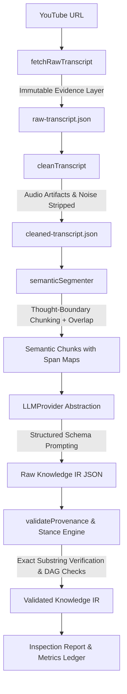

# Semantic Knowledge Extraction Engine — Architecture & Design Specification

**Document Version:** 1.0.0  
**Phase:** Phase 7 Architecture Specification  
**Status:** Approved for Implementation  
**Auditor/Author:** Antigravity Knowledge Architecture System  

---

## 1. Extraction Architecture Overview

The Semantic Knowledge Extraction Engine transforms unstructured spoken video transcripts into a verified, machine-readable **Knowledge Intermediate Representation (Knowledge IR)**.



### Core Pipeline Invariant:
> **The final Knowledge IR must never contain knowledge that cannot be traced to either verifiable source segments or an explicitly identified inference.**

---

## 2. Model / Provider Abstraction

To decouple the pipeline from any single vendor, we establish an abstract `LLMProvider` interface:

```typescript
export interface TokenUsage {
  promptTokens: number;
  completionTokens: number;
  totalTokens: number;
}

export interface LLMResponse<T> {
  data: T;
  rawText: string;
  usage: TokenUsage;
  latencyMs: number;
  model: string;
  provider: string;
}

export interface LLMProvider {
  providerName: string;
  modelName: string;
  generateStructured<T>(
    prompt: string,
    schema: Record<string, any>,
    systemPrompt?: string
  ): Promise<LLMResponse<T>>;
}
```

### Supported Providers:
1. **`GeminiLLMProvider`**: Uses Google Generative AI (`@google/genai` or REST endpoint with `GEMINI_API_KEY`).
2. **`OpenAILLMProvider`**: Uses OpenAI chat completions with structured JSON output (`OPENAI_API_KEY`).
3. **`SemanticMockProvider`**: Hermetic semantic engine for automated testing and CI verification without requiring paid API tokens.

---

## 3. Semantic Segmentation & Chunking Strategy

Spoken speech does not naturally respect fixed 4–10 segment boundaries. Slicing transcripts by segment count fractures sentences and breaks pronoun referents.

### Segmentation Rules:
1. **Punctuation & Thought Boundaries**: Group segments until a natural conclusion (`.`, `?`, `!`, or pauses $> 1.5\text{s}$) is reached.
2. **Target Chunk Size**: $300\text{–}600$ words ($2\text{–}4$ minutes of audio per chunk).
3. **Contextual Overlap**: Include a rolling 1-sentence ($20\text{–}40$ word) context buffer at the boundary of each chunk to resolve pronouns ("this", "they", "as mentioned").
4. **Strict Traceability**: Every semantic chunk maintains an array of referenced transcript segment IDs (`seg-0012` $\to$ `seg-0028`) and start/end timestamps.

---

## 4. Extraction Schema & Epistemic Hierarchy

The schema formally separates speaker stance from objective truth:

```typescript
export type EpistemicStatus = 
  | 'SOURCE_EXTRACTED'    // Directly asserted by speaker
  | 'SOURCE_DERIVED'      // Direct structural implication
  | 'MODEL_INTERPRETATION';// Higher-level AI abstraction

export type ClaimStance =
  | 'ASSERTED'            // Speaker presents as true
  | 'REFUTED'             // Speaker explicitly denies/disproves
  | 'HYPOTHETICAL'        // Counterfactual / conditional condition
  | 'POSSIBLE'            // Speculative / unproven possibility
  | 'UNCERTAIN'           // Speaker expresses explicit doubt
  | 'QUOTED_OTHER'        // Speaker quotes another party
  | 'ATTRIBUTED'          // Stated by third-party researcher/author
  | 'QUESTION'            // Rhetorical or exploratory question
  | 'EXAMPLE_ONLY';       // Single anecdote without universal claim
```

---

## 5. Provenance & Exact Quote Verification

Every extracted Claim, Concept, Mechanism, and Analogy must provide:
```json
{
  "source_spans": [
    {
      "start": 142.5,
      "end": 168.0,
      "segment_ids": ["seg-0042", "seg-0043", "seg-0044"],
      "quoted_text": "verbatim text matching source transcript"
    }
  ]
}
```

### Deterministic Substring Verification Algorithm:
1. Reconstruct the contiguous text from `segment_ids` in `cleaned-transcript.json`.
2. Normalize harmless whitespace and punctuation.
3. Assert that `quoted_text` is an **exact substring** of the reconstructed text.
4. If the quote does not match, reject the extraction with `INVALID_PROVENANCE_QUOTE_MISMATCH`.

---

## 6. Dynamic Mechanism & Argument Extraction

* **No Static Templates**: Mechanisms are never populated with boilerplate steps.
* **Mechanism Contract**:
  * `trigger`: The initiating condition or stimulus.
  * `steps`: Array of `{ step_num, action, result, source_spans }` derived directly from speech.
  * `outcome`: The resulting systemic state change.
* **Argument Contract**:
  * `thesis`: The central proposition.
  * `premises`: Supporting claims actually voiced.
  * `counterarguments`: Opposing views explicitly dismantled in the video (if none $\to$ empty array).
  * `conclusion`: The speaker's closing deduction.

---

## 7. Retry, Failure & Hallucination Defense

1. **Fail Closed**: If schema validation or provenance fails, the pipeline halts with `VALIDATION_FAILED`. No unbacked or hallucinated knowledge is passed downstream.
2. **Deterministic Fallbacks**: Low-confidence or unresolvable ambiguities are logged into `uncertainties` with `confidence: LOW` rather than guessing.
3. **Cost Controls**: Token budgets are capped at $2,000$ prompt tokens per semantic chunk, with maximum 1 pass for local extraction and 1 pass for global synthesis.

---

## 8. Evaluation Methodology

The system is evaluated against:
1. **20-Case Expanded Adversarial Suite**: Tests negation, sarcasm, hypothetical claims, quotations, retractions, and pronoun ambiguities.
2. **Golden Benchmark Dataset**: Manually verified transcript passages with ground-truth expected stances.
3. **8-Video Multi-Domain Benchmark**: Technical, Philosophy, Science, Economics, Habits, and Dialogue.
