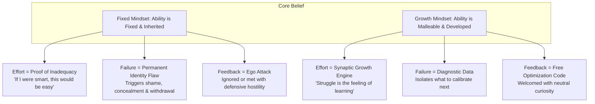
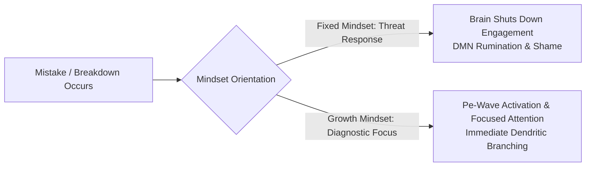
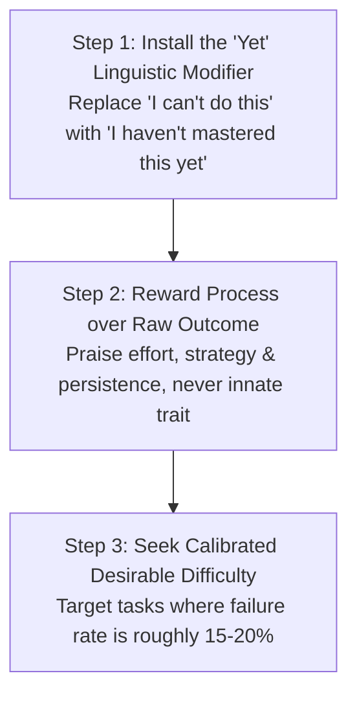

# Volume 3: Philosophy of Action & Metacognition

## Chapter 7: The Neurobiology of Growth — Dismantling the Fixed Mindset

Human development is rarely constrained by biological limits; it is constrained by **implicit psychological models of capability**.

When an individual encounters difficulty, confusion, or public failure, their brain makes a subconscious interpretation: *Does this struggle mean I lack the innate talent for this domain, or does it mean my brain is currently building new synaptic connections?*

This single distinction separates the **Fixed Mindset** (the belief that intelligence, talent, and personality are static traits) from the **Growth Mindset** (the empirical reality that cognitive capacity is an expandable neurobiological system). Understanding the psychological architecture behind stagnation is the key to unlocking perpetual adaptation.

---

### The Dual Mindset Divergence

---

### The Four Pathologies of Cognitive Stagnation

Why do capable people plateau and spend decades trapped in low-agency patterns?

#### 1. The Fallacy that "Effort Equals Incompetence"
In a fixed mindset, effortless performance is worshiped as the sole hallmark of genius. The moment an endeavor requires grinding repetition, the fixed mindset registers embarrassment. High performers in contrast understand that **friction is the biological requirement for myelination** (the insulating sheath that makes neural pathways fast and efficient).

#### 2. The Identity Threat of Failure
When your identity is tied to being "the smart one" or "the natural talent," every mistake threatens your self-worth. To preserve the illusion of competence, the individual subconsciously restricts themselves only to tasks they already know how to do, forfeiting long-term evolution.

#### 3. Defensive Feedback Rejection
When corrective criticism is provided, the fixed mind hears an existential verdict (*"You are flawed"*), triggering fight-or-flight defensiveness. The growth mind hears algorithmic optimization (*"This specific technique needs a 15-degree adjustment"*).

#### 4. The Threat of Others' Excellence
Because the fixed mindset views ability as a fixed pie, the success of peers triggers envy, cynicism, or dismissal (*"They just got lucky"* or *"They have connections"*), closing the door to learning from others.

---

### The Neurobiology of the Learning Error

When neuroscientists measure brain activity during mistakes using EEG, they observe a rapid electrical spike called the **Error-Related Negativity (ERN)** wave:

* **Fixed Brains during Errors**: Show minimal Pe-wave activity (the electrical wave associated with conscious attention to mistakes). The brain tries to turn away from the error as quickly as possible to protect the ego.
* **Growth Brains during Errors**: Show massive Pe-wave surges. The brain leans *into* the error, treating the discrepancy between expectation and reality as the exact coordinate where neuroplastic rewiring must occur.

---

### The 3-Step Mindset Recalibration Protocol

To systematically transition your operating psychology from stagnation to relentless growth:

1. **The "Yet" Cognitive Modifier**: Whenever your internal monologue asserts *"I am not good at mathematics/public speaking/managing capital,"* immediately append the word **"Yet."** This simple linguistic shift shifts your neurology from a permanent verdict to a temporary stage of development.
2. **Shift Praise from Traits to Systems**: Never praise yourself or others for being "smart" or "naturally gifted." Reward the depth of concentration, the willingness to endure difficulty, and the iterative strategy used.
3. **The 85% Sweet Spot (Desirable Difficulty)**: If you succeed 100% of the time, you are not learning; you are merely performing. Calibrate your practice so that you succeed roughly **85% of the time and struggle 15% of the time**. This is the exact mathematical sweet spot for maximizing neuroplastic adaptation.

---

### The Core Takeaway to Remember
> Intelligence and talent are not fixed biological ceilings; they are starting points. Embrace the friction of confusion, treat every mistake as diagnostic data, and realize that your brain's capacity expands precisely where the challenge begins.
