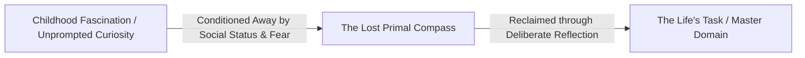
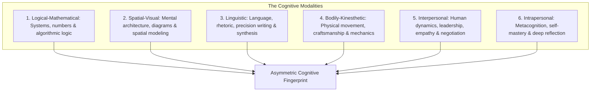
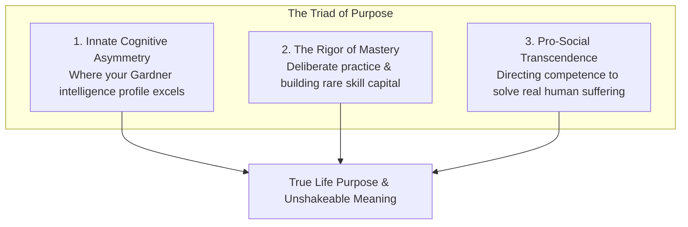
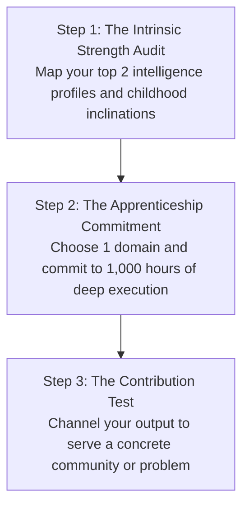

# Volume 3: Philosophy of Action & Metacognition

## Chapter 24: The Architecture of Purpose & Mastery — The Craft-First Paradigm & Multiple Intelligences

The dominant cultural myth regarding human potential is the **"Passion Myth"**: the romantic idea that purpose is a fully formed, pre-packaged treasure waiting to be discovered in an instant flash of divine inspiration.

In cognitive psychology and the science of expertise, **purpose is not discovered; purpose is constructed through deliberate mastery and pro-social contribution**.

When you wait around to "find your passion" before you commit to hard work, you become a victim of the **Consumer Mindset**. High performers operate under the **Craftsman Mindset**: they identify their unique cognitive inclinations, endure the rigorous apprenticeship of skill acquisition, and allow genuine passion and purpose to emerge as the natural byproduct of rare competence.

---

### The Passion Trap vs. The Craftsman Mindset

```mermaid
graph TD
    subgraph The Passion Trap (Consumer Mindset)
        P1[Waiting to 'Find' Perfect Passion] 
        --> P2[Avoids High Friction & Demanding Apprenticeship]
        --> P3[Chronic Career Anxiety & Frequent Quitting]
        --> P4[Zero Durable Skill Built]
    end

    subgraph The Craftsman Engine (Builder Mindset)
        C1[Identify Unique Cognitive Profile & Strengths]
        --> C2[Endure the 10,000-Hour Apprenticeship & Deep Practice]
        --> C3[Rare Competence & Autonomy Unlocked]
        --> C4[Deep Purpose, Flow & Meaning Emerge Naturally]
    end
```

* **The Fallacy of Premature Passion**: Passion does not precede competence. When you are a complete beginner at a difficult craft, everything feels clumsy and frustrating. If you rely on passion to sustain you, you will quit the moment friction arises.
* **The Competence-Purpose Sequence**: Autonomy, mastery, and purpose are rewards earned after you build rare and valuable skills that the world desperately needs.

---

### Decoding Your Primal Inclinations (The Mastery Archetype)

In his landmark work *Mastery*, author Robert Greene demonstrated that every human mind possesses **Primal Inclinations**—subtle, innate affinities that surfaced in early childhood before parental and societal conditioning imposed external expectations.



* **The Childhood Marker**: What subjects, objects, or activities fascinated you before you cared about money, grades, or peer status? Did you build physical structures, dissect systems, tell stories, draw maps, or organize groups?
* **The Return to the Root**: Reconnecting with your primal inclinations provides the authentic fuel required to sustain decades of deliberate practice without burning out.

---

### The Spectrum of Multiple Intelligences

Formulated by developmental psychologist Dr. Howard Gardner in *Frames of Mind*, intelligence is not a single linear metric (IQ). Human cognitive architecture encompasses distinct modalities:



1. **Logical-Mathematical**: Mastery of abstract reasoning, quantitative relations, and complex systematic problem-solving.
2. **Spatial-Visual**: The ability to manipulate 3D models mentally, design visual schemas, and navigate complex topologies.
3. **Linguistic**: Precision with words, dialectic arguments, structured synthesis, and compelling narrative delivery.
4. **Bodily-Kinesthetic**: Physical coordination, fine motor dexterity, and physical craftsmanship.
5. **Interpersonal**: Deep sensitivity to others' motivations, group dynamics, and conflict resolution.
6. **Intrapersonal**: Intense self-awareness, emotional regulation, and metacognitive clarity.

---

### The Triad of Durable Purpose



1. **Cognitive Alignment**: Aligning your daily work with your natural intelligence profile so that learning feels frictionless and intuitive.
2. **The Rigor of Mastery**: Committing to the unglamorous, repetitive grind of foundational skill acquisition over years.
3. **Pro-Social Transcendence (Service)**: Purpose is only fully unlocked when mastery is directed outward. As long as your goals are purely selfish (more wealth, higher status), the brain remains vulnerable to existential dread. When your craft alleviates real suffering or solves critical problems for others, meaning becomes unbreakable.

---

### The 3-Step Protocol for Constructing Purpose



1. **The Intrinsic Strength Audit**: Review Gardner's modalities and identify the two where your learning speed is 3x faster than average.
2. **The 1,000-Hour Apprenticeship**: Pick one specific domain aligned with those modalities. Refuse to change domains for at least 1,000 hours of focused study and building.
3. **The Contribution Test**: Never ask *"What can the world give me?"* Ask *"What rare value can my craft give to the world?"*

---

### The Core Takeaway to Remember
> Stop waiting for purpose to strike you like lightning. Purpose is not found; it is forged. Identify your unique cognitive strengths, embrace the quiet discipline of mastery, dedicate your skills to something larger than yourself, and let meaning be the natural fruit of your devotion.
