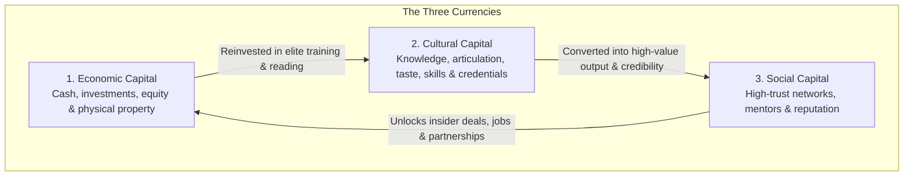
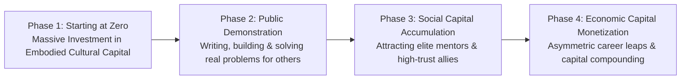

# Volume 5: The Architecture of Social Sovereignty

## Chapter 25: The Three Currencies — Leveraging Economic, Cultural & Social Capital

Most people believe that the game of life and career is governed by a single metric: **money (financial wealth)**.

In deep sociological analysis, French sociologist Pierre Bourdieu demonstrated that human society actually runs on **three convertible currencies of power and leverage**. When you only focus on financial income, you miss the hidden mechanisms through which influence, opportunity, and mobility are truly won.

By mastering the **Three Forms of Capital**, you learn how to start with zero financial wealth, rapidly build intellectual and social assets, and systematically convert them into asymmetric career mobility and economic freedom.

---

### The Architecture of the Three Capitals

---

### Deconstructing the Three Currencies

#### 1. Economic Capital (The Tangible Fuel)
* **What It Is**: Bank balances, shares, real estate, and hard monetary assets.
* **Its Nature**: It is the most liquid and immediately spendable form of power, but also the most vulnerable to taxes, market volatility, and envy.

#### 2. Cultural Capital (The Embodied Leverage)
Bourdieu revealed that cultural capital exists in three distinct states:
* **The Embodied State**: How you think, your communication precision, your vocal composure under pressure, and your mental schemas. This is permanently etched into your nervous system and can never be stolen or confiscated.
* **The Objectified State**: The books in your library, the tools in your workspace, and the intellectual artifacts you produce.
* **The Institutionalized State**: Degrees, professional certifications, and institutional accreditations that signal competence to the marketplace.

#### 3. Social Capital (The Network Multiplier)
* **What It Is**: The aggregate of actual or potential resources linked to possession of a durable network of high-trust relationships.
* **Its Nature**: Social capital is not handing out business cards at networking events. It is building genuine, unshakeable trust with a small group of high-integrity individuals who vouch for your character and competence when you are not in the room.

---

### The Capital Conversion Engine

The true master of strategy does not obsess over accumulating only one currency; they understand the **Cycle of Capital Conversion**:

1. **Step 1 (The Cultural Foundation)**: When you have zero money and zero connections, 100% of your energy must go into **Embodied Cultural Capital**—reading deeply, mastering technical fundamentals, speaking with clarity, and building rare craftsmanship.
2. **Step 2 (The Social Transmutation)**: Take your embodied skills and use them generously to solve painful problems for high-leverage people without asking for immediate payment. This converts cultural capital into immense **Social Goodwill & Trust**.
3. **Step 3 (The Economic Harvest)**: High-trust networks inevitably open doors to asymmetric career opportunities, investments, and partnerships that generate durable **Economic Capital**.

---

### The Core Takeaway to Remember
> Do not be deceived into thinking you are powerless just because your bank account is modest. Financial wealth is only one currency. Build rare embodied cultural capital through intense study and craft, convert it into unshakeable social trust, and the economic rewards will follow with mathematical certainty.
