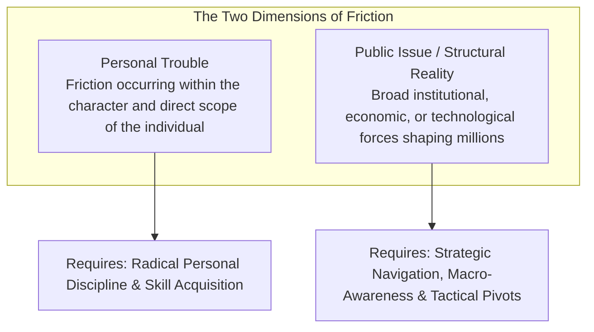
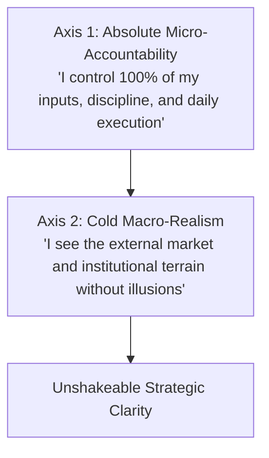

# Volume 5: The Architecture of Social Sovereignty

## Chapter 27: The Sociological Imagination — Personal Troubles vs. Systemic Realities

When things go wrong in life—when a job search stalls, when focus feels impossible in an app-saturated world, or when cost-of-living pressures squeeze your budget—the modern culture teaches you to turn 100% of the blame inward.

You are told that every failure is purely a personal defect of willpower, mindset, or ambition. While personal agency is essential, excessive self-blame leads to demoralization and chronic burnout.

In 1959, sociologist C. Wright Mills introduced a foundational cognitive framework known as **The Sociological Imagination**. It provides the intellectual toolkit to clearly separate **Personal Troubles** from **Public Issues**, granting you both radical personal accountability and cold, objective structural clarity.

---

### Personal Troubles vs. Public Issues



* **The Unemployment Diagnostic**:
  * If in a city of 100,000 people, only 1 person is unemployed, that is a **Personal Trouble** (an issue of individual skill, work ethic, or personal choices).
  * If in a nation of 50 million workers, 15 million are unemployed due to automation or macroeconomic recession, that is a **Public Issue / Structural Reality**. To tell those 15 million people that their struggle is purely an "individual mindset defect" is a toxic misdiagnosis.
* **The Attention Economy Diagnostic**:
  * If you cannot concentrate because you stayed up gaming until 3:00 AM, that is a **Personal Trouble**.
  * If billions of people find their attention spans shattered because trillion-dollar tech corporations employ thousands of neuroscientists to weaponize algorithmic feeds, that is a **Public Issue**.

---

### The Power of Structural Realism

```mermaid
graph LR
    subgraph The Naive Self-Blamer
        N1[Encounter Structural Friction] --> N2[Internalize as Moral Inadequacy] --> N3[Shame, Despair & Paralysis]
    end

    subgraph The Strategist (Sociological Imagination)
        S1[Encounter Structural Friction] --> S2[Diagnose the Macro Forces at Play] --> S3[Execute Asymmetric Micro-Tactics with Zero Shame]
    end
```

1. **Eliminating Paralyzing Shame**: When you understand the broader structural forces (inflationary dynamics, hyper-competitive exam funnels, algorithmic attention hooks), you stop treating friction as proof of personal brokenness.
2. **Clear-Eyed Strategic Navigation**: You cannot solve a structural problem with sentimental self-help mantras. You solve it by seeing the structural terrain clearly and deploying tactical countermeasures (e.g., airgapping your devices, building asymmetric skills, or positioning yourself in growing sectors).

---

### The Dual-Axis Operating Protocol

To achieve supreme mastery over your life, operate across two concurrent axes:



1. **Micro-Accountability**: Never use structural forces as an excuse for personal lethargy. Control your sleep, your focus blocks, your books, and your physical health with absolute discipline.
2. **Macro-Realism**: Never assume the world is a fair playground. Understand the incentives of institutions, the tides of macroeconomics, and the architectural design of modern platforms so you can position your efforts where they have the highest mathematical probability of success.

---

### The Core Takeaway to Remember
> Do not internalize the pathologies of a broken system as personal moral flaws. Take radical responsibility for your own effort, but view the external world through the lens of structural realism. Master your inner craft, navigate the outer terrain with sharp awareness, and execute with quiet confidence.
