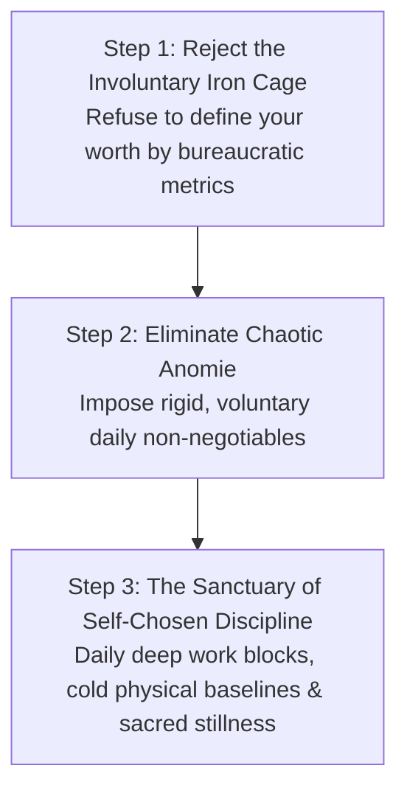

# Volume 5: The Architecture of Social Sovereignty

## Chapter 28: The Iron Cage & Anomie — Navigating Sterile Systems & The Power of Chosen Constraints

Modern civilization presents human beings with two opposing psychological hazards:
1. **The Iron Cage of Rationalization** (Max Weber): Being trapped in hyper-bureaucratic, sterile institutions that treat humans as disposable cogs in an efficiency calculation machine.
2. **Anomie or Normlessness** (Émile Durkheim): Being paralyzed by boundless, infinite choices and the total absence of meaningful rules, leading to aimlessness and existential despair.

When you master the dynamic between the **Iron Cage** and **Anomie**, you unlock the secret to lasting psychological peace: **the deliberate construction of sacred, self-chosen constraints**.

---

### The Two Pathologies of Modern Society

```mermaid
graph TD
    subgraph Path 1: The Iron Cage (Hyper-Control)
        W1[Max Weber's Iron Cage]
        --> W2[Hyper-rationalization, bureaucratic checklists & sterile metrics]
        --> W3[Loss of Human Soul, Meaning & Passion]
    end

    subgraph Path 2: Anomie (Boundaryless Chaos)
        D1[Émile Durkheim's Anomie]
        --> D2[Collapse of shared norms, infinite options & zero structure]
        --> D3[Paralysis of Choice, Existential Dread & Isolation]
    end

    W3 & D3 --> SOL[The Sovereign Solution: Self-Chosen Monastic Order]
```

---

### 1. Weber's Iron Cage: Surviving Institutional Sterility
* **The Mechanism**: Modern corporations and government institutions operate through cold, impersonal logic. They optimize exclusively for **calculability, efficiency, and predictability**.
* **The Trap**: If you look to your corporate job or academic institution to supply you with deep spiritual meaning, fulfillment, or personal love, you will be crushed. The machine is designed to be indifferent.
* **The Countermeasure**: View the institution as an exchange mechanism (your labor for capital and credentials). Keep your core identity, philosophy, and creative fire safely outside the machine.

---

### 2. Durkheim's Anomie: The Tyranny of Infinite Freedom
* **The Mechanism**: Ancient humans were constrained by tight tribal customs and rigid daily rhythms. Modern digital culture offers limitless options: infinite careers, endless entertainment, and infinite lifestyle choices.
* **The Paradox**: Complete freedom without boundaries (*Anomie*) does not create happiness; it creates crippling anxiety. When anything is possible, nothing feels meaningful. The human mind requires constraints to experience flow and purpose.

---

### The Sovereign Synthesis: The Power of Chosen Constraints

The antidote to both the sterile Iron Cage and chaotic Anomie is **Voluntary Monastic Order**:



1. **Freedom Through Discipline**: Real freedom is not doing whatever you feel like doing on a whim (which is just biological impulsivity). Real freedom is the power to **choose your own master**—committing your energy to a noble craft, a daily routine, and a code of personal honor.
2. **The Daily Non-Negotiable Fence**: When your mornings have a fixed structure (60-minute zero-input window, deep work sprint, physical movement), your brain is protected from the decision fatigue of *Anomie*.

---

### The Core Takeaway to Remember
> Do not let sterile corporate cages define your soul, and do not let boundaryless freedom plunge you into chaos. Build your own fortress of self-chosen discipline. Choose your rules, honor your daily non-negotiables, and discover the deep peace that exists within self-mastered order.
