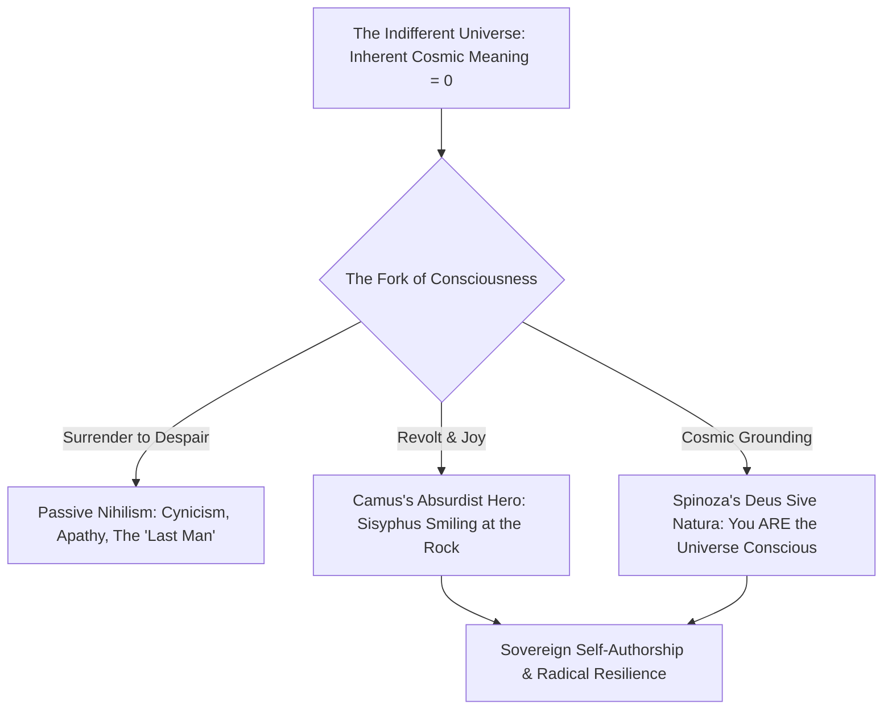

When traditional religious and metaphysical structures collapsed under modern secularization ("The Death of God"), humanity was left standing in a silent, indifferent cosmic void.

Most people respond with **Passive Nihilism**: cynicism, doom-scrolling, anhedonia, and a surrender to petty consumer dopamine. However, the deepest philosophers of modernity—Nietzsche, Camus, and Spinoza—demonstrated that the void is not a pit to drown in, but **the supreme canvas of human liberation**.

---

### The Existential Spectrum: Void to Sovereignty

#### 1. Camus & The Revolt of Sisyphus
Albert Camus defined **The Absurd** as the unresolvable collision between the human soul's demand for meaning and the cold silence of the universe. Sisyphus, condemned to roll a boulder up a mountain for eternity, triumphs over his curse the moment he walks back down to lift the rock again. His joy is his defiance: *"The struggle itself toward the heights is enough to fill a man's heart. One must imagine Sisyphus happy."*

#### 2. Spinoza’s Non-Dual Grounding
Baruch Spinoza dissolved the alienation of Western man: you did not "arrive into" the world from outside; the world grew you. God is not a king handing out punishments; **God IS Nature (*Deus Sive Natura*)**. Every breath, every heartbreak, every scientific insight is the cosmos experiencing its own infinite attributes.
