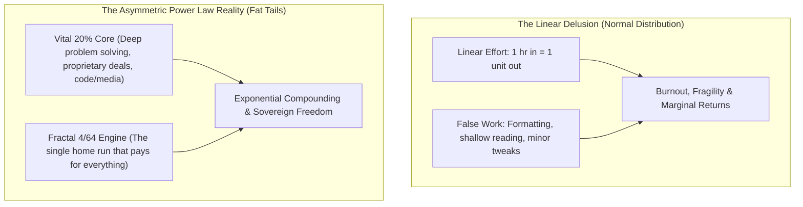
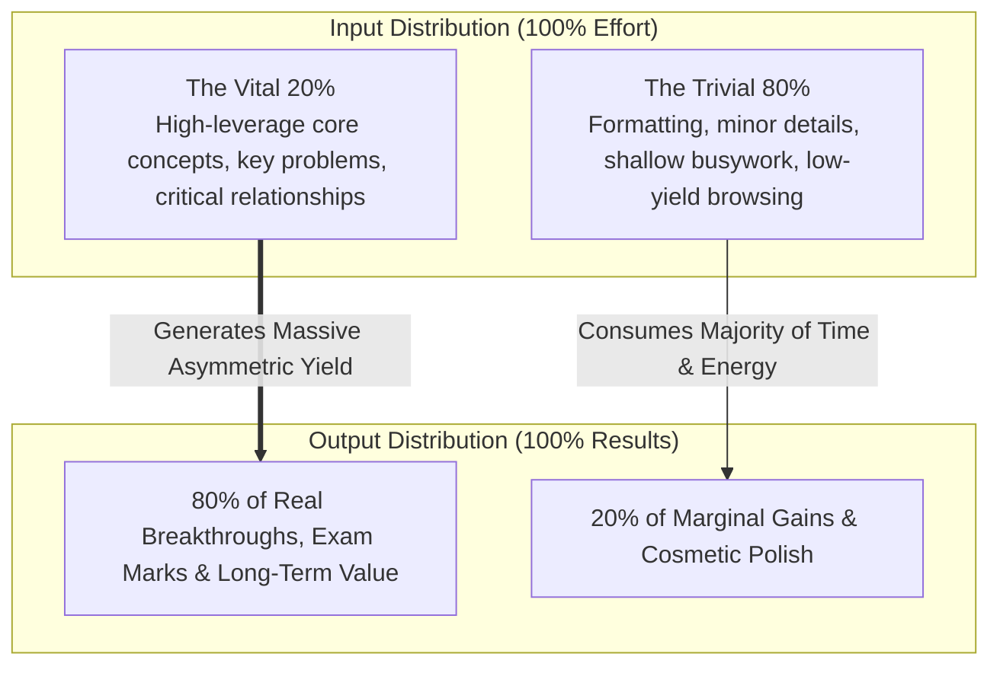
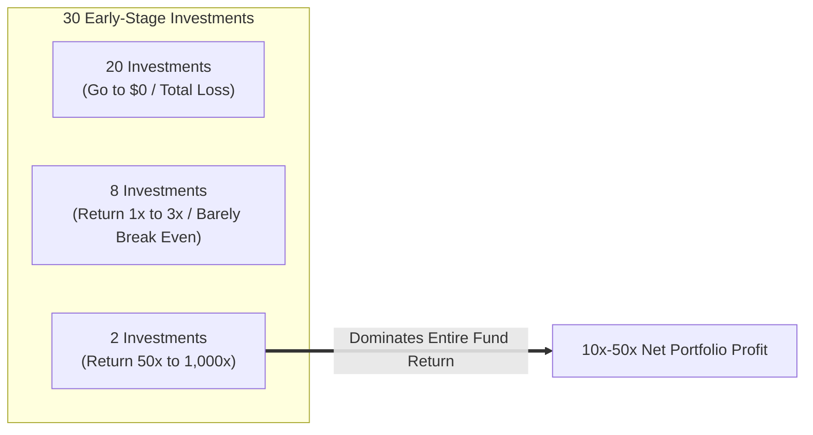
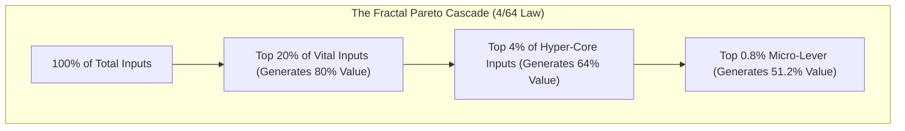
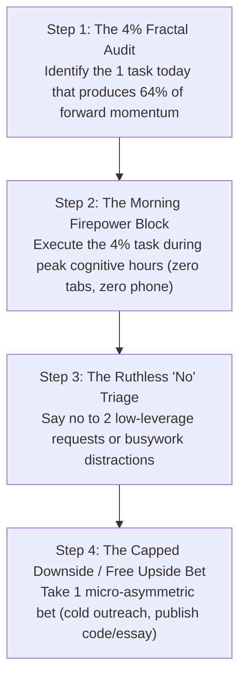

In modern society, exhaustion is often mistaken for productivity. We are culturally conditioned to believe that linear results require linear effort: *if 4 hours of study or work produces X, then 8 hours must produce 2X*.

In real-world non-linear systems, effort and outcome almost never exist in a 1:1 ratio. Instead, reality is governed by **Power Laws and Asymmetric Leverage**, formalized as the **Pareto Principle (The 80/20 Rule)**: roughly **80% of your meaningful outcomes stem from 20% of your critical inputs**.

Mastery is not about working harder or filling every waking hour with frantic activity; it is the rigorous, continuous identification of the **"Vital Few"** and the ruthless elimination of the **"Trivial Many."**

---

### The Power Law Distribution of Effort and Yield

---

### The Venture Power Law: Lessons from Angel Investing (Naval Ravikant)

Nowhere is the power law more brutally evident than in early-stage technology investing, as distilled by AngelList co-founder Naval Ravikant in his masterclass on angel investing:

1. **The Extreme Fat Tail**: Venture capital returns do not follow a Gaussian bell curve. If you invest in 30 startups, 20 will go to zero, 8 will barely return your capital, and **1 or 2 outlier winners (e.g., an early check into Uber or Twitter) will return 100x to 1,000x**, completely paying for all losses and generating 95%+ of the fund's total profit.
2. **Access Over Picking**: In power-law environments, evaluating deals is useless if you never see the best deals. Top founders select their investors; thus, building **proprietary reputation, specific knowledge, and unshakeable founder-alignment** is the prerequisite to being invited into the winning cap tables.
3. **Capped Downside vs. Uncapped Upside**: The beauty of equity asymmetry is mathematical: you can only ever lose **1x** your investment (if the startup goes to zero), but your upside is **theoretically boundless (100x, 500x, 10,000x)**. Applying this mental model to your career means constantly seeking asymmetric bets where failure is cheap and success is life-altering.

---

### The Pathology of "Fake Work" (The Linear Effort Illusion)

Why do high-effort individuals frequently fail to achieve breakthrough results?

1. **The Comfort of Low-Leverage Busywork**: High-leverage work (e.g., solving hard diagnostic problems, writing original synthesis, cold outreach, early-stage venture pitching) involves intense cognitive friction and fear of failure. Low-leverage work (e.g., color-coding notes, reorganizing files, endless superficial reading) feels productive while avoiding real challenge.
2. **Diminishing Marginal Returns**: The first 20% of concentrated effort captures 80% of the core understanding. Spending the remaining 80% of your time trying to achieve cosmetic perfection yields rapidly diminishing returns while causing severe mental fatigue.

---

## 🏛️ Tier 1: The Jargon-Free Reality Bridge (Plain English Hook)
*Target: An intelligent 25-year-old graduate entering competitive exams, tech, or entrepreneurship.*

- **The Gold Miner Analogy**: Imagine two gold miners. Miner A works 14 hours a day with a small shovel, digging randomly in the clay outside his tent, exhausting himself until his hands bleed. Miner B spends 3 days studying geological maps, locates a volcanic quartz vein, and swings his pickaxe for just 2 hours to uncover a 10-kilogram gold nugget. Miner A complains: *"I worked 7 times harder than you!"* Reality does not care about your sweat; reality cares whether you are digging where the gold actually is. The Pareto Principle is the geological map of life.
- **The One Decision That Pays for Everything**: In your career, 1 or 2 specific choices (the right company to join, the right partner to marry, the right skill to master) will dictate 90% of your net worth and happiness. Stop treating all hours and tasks as equal.
- **Why This Matters Today**: In the modern information economy, leverage amplifies outcomes by 1,000x. If you apply linear thinking in a power-law world, you will work yourself to the bone while watching asymmetric players effortlessly pull ahead.

---

## 🔬 Tier 2: Modern Cognitive Science & Mathematical Architecture Correlate
*Target: Grounding the 80/20 rule in statistical mechanics, non-linear dynamics, and power laws.*

- **The Mathematics of Scale-Free Networks (Barabási & Zipf)**: Power laws ($P(x) propto x^{-alpha}$) naturally emerge in complex networks with preferential attachment (the Matthew Effect: *"to those who have, more will be given"*). In social networks, citations, wealth distribution, and technological adoption, nodes with initial structural advantage attract an exponential share of connections.
- **The Fractal Nature of Leverage (The 4/64 Rule)**: The Pareto distribution applies within itself recursively:
  $$0.20 	imes 0.20 = 0.04 quad (4% 	ext{ of inputs})$$
  $$0.80 	imes 0.80 = 0.64 quad (64% 	ext{ of outputs})$$
  By identifying the vital 4% within your top 20%, you isolate the nuclear core of your performance.
- **Cognitive Switching Cost & The Firepower Law**: Performing 10 shallow tasks incurs continuous attentional residue and prefrontal glucose depletion. Concentrating uninterrupted cognitive firepower on the singular 4% task induces deep neurological flow, consolidating synaptic plasticity and producing rare, uncopyable output.

---

## ⚖️ Tier 3: The Skeptic’s Razor & Failure Mode Guardrails
*Target: Inoculating against chronic laziness disguised as "efficiency" and premature optimization.*

- **The "Lazy Hacker" Excuse**: Many beginners use the 80/20 rule as an intellectual justification for laziness: *"I'll just do 20% of the work and get 80% of the grade."* In competitive exams (like SBI/IBPS PO or UPSC), getting 80% of the baseline is what 500,000 applicants do; the final 5% cut-off requires obsessive mastery. The 80/20 principle tells you **where to focus your all-out intensity**, not an excuse to cut corners.
- **The Diworsification Fallacy**: In investing and skill acquisition, spreading yourself across 25 different projects under the guise of "hedging risk" guarantees mediocrity. High-conviction focus on 2–3 deeply understood assets or skills beats shallow dabbling every time.
- **Survivorship Bias in Asymmetric Bets**: Remember that in power-law domains (startups, creative fields), the downside is capped, but failure is the statistical norm. Never deploy asymmetric bets using capital or emotional health you cannot afford to lose completely. Keep a rock-solid, low-variance defensive base (your emergency moat and 9-to-5 cashflow) before swinging for 100x power-law fences.

---

## ⚡ Tier 4: The 24-Hour Behavioral Protocol ("The Homework")
*Target: The 4 Daily Steps to Operationalize Asymmetric Leverage.*

1. **Step 1: The 4% Fractal Audit**
   - *Action*: Review your to-do list for today.
   - *Execution*: Ask: *"If I were only allowed to work for 90 minutes today, which single task would drive nearly two-thirds of my actual progress?"* Circle it. That is your 4% lever.
2. **Step 2: The Morning Firepower Block**
   - *Action*: Protect your peak biological cortisol and executive window.
   - *Execution*: Spend the first **90 minutes of your workday** executing that single 4% task before checking email, opening Slack, or answering text messages. Never give your freshest dopamine to someone else's agenda.
3. **Step 3: The Low-Leverage Elimination Triage**
   - *Action*: Audit your low-friction busywork.
   - *Execution*: Identify two tasks you were planning to do today (e.g., tweaking slide formatting, organizing bookmarks, browsing industry forums) that produce zero measurable needle movement. Delete them from your schedule.
4. **Step 4: The Micro-Asymmetric Bet**
   - *Action*: Take one asymmetric action today where the downside is zero and the upside is uncapped.
   - *Execution*: Send a thoughtful cold email to an admired builder, submit an application for an ambitious grant, or publish an original analytical breakdown online. Downside: 15 minutes of effort; upside: a relationship or opportunity that alters your trajectory.

---

### The Core Takeaway to Remember
> The universe does not reward linear sweat; it rewards asymmetric leverage. Stop scattering your finite biological energy across the trivial 80% of cosmetic busywork. Protect your downside, identify the fractal 4% that creates 64% of lifetime yield, and concentrate your absolute firepower on the vital few that compound forever.
