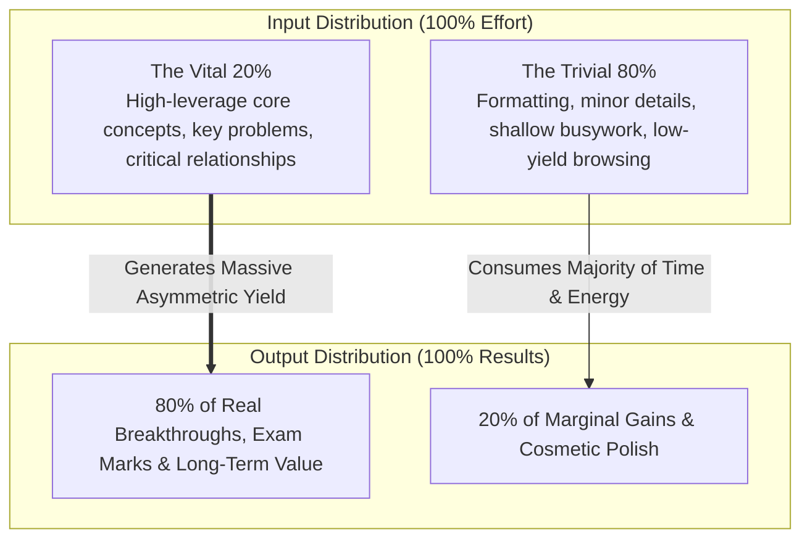
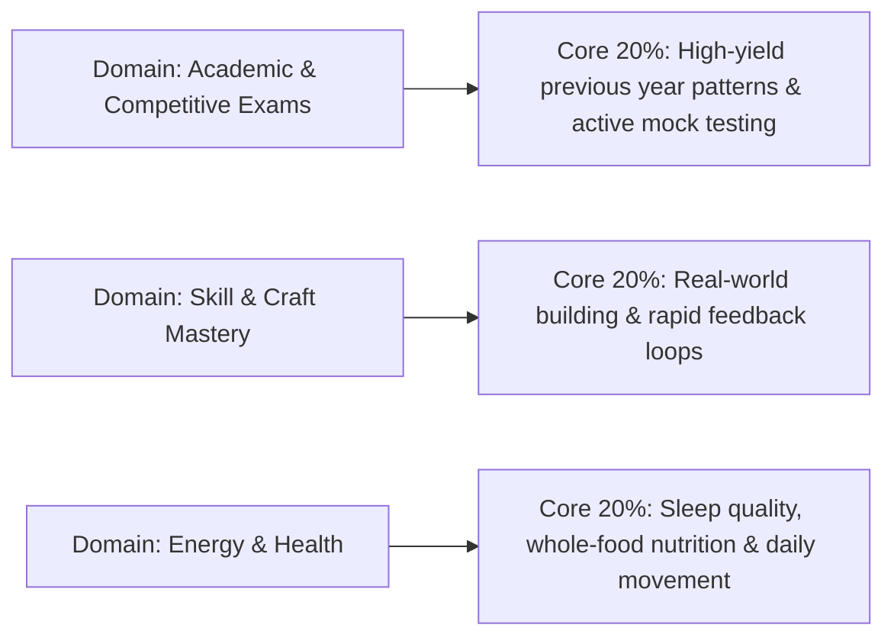
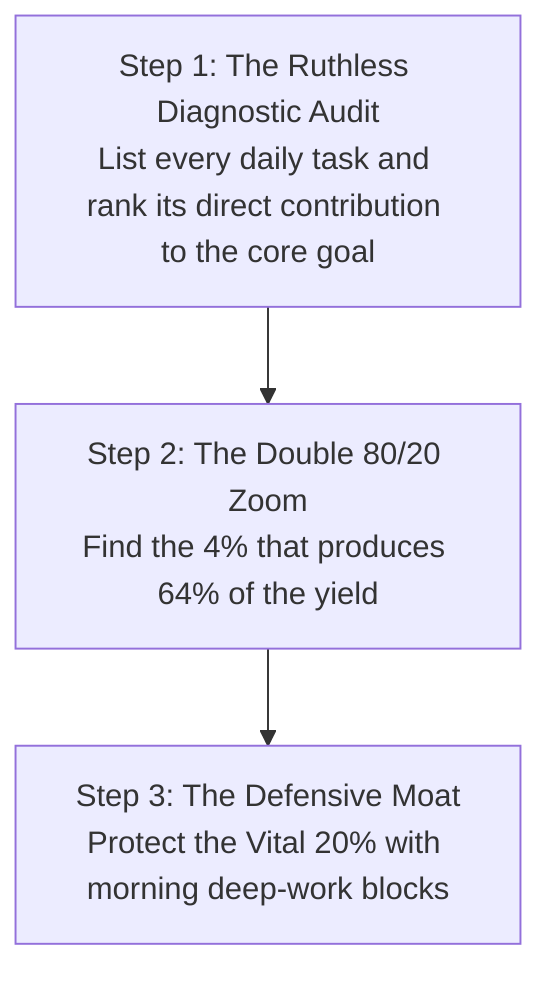

In modern society, exhaustion is often mistaken for productivity. We are culturally conditioned to believe that linear results require linear effort: *if 4 hours of study or work produces X, then 8 hours must produce 2X*.

In real-world non-linear systems, effort and outcome almost never exist in a 1:1 ratio. Instead, reality is governed by **Power Laws and Asymmetric Leverage**, formalized as the **Pareto Principle (The 80/20 Rule)**: roughly **80% of your meaningful outcomes stem from 20% of your critical inputs**.

Mastery is not about working harder or filling every waking hour with frantic activity; it is the rigorous, continuous identification of the **"Vital Few"** and the ruthless elimination of the **"Trivial Many."**

---

### The Power Law Distribution of Effort and Yield

---

### The Pathology of "Fake Work" (The Linear Effort Illusion)

Why do high-effort individuals frequently fail to achieve breakthrough results?

1. **The Comfort of Low-Leverage Busywork**: High-leverage work (e.g., solving hard diagnostic problems, writing original synthesis, cold outreach) involves intense cognitive friction and fear of failure. Low-leverage work (e.g., color-coding notes, reorganizing files, endless superficial reading) feels productive while avoiding real challenge.
2. **Diminishing Marginal Returns**: The first 20% of concentrated effort captures 80% of the core understanding. Spending the remaining 80% of your time trying to achieve cosmetic perfection yields rapidly diminishing returns while causing severe mental fatigue.

---

### The 80/20 Audit across Life Domains

#### 1. In Learning & Competitive Studies
* **The 80% Trap**: Reading textbooks cover-to-cover passively, highlighting endless paragraphs, and watching dozens of superficial review lectures.
* **The 20% Engine**: Mastering core fundamental formulas/theorems, analyzing past 5 years of exam question patterns, and practicing active retrieval via timed drills.

#### 2. In Work & Professional Output
* **The 80% Trap**: Replying instantly to every email, attending status meetings, and tweaking slide presentations.
* **The 20% Engine**: Building the core product architecture, closing lead clients, or mastering a high-demand technical skill.

#### 3. In Social & Mental Energy
* **The 80% Trap**: Maintaining dozens of shallow, energy-draining acquaintances and doom-scrolling social feeds.
* **The 20% Engine**: Investing deeply in 3 to 5 high-trust, growth-oriented relationships that provide emotional grounding.

---

### The 3-Step Asymmetric Execution Protocol

To shift from exhausting linear hustle to asymmetric high-yield execution:

1. **The Ruthless 80/20 Audit**: Write down all tasks performed in the last 7 days. Ask: *"If I could only accomplish two items from this list, which two would generate almost all of my forward progress?"*
2. **The Fractal Zoom (The 4/64 Law)**: The Pareto Principle is fractal. Within the top 20% of vital tasks, another 80/20 rule applies ($0.20 \times 0.20 = 0.04$, producing $0.80 \times 0.80 = 0.64$). Roughly **4% of your specific daily actions generate nearly two-thirds of your entire lifetime impact**. Identify that 4% and give it your absolute peak mental hours.
3. **Say 'No' by Default**: Every time you say "yes" to a low-leverage request or task, you are subconsciously saying "no" to your vital 20%. Guard your cognitive bandwidth aggressively.

---

### The Core Takeaway to Remember
> Doing more is not the path to greatness; doing the vital few with uncompromised depth is. Strip away the trivial 80%, concentrate your firepower on the asymmetric 20%, and achieve effortless leverage.
