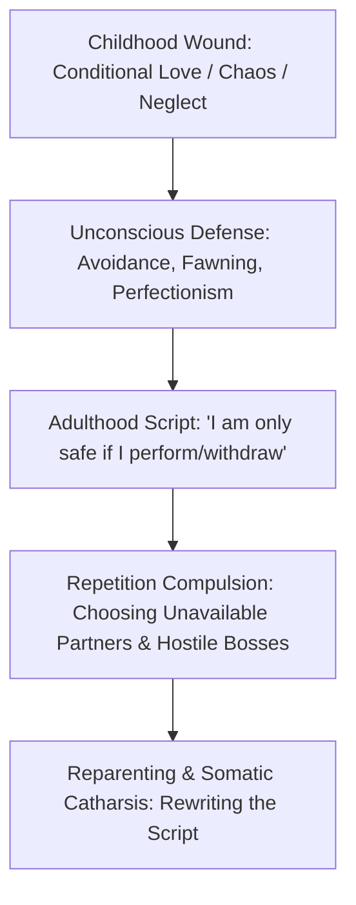

The central thesis of psychodynamics is that **we do not leave our childhoods behind; we project them forward onto the world**.

---

### Key Epistemic Insights

#### 1. All Meanness is Inherited
No one is born cruel. The bully, the toxic manager, and the hyper-critical parent are operating from ancient, unintegrated terror. Cruelty is the desperate defense of someone terrified of being exposed as helpless.

#### 2. The Price of Skipped Adolescence
When children are forced to be the sensible, responsible caretakers of chaotic adults (*parentification*), they skip healthy rebellion. In their thirties and forties, they often experience severe crises, acting out the suppressed defiance they never had the safety to express.

#### 3. Reparenting the Self
Healing does not require waiting for elderly parents to apologize. It requires becoming the wise, gentle, and firm adult your inner infant never had—setting healthy boundaries, honoring emotional fatigue, and offering unconditional validation.
