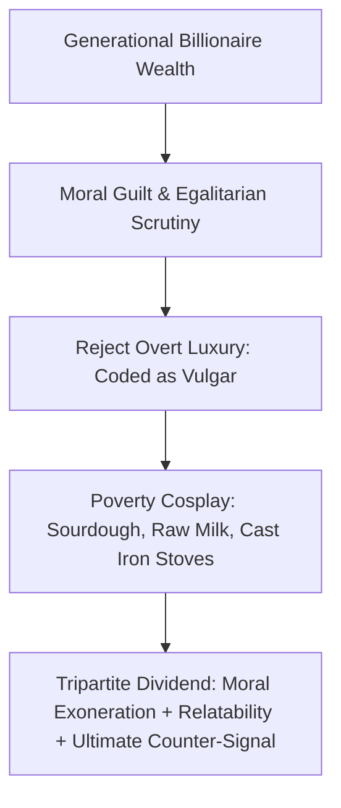

Why do individuals with private jets, multi-million-dollar safety nets, and corporate fortunes spend their days churning butter, wearing faded overalls, driving rusted trucks, and broadcasting rustic manual labor to millions online?

In *Why Rich People Love Pretending to Be Poor*, Horses analyzes **poverty cosplay** and **class tourism**. Using the viral phenomenon of **Ballerina Farm** (Hannah Neeleman, a Juilliard ballerina, and Daniel Neeleman, son of JetBlue airline billionaire founder David Neeleman) as the modern archetype, the essay exposes an acute sociological inversion: **overt luxury has become insecure and morally suspect, whereas the aesthetic of manual working-class toil has become the supreme luxury commodity.**

---

### The Inverted Consumption Framework

#### Historical Precedent: Marie Antoinette’s *Hameau de la Reine*
In 1783, overwhelmed by the rigid artificiality of Versailles, Queen Marie Antoinette built *Le Hameau de la Reine*—a functioning replica of a peasant village on the palace grounds. There, she dressed in simple muslin dresses and carried porcelain buckets to "play" at being a milkmaid while French peasants starved outside. When privilege completely insulates people from physical reality, they crave the feeling of grounding—but sanitize it of real economic terror.

#### The Four Drivers of Poverty Cosplay:
1. **The Alleviation of Wealth Guilt:** Performing physical chores provides psychological penance (*"Look at my hands, I am not a parasite"*).
2. **The Weapon of Relatability:** Unapproachable luxury invites resentment; rural struggle invites trust, sponsorship, and ad revenue.
3. **The Search for Lost Agency:** Abstract financial wealth feels hollow; physical manual labor offers direct cause-and-effect dopamine.
4. **The Sanctification of Meritocracy:** Obscuring generational capital preserves the illusion that one's success is entirely earned through personal grit.
