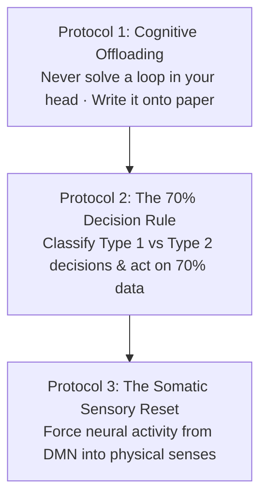
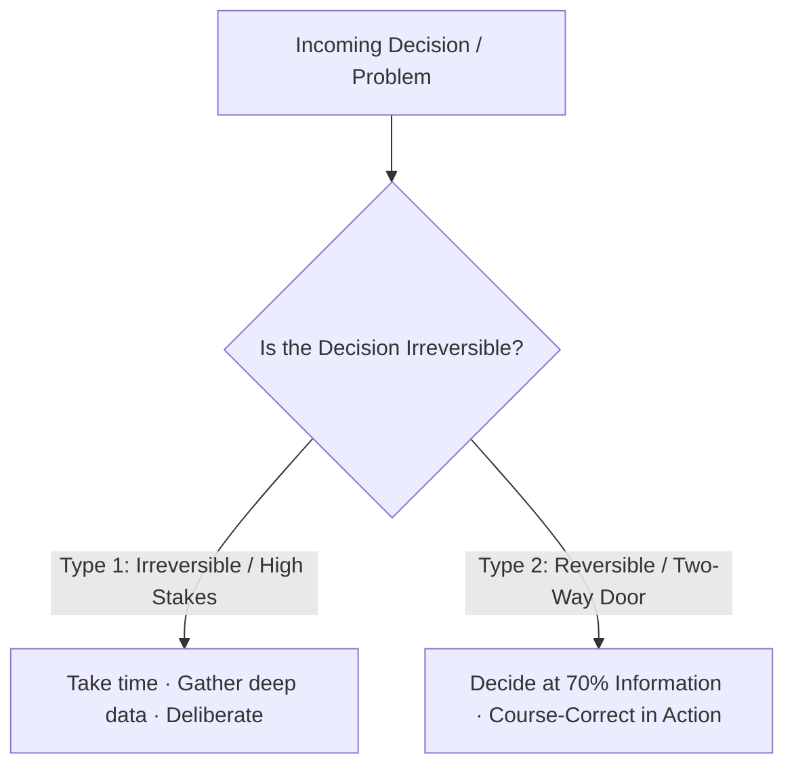

Most people believe that overthinking is simply an excess of intelligence or analytical rigor.

In cognitive neuroscience and clinical psychology, **overthinking is not thinking at all—it is a closed neurological loop (rumination)**.

True thinking is **convergent, linear, and actionable**: it moves systematically from an open question to a hypothesis, reaches a decision, and terminates in immediate physical execution.

Overthinking, by contrast, is **circular, divergent, and paralyzed**: it traps the mind in endless catastrophic simulations, burns massive amounts of glucose in the prefrontal cortex, floods the nervous system with cortisol, and produces zero forward progress.

Understanding the mechanics of the overthinking loop allows you to dismantle the illusion of control and regain mental stillness.

---

### The Fundamental Divergence: Thinking vs. Looping

```mermaid
graph TD
    subgraph Constructive Thinking (Convergent Engine)
        T1[Problem Identified] --> T2[Evaluate Variables & Options]
        T2 --> T3[Make Concrete Decision]
        T3 --> T4[Execute Physical Action]
        T4 --> T5[Cognitive Loop Closed · Mental Peace]
    end

    subgraph The Overthinking Loop (DMN Rumination)
        L1[Trigger / Uncertainty] --> L2[Simulate Catastrophic Scenarios]
        L2 --> L3[Paralysis & Acute Anxiety]
        L3 --> L4[Re-Analyze Past Scenarios]
        L4 --> L5[Doubt & Decision Avoidance]
        L5 --> L1
    end
```

* **The Illusion of Control**: The chronic overthinker believes that by mentally rehearsing every potential disaster a thousand times, they are protecting themselves from failure. In reality, catastrophe simulation does not prepare the nervous system; it merely exhausts it before the challenge even begins.
* **The Termination Criteria**: If a train of thought does not end in a tangible decision or physical action within 5 minutes, it is no longer analysis—it has degenerated into an anxiety loop.

---

### The Default Mode Network & Working Memory Bleed

When you are trapped in an overthinking loop, your brain exhibits hyper-synchrony in the **Default Mode Network (DMN)**—the neural network responsible for self-referential thought, ego protection, and future dread.


* **Working Memory Capacity**: The human working memory can hold only roughly **4 to 7 discrete chunks of information** simultaneously.
* **The Cognitive Jam**: When unwritten worries, future deadlines, and social anxieties bounce around inside working memory, they occupy 100% of your cognitive RAM. You cannot focus on studying, reading, or deep work because the processor is fully consumed by the background loop.

---

### Three Master Protocols to Break Cognitive Loops



---

#### 1. Cognitive Offloading (The Pen-and-Paper Test)
An overthinking loop cannot survive when it is forced out of the head and onto a physical page. The moment you write, the linear nature of language destroys the circular nature of the loop.

Whenever you find your mind spinning, immediately write down three answers:
1. *What is the exact, specific problem in one sentence?*
2. *What single variable in this problem is within my direct control today?*
3. *What is the very next physical action I will take in the next 10 minutes?*

---

#### 2. The 70% Decision Heuristic (Type 1 vs. Type 2 Decisions)
Most overthinking stems from treating every minor life decision as an irreversible catastrophe.



* **Type 1 Decisions (Irreversible)**: Rare choices that cannot be undone (e.g., signing a 30-year high-interest loan). These warrant deep, slow deliberation.
* **Type 2 Decisions (Reversible)**: Over 95% of daily dilemmas (how to outline a chapter, which study topic to begin with, how to format a project). The cost of delaying a Type 2 decision is always far greater than the cost of making a imperfect choice and calibrating on the fly. Make the call the moment you have **70% certainty**.

---

#### 3. The Somatic Sensory Reset (Grounding Circuit Breaker)
You cannot use the thinking mind to solve the problems of an overthinking mind. When the cognitive engine is redlining, you must bypass thoughts entirely and drop into the **somatosensory cortex**.

* **The 5-4-3-2-1 Sensory Grounding Technique**:
  * Identify **5** things you can visually see in your room.
  * Identify **4** physical textures you can feel with your skin (desk, clothing, feet on floor).
  * Identify **3** distinct ambient sounds you can hear.
  * Identify **2** distinct scents in the air.
  * Take **1** deep physiological sigh (two sharp inhales through the nose, one long exhale through the mouth).
* **The Biological Shift**: Forcing sensory processing instantly draws blood flow away from the anxious Default Mode Network and returns your neurology to present-moment baseline calm.

---

### The Core Takeaway to Remember
> Analysis that leads to action is wisdom; analysis that leads to more analysis is a prison. Never solve worries inside your head—write them down, make the call at 70% certainty, ground your body in physical reality, and let execution silence the noise.
