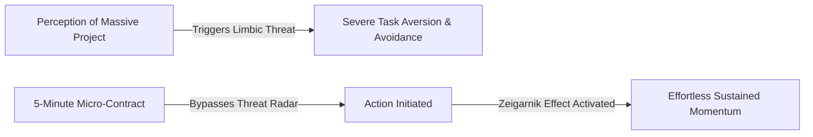
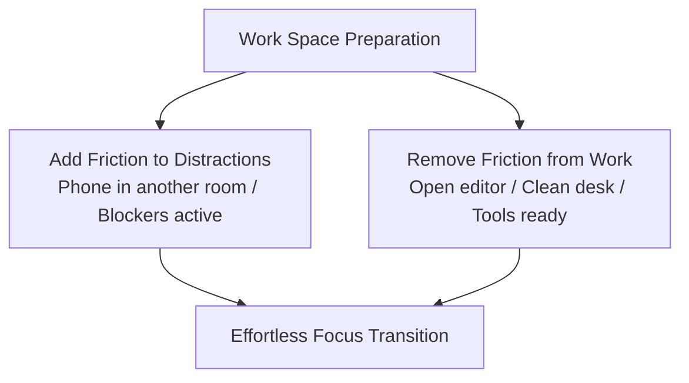
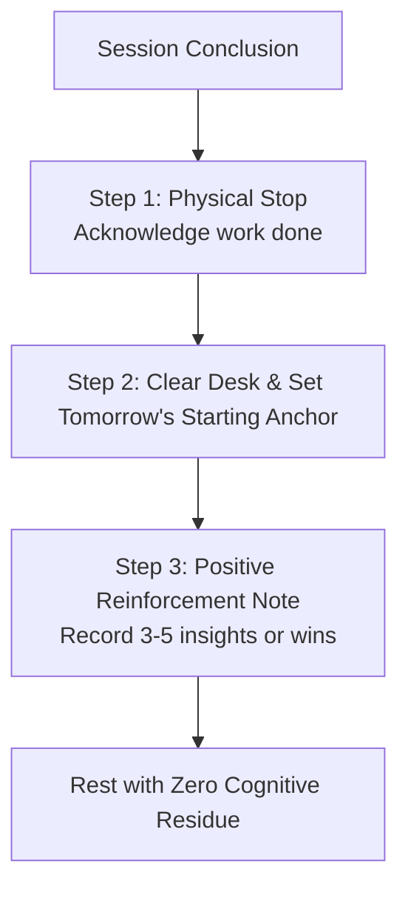

Procrastination is almost universally misunderstood as laziness or a deficiency of willpower. In cognitive psychology and behavioral economics, procrastination is a **mathematically predictable output of human motivation mechanics** combined with an **activation energy barrier**.

When you face a large, ambiguous, or distant task, the limbic system (the emotional threat center of the brain) perceives discomfort, uncertainty, or fear of failure. It immediately prompts you to seek instant dopamine relief through low-effort distractions.

To permanently defeat procrastination, you do not fight your feelings with brute willpower; you systematically manipulate the variables of the **Procrastination Formula** and re-engineer the **physics of starting**.

---

### The Procrastination Equation (Temporal Motivation Theory)

Formulated by behavioral psychologist Dr. Piers Steel, human motivation to execute any task is modeled by four interacting variables:

$$\text{Motivation} = \frac{\text{Expectancy} \times \text{Value}}{\text{Impulsiveness} \times \text{Delay}}$$

```mermaid
graph TD
    subgraph The Motivators (Numerator - Maximize These)
        E[Expectancy: Belief & Confidence in Successful Execution]
        V[Value: Perceived Meaning & Reward of Completion]
    end

    subgraph The Saboteurs (Denominator - Minimize These)
        I[Impulsiveness: Susceptibility to Distraction & Novelty]
        D[Delay: Time Horizon until the Ultimate Payoff]
    end

    E & V -->|Multiplies Forward Drive| M[Total Motivation to Act]
    I & D -->|Suppresses & Delays Action| M
```

1. **Expectancy ($\uparrow$)**: If you believe a task is too difficult, ambiguous, or confusing, expectancy drops to zero, triggering instant paralysis. *Solution: Break the task into micro-steps where success is guaranteed.*
2. **Value ($\uparrow$)**: If the task feels meaningless, boring, or disconnected from your core identity, perceived value remains low. *Solution: Connect the task to high-stakes mastery or gamify progress.*
3. **Impulsiveness ($\downarrow$)**: If you have high sensitivity to digital distractions and low frustration tolerance, impulsiveness balloons the denominator. *Solution: Remove environmental cues and apply friction inversion.*
4. **Delay ($\downarrow$)**: If the final exam, product launch, or deadline is 6 months away, the temporal discount factor makes the urgency feel non-existent. *Solution: Create artificial 24-hour micro-deadlines.*

---

### Collapsing Activation Energy: The 5-Minute Micro-Contract

In chemistry, **activation energy** is the minimum energy required to initiate a reaction. Once the reaction starts, it often becomes self-sustaining. Human behavior follows the exact same thermodynamic law.



* **The Cognitive Mistake**: When you think, *"I must sit down and finish this entire massive project,"* your brain calculates the immense cumulative energy cost and triggers acute task aversion.
* **The Micro-Contract Protocol**: Make an unconditional agreement with yourself to work on the task for **exactly 5 minutes**, with absolute permission to stop when the timer rings.
* **The Neural Shift**: Five minutes is too small for the brain's threat radar to trigger avoidance. Once you cross the 5-minute threshold, the *Zeigarnik Effect* (the psychological drive to complete an already-started task) takes over, and momentum carries you forward effortlessly.

---

### Friction Engineering & The 2-Minute Pre-Flight

Discipline is heavily dictated by physical proximity and environmental friction.



Before engaging with the task, execute a **2-minute environmental reset**:
1. **Friction Inversion**: Place your smartphone in another room or inside a drawer. Every additional physical step required to reach a distraction acts as a cognitive speed bump that breaks subconscious autopilot.
2. **Workspace Priming**: Clear all unrelated visual clutter from your desk and open only the single software window or notebook page needed for the immediate task.

---

### Choice Nudging & Constraint Narrowing

When the initial 5 minutes expire, never ask yourself an open-ended binary question: *"Do I want to keep working?"* An open question forces your brain into decision fatigue, and comfort-seeking impulses will usually vote to stop.

Instead, apply **Choice Nudging (Bounded Selection)**:
* Ask yourself: *"Will I do another 15 minutes or 25 minutes?"*
* By narrowing the choice between two productive options rather than between work and escape, your brain naturally selects one of the bounded work blocks without cognitive rebellion.

---

### The Zeigarnik Close-Out Ritual

How you finish a work session dictates how easy it will be to start tomorrow. When work stops abruptly in chaos, the brain encodes the memory of the session with frustration and mental exhaustion.



To close out a session cleanly:
1. **Define the Tomorrow Anchor**: Write down the exact first micro-step for your next session (e.g., *"Open document and write section 3 heading"*). This eliminates startup ambiguity for the next day.
2. **Positive Neuro-Encoding**: Take 30 seconds to jot down 3 to 5 small wins, interesting insights, or positive moments from the session. This trains the reward circuitry to associate deep work with genuine satisfaction rather than pain.

---

### The Core Takeaway to Remember
> Motivation does not precede action; action produces motivation. Maximize expectancy and value, crush impulsiveness and delay, lower your activation barrier to 5 minutes, and let momentum do the heavy lifting.
