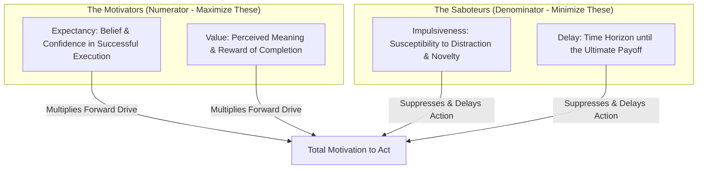
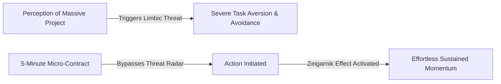
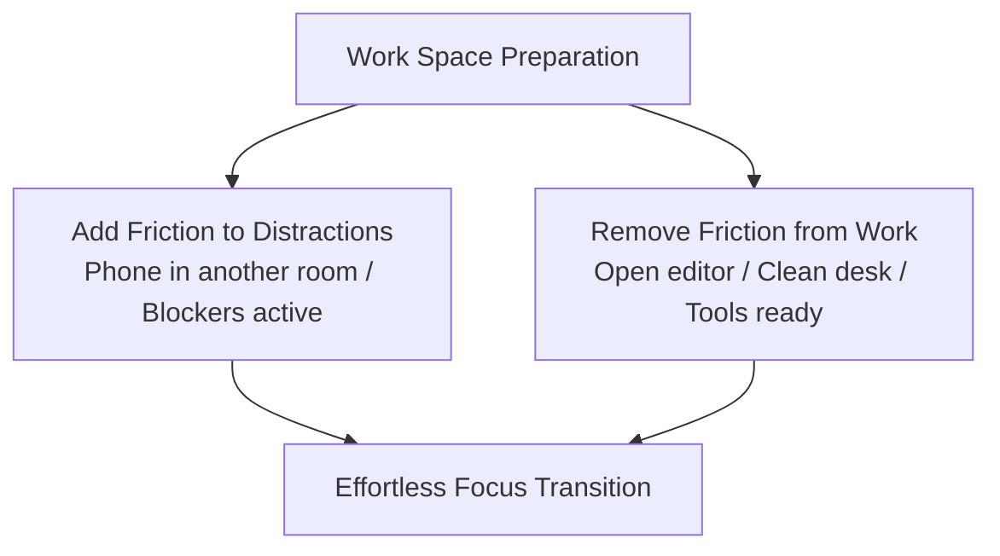
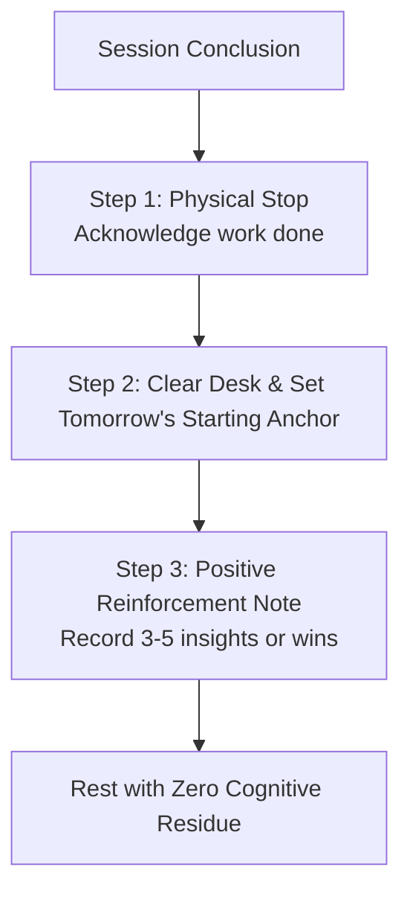
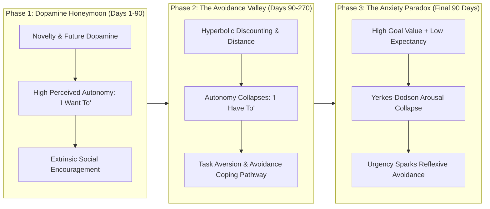
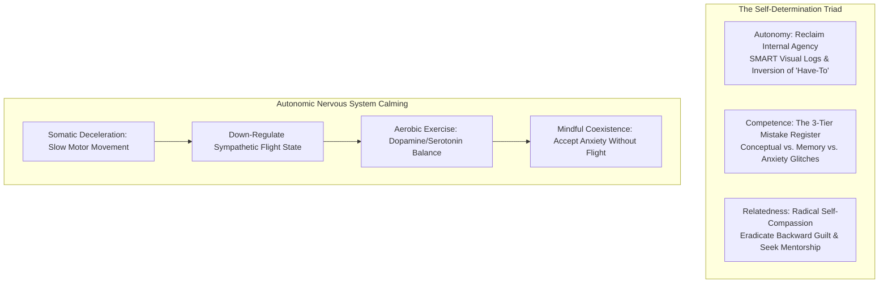

Procrastination is almost universally misunderstood as laziness or a deficiency of willpower. In cognitive psychology and behavioral economics, procrastination is a **mathematically predictable output of human motivation mechanics** combined with an **activation energy barrier**.

When you face a large, ambiguous, or distant task, the limbic system (the emotional threat center of the brain) perceives discomfort, uncertainty, or fear of failure. It immediately prompts you to seek instant dopamine relief through low-effort distractions.

To permanently defeat procrastination, you do not fight your feelings with brute willpower; you systematically manipulate the variables of the **Procrastination Formula** and re-engineer the **physics of starting**.

---

### The Procrastination Equation (Temporal Motivation Theory)

Formulated by behavioral psychologist Dr. Piers Steel, human motivation to execute any task is modeled by four interacting variables:

$$\text{Motivation} = \frac{\text{Expectancy} \times \text{Value}}{\text{Impulsiveness} \times \text{Delay}}$$

1. **Expectancy ($\uparrow$)**: If you believe a task is too difficult, ambiguous, or confusing, expectancy drops to zero, triggering instant paralysis. *Solution: Break the task into micro-steps where success is guaranteed.*
2. **Value ($\uparrow$)**: If the task feels meaningless, boring, or disconnected from your core identity, perceived value remains low. *Solution: Connect the task to high-stakes mastery or gamify progress.*
3. **Impulsiveness ($\downarrow$)**: If you have high sensitivity to digital distractions and low frustration tolerance, impulsiveness balloons the denominator. *Solution: Remove environmental cues and apply friction inversion.*
4. **Delay ($\downarrow$)**: If the final exam, product launch, or deadline is 6 months away, the temporal discount factor makes the urgency feel non-existent. *Solution: Create artificial 24-hour micro-deadlines.*

---

### Collapsing Activation Energy: The 5-Minute Micro-Contract

In chemistry, **activation energy** is the minimum energy required to initiate a reaction. Once the reaction starts, it often becomes self-sustaining. Human behavior follows the exact same thermodynamic law.

* **The Cognitive Mistake**: When you think, *"I must sit down and finish this entire massive project,"* your brain calculates the immense cumulative energy cost and triggers acute task aversion.
* **The Micro-Contract Protocol**: Make an unconditional agreement with yourself to work on the task for **exactly 5 minutes**, with absolute permission to stop when the timer rings.
* **The Neural Shift**: Five minutes is too small for the brain's threat radar to trigger avoidance. Once you cross the 5-minute threshold, the *Zeigarnik Effect* (the psychological drive to complete an already-started task) takes over, and momentum carries you forward effortlessly.

---

### Friction Engineering & The 2-Minute Pre-Flight

Discipline is heavily dictated by physical proximity and environmental friction.

Before engaging with the task, execute a **2-minute environmental reset**:
1. **Friction Inversion**: Place your smartphone in another room or inside a drawer. Every additional physical step required to reach a distraction acts as a cognitive speed bump that breaks subconscious autopilot.
2. **Workspace Priming**: Clear all unrelated visual clutter from your desk and open only the single software window or notebook page needed for the immediate task.

---

### Choice Nudging & Constraint Narrowing

When the initial 5 minutes expire, never ask yourself an open-ended binary question: *"Do I want to keep working?"* An open question forces your brain into decision fatigue, and comfort-seeking impulses will usually vote to stop.

Instead, apply **Choice Nudging (Bounded Selection)**:
* Ask yourself: *"Will I do another 15 minutes or 25 minutes?"*
* By narrowing the choice between two productive options rather than between work and escape, your brain naturally selects one of the bounded work blocks without cognitive rebellion.

---

### The Zeigarnik Close-Out Ritual

How you finish a work session dictates how easy it will be to start tomorrow. When work stops abruptly in chaos, the brain encodes the memory of the session with frustration and mental exhaustion.

To close out a session cleanly:
1. **Define the Tomorrow Anchor**: Write down the exact first micro-step for your next session (e.g., *"Open document and write section 3 heading"*). This eliminates startup ambiguity for the next day.
2. **Positive Neuro-Encoding**: Take 30 seconds to jot down 3 to 5 small wins, interesting insights, or positive moments from the session. This trains the reward circuitry to associate deep work with genuine satisfaction rather than pain.

---

### The Macro Preparation Trajectory: The Three Phases & The Anxiety Paradox

In long-term competitive examination preparation (such as UPSC, JEE, NEET, or Officer-Level Banking Mains), procrastination is not a static daily lapse; it follows a predictable **longitudinal neuro-psychological trajectory** across three distinct phases.

#### 1. Phase 1: The Dopamine Honeymoon (Days 1 to ~90)
* **The Neurobiology of Novelty**: When embarking on a new preparation journey, dopamine levels are elevated by novelty—new syllabi, fresh notebooks, new coaching peers, and ambitious visions of future success.
* **The Perceived Autonomy Illusion**: Motivation feels completely intrinsic (*"I want to do this"*), yet it is heavily subsidized by extrinsic factors: parental optimism, peer enthusiasm, and uncalibrated optimism. Because the student has not yet encountered prolonged failure or difficult plateaus, expectancy remains superficially high.

#### 2. Phase 2: The Avoidance Valley & Autonomy Erosion (Days 90 to ~270)
* **The Perceived vs. Actual Learning Gap**: Just as physical weight training produces microscopic cellular adaptations long before visible muscular hypertrophy appears, cognitive skill accumulation occurs at the micro-level without immediate dramatic score gains. Students misinterpret flat mock percentiles as total stagnation.
* **Hyperbolic Discounting & Psychological Distancing**: The exam remains 6 to 9 months away. The brain drastically discounts the subjective value of future success, while immediate distractions (social media, comfort eating) offer instant, high-certainty dopamine.
* **The Autonomy Inversion ($I\text{ Want To} \to I\text{ Have To}$)**: Parental check-ins and mentor evaluations are filtered through confirmation bias as punitive surveillance. The internal drive degrades into external servitude (*"I have to study / it is a compulsion"*). 
* **The Avoidance Coping Neural Loop**: Studying becomes paired with feelings of guilt, inadequacy, and emotional friction. The limbic system escapes this pain through avoidance. Each time the student procrastinates to relieve anxiety, the brain receives a dopamine relief reward, carving an entrenched neural highway of chronic avoidance.

#### 3. Phase 3: The Anxiety Paradox & Yerkes-Dodson Inversion (Final 90 Days)
* **The High-Value / Low-Expectancy Paradox**: In Piers Steel's Procrastination Formula, Motivation requires both high Value and high Expectancy. As the exam date looms, the goal's perceived **Value and urgency surge to maximum**. However, because Phase 2 was characterized by avoidance and patchy preparation, the student's **Expectancy of success collapses to near zero**.
  $$\text{Surging Goal Value} + \text{Near-Zero Expectancy} \implies \text{Acute Limbic Panic}$$
* **The Yerkes-Dodson Performance Collapse**: According to the Yerkes-Dodson Law, task performance increases with physiological or mental arousal, but only up to an optimal peak. When arousal exceeds this threshold into panic, cognitive processing and prefrontal working memory contract.
* **The Bizarre Paralysis Paradox**: The candidate experiences extreme urgency, yet sits at the study table completely paralyzed, reflexively seeking avoidance. The brain defaults to the neural coping loop carved in Phase 2: *Panic $\to$ Limbic Overwhelm $\to$ Avoidance for Temporary Relief*.

---

### The Self-Determination Restoration Protocol & Somatic Deceleration

Dismantling this long-term avoidance architecture requires systematic intervention across the three pillars of **Self-Determination Theory (Deci & Ryan)** combined with autonomic nervous system regulation:

#### 1. Restoring Autonomy (Reclaiming Internal Agency)
* **Neutralizing Hyperbolic Discounting**: Replace the abstract, distant exam date with immediate, tangible micro-feedback. Maintain a physical whiteboard or daily progress sheet logging completed problem sets. Immediate visual confirmation provides the proximate reward the limbic system craves.
* **Linguistic Cognitive Reframe**: Consciously eradicate *"I have to study"* from your internal monologue. Substitute it with *"I chose this path, and I am choosing to execute this 45-minute block right now."* Restoring perceived control eliminates the subconscious rebellion that drives avoidance.

#### 2. Rebuilding Competence: The 3-Tier Mistake Register
Measuring progress solely by composite mock test scores generates wild emotional volatility. True competence is built by categorizing every missed question into an objective diagnostic ledger:
1. **Conceptual Deficit**: Fundamental misunderstanding of the underlying mechanism. *Intervention: Re-study core theory via first principles.*
2. **Memory / Retrieval Lapse**: Concept was understood but could not be extracted under time pressure. *Intervention: Construct active recall questions and spaced flashcards.*
3. **Execution / Anxiety Glitch**: Calculation error, misread prompt, or panic-induced oversight. *Intervention: Breath regulation and timed simulation drills.*
* Focusing on eliminating common error patterns restores the feeling of mastery, raising Expectancy regardless of external mock rankings.

#### 3. Restoring Relatedness & Radical Self-Compassion
* **The Poison of Backward-Looking Guilt**: Aspirants frequently spend 40% of their daily cognitive energy agonizing over study promises broken last week or yesterday. **Guilt is an engine of avoidance**—the more guilt a student feels, the more painful studying becomes, prompting further limbic flight.
* **Self-Forgiveness as an Executive Reset**: Formally forgive yourself for past missteps during a dedicated weekly reflection window. Treat past errors with the objective neutrality of a laboratory scientist examining data, not a moral judge.
* **Demystifying Mentorship**: Overcome the fear of humiliation (*"beizzati"*) when asking questions. Engaging in active dialogue with mentors and serious peers provides an emotional anchor that stabilizes motivation during the mid-stage valley.

#### 4. Somatic Deceleration & Anxiety Coexistence
When acute exam anxiety surges in the final 90 days, intellectual self-talk often fails because the amygdala has hijacked the sympathetic nervous system.
* **Deliberate Motor Deceleration**: Intentionally slow down your physical movements. Walk slowly, write deliberatively, chew food slowly, and breathe with prolonged exhalations. Motor deceleration directly triggers parasympathetic vagal signaling, communicating to the brainstem: *"There is no immediate lethal predator; the environment is safe."*
* **Coexistence Over Resistance**: Stop trying to eliminate anxiety before working. Acknowledge the somatic sensations (accelerated pulse, knot in the stomach) as natural evolutionary arousal preparing the body for intense focus. Sit with the anxiety and execute the micro-task *alongside* it.

---

### The Core Takeaway to Remember
> Motivation does not precede action; action produces motivation. Maximize expectancy and value, crush impulsiveness and delay, lower your activation barrier to 5 minutes, and let momentum do the heavy lifting.
