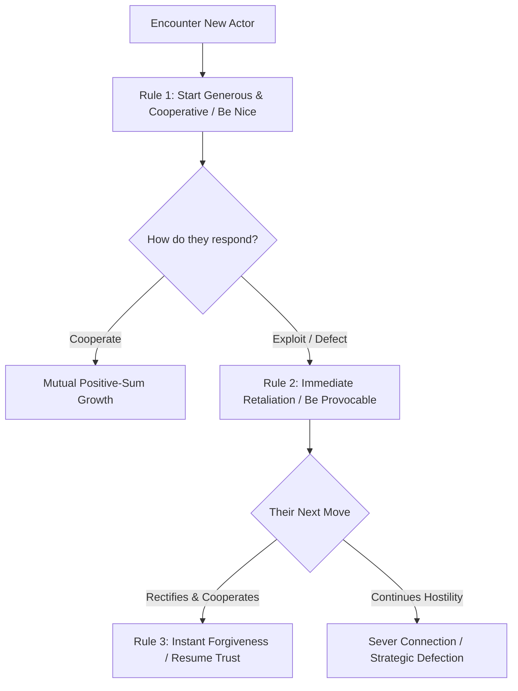
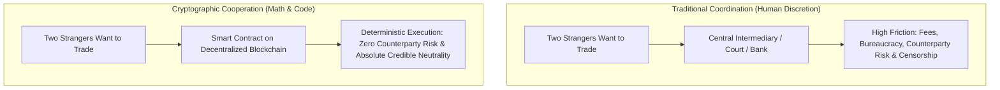

Most people view life through a false dichotomy: either you are a naive, self-sacrificing altruist who gets exploited, or a ruthless, cynical Machiavellian who trusts no one.

Mathematical Game Theory disproves both extremes. It proves that **strategic cooperation is the mathematically optimal long-term strategy for self-interested individuals**.

---

### The Iterated Dilemma: Why Nice Guys Finish First

#### Robert Axelrod’s Tournament
In 1980, political scientist Robert Axelrod invited world-renowned mathematicians and economists to submit algorithmic strategies for the **Iterated Prisoner's Dilemma**. Complex, predatory strategies programmed to exploit weaknesses were systematically eliminated. 

The champion was **Tit-for-Tat**, the simplest 4-line program submitted by Anatol Rapoport.

#### The 4 Rules for Winning the Game of Life:
1. **Be Nice:** Never be the first to defect. Always start every negotiation, friendship, and professional venture with honest goodwill and cooperation.
2. **Be Provocable:** If someone violates your trust, cheats you, or insults your boundaries, **retaliate immediately on the very next round**. Passive appeasement invites predatory exploitation.
3. **Be Forgiving:** The instant the counterparty rectifies their behavior, forgive immediately and return to cooperation. Do not maintain bitter multi-year grudges that poison the well.
4. **Be Clear:** Do not play ambiguous mind games. Let your rules, boundaries, and consequences be completely obvious to everyone.

---

### The Vitalik Buterin Synthesis: Cryptographic Game Theory & "Impregnable Castles Made of Math"

In his foundational discussions with Naval Ravikant, Ethereum creator Vitalik Buterin bridges classical game theory into modern decentralized mechanism design:

1. **Beyond Human Intermediaries ("Castles Made of Math")**: For thousands of years, scaling human cooperation required central authorities—tribal chiefs, royal courts, megabanks, and nation-state legal systems. While functional, human institutions suffer from rent-seeking, regulatory capture, corruption, and arbitrary confiscation. Ethereum and public smart contracts replace fallible human discretion with mathematical guarantees. If the condition is met, the code executes.
2. **Trading Efficiency for Credible Neutrality**: Critics often note that Ethereum is computationally slower and more expensive than an Amazon AWS or Google Cloud server. Vitalik points out that this is an intentional feature, not a bug. A centralized database optimizes for **raw efficiency**; a decentralized blockchain intentionally sacrifices efficiency to achieve **credible neutrality**—a public ledger where no single party, including its creator, can censor a transaction, print counterfeit supply, or rewrite history.
3. **The Layer 1 vs. Layer 2 Architecture**:
   - **Layer 1 (The Bedrock Court)**: Must remain simple, robust, and slow to change. It is optimized for maximum security, decentralization, and stateless verifiability so that an individual running a simple laptop node can audit the entire network.
   - **Layer 2 (The Permissionless Market)**: High-speed execution layers (rollups, zero-knowledge proofs) where applications run with sub-second latency and fractions-of-a-cent fees, settling their proofs back to the Layer 1 anchor.
4. **Byzantine Fault Tolerance & The Social Layer**: Game theory at civilizational scale is not merely software; it is the alignment of economic incentives with the human community. Protocol resilience requires that the honest majority always has an economic path to defend the network against attackers, backed by a culture of open-source stewardship and ideological neutrality.

---

### The Core Takeaway to Remember
### The Core Takeaway to Remember
> Cooperation is not an act of naive moral charity; it is the highest form of strategic intelligence. When playing repeated games in life, business, and protocols, start with transparent cooperation, retaliate swiftly against defection, forgive instantly upon repair, and replace fallible human friction with credibly neutral, verifiable systems.
