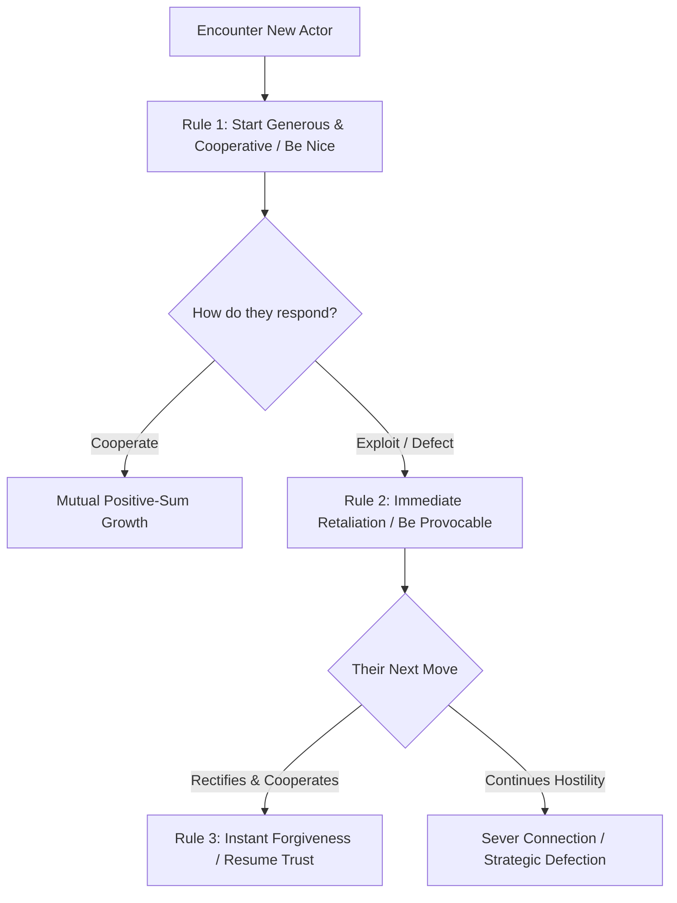

Most people view life through a false dichotomy: either you are a naive, self-sacrificing altruist who gets exploited, or a ruthless, cynical Machiavellian who trusts no one.

Mathematical Game Theory disproves both extremes. It proves that **strategic cooperation is the mathematically optimal long-term strategy for self-interested individuals**.

---

### The Iterated Dilemma: Why Nice Guys Finish First

#### Robert Axelrod’s Tournament
In 1980, political scientist Robert Axelrod invited world-renowned mathematicians and economists to submit algorithmic strategies for the **Iterated Prisoner's Dilemma**. Complex, predatory strategies programmed to exploit weaknesses were systematically eliminated. 

The champion was **Tit-for-Tat**, the simplest 4-line program submitted by Anatol Rapoport.

#### The 4 Rules for Winning the Game of Life:
1. **Be Nice:** Never be the first to defect. Always start every negotiation, friendship, and professional venture with honest goodwill and cooperation.
2. **Be Provocable:** If someone violates your trust, cheats you, or insults your boundaries, **retaliate immediately on the very next round**. Passive appeasement invites predatory exploitation.
3. **Be Forgiving:** The instant the counterparty rectifies their behavior, forgive immediately and return to cooperation. Do not maintain bitter multi-year grudges that poison the well.
4. **Be Clear:** Do not play ambiguous mind games. Let your rules, boundaries, and consequences be completely obvious to everyone.
