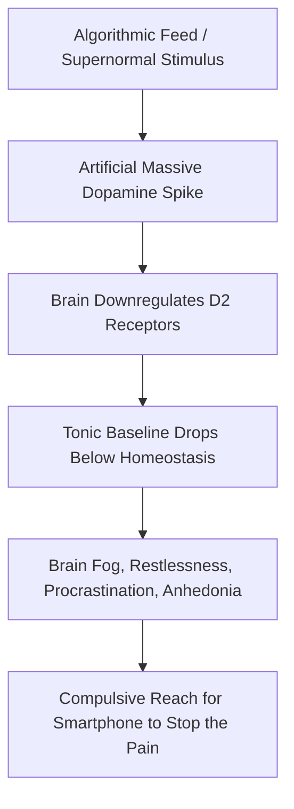

Modern technological civilization is conducting an unprecedented, uncontrolled biological experiment on the human nervous system.

By flooding a hunter-gatherer brain with algorithmic notifications, hyper-palatable foods, and infinite scrolling feeds, we have fundamentally disrupted the neurochemistry of attention and purpose.

---

### The Dopamine Baseline Dynamics

#### 1. The Dopamine Baseline Fallacy
Dopamine is not the molecule of reward or pleasure; it is the molecule of **pursuit, craving, and motivation**. When you trigger an artificial high-contrast spike (scrolling TikTok or playing video games), your brain pays an inevitable biochemical tax: **the baseline crashes below where it started**. 

True satisfaction (*Eudaimonia*) requires keeping the tonic baseline stable by deriving dopamine from **effort and progress**, not passive consumption.

#### 2. The 11 Million vs. 50 Bits Asymmetry
Your sensory organs flood your brain with **11,000,000 bits of information every second**. Your conscious prefrontal cortex can actively manipulate only **40 to 50 bits per second**. 
- The conscious ego is not the commander of an army; it is a tiny spotlight.
- If you place your smartphone face-up on your desk while studying, the visual cue consumes precious bits of subconscious cognitive bandwidth even if you never touch it.
- **The Law of Sovereign Environment:** You do not win through conscious grit; you win by ruthlessly eliminating cues from your physical and digital space.
