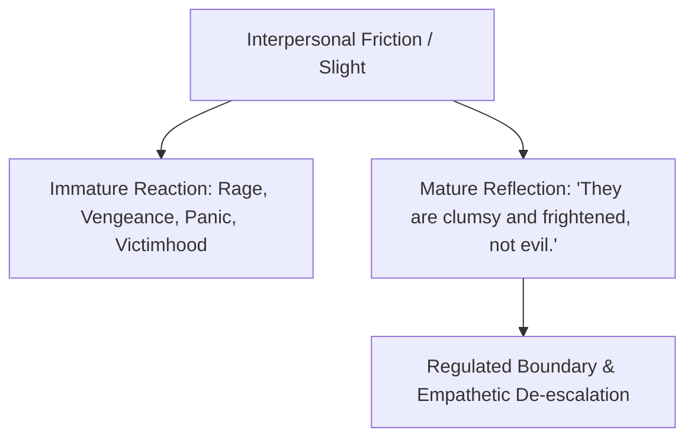

Emotional maturity is the transition from believing everyone is intentionally trying to hurt you to understanding that **most people are clumsy, frightened creatures attempting to defend their fragile egos.**

---

### Core Principles of Mature Intimacy

#### 1. The Real Meaning of Arguments
When partners fight violently over dishes or lateness, the real issue is never the dishes. It is the infantile panic: *"Do you care about me? Am I safe with you?"* Once you speak directly to the underlying fear instead of the surface detail, the argument dissolves.

#### 2. The Illusion of Romantic Completeness
The modern romantic myth claims one person can be your lover, best friend, co-parent, financial partner, and intellectual soulmate. Emotional maturity accepts that no human being can bear this weight, and loves partners for who they are rather than who they were projected to be.

#### 3. The 12 Signs of Psychological Maturity
1. Forgives parents without needing their confession.
2. Accepts that work and relationships are inherently flawed.
3. Understands that no one is truly "normal" once you know them well.
4. Pauses between impulse and reaction.
5. Replaces blame with curiosity.
6. Chooses peaceful routine over dramatic chaos.
