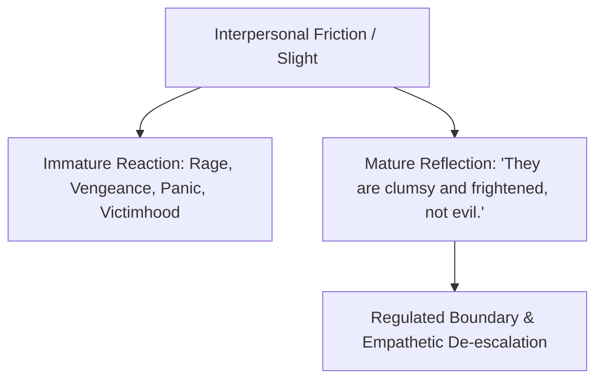
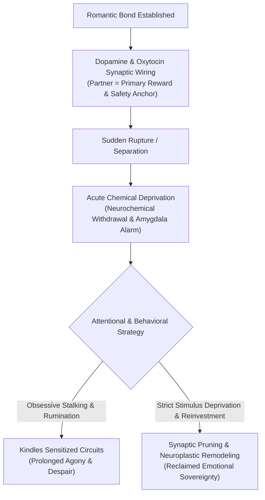
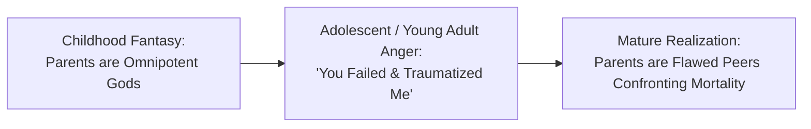

Emotional maturity is the transition from believing everyone is intentionally trying to hurt you to understanding that **most people are clumsy, frightened creatures attempting to defend their fragile egos.**

---

### Core Principles of Mature Intimacy

#### 1. The Real Meaning of Arguments
When partners fight violently over dishes or lateness, the real issue is never the dishes. It is the infantile panic: *"Do you care about me? Am I safe with you?"* Once you speak directly to the underlying fear instead of the surface detail, the argument dissolves.

#### 2. The Illusion of Romantic Completeness
The modern romantic myth claims one person can be your lover, best friend, co-parent, financial partner, and intellectual soulmate. Emotional maturity accepts that no human being can bear this weight, and loves partners for who they are rather than who they were projected to be.

#### 3. The 12 Signs of Psychological Maturity
1. Forgives parents without needing their confession.
2. Accepts that work and relationships are inherently flawed.
3. Understands that no one is truly "normal" once you know them well.
4. Pauses between impulse and reaction.
5. Replaces blame with curiosity.
6. Chooses peaceful routine over dramatic chaos.

---

### The Neurobiology of Romantic Rupture & Attachment Pruning
Heartbreak is not an abstract poetical sorrow; neuroimaging demonstrates that sudden romantic dissolution triggers the same dorsal anterior cingulate cortex (dACC) pain pathways as acute physical trauma:

1. **Neurochemical Withdrawal**: Being severed from a romantic partner causes a precipitous plunge in oxytocin and endogenous opioids. The agonizing craving to text, call, or check their social media is an animal withdrawal response seeking a dopamine hit.
2. **The Rebound Paradox**: Conventional folklore condemns "rebounds" categorically. From an attachment theory and neurochemical perspective, a controlled, transparent rebound can serve as an **attentional circuit breaker**. By introducing novel social stimuli and gentle dopamine signaling, it prevents destructive rumination, provided one does not practice deceit or seek instant replacement of deep intimacy.
3. **Synaptic Pruning Through Non-Contact**: Every time you view an ex-partner's photos or replay memories, you fire and wire the old attachment synapse. Strict stimulus deprivation starves the circuit, allowing neuroplasticity to gradually prune the connection over 60 to 90 days.

---

### Intergenerational De-Idealization: Empathy for Aging Parents
A hallmark of true psychological maturation is reframing one's relationship with aging parents:

1. **The Fall of the Parental Deity**: In childhood, parents are experienced as infallible authorities. In young adulthood, this illusion shatters, often producing bitter grievance over their flaws, emotional blind spots, or parenting mistakes.
2. **Recognizing the Flawed Peer**: Emotional maturity arrives when you realize your parents were in their twenties or thirties—often broke, anxious, traumatized by their own lineage, and improvising without psychological manuals—when they raised you.
3. **The Finite Window**: As parents enter their senior years, harboring resentment for unexpressed apologies is an infantile indulgence. Mature sovereignty grants forgiveness unilaterally, recognizing that time is irreversibly finite.
