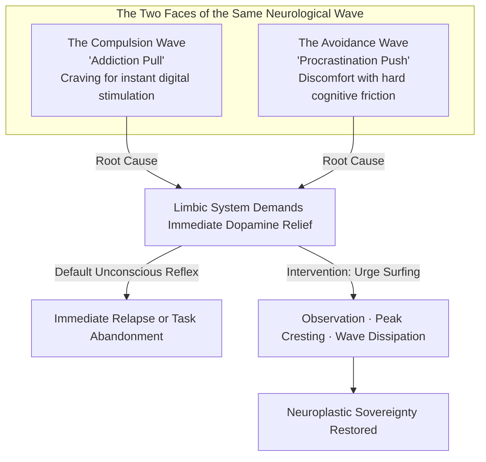
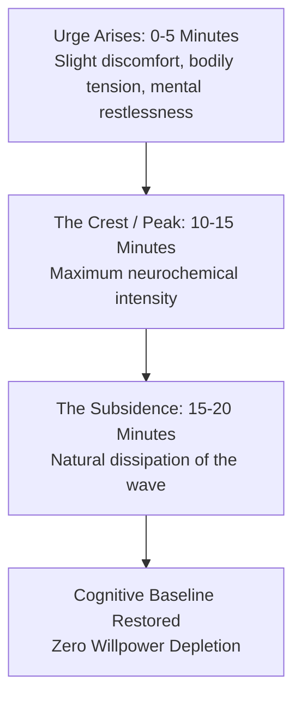
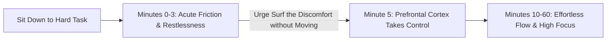
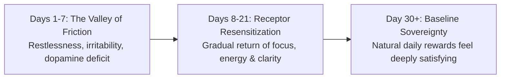

The human brain evolved in an ancestral environment of scarcity. For hundreds of thousands of years, high-calorie food, social approval, and reproductive opportunities required immense physical exertion and patience.

In the modern digital landscape, the brain encounters **Supernormal Stimuli**—artificial, hyper-concentrated sources of stimulation (such as infinite short-form video, hyper-palatable processed food, and digital pornography) that deliver neurochemical surges far exceeding anything found in nature.

Simultaneously, the brain encounters **The Friction Paradox**: demanding cognitive work (studying complex theory, deep analytical writing, building systems) generates immediate internal discomfort.

The modern mind is caught between two complementary impulses:
1. **The Compulsive Pull (Addiction)**: The urge to seek an effortless, immediate dopamine surge.
2. **The Avoidance Push (Procrastination)**: The urge to escape immediate cognitive discomfort and friction.

Both challenges share the exact same neurobiological mechanism. Mastering them requires the singular metacognitive skill of **Urge Surfing**.

---

### The Dual-Front Mechanism of Impulse Control

---

### The Fallacy of White-Knuckle Suppression

The most common mistake when attempting to break a compulsive habit or force focus is **brute-force thought suppression** (*"I must not look at my phone"* or *"I must force myself to like this hard task"*).

* **The Ironic Process Theory**: When you consciously try *not* to think about an impulse, your brain must constantly scan your subconscious to check whether you are thinking about it. This paradoxical monitoring keeps the neural circuit in a state of high arousal.
* **The Shame-Relapse Cycle**: Suppressing urges with self-criticism and guilt increases psychological stress (cortisol). Because your brain was conditioned to use the compulsive behavior to soothe stress in the first place, guilt directly accelerates the next relapse or distraction loop.

---

### The Unified Technique of Urge Surfing

Developed in clinical addiction psychology by Dr. Alan Marlatt, **Urge Surfing** approaches physical and mental cravings not as commands to obey or enemies to fight, but as **transient physiological waves**.

An urge is not an infinite upward climb; it is an ocean wave that peaks within **10 to 15 minutes** (for compulsive cravings) or **3 to 5 minutes** (for procrastination friction) and naturally subsides if it is not fed by mental fantasy or physical action.

#### The 3-Step Urge Surfing Protocol:
1. **Shift to the Observer Stance**: The moment a craving or procrastination aversion strikes, mentally step back. Say to yourself: *"My brain is experiencing a dopamine wave; I am the observer watching this wave, not the wave itself."*
2. **Body Scan Localization**: Locate where the physical sensation of the urge is living in your body (tightness in the chest, heat in the stomach, restlessness in the hands, tension behind the eyes).
3. **Breathe into the Sensation**: Instead of resisting or grabbing your phone for immediate escape, breathe deeply into that physical sensation with neutral curiosity. Watch the intensity rise, peak, and dissolve.

---

### Applying Urge Surfing to Overcome Procrastination

When sitting down to study or do deep work, notice that the desire to check notifications or abandon the desk is at its **maximum intensity during the first 3 minutes**.

* **The Friction Wave**: The initial discomfort is not permanent; it is simply the friction of shifting neural gears from passive consumption to active calculation.
* **The 3-Minute Rule**: Agree to sit with the physical friction for just 180 seconds without touching another tab or device. Once the initial friction wave crests, the brain slips into deep immersion.

---

### The HALT Diagnostic: Unmasking Emotional Triggers

Compulsive digital consumption and procrastination are rarely about the task or stimulus itself; they are almost always **unconscious coping mechanisms** for underlying unmet biological deficits.

| State | Underlying Deficit | The True Physical Solution |
| :--- | :--- | :--- |
| **H — Hungry** | Low blood glucose & metabolic fatigue | Eat a nutrient-dense whole-food meal |
| **A — Angry / Anxious** | Elevated cortisol & sympathetic stress | 5-minute box breathing or physical walk |
| **L — Lonely** | Oxytocin deficit & social isolation | Reach out to a friend or work in a shared space |
| **T — Tired / Bored** | Prefrontal cortex depletion | Sleep, rest, or step away from all screens |

---

### The Receptor Restoration Timeline

When you consistently urge-surf rather than surrender to supernormal stimuli, the brain undergoes a predictable neuroplastic reset:

1. **The Friction Phase (Days 1–7)**: As the brain adapts to the absence of hyper-stimulation, you will experience transient boredom and lethargy. This is the physiological signature of healing.
2. **The Resensitization Phase (Days 8–21)**: D2 dopamine receptors in the striatum begin to multiply and regain sensitivity.
3. **The Emergence of Natural Reward (Day 30+)**: Normal activities—reading a book, having a deep conversation, exercising, or solving a hard problem—begin to feel intrinsically engaging and deeply rewarding again.

---

### The Core Takeaway to Remember
> Cravings and procrastination are not character flaws; they are transient neurochemical waves. You do not need to fight the wave or obey it—simply observe it without judgment, let it crest and subside, and allow your brain's natural sovereignty to return.
