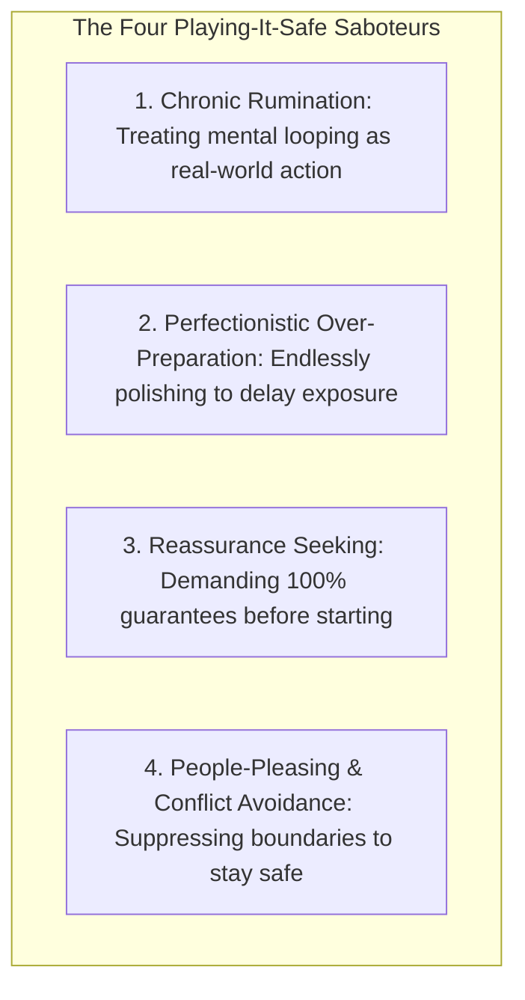
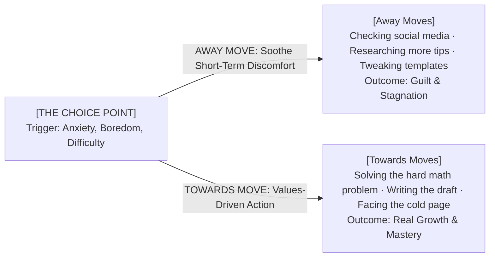
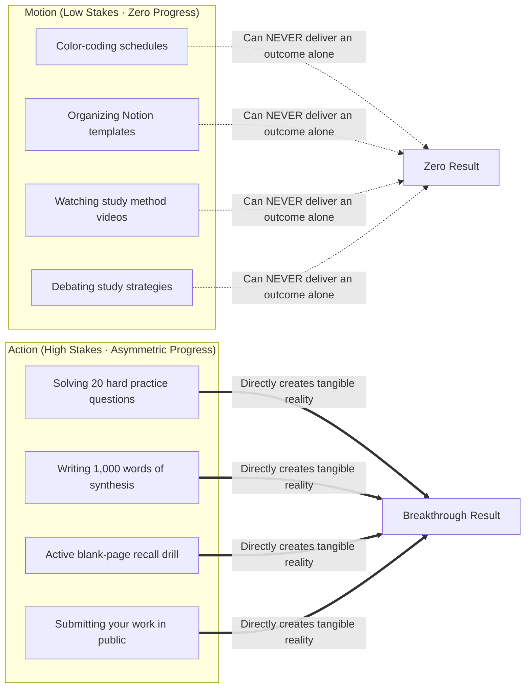
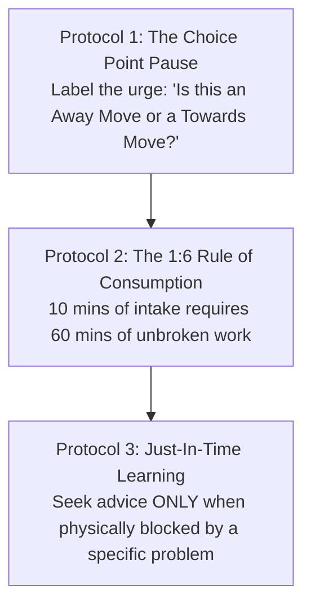

In the digital era, one of the most insidious forms of procrastination does not disguise itself as video games or television. It disguises itself as **self-improvement and "careful preparation."**

Millions of people spend hours every week consuming productivity videos, researching strategies, organizing templates, and endlessly tweaking plans. While this behavior feels virtuous and responsible, clinical psychology and behavioral science reveal that excessive preparation often functions as a **subconscious anxiety-avoidance mechanism**.

When you over-prepare or ruminate, your brain experiences **Vicarious Accomplishment**—it mistaking the *simulation of growth* for the *reality of execution*.

Understanding the **Action Paradox** and mastering the **Acceptance and Commitment (ACT) Choice Point** allows you to dismantle the four "playing-it-safe" saboteurs and anchor your life in values-driven execution.

---

### The Anatomy of Vicarious Accomplishment

```mermaid
graph TD
    subgraph SG_1_The_Self_Help__ ["The Self-Help & Preparation Trap"]
        C1[Encounter Fear of Failure / Uncertainty] 
        --> C2["Engage in 'Playing-It-Safe' Behaviors: Over-Research & Polish"]
        --> C3[Temporary Drop in Anxiety · Illusion of Progress]
        --> C4[Zero Real-World Exposure · Shrinking Self-Efficacy]
        --> C5[Anxiety Returns Stronger When Deadlines Approach]
        C5 --> C1
    end

    subgraph SG_2_The_Sovereign_A ["The Sovereign Action Path"]
        A1[Encounter Fear / Uncertainty]
        --> A2["The Choice Point: Execute 'Towards Move' Despite Discomfort"]
        --> A3[Direct Physical Exposure & Friction]
        --> A4[Empirical Skill Deposit & Unshakeable Self-Trust]
    end

```

---

### The Four "Playing-It-Safe" Saboteurs

Human beings do not procrastinate because they are lazy; they engage in **"Playing-It-Safe" behaviors** to temporarily soothe unhandled anxiety:

1. **Chronic Rumination (The Simulation Trap)**: Believing that thinking through 50 worst-case scenarios is equivalent to solving a problem. Rumination is passive mental looping that drains glucose without producing a single physical result.
2. **Perfectionistic Over-Preparation (Ego Shield)**: Reading five more books, watching three more courses, or color-coding notes to delay putting your work into the real world where it can be judged.
3. **Reassurance Seeking**: Demanding constant validation from mentors, peers, or checklists before making a decision.
4. **The Short-Term Tradeoff**: Playing-it-safe behaviors work brilliantly in the short term because they lower your immediate anxiety. But they construct a long-term psychological prison, trading acute discomfort for chronic stagnation.

---

### The ACT Choice Point: "Away Moves" vs. "Towards Moves"

Whenever you sit down to work and feel the sting of uncertainty, self-doubt, or difficulty, you arrive at a **Choice Point**:

* **Away Moves**: Any behavior driven by the desire to escape internal discomfort (scrolling, researching, tweaking templates, snacking). It moves you away from your values and latent potential.
* **Towards Moves**: Any action aligned with your core values and mission, executed **in the presence of internal discomfort**.
* **The Principle of Willingness**: You do not need to wait until fear, self-doubt, or resistance vanishes before taking action. You only need the **willingness** to allow the uncomfortable physical sensations to exist while your hands continue to execute your Towards Moves.

---

### Motion vs. Action: The Critical Distinction

* **Motion**: Actions that prepare, plan, or organize for a task. Motion feels productive and carries zero risk of failure, but it will never produce an outcome on its own.
* **Action**: Direct, friction-filled execution that delivers a measurable result. Action exposes you to the possibility of error, which is why the comfort-seeking brain constantly attempts to substitute Motion for Action.

---

### The Protocols for Restoring Action Sovereignty

#### 1. The Choice Point Micro-Pause
When you feel the sudden impulse to switch tabs, read another article, or reorganize your workspace, pause for 3 seconds and ask:
> *"Is this action an Away Move to soothe my temporary anxiety, or a Towards Move that builds my craft?"*

#### 2. The 1:6 Consumption-to-Execution Ratio
For every 10 minutes of educational or tactical advice you consume, you must invest at least **60 minutes of active, distraction-free execution** before consuming another byte.

#### 3. Just-In-Time Learning
Shift from *Just-In-Case Information Hoarding* to *Just-In-Time Learning*: Consume information **only when you are currently sitting at your desk and hit a concrete, technical bottleneck**. Find the specific answer, close the browser, and return to execution.

---

### The Core Takeaway to Remember
> Stop using preparation as a shield against the vulnerability of action. Recognize the four playing-it-safe saboteurs, pause at the Choice Point, develop the willingness to carry discomfort, and execute your Towards Moves with relentless devotion to your craft.
