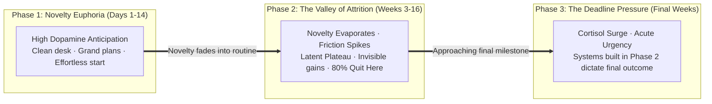
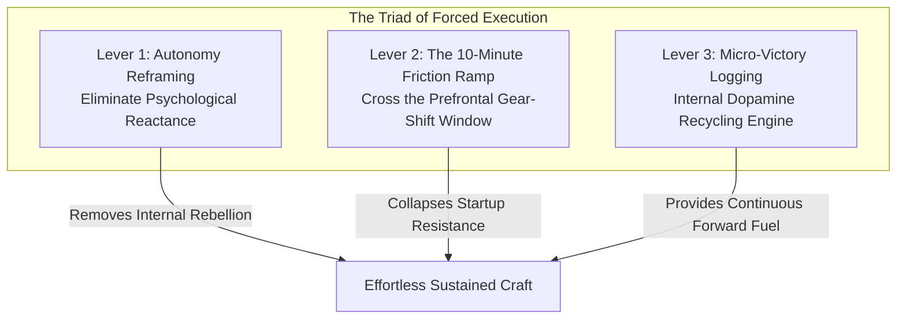
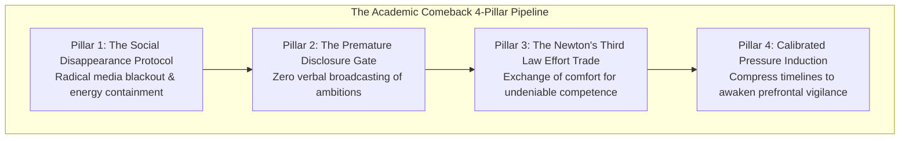

Every major human pursuit—whether preparing for a career-defining competitive examination, mastering an advanced domain, or building an enterprise—follows a predictable **tri-phasic psychological curve**.

Most people begin with intense excitement, only to experience an agonizing decline in motivation within weeks. They mistakenly interpret this decline as a loss of passion, lack of capability, or personal failure.

In reality, motivation is a temporary neurochemical catalyst, not a long-term strategy. When you understand the **Three Phases of Long-Term Pursuits** and install the **Triad of Forced Execution**, you develop the capacity to sit down and execute high-friction work regardless of emotional resistance.

---

### The Tri-Phasic Psychological Arc of Long-Term Pursuits

---

#### Phase 1: The Novelty Euphoria (Days 1–14)
* **The Neurobiology**: When embarking on a new endeavor, the brain experiences a massive surge of baseline dopamine. Everything feels fresh, possible, and exciting.
* **The Dangerous Trap**: Beginners mistake this cheap, novelty-driven energy for true discipline. They build unsustainable schedules (e.g., studying 12 hours a day immediately), setting themselves up for systemic burnout the moment novelty wears off.

---

#### Phase 2: The Valley of Attrition / The Muddy Middle (Weeks 3–16)
* **The Reality**: Novelty is gone; the daily work is repetitive, difficult, and lonely. Progress is subterranean and invisible (The Latent Plateau).
* **The Crisis**: The ancient comfort-seeking brain, starved of novel dopamine, begins manufacturing rationalizations: *"Maybe this isn't for me,"* *"I will take a short break and restart next week,"* or *"I need a new strategy."*
* **The Law**: **Eighty percent of aspirants and creators quit in Phase 2.** True competitive advantage is not built in Phase 1; it is won by the sovereign execution of unexciting fundamentals in the middle of Phase 2.

---

#### Phase 3: The Deadline Squeeze (Final Weeks)
* **The Pressure**: As the ultimate test or launch approaches, temporal urgency spikes adrenaline and cortisol.
* **The Outcome**: Those who relied solely on feelings in Phase 2 experience acute panic and breakdown. Those who built rigid, automatic systems in Phase 2 execute with calm, surgical precision.

---

### The Triad of Forced Execution (How to Move Without Motivation)

When emotional resistance is high, relying on willpower alone causes cognitive exhaustion. Apply the three structural levers:

---

#### 1. Autonomy Reframing (Dismantling Psychological Reactance)
Whenever you tell yourself, *"I HAVE to study,"* *"I MUST do this,"* or *"I SHOULD work,"* your brain registers internal coercion.
* **Psychological Reactance**: The human subconscious automatically rebels against perceived loss of freedom, generating feelings of stubborn resistance, lethargy, and resentment.
* **The Linguistic Shift**: Replace all coercive language with autonomous sovereignty:
  * Instead of: *"I have to sit here and solve 50 problems."*
  * Say: *"I am freely CHOOSING to master these 50 problems today because it aligns with my personal standard of excellence."*
* Reframing action as an act of personal freedom instantly dissolves subconscious rebellion.

---

#### 2. The 10-Minute Friction Ramp (The Gear-Shift Window)
The brain experiences its absolute peak resistance during the transition from rest to deep calculation.
* **The Mechanism**: Shifting neural blood flow from the Default Mode Network into the Dorsolateral Prefrontal Cortex requires roughly 600 seconds (10 minutes).
* **The Protocol**: Make a non-negotiable pact to engage with the task for **exactly 10 minutes with zero expectation of high performance**. Once the 10-minute gear-shift is complete, cognitive inertia flips from resistance to effortless immersion.

---

#### 3. Micro-Victory Logging (Internal Dopamine Recycling)
When tasks are large and distant, the brain receives zero reward feedback, causing rapid motivation depletion.
* **The Method**: Deconstruct a 3-hour work block into **three 45-minute micro-sprints**, each with a singular, clearly defined physical output (e.g., *"Summarize Chapter 4"* or *"Solve questions 1 through 15"*).
* **The Dopamine Strike**: Physically check off each micro-milestone on paper upon completion. This deliberate acknowledgment closes the cognitive feedback loop, releasing a micro-dose of dopamine that fuels the next sprint from within the craft itself.

---

### The Academic Comeback Architecture: Strategic Isolation & Calibrated Pressure

When an aspirant or high performer experiences a prolonged period of academic drift, underachievement, or lost momentum, restarting feels mathematically impossible. As articulated by **Dr. Anuj Pachhel** (who cleared NEET UG and NEET PG on his first attempts), an extraordinary academic comeback is not achieved through incremental tweaks to a casual routine. It demands **radical environmental isolation, energy containment, and controlled neurological urgency**.

#### 1. The Social Disappearance Protocol
The single greatest leak of cognitive energy during competitive preparation is **social maintenance**.
* **The Energy Drain**: Trying to stay socially available, maintaining messaging streaks, attending peripheral family gatherings, and scrolling peers' highlight reels fractures executive attention.
* **The Disappearance Mandate**: Disappear completely from social feeds and casual social circles for 6 to 12 months. This is not anti-social cynicism; it is the **deliberate preservation of metabolic capital**. True allies and genuine supporters will respect your temporary absence; superficial acquaintances will fall away, permanently removing distraction.

#### 2. The Premature Disclosure Dopamine Trap
A fatal behavioral error made by struggling students is publicly announcing their comeback: *"Starting tomorrow, I am waking up at 5:00 AM and studying 10 hours a day."*
* **The Neurological Mechanic**: When you state your intentions to friends or family, they offer instant verbal appreciation, praise, and encouragement.
* **The Dopamine Fraud**: The striatum cannot distinguish between social praise for *promising* to do something and the actual neurochemical reward of *completing* it. The brain receives an unearned flood of dopamine, which dissipates the internal tension and hunger required to actually execute the grueling work.
* **The Rule of Silence**: **Protect your ambitions in absolute secrecy.** Never broadcast your study hours, target scores, or plans. Let your work remain invisible until the results make noise on your behalf.

#### 3. The Newton's Third Law Effort Exchange
* **The Casual Routine Illusion**: Many aspirants conflate physical presence with rigorous effort: attending classes, eating, casually reviewing a few questions, and going to bed. This is mere biological existence, not competitive preparation.
* **The Metabolic Law**: Analogous to Newton's Third Law ($F_{\text{action}} = -F_{\text{reaction}}$), exceptional results demand an equal and uncompromising exchange of effort. The universe does not award rank to wishes. You must physically surrender gluttony, laziness, comfort, and entertainment to purchase intellectual dominance.

#### 4. Calibrated Pressure Induction (Awakening the Dormant Beast)
* **The Relaxation Trap**: Operating with excessive leisure (*"The exam is still 8 months away"*) induces chronic complacency, low arousal, and sluggish cognitive throughput.
* **The Optimal Yerkes-Dodson Calibration**: Elite performance requires an elevated, controlled degree of psychological pressure. 
* **Timeline Compression**: Actively compress your timelines. Instead of planning a leisurely 6-month first read, demand that your first comprehensive revision finishes in **60 to 90 days**, forcing you into immediate problem-solving mode and multiple cumulative revision cycles.
* **Eliminating Safety Nets**: Refuse the psychological crutch of a "drop year" or "backup attempt." When the bridge behind you is burned, the prefrontal cortex mobilizes dormant evolutionary reserves, focusing attentional stamina with surgical intensity.

#### 5. Pruning Peripheral Toxicity
In high-stakes competitive examinations, subtle negativity from peers, relatives, or cynical study partners acts as a psychological neurotoxin.
* In zero-sum competitive selection, peers may outwardly sympathize while subconsciously fearing your elevation.
* The moment an associate disparages your targets, introduces gossip, or tempts you to compromise your standards, **sever contact immediately**. Safeguarding your cognitive environment is a prerequisite for sustained victory.

---

### The Core Takeaway to Remember
> Motivation is a visitor that arrives only after the work has begun. Do not wait for excitement to return in the muddy middle—reframe your work as sovereign choice, survive the first 10 minutes of friction, log your micro-victories, and let consistent systems carry you across the finish line.
