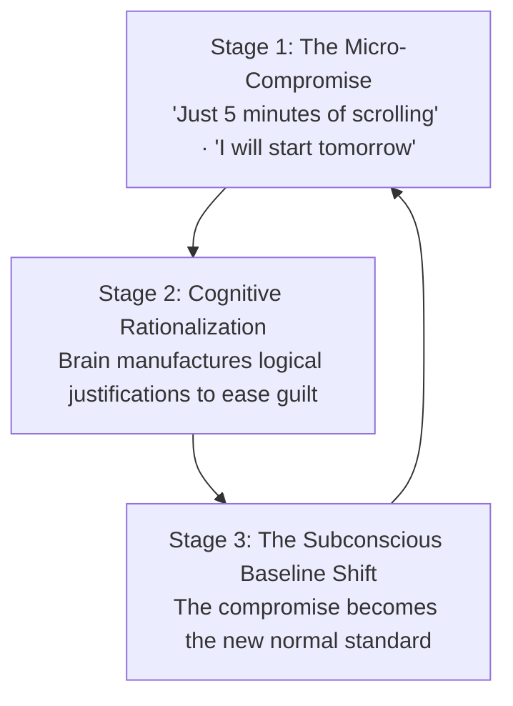
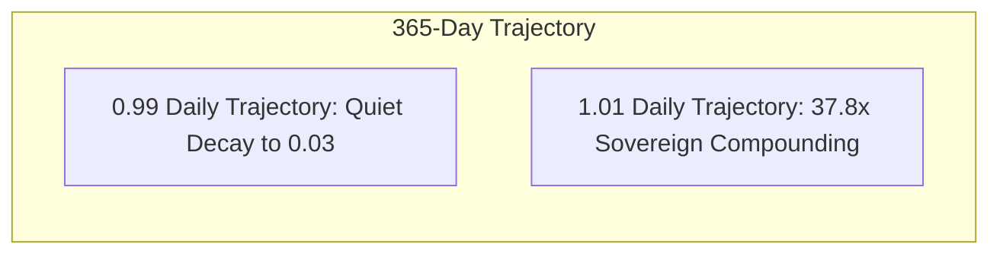
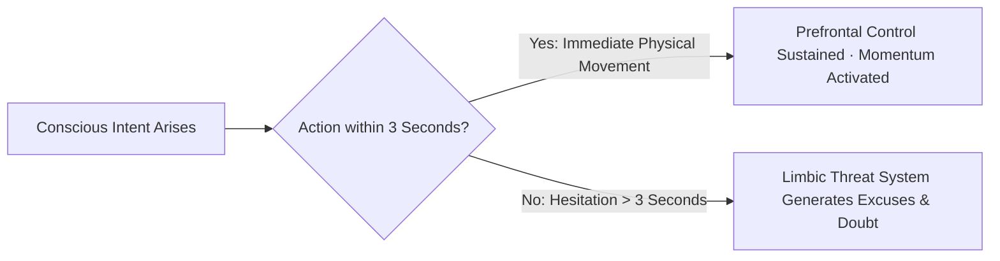
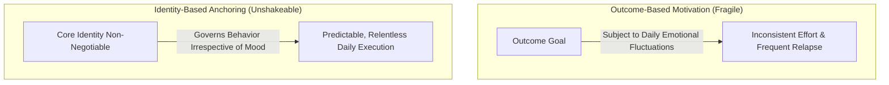

Chronic indiscipline is almost never caused by a lack of information.

In the modern era, nearly everyone knows what they *should* do: eat nourishing foods, exercise regularly, read deeply, avoid compulsive screen time, and execute focused daily work. The crisis of indiscipline is a **failure of the translation layer between intent and immediate physical action**.

When an individual allows repeated micro-compromises in daily life, they are not merely losing time; they are **subconsciously retraining their brain to treat their own commitments as optional**.

Understanding the neurological anatomy of indiscipline allows you to dismantle the excuse-generating engine and install unbreakable identity anchors.

---

### The Three Stages of Subconscious Decay

Indiscipline does not begin with dramatic, catastrophic failures; it begins with an almost imperceptible three-stage sequence:

1. **The Micro-Compromise**: An intentional agreement with yourself is broken for momentary comfort.
2. **The Rationalization Engine**: To eliminate the uncomfortable sensation of cognitive dissonance (the gap between who you want to be and what you just did), your prefrontal cortex manufactures a convenient lie (*"I had a tiring day,"* *"One day won't make a difference,"* or *"I work better under pressure later"*).
3. **The Baseline Shift**: Because the brain survived the compromise with zero immediate physical consequence, the subconscious lowers its operational standard. What was once an unthinkable breach becomes the default habit.

---

### The Mathematics of Compound Action

Human behavior is governed by exponential power laws. A single compromise or disciplined action appears completely inconsequential in isolation, but over a 365-day horizon, the compounding effect is mathematically devastating:

$$\text{Compound Neglect: } (0.99)^{365} \approx 0.03 \quad (\text{97\% Degradation})$$

$$\text{Compound Discipline: } (1.01)^{365} \approx 37.8 \quad (\text{37x Exponential Growth})$$

* **The Illusion of Symmetry**: A 1% improvement and a 1% compromise feel identical on any given Tuesday afternoon.
* **The Reality of Divergence**: Over a year, the individual who maintains 1% discipline becomes **more than 1,000 times more capable** than the individual who surrendered to 1% neglect.

---

### The 3-Second Rule: Bypassing the Limbic Hesitation Trap

When your conscious mind recognizes an action that must be taken (e.g., getting out of bed, opening a difficult textbook, shutting down a digital distraction), you have a **3-second neurobiological window** before your emotional limbic system generates friction.

* **The Science of Hesitation**: The human brain interprets hesitation as a signal of potential threat. If you pause and think for more than 3 seconds, the brain immediately releases micro-signals of anxiety and provides logical excuses to keep you in comfort.
* **The Execution Protocol**: The moment the thought of execution enters your consciousness, count down **3... 2... 1...** and move your physical body immediately. Do not debate, do not negotiate, and do not consult your emotional state.

---

### Identity-Based Anchoring: From Goals to Non-Negotiables

Most people fail to maintain discipline because their efforts are anchored only to **outcome-based goals** (*"I want to lose 5 kg"* or *"I want to clear an exam"*).

1. **The Outcome Trap**: When you are tired, demotivated, or anxious, an abstract goal six months in the future lacks the immediate neurochemical power to compete with instant dopamine.
2. **The Identity Anchor**: Shift your self-definition from what you want to achieve to **who you are**.
   * Instead of: *"I am trying to study 4 hours today."*
   * Shift to: *"I am a craftsman who never negotiates with his morning deep-work block, regardless of how I feel."*
3. **The Non-Negotiable Rule**: Identify **1 to 2 core anchor behaviors** in your day that are completely non-negotiable. Whether you are inspired, exhausted, traveling, or stressed, these anchors are executed without emotional debate.

---

### The Core Takeaway to Remember
> Indiscipline is not a lack of knowledge; it is a habit of negotiating with your own standards. Never hesitate longer than 3 seconds, anchor your discipline to your identity rather than fleeting emotions, and recognize that small daily compromises compound into massive lifetime decay.
