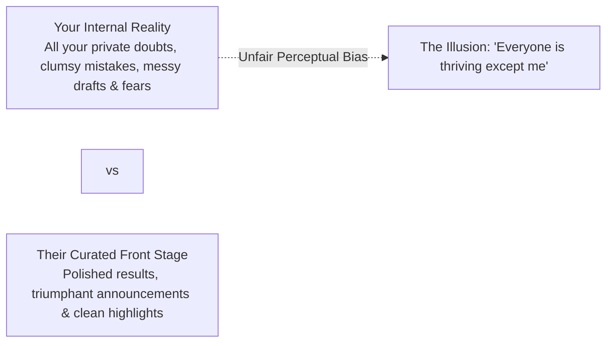
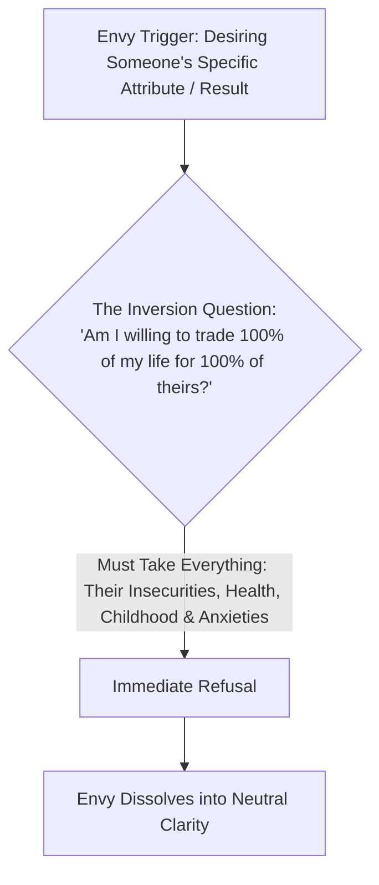
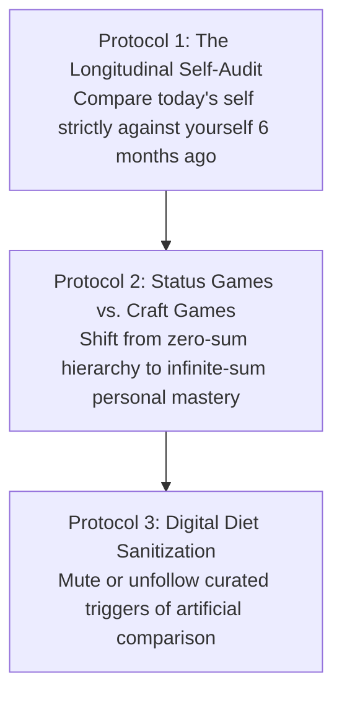

Social comparison is one of the deepest drivers of human anxiety, imposter syndrome, and emotional exhaustion.

Even high-functioning individuals who are making steady, disciplined progress often experience sudden waves of inadequacy when they see a peer succeed, get promoted, or announce a major milestone. A quiet inner voice whispers: *"You are falling behind in life."*

In evolutionary psychology and cognitive science, social comparison is not a personal character flaw; it is an **ancestral survival algorithm operating in a severely distorted modern environment**. When you understand the evolutionary mechanics of comparison and apply the **Complete Package Trade Heuristic**, you permanently disconnect your self-worth from external scoreboards.

---

### The Evolutionary Mismatch of Comparison

For hundreds of thousands of years, the human brain evolved in small ancestral tribes of 50 to 150 people.

```mermaid
graph TD
    subgraph Ancestral Environment (Calibrated & Local)
        A1[Small Tribe: 50-150 People] --> A2[Visible, Realistic Local Comparisons]
        A2 --> A3[Clear, Stable Social Hierarchy]
    end

    subgraph Modern Digital Environment (Hyper-Distorted)
        M1[Global Digital Algorithms] --> M2[Exposed to Top 0.01% Worldwide Daily]
        M2 --> M3[Brain Interprets Global Elite as Immediate Tribe Rivals]
        M3 --> M4[Chronic Feeling of Defeat & Inadequacy]
    end
```

* **The Ancestral Purpose**: In a small band of hunter-gatherers, monitoring your standing relative to immediate peers was essential for survival and resource distribution.
* **The Modern Distortion**: Today, your ancient tribal brain is exposed daily to the curated highlight reels of millions of people worldwide. The brain mistakenly treats the top 0.01% of global performers as its immediate local competitors, triggering an ongoing subconscious alarm that you are at the bottom of the tribe.

---

### The Backstage Fallacy (Asymmetric Information Trap)

The fundamental cognitive error in social comparison is the **Asymmetric Information Trap**:



* You compare your **entire internal raw backstage** (every moment of laziness, confusion, awkwardness, and self-doubt) against another person's **carefully curated front stage** (their filtered accomplishments, awards, and victories).
* You judge yourself on how you *feel* inside, while judging everyone else on how they *look* outside.

---

### The Complete Package Trade Heuristic (The Inversion Test)

Whenever you experience a pang of envy toward someone else's success, wealth, score, or physical appearance, run the **Complete Package Trade Heuristic**:



1. **The Pick-and-Choose Myth**: Envy assumes you can selectively extract someone else's single desirable trait (e.g., their exam rank or wealth) while retaining your own mind, family, relationships, and identity.
2. **The Reality of Human Existence**: Every human life is an indivisible, whole package containing unique traumas, private illnesses, relationship strains, and mental burdens.
3. If you would not trade your entire life—your soul, your memories, your body, your struggles—for theirs, then **desiring any isolated piece of their outcome is mathematically irrational**.

---

### The Three Protocols for Sovereign Self-Calibration



#### 1. The Longitudinal Self-Audit (You vs. You-6-Months-Ago)
* The only statistically valid baseline for measuring progress is your own historical coordinate.
* Ask: *Are my focus, understanding, and emotional composure better than they were 6 or 12 months ago?* If yes, the compounding engine is functioning flawlessly.

#### 2. Shift from Status Games to Craft Games
* **Status Games (Zero-Sum)**: Require someone else to lose for you to win (ranking higher than someone else). They breed paranoia, envy, and fragile egos.
* **Craft Games (Infinite-Sum)**: Focus entirely on solving hard problems, mastering principles, and deepening knowledge. The excellence of another person does not diminish your ability to master your craft; it provides proof of what is possible.

#### 3. Environmental & Digital Sanitization
* The brain cannot resist comparison if it is continuously fed algorithmic stimulation designed to trigger inadequacy.
* Ruthlessly prune your information diet. Mute, unfollow, or remove feeds that trigger cheap upward comparison, and protect your mental bandwidth for deep work.

---

### The Core Takeaway to Remember
> Social comparison is comparing your raw internal backstage with someone else's curated front stage. You cannot trade for someone's victory without adopting their entire life and struggle. Step out of the status game, measure yourself strictly against your past baseline, and let deep craft be your only scoreboard.
