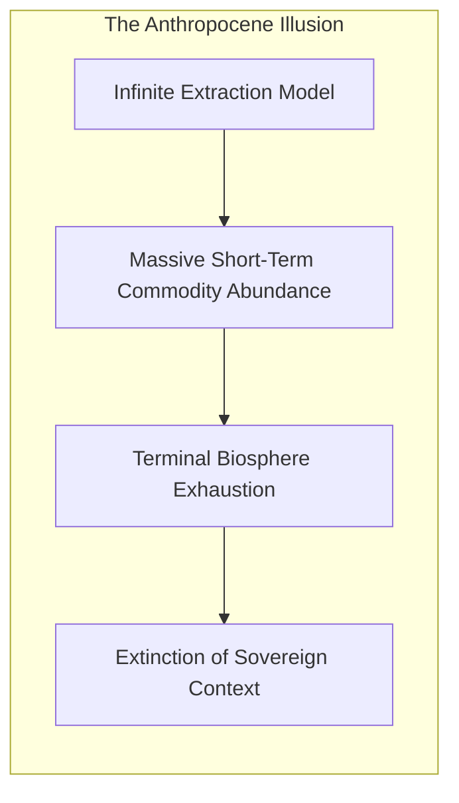
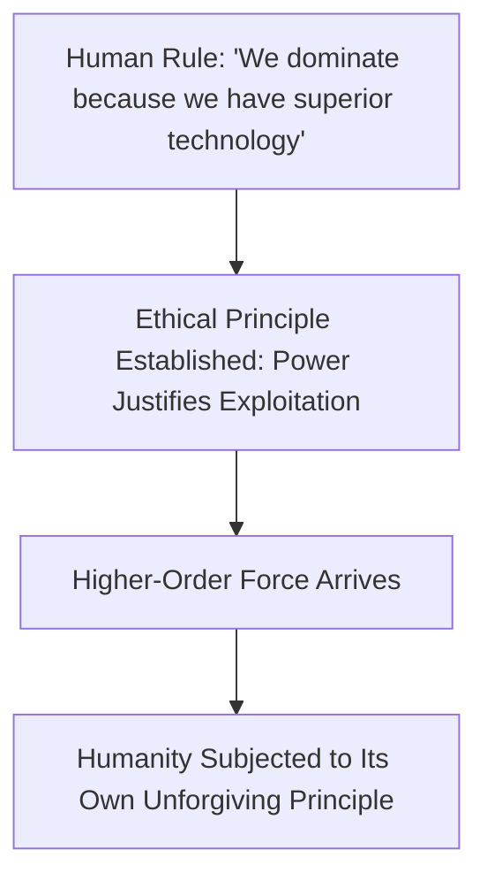

In his seminal animated treatise *MAN*, artist and satirist **Steve Cutts** deconstructs the foundational pathology of the Anthropocene: humanity’s transition from a biological participant within the biosphere to an unchecked, extractive predator.

Set against the relentless cadence of Edvard Grieg’s *In the Hall of the Mountain King*, the work illustrates how **extractive consumerism divorces power from stewardship**, creating a self-terminating civilizational trajectory.

---

### The Extractive Cascade: From Participant to Commodity Engine

The human relationship with nature in the modern era follows a predictable, escalating cycle of rationalized exploitation:

1. **The Trivialization of Harm**: The narrative begins not with grand malice, but with casual, smiling cruelty—stepping on a beetle, transforming a snake into footwear, turning an elephant into knick-knacks. Exploitation begins when living organisms are viewed solely as raw material for transient human convenience.
2. **The Industrial Acceleration**: Mechanization severs individual humans from the sensory reality of destruction. Trees enter a shredder and exit as clean, sterile reams of paper; oceans become infinite dumping grounds for single-use plastics. The market mechanism abstracts the violence of extraction into frictionless consumer products.

---

### The Pathology of the Trash Heap Sovereign

The climax of Cutts's critique arrives when the protagonist, having eradicated all competing terrestrial fauna and flattened the ancient forests, crowns himself with an inflatable throne atop a colossal mountain of industrial sludge.

* **The Illusion of Victory**: Humanity celebrates "conquering nature" without recognizing that humanity is an inseparable subsystem of the very nature it has destroyed.
* **The Irony of Sovereignty**: True sovereignty requires endurance, regeneration, and resilience. To reign over an irradiated, plasticized wasteland is not sovereignty; it is a pyrrhic victory born of cognitive blindness.

---

### The Extraterrestrial Mirror: The Symmetry of Domination

The final thirty seconds deliver the philosophical conclusion of the work:

When an alien craft lands on Earth, its robotic pilot steps out, views humanity, and promptly crushes the man beneath its foot before transforming his skin into a decorative rug—mirroring the exact sequence of actions humanity inflicted upon terrestrial species.

> If a civilization establishes technological dominance as its sole moral justification for exploitation, it forfeits all philosophical claims to dignity when confronted by a superior power.

---

### The Core Takeaway to Remember

> Civilizational greatness cannot be measured by the speed at which living ecosystems are converted into dead commodities. A society that substitutes extractive domination for moral stewardship ultimately crowns itself sovereign over an uninhabitable garbage heap.
