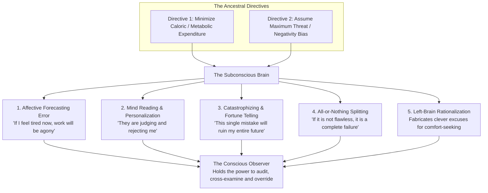
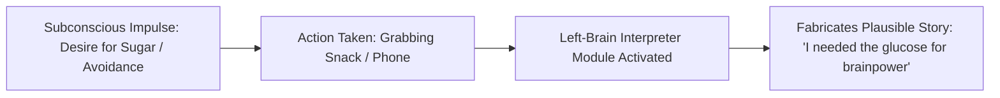
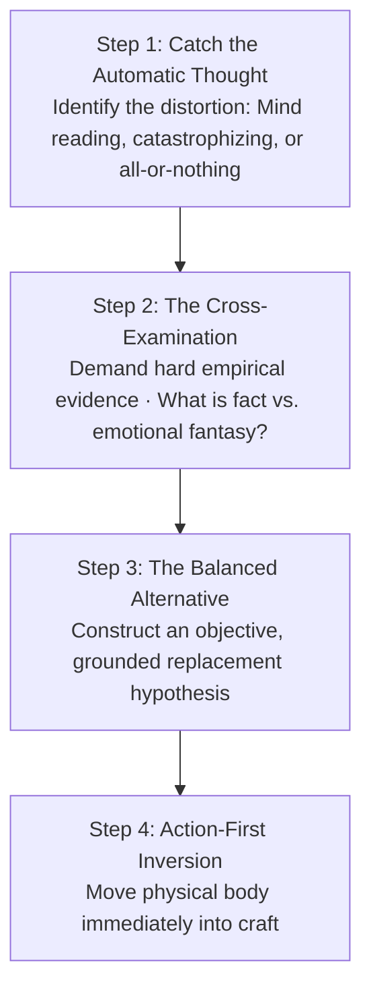

One of the greatest milestones in mental maturity is the realization that **not every thought that arises in your mind is true**.

The human brain did not evolve to deliver objective reality, philosophical truth, or long-term fulfillment. It evolved in an environment of extreme ancestral scarcity with two primary directives: **conserve metabolic energy and survive perceived threats**.

To achieve this, the brain operates as an aggressive simulation and shortcut machine. It routinely distorts reality, amplifies fear, invents convenient rationalizations, and mispredicts future feelings. When you treat every incoming thought as a factual verdict, you become the prisoner of your own evolutionary programming. When you understand the **Master Cognitive Distortions**, you develop the meta-cognitive ability to observe the mind without being governed by its illusions.

---

### The Architecture of the Deceptive Mind

---

### The Five Daily Cognitive Distortions

---

#### 1. The Affective Forecasting Error (The Projection Fallacy)
* **The Illusion**: When you feel lethargic or unmotivated before sitting down to study or exercise, your brain projects that current emotional state forward, warning you: *"If you work for the next 2 hours, it will be torturous."*
* **The Neurobiological Truth**: Mood is **dynamic, not static**. The neurotransmitter cocktail in your brain changes within **180 seconds of physical action**. The discomfort you feel *before* starting has zero predictive power over how you will feel once momentum is activated.

---

#### 2. Mind Reading & Personalization (The Egocentric Threat Trap)
* **The Distortion**: Assuming you know what other people are thinking—almost universally projecting disapproval, judgment, or hostility without a shred of empirical evidence.
* **The Reality**: Human beings are deeply self-absorbed; they are not spending their cognitive bandwidth scrutinizing your flaws. Assuming silence or brief responses mean rejection is a narcissistic distortion of the threat radar.

---

#### 3. Catastrophizing & Fortune Telling (The Disaster Engine)
* **The Evolutionary Origin**: In the ancestral wild, anticipating worst-case scenarios kept you alive against predators.
* **The Modern Pathology**: Treating an unmastered concept, an awkward conversation, or an exam setback as an existential life-or-death catastrophe. Catastrophizing floods the bloodstream with cortisol and paralyzes the prefrontal cortex.

---

#### 4. All-or-Nothing / Black-and-White Thinking (Splitting)
* **The Trap**: Viewing reality in extreme binaries: 100% perfection or total worthlessness.
* **The Result**: If you plan to study 4 hours and only study 3, or miss 1 question on a practice test, the brain declares the entire endeavor a failure. This binary perfectionism triggers the "What-the-Hell Effect," causing complete surrender.

---

#### 5. The Left-Brain Narrative Interpreter (Post-Hoc Rationalization)
In landmark split-brain neuroscience research by Dr. Michael Gazzaniga, scientists discovered that the left hemisphere of the brain contains an automatic **"Interpreter Module."**

* **The Mechanism**: The moment your primal emotional brain makes an impulsive, comfort-seeking choice, the left-brain interpreter immediately manufactures a clever, intellectual story to justify it.
* **The Rule**: Never debate your own rationalizations; recognize that your intellect is often acting as a defense attorney for your comfort-seeking impulses.

---

### The Cognitive Restructuring Protocol: The Courtroom Test

1. **The Observer Separation**: You are not the thoughts produced by your brain; you are the **conscious awareness observing them**. Replace *"I am a failure"* with *"I notice my brain is generating an all-or-nothing distortion."*
2. **The Cross-Examination**: Ask: *“If this case were presented to an objective judge in a court of law, would my emotional assumption hold up as undeniable fact, or is it pure speculation?”*
3. **The Balanced Alternative**: Replace the catastrophic thought with an objective statement: *“I struggled with this practice set, which simply highlights 2 specific formulas I need to review today.”*
4. **Action-First Inversion**: **Act the way you want to feel, rather than waiting to feel the way you want to act.** Move your physical body into position, open the page, and let your neurochemistry follow your behavior.

---

### The Core Takeaway to Remember
> Your brain is a survival engine, not a truth teller. It exaggerates fear, projects negative judgments, and invents catastrophic futures to keep you safe in comfort. Do not believe everything you think—cross-examine your distortions with courtroom evidence, and let disciplined physical action lead the way.
