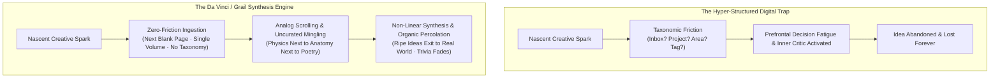
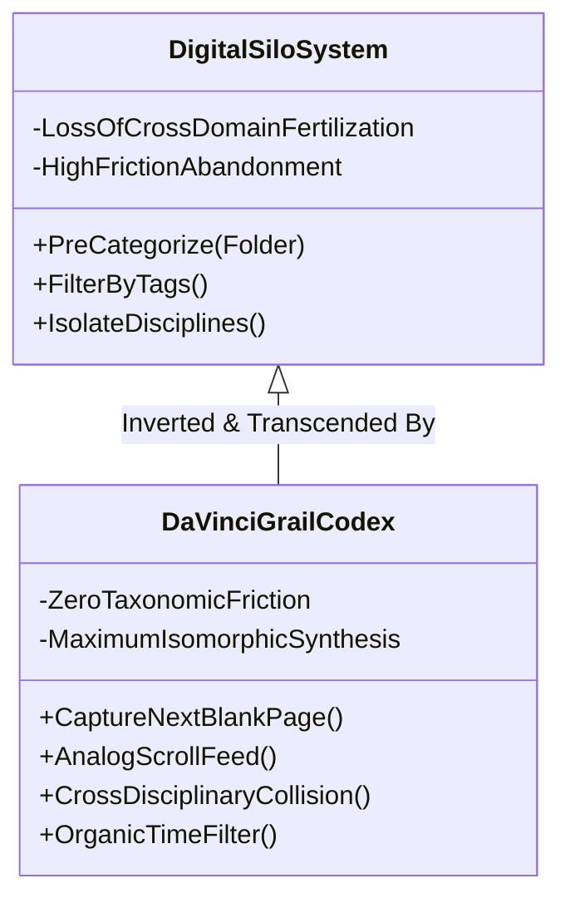
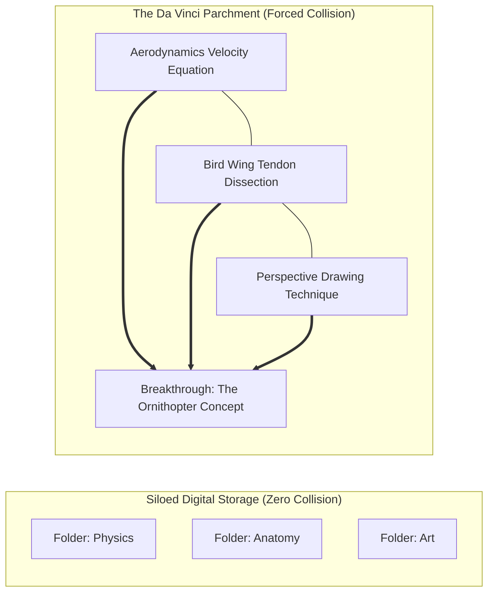
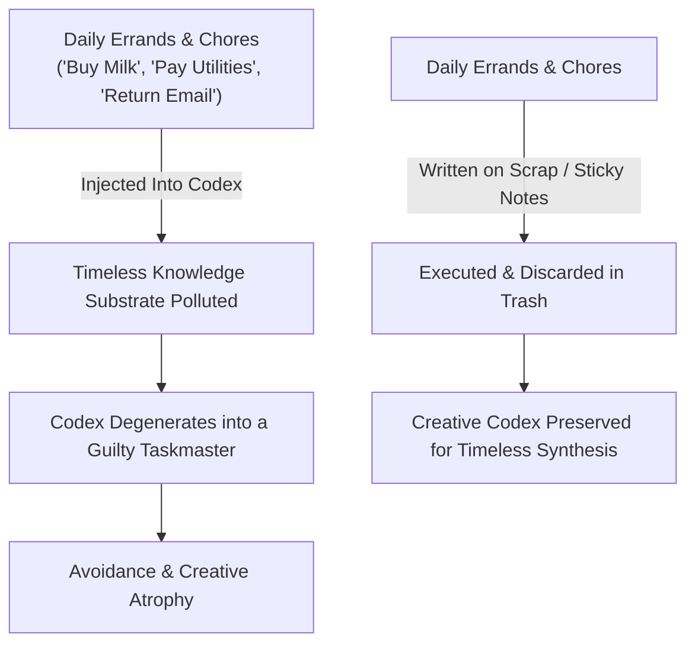

A pervasive romantic mythology paints creativity as a capricious, divine lightning bolt—a celestial gift bestowed upon a chosen artistic elite. This mythology is an intellectual alibi for the undisciplined. 

Throughout history, the minds responsible for monumental intellectual and creative leaps—from **Leonardo da Vinci** and **Charles Darwin** to **Isaac Newton** and **Mark Twain**—did not wait passively for inspiration. They operated an empirical, low-friction **synthesis engine**.

Crucially, this synthesis engine bears almost zero resemblance to modern productivity paradigms.

---

### The Taxonomic Friction Trap

The tragedy of the modern knowledge worker is the substitution of **organizational choreography** for authentic thought.

In an effort to tame information overload, creatives build Byzantine digital architectures: complex Notion relational databases, PARA filing systems, nested folders, future logs, and automated tagging pipelines. Yet, when an unexpected, fragile intuition arrives, the system erects a wall of **taxonomic friction**:

* *"Does this quote belong in 'Resources' or 'Projects'?"*
* *"Should this story snippet go into the 'Someday/Maybe' database or an active sprint?"*
* *"What metadata tags must I assign before closing the window?"*

By forcing the conscious intellect to make administrative categorization decisions at the point of inception, the fragile spark is crushed. The creator hesitates, postpones entry, and the idea vanishes.

> **The First Invariant of Creative Velocity**:  
> **A capture system you fear making messy is a capture system that guarantees creative paralysis.**

---

### The Da Vinci Disordered Notebook Invariant

Leonardo da Vinci left posterity over **6,000 manuscript pages** of personal notebooks. Modern observers inspecting polished museum reproductions frequently imagine an orderly, encyclopedia-like volume. 

The physical reality is the exact opposite: da Vinci’s notebooks are an anarchic, breathtaking jumble. In the *Codex Arundel*, Leonardo explicitly addresses the reader with striking epistemic honesty:

> *"This will be a collection without order, made up of many sheets which I have copied here. And I believe that before I am at the end of this, I shall have to repeat the same thing several times. And therefore, oh reader, blame me not because the subjects are many and the memory cannot retain them and say, 'This I will not write because I have already written it.'"*

Leonardo recognized a profound neurological truth: **attempting to impose order upon thought during the act of capture cripples synthesis**.

When you surrender the impulse to file, tag, and index, your notebook ceases to be a sterile filing cabinet. It becomes a fertile soil where anatomical dissection, water fluid dynamics, geometric proofs, and philosophical musings sit shoulder-to-shoulder on the same parchment.

---

### The Three Pillars of the Grail Method

#### 1. Zero-Friction Capture (The Single Physical Codex)
All intellectual inputs must flow into a single, bound physical volume without internal departmentalization:
- **No Sections**: No reserved pages for finance, poetry, or work. Everything enters chronologically into the next available blank space.
- **Bypassing the Inner Critic**: You do not evaluate whether a thought is "worthy," "brilliant," or "stupid" before committing ink to paper. Half-baked intuitions, architectural sketches, verbatim book quotes, and overheard subway remarks are granted equal residency.
- **Physical Ephemera**: Envelopes, postcards, ticket stubs, and napkin diagrams are tucked directly between the pages, turning the volume into a tactile extension of working memory.

#### 2. Analog Scrolling (Passive Review as Ideation Engine)
David Allen’s famous GTD aphorism observes that *"your mind is for having ideas, not for holding them."* However, traditional productivity tools misinterpret this by turning externalization into an endless series of actionable tasks.

In the Grail Method, review is not homework, study, or memorization. It is **Analog Scrolling**:
- Carry the codex everywhere.
- During idle intervals—waiting for a train, sipping coffee, pausing between work blocks—flip casually through the pages as if browsing a personalized social media feed.
- Because concepts are unindexed, your eyes drift non-linearly: a sketch of a machine gear juxtaposes with a quote on human melancholy. 
- **Non-Linear Synthesis**: When anatomy mingles with physics, da Vinci envisions human flight. When evolutionary biology mingles with political theory, Darwin formulates natural selection. Cross-pollination is mathematically impossible inside isolated folder hierarchies.

#### 3. The Organic Idea Filter (Ripening vs. Atrophy)
When you maintain a unified, uncurated stream of thought across months, time acts as an impartial natural selector:
- **The Evaporation of Mediocrity**: Thoughts that felt earth-shattering in the heat of a manic moment reveal their shallowness upon casual review weeks later. You don't need to delete them; they simply rest silently in the margins.
- **The Ripening of Intuition**: Observations that seemed modest or incomplete gradually attract adjacent notes, quotes, and diagrams over successive notebooks.
- **The Sovereign Exit**: When an idea matures, it exits the notebook and enters physical reality—becoming an essay, an engineering design, a company, or a video script. The codex is the womb; reality is the destination.

---

### The Iron Rule: The Ephemerality Invariant (Zero To-Do Lists)

The single fatal mistake that destroys a creative codex is introducing **daily to-do lists**.

To-do lists are **transactional, ephemeral trash**:
- You do not need to remember three years from now that you purchased printer paper or mailed a tax form on a Tuesday.
- When you mix administrative maintenance with creative synthesis, your codex stops being an inspiring playground and transforms into a nagging, anxiety-inducing taskmaster.
- **The Protocol**: Write daily checklists on disposable sticky notes, pocket scrap paper, or index cards. Tuck them inside the book if necessary, but the moment the boxes are checked, **throw the paper into the trash**.

---

### The Sovereignty Invariant

In an era saturated with automated AI workflows and sterile algorithmic feeds, the capacity for **messy, slow, inefficient, human contemplation** is the ultimate cognitive moat.

Do not seek a pristine, perfectly indexed digital fortress. Pick up a rugged notebook, abandon the taxonomy, embrace the chaos of the blank page, and allow the seeds of original thought to collide, ripen, and emerge.
