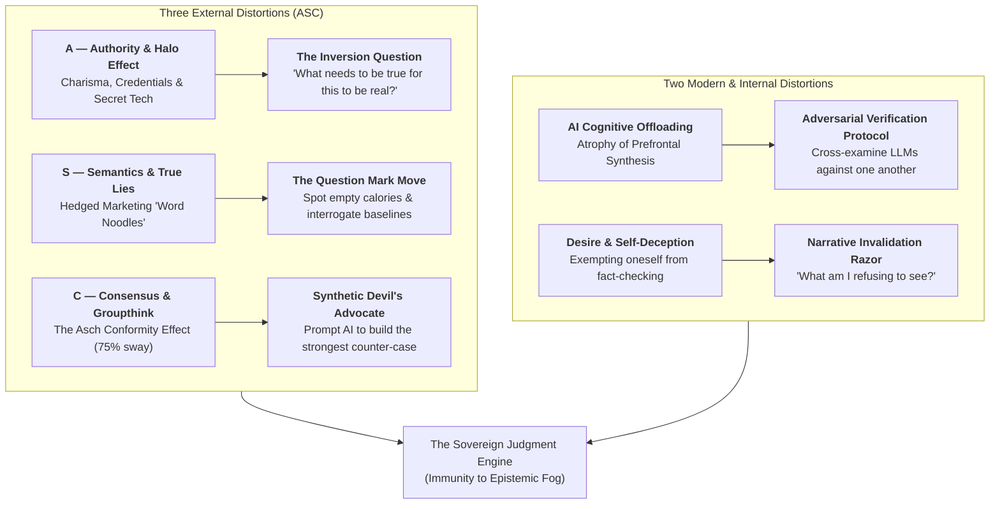
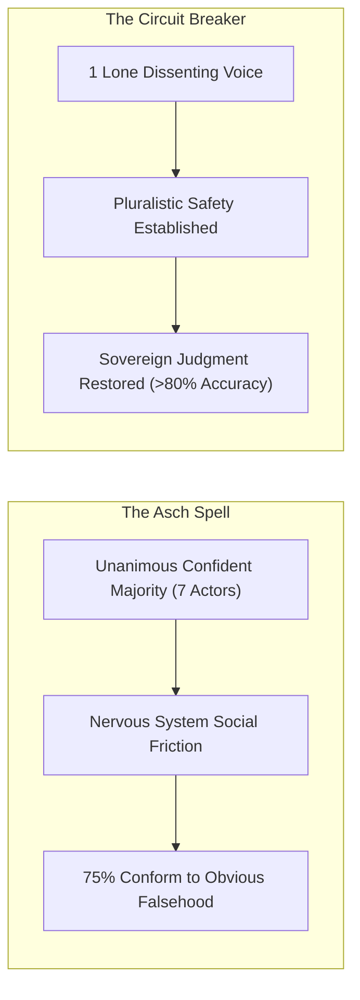
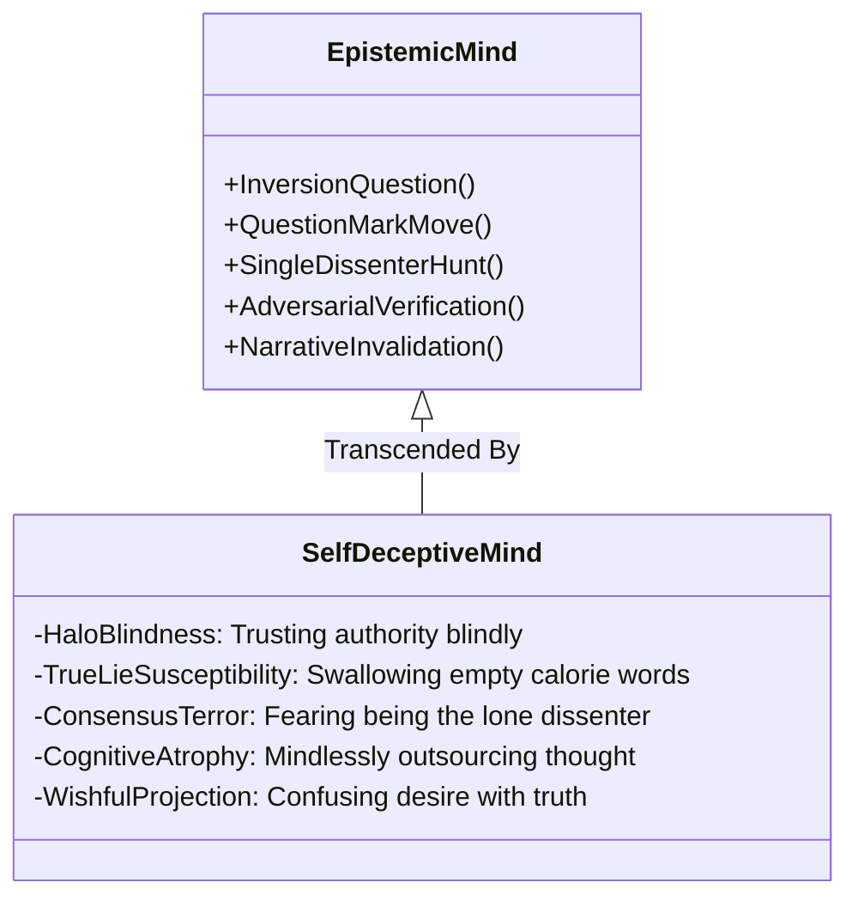

The popular warning that artificial intelligence is destined to render human beings intellectually obsolete fundamentally misidentifies the true threat. The existential danger of modernity is not that machines calculate faster than humans; it is **the total collapse of human critical judgment under epistemic fog**.

In January 2024, a finance employee at the multinational engineering firm Arup received a message purportedly from his Chief Financial Officer demanding the urgent wire transfer of $25 million. Sensing potential fraud, the employee prudently insisted on a video conference to verify the order. 

The CFO appeared on the screen, accompanied by several known colleagues, and methodically walked the employee through the step-by-step transfer. The employee executed the transaction. Days later, investigators discovered that **every single face and voice on that video conference was an AI-generated deepfake**, synthesized in real-time from scraped public media.

This introduces the defining epistemological dilemma of our era:

> **The Synthetic Needle Paradox**: In the past, critical thinking meant finding a needle in an empty haystack. Today, you must identify the single real needle buried inside a mountainous haystack of synthetic needles that look, feel, and sound indistinguishable from the truth.

When machines can manufacture infinite high-fidelity illusions, **human judgment ceases to be a luxury—it becomes the only irreplaceable form of capital.**

---

### The Three External Distortions (The "ASC" Matrix)

Human judgment is systematically hijacked from the outside by three structural vectors: **Authority**, **Semantics**, and **Consensus**.

#### 1. Authority & The Halo Effect: The Theranos Catastrophe
The most dangerous falsehoods are not propagated by obvious grifters; they are consecrated by the most credentialed authorities in society.

At its zenith, Theranos was valued at $9 billion, having raised over $700 million from top-tier institutional capital. Founder Elizabeth Holmes affected a deep baritone voice, wore Steve Jobs's signature black turtleneck, and surrounded herself with a board of directors that included two former U.S. Secretaries of State (Henry Kissinger and George Shultz), a retired four-star Marine General (James Mattis), and decorated Fortune 500 executives. 

Yet despite their formidable intellects and geopolitical power, **not a single board member understood basic blood chemistry or microfluidics**. For twelve years, under the romantic veil of Silicon Valley "stealth mode," the miracle machine was a hollow box running adulterated tests on commercial Siemens analyzers. When questioned about the core mechanics, Holmes offered vacant word salad: *"Chemistry is performed so that a chemical reaction occurs and generates a signal, which is translated into a result."*

The identical pathology underpinned Enron, FTX, WeWork, and the 2008 subprime mortgage collapse: **intelligent operators suspended their own judgment because they assumed someone with greater prestige had already verified the foundational premises.**

> **The Sovereign Tool: The Inversion Question**  
> Whenever an authority figure, pitch deck, or charismatic founder presents an audacious claim, immediately reverse the frame:  
> **"What needs to be true in baseline physical reality for this claim to hold?"**  
> If an automated diagnostics box claims to run 200 assays from a single capillary pinprick, what must be true about dilution limits, enzyme kinetics, and acoustic interference? If those foundational physical dependencies cannot be demonstrated, credentials and turtleneck uniforms are irrelevant.

#### 2. Semantics & "True Lies": The Dark Art of Elastic Hedging
Modern institutions and corporate marketing apparatuses rarely tell crude, actionable lies. Outright falsehoods expose them to litigation and regulatory sanctions. Instead, they deploy an infinitely more sophisticated instrument: **True Lies**.

A "True Lie" is a statement that is technically, legally truthful in the narrowest literal sense, but engineered specifically to induce an inflated, false reality in the mind of the consumer:

| Corporate Word Trick | The Manufactured Illusion | The Technical, Litigated Reality |
| :--- | :--- | :--- |
| **"Up to..."** | *"Our battery lasts up to 36 hours."* | If the battery lasts 14 minutes under ordinary use, the claim remains legally true because 14 is within the set of numbers $\le 36$. |
| **"Starting at..."** | *"Tesla Model 3 starting at $37,000."* | Base stripped chassis only. Adding necessary all-wheel drive ($47k$), performance acceleration ($55k$), and full self-driving ($1,200/yr$) yields a real cost far higher. |
| **"As low as..."** | *"Credit card financing as low as 0% APR."* | Contingent on flawless credit score and zero missed payments; a single late fee triggers 24.99% compounding monthly interest retroactively. |
| **"Unlike anything we've created."** | *"An all-new flagship device raising the bar."* | Semantic tautology ("word noodles"). It merely denotes that the product is non-identical to prior iterations—the literal dictionary definition of "new." |

> **The Sovereign Tool: The Question Mark Move**  
> 1. **Sensory Auditing**: Train your cognitive radar to identify empty-calorie linguistic markers (*"clinically proven"*, *"recommended by experts"*, *"up to"*, *"revolutionary"*).  
> 2. **Interrogate the Baseline**: Silently append a sharp question mark to the claim:  
>    * *"Up to eight times faster?"* $\to$ **Faster than what baseline? Under what ambient temperature? At what failure rate?**  
> The moment you force an elastic claim against concrete benchmarks, the marketing scaffolding collapses.

#### 3. Consensus & Groupthink: The Asch Conformity Spell
Mass crowds possess the terrifying capacity to believe in completely groundless premises—from the 17th-century Dutch Tulip Mania and the Salem Witch Trials to the Dot-Com equity frenzy and Depression-era bank runs.

In his legendary 1951 social psychology experiments, Solomon Asch placed a single real participant in a room with seven confederates. The group was shown a reference line alongside three comparison lines and asked which lines matched. The correct answer was visually unmistakable. 

Yet, when the seven actors sequentially proclaimed an obviously incorrect line with absolute calm confidence, **75% of participants conformed to the group's false verdict at least once**, deliberately denying their own optic nerves. Post-experiment interviews revealed that participants were not visually confused; **they simply could not bear the social agony of being the lone dissenter in the room**.

Crucially, Asch discovered an extraordinary asymmetry: **when just ONE single actor broke ranks and gave the correct answer, the conformity rate plummeted by over 80%.** It takes only a single point of articulated dissent to liberate human judgment from hypnotic consensus.

> **The Sovereign Tool: The Synthetic Devil's Advocate**  
> When you find yourself in a room where every executive, colleague, or friend agrees enthusiastically on a strategy, do not celebrate consensus; **hunt down the lone dissenter**.  
> If an authentic human dissenter is unavailable, command artificial intelligence to occupy the role:  
> *"Assume this consensus proposal is completely catastrophically wrong. Formulate the most rigorous, evidence-backed adversarial case dismantling every premise."*

---

### The Two Modern & Internal Distortions

Beyond external pressures, the greatest vulnerabilities to critical thinking reside in our interaction with technology and our instinct for self-deception.

#### 4. Cognitive Offloading & Neural Atrophy (The MIT LLM Study)
The seductive danger of large language models is not that they hallucinate; it is that they induce **prefrontal cognitive atrophy**.

In an empirical study conducted by researchers at the Massachusetts Institute of Technology (MIT), two cohorts were assigned complex essay-writing tasks:
- **Group A**: Conducted manual research and analytical drafting using their own working memory.
- **Group B**: Relied on ChatGPT to generate and structure their essays.

Neuroimaging revealed that the ChatGPT cohort exhibited **the lowest level of cortical activation**. Most alarmingly, when tested mere minutes after completion, **participants in the AI-assisted group could not recall or quote a single sentence of what they had just written and submitted**. 

When you fully outsource the struggle of synthesis, the brain bypasses synaptic consolidation. You produce content, but your mind remains hollow.

> **The Sovereign Tool: The Adversarial Verification Protocol**  
> Never accept an LLM's synthesis as finished ground truth. Treat AI not as an oracle, but as a fallible mathematical processor:  
> 1. **Prompt Constraints**: Enforce the dual invariant: *"Be precise, cite primary physical mechanisms, and actively flag your own uncertainty."*  
> 2. **Cross-Model Adversarial Cross-Examination**: Take the output generated by one architecture (e.g., GPT-4o) and feed it into an opposing architecture (e.g., Claude 3.5 Sonnet or Gemini 1.5 Pro) with the explicit prompt:  
>    *"Audit this text for unsupported claims, statistical sleights of hand, and logical fallacies. What did this model miss?"*

#### 5. Desire & Self-Deception: The Narrative Invalidation Razor
The single source of information you will never intuitively fact-check is **yourself**. 

Human beings do not lie to themselves out of calculated cynicism; we lie to ourselves because **we desperately need a specific narrative to be true**. As Sandeep Swadia observes from his own life counseling two close friends: a man was madly in love with a woman and convinced they were cosmically destined for each other. When confronted with his immense devotion, the woman replied with devastating epistemic clarity:

> *"His love for me is not enough of a reason for me to fall in love with him."*

Wanting an investment to explode 100x does not alter market mechanics. Wanting an abusive relationship to heal does not change character. Wanting a business strategy to succeed does not bend cash flow.

> **The Sovereign Tool: The Narrative Invalidation Razor**  
> When confronting any high-stakes dilemma, look into the mirror and demand the ultimate sovereign question:  
> **"What specific reality am I actively refusing to see, simply because I need this story to be true?"**

---

### The Architecture of Clear Vision

When the environment is thick with epistemic fog, you cannot navigate by accelerating blindly or wishing the haze away. You navigate by **slowing down, calibrating your instruments, interrogating authority, deconstructing elastic semantics, breaking consensus spells, verifying synthetic outputs, and killing your own illusions.**

True intelligence is not the speed at which you absorb words; **it is the incorruptible clarity of your judgment.**
