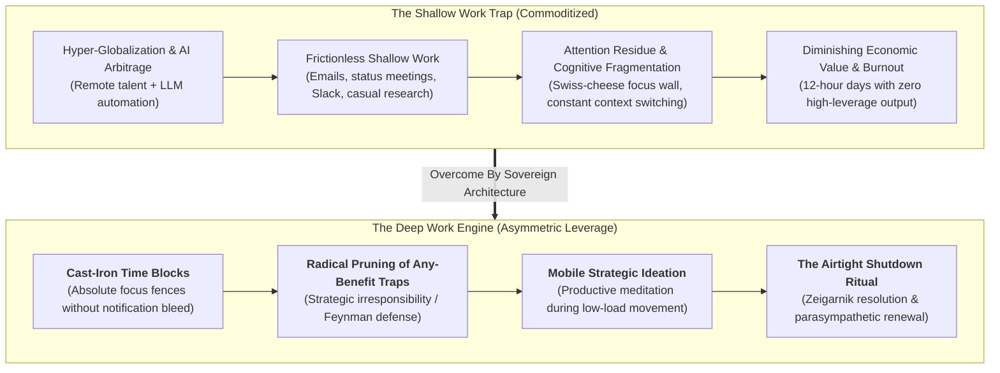
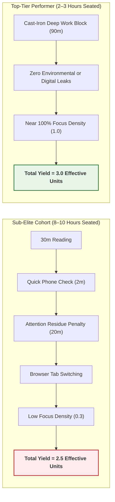
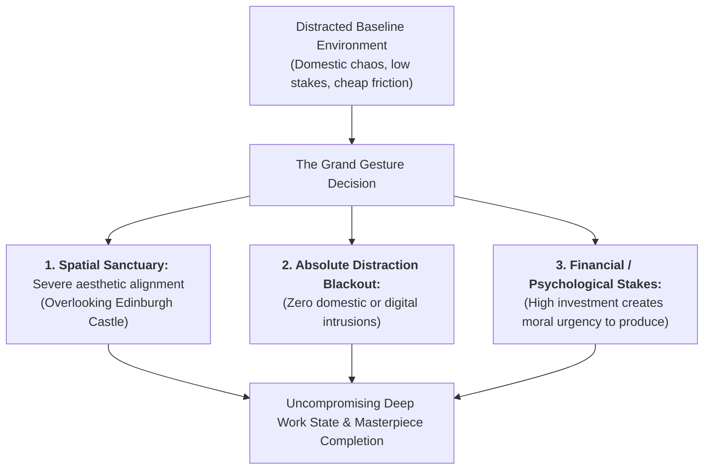
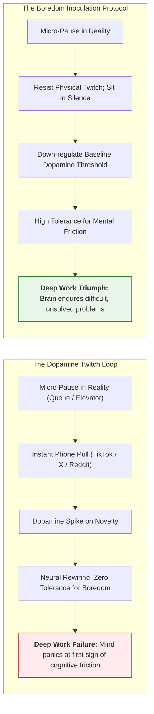
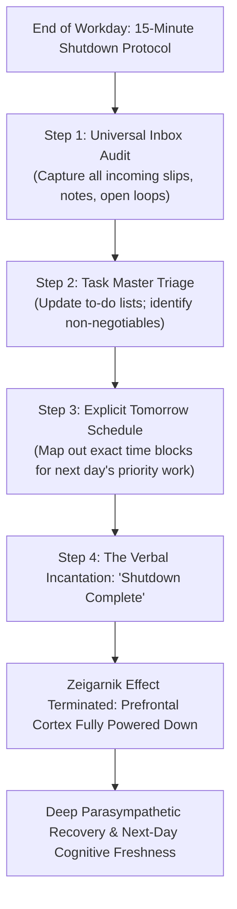

In the contemporary knowledge economy, a catastrophic divergence is underway.

On one side stands the vast majority of the modern workforce: distracted, digitally tethered, chronically fatigued, and engaged in a frenetic pantomime of productivity—firing off Slack messages, attending sterile committee meetings, and reacting to endless notification pings. 

On the other side stands a razor-thin cadre of elite performers who command extraordinary asymmetric leverage: individuals who can master complex, highly technical systems in weeks rather than years, and who produce high-value intellectual assets with startling speed.



As theoretical computer scientist Dr. Cal Newport established in *Deep Work*, this divergence is driven by two inexorable economic forces:
1. **The Commoditization of Mediocre Knowledge Work**: In a hyper-globalized world augmented by synthetic intelligence models, basic programming, routine drafting, and low-level analysis can be outsourced to Estonia, India, or an API call. If your work does not require intense, unbroken cognitive strain, you have no moat.
2. **The Scarcity of Deep Focus**: At the precise historical moment when the market rewards elite conceptual depth more lavishly than ever before, the ambient culture has systematically dismantled the human capacity for sustained concentration.

Those who master the architecture of **Deep Work** do not merely work more efficiently; they operate in a completely different competitive tier.

---

### The Focus Density Multiplier: Why Top Performers Study Less

In extensive empirical investigations of ultra-high-scoring undergraduates at elite, hyper-competitive universities, researchers uncovered a paradoxical finding: **the students in the very top tier spent significantly fewer total hours studying than the tier immediately beneath them.**



The governing equation of cognitive production is not linear duration:

$$\text{Work Produced} = \text{Time Spent} \times \text{Intensity of Focus}$$

A student seated at a desk for eight hours with a focus intensity of 0.25 (intermittent WhatsApp notifications, background YouTube video, ambient chat) produces:

$$8 \times 0.25 = 2.0 \text{ units of cognitive output}$$

An elite practitioner working in an austere sanctuary for two hours with an intensity of 1.0 produces:

$$2 \times 1.0 = 2.0 \text{ units of cognitive output}$$

The elite practitioner extracts the identical cognitive yield in one-quarter of the time, leaving six hours of the day wide open for intense physical training, high-leverage reading, deep sleep, and genuine rejuvenation.

---

### The Cast-Iron Focus Wall & The Science of Attention Residue

Why is focus intensity so fragile? The answer lies in the pioneering research of business professor Dr. Sophie Leroy on **Attention Residue**.

When you switch your focus from Task A (e.g., writing an analytical chapter or compiling code) to Task B (e.g., checking an incoming email for 15 seconds), your attention does not transition cleanly. A substantial portion of your working memory and prefrontal circuitry remains anchored to Task B:

```mermaid
sequenceDiagram
    participant Executive as Executive Function (Prefrontal Cortex)
    participant TaskA as Primary Task (Deep Code / Complex Analysis)
    participant Phone as Micro-Interruption (2-Second Notification)

    Executive->>TaskA: Deep immersion in complex multi-variable schema
    Note over Executive: Working memory holds 4 interdependent variables
    Phone->>Executive: Vibration ping: "New message received"
    Executive->>Phone: Quick 2-second glance / glance at sender
    Note over Executive: <b>ATTENTION RESIDUE TRIGGERED</b><br>Subconscious circuitry evaluates message implications
    Executive->>TaskA: Attempts to return to primary task
    Note over TaskA: High cognitive friction; mental schema collapsed;<br>Recovery takes 15–25 minutes
```

Every time you allow a micro-distraction during a deep work block, **you drill a physical hole through your mental focus wall**. 
- Drill three holes, and your working memory begins to leak.
- Drill ten holes, and the wall collapses entirely into swiss cheese. 

For the remainder of the afternoon, your mind is incapable of maintaining deep focus, bouncing erratically between the task at hand and random, trivial impulses.

#### The Cast-Iron Rule:
When scheduling a deep work time box (whether 45 minutes or 120 minutes), the perimeter must be **cast-iron**. You do not check notifications "just for a second." You do not look up "one quick fact" on Twitter. You either battle through the difficult analytical obstacle, or you stare at the blank document in silence. By resisting the urge to flee to distraction, your brain physically patches the cognitive wall.

---

### Environmental Architecture & The Grand Gesture

In 2007, facing the immense pressure of finishing *Harry Potter and the Deathly Hallows*, author J.K. Rowling found herself completely paralyzed by household distractions: barking dogs, crying children, cleaners moving through rooms, and journalists outside.

Her solution was what Newport terms **The Grand Gesture**: she checked into a luxury suite at the five-star Balmoral Hotel in downtown Edinburgh—a Victorian stone landmark sitting directly across from Edinburgh Castle. 



The Grand Gesture works through two psychological levers:
1. **Radical Environmental Cleansing**: It completely separates the practitioner from conditioned habits, domestic cues, and casual interruption vectors.
2. **Psychological Stake Inflation**: Investing significant resources, travel, or deliberate ceremony into a workspace signals to the subconscious mind: *“This endeavor is profoundly important. Stagnation is not an option.”*

---

### Inoculation Against Stimulus Cravings: Training the Boredom Muscle

A widespread cultural myth treats focus as an immutable genetic trait: *"I just have an active brain; I can't sit still."*

Focus is not a personality trait; **it is a trained neurological capacity**.

If every time you encounter three seconds of boredom—standing in an elevator, waiting in a supermarket queue, waiting for water to boil—you instantly reach for your smartphone to consume low-grade novelty, **you are actively conditioning your neural circuits to crave perpetual distraction**.



As Cal Newport observed:
> *“Once you are wired for distraction, you crave it.”*

If your brain cannot tolerate sitting quietly in an elevator for 30 seconds without stimulation, it will inevitably mutiny the moment you encounter a complex mathematical proof, an ambiguous bug in a codebase, or a challenging paragraph in an academic text. 

**The Boredom Inoculation Protocol**: Deliberately practice standing in queues, walking to your vehicle, and waiting for meetings with your hands in your pockets and your eyes observing physical reality. Reclaiming comfort with stillness is the neurological prerequisite for elite focus.

---

### Productive Meditation: Mobile Strategic Ideation

Most individuals attempt to multitask by rapidly oscillating between two high-load cognitive tasks (e.g., answering emails while analyzing a financial model), which fragments working memory and induces cognitive exhaustion.

The legitimate, high-leverage application of dual-tasking is **Productive Meditation**:
- **The Setup**: Identify a routine, low-cognitive physical activity that you already execute daily: walking your dog, commuting on foot, or cleaning dishes.
- **The Focus**: Rather than listening to podcasts or daydreaming, select **one single, high-stakes structural problem** that requires resolution (e.g., outlining the chapter hierarchy of a book, designing a database schema, or structuring a critical business proposal).
- **The Mental Discipline**: Hold the problem firmly in working memory. When irrelevant mental flotsam intrudes (*"Did I lock the front door?"* or *"Could I start a coffee roasting company?"*), recognize the drift without self-judgment, sweep it aside, and redirect working memory back to the primary problem.
- **The Synthesis**: Formulate key sub-questions, resolve them sequentially, and arrive at a definitive tactical blueprint before the physical journey concludes.

---

### The Any-Benefit Fallacy & Strategic Irresponsibility

Why do high-achieving professionals fill their calendars with trivia? Because they fall prey to **The Any-Benefit Fallacy**.

```
[THE ANY-BENEFIT TRAP]
"Activity X provides SOME benefit, therefore Activity X is worth doing."
├── Example A: "Attending this 60-minute sync keeps me informed on a tangent project."
├── Example B: "Scrolling social feeds lets me see industry news."
└── Example C: "Volunteering for this internal committee boosts my network."

[THE HIGH-AGENCY REVISED FILTER]
"Does Activity X offer EXPONENTIAL ROI on my primary mission, 
or does its cognitive fragmentation cost vastly exceed its marginal yield?"
```

The human brain instinctively seeks shallow, low-friction tasks because they provide the comforting sensation of being busy while requiring minimal metabolic energy. 

#### The Richard Feynman Protocol:
Nobel Prize-winning physicist Richard Feynman consciously insulated his creative genius by weaponizing **Strategic Irresponsibility**:

> *"Whenever anyone asked me to be on a committee to review professors or evaluate admissions, I said, 'No, I am completely irresponsible. If you put me on that committee, I won't read the papers and I will make terrible decisions.' So they stopped asking me."*

Feynman understood that institutions will greedily consume 100% of an elite mind's cognitive bandwidth with administrative trivia unless that mind constructs a ferocious defense. **Clarity about what matters creates sovereign clarity about what does not.**

---

### The Evening Shutdown Ritual: Resolving the Zeigarnik Effect

Attempting to squeeze an extra 45 minutes of work out of late evening hours produces a catastrophic trade-off: marginal, error-ridden output in exchange for chronic insomnia and morning brain fog.

Yet the brain cannot truly rest if open work obligations linger unresolved. This psychological tension is known as the **Zeigarnik Effect**: the human mind maintains persistent intrusive thoughts regarding uncompleted, poorly structured tasks.



#### The 4-Step Shutdown Protocol:
1. **Universal Capture**: Review inboxes, sticky notes, and open browser tabs. Extract every open loop into your master task ledger.
2. **Prioritization Audit**: Verify that no urgent deadline is slipping and select the 2–3 high-leverage battles for tomorrow.
3. **Calendar Architecture**: Map tomorrow's deep work blocks directly into your schedule, allocating realistic contingency buffers.
4. **The Termination Anchor**: Say aloud: *"Shutdown Complete."* Once uttered, you are under strict intellectual orders not to inspect email, check dashboards, or ponder work problems until tomorrow's official start time.

---

### The Active Flow Paradox: Csikszentmihalyi's Law

When people complete a grueling day of work, their default instinct is passive vegetative consumption: collapsing onto a sofa and scrolling television channels or social media.

Yet the pioneering psychological research of Dr. Mihaly Csikszentmihalyi disproved the notion that passive relaxation restores the human spirit.

```mermaid
graph TD
    subgraph PassiveVegetation["The Passive Relaxation Illusion"]
        V1["Passive TV / Mindless Scrolling"] --> V2["Zero Working Memory Engagement"]
        V2 --> V3["Apathy, Low-Grade Guilt & Ennui"]
        V3 --> V4["Morning Lethargy & Continued Fatigue"]
    end

    subgraph ActiveFlowCrucible["Csikszentmihalyi's Active Flow Engine"]
        A1["Strenuous Active Leisure<br>(Martial arts, instrument, carpentry, rigorous debate)"]
        A1 --> A2["Stretches Cognitive / Physical Faculties to Limit"]
        A2 --> A3["Total Absorption in Flow State"]
        A3 --> A4["True Psychological Rebirth & Deep Vitality"]
    end

    style V4 fill:#ffebee,stroke:#c62828,stroke-width:2px
    style A4 fill:#e8f5e9,stroke:#2e7d32,stroke-width:2px
```



Csikszentmihalyi’s longitudinal studies revealed that **the happiest, most energized, and most resilient individuals were not those who spent their free time vegetating in comfort.**

The highest states of human fulfillment and authentic psychological restoration occur when an individual is actively stretching their capabilities to their absolute limit on something that is both intrinsically challenging and meaningful: playing a demanding musical piece, mastering a martial art, executing complex woodworking, or engaging in fierce philosophical inquiry.

**True recovery is not the absence of effort; it is the presence of high-leverage engagement.**
