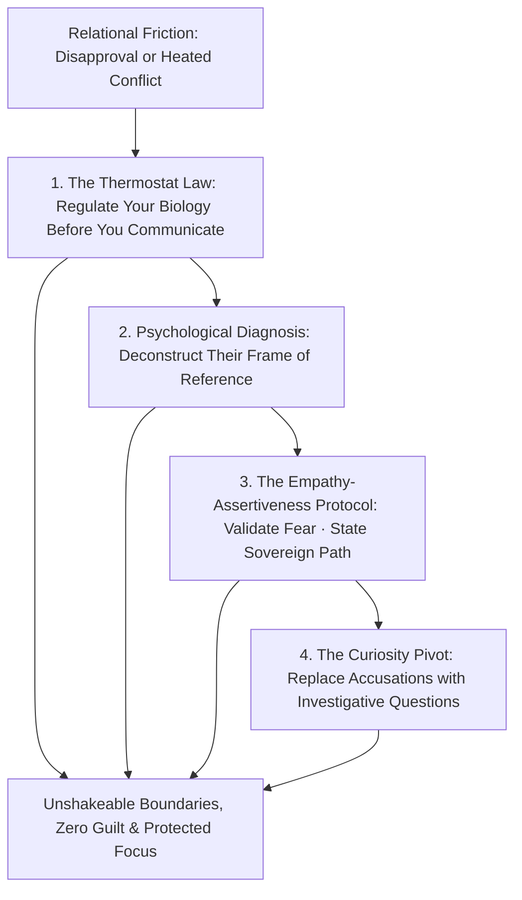
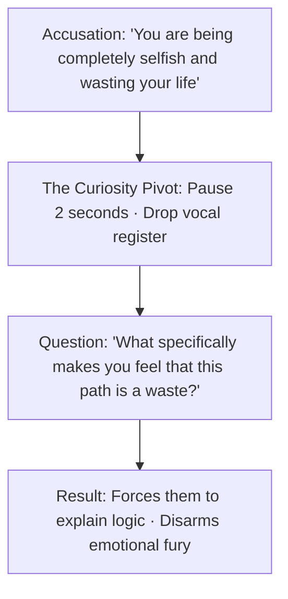

When an ambitious individual chooses a path of serious discipline, competitive examinations, or high-stakes entrepreneurship, the fiercest resistance rarely comes from external competitors.

It almost always comes from **the immediate circle: parents, spouses, siblings, and lifelong friends**.

Well-meaning loved ones often push back with skepticism, anxiety, or guilt (*"Why can't you just take a safe job?", "You are working too hard," "You have changed"*). When faced with this friction, most people either surrender their ambition to keep the peace, or explode into bitter defensiveness that damages relationships.

In relational psychology and high-agency communication, **a difficult conversation is not an ideological war to be won; it is a structural alignment of boundaries, emotional thermostats, and frames of reference**.

When you master the **Architecture of Difficult Conversations**, you regulate your biology before speaking, decouple love from consensus, and secure relational peace while executing your sovereign mission.

---

### The Anatomy of Difficult Conversations



---

### Phase 1: The Thermostat Law & The "Considered Before Corrected" Principle

```mermaid
graph LR
    subgraph The Thermometer (Reactive)
        T1[Incoming Emotional Heat] --> T2[Nervous System Floods] --> T3[Mirrors the Anger & Escalates]
    end

    subgraph The Thermostat (Mastery)
        TM1[Incoming Emotional Heat] --> TM2[Somatic Pause & Decelerated Voice] --> TM3[Sets the Room's Temperature to Calm]
    end
```

1. **The Thermostat Law**: In any heated discussion, **the calmest nervous system in the room sets the emotional temperature**. A reactive person acts like a thermometer (rising with the room's heat). A master acts like a thermostat (absorbing turbulence and imposing steady calm).
2. **Considered Before Corrected**:
   * Truth without psychological safety does not register as truth; it registers as an attack.
   * Human beings will resist the most brilliant logical argument if they feel diminished, scolded, or dismissed. People must feel **fully considered** before they will ever accept a difficult truth.
3. **Clarity Over Intensity**: High vocal intensity and emotional urgency signal weakness and panic. Dropping your volume and slowing your delivery signals unshakable authority and inner peace.

---

### Phase 2: The Frame of Reference Principle

The fundamental error in difficult conversations is assuming the other person operates with your data, risk appetite, and vision.

```mermaid
graph LR
    subgraph Their Frame of Reference (Generational Fear)
        F1[Past Economic Hardship] --> F2[Need for Predictability & Safety] --> F3[Projection of Fear disguised as Advice]
    end

    subgraph Your Frame of Reference (Sovereign Agency)
        A1[High Ambition] --> A2[Willingness to Endure Asymmetric Risk] --> A3[Relentless Craft & Compounding]
    end
```

* **Their Resistance is Not Malice; It is Fear**: When a parent or partner reacts with anger or anxiety to your ambitious routine, they are not trying to destroy your future; their brain is projecting their own generational trauma, fear of the unknown, or need for stability.
* **The Permission Fallacy**: You do not need their intellectual agreement to execute your life. Stop debating your philosophy over dinner. A debate implies that their approval is required before you can act.

---

### Phase 3: The 3-Step Empathy-Assertiveness Protocol

When confronting friction or disapproval from your close circle, deploy the **Empathy-Assertiveness Protocol**:

```mermaid
graph TD
    S1[Step 1: Empathy & Emotional Validation<br>'I know you love me and want me to be safe and secure']
    --> S2[Step 2: The Sovereign Boundary Pivot<br>'However, this is the exact craft and mission I have chosen']
    --> S3[Step 3: Concrete Tactical Definition<br>'The best way you can support me right now is [Specific Request]']
```

#### 1. Step 1: Validate Their Intention (Disarm Defense)
* *The Script*: *"I understand why you are worried. I know you love me, and I see that your concern comes from wanting me to have a stable, secure life."*
* *The Effect*: Validating their emotional intent disarms the fight-or-flight response in their nervous system.

#### 2. Step 2: State Your Sovereign Boundary (Zero Apology)
* *The Script*: *"At the same time, I have made a clear decision. This is the mountain I am climbing, and I am willing to endure the uncertainty and hardship required."*
* *The Rule*: Do not over-explain or justify your metrics. Justification invites counter-arguments. State your choice as a settled, non-negotiable fact.

#### 3. Step 3: Shift from Philosophical Debate to Tactical Requests
* *The Fatal Mistake*: Asking: *"Why can't you just support my dreams?"* (Vague, emotional, un-actionable).
* *The Master Heuristic*: Give them a concrete, mechanical way to help:
  * *"The most valuable support you can give me during these next 6 months is protecting my morning focus block between 6:00 AM and 11:00 AM without interruptions."*

---

### Phase 4: The Trial Lawyer's "Curiosity Pivot"

When a conversation turns hostile or accusatory, never respond with a defensive counter-statement. Pivot immediately to **Investigative Curiosity**:



* Replace *"You are not listening to me!"* with *"Can you tell me what you heard from what I just said?"*
* Replace *"You don't know what you're talking about!"* with *"Help me understand how you are looking at this problem?"*
* Asking a precise, calm question forces the other person's prefrontal cortex to re-engage, instantly deflating emotional rage.

---

### The Core Takeaway to Remember
> You can love someone deeply without adopting their fears or living out their limitations. Regulate your nervous system before you utter a word, make others feel considered before you correct them, state your chosen path with unshakeable calm, and let your long-term results demonstrate the wisdom of your boundaries.
