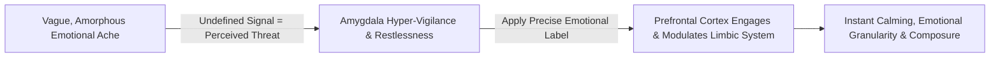
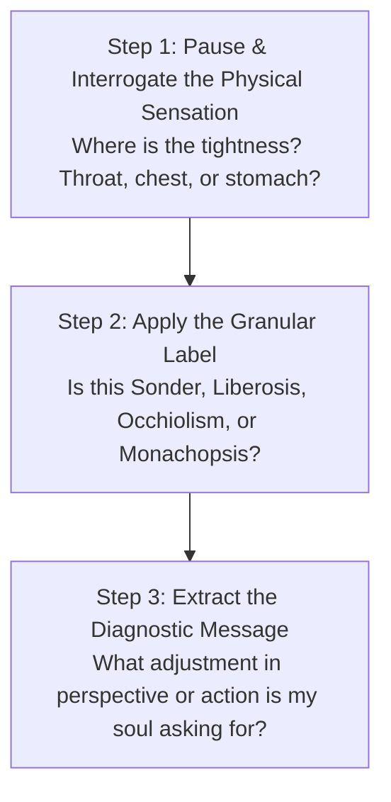

Human suffering often thrives in the dark corners of the mind where sensations have no names.

When you experience an amorphous, vague emotional ache—a strange loneliness in a crowded room, a sudden exhaustion with caring about prestige, or a melancholic awe at the scale of time—your nervous system enters a state of mild alarm. The brain’s threat center, the amygdala, treats undefined sensations as unresolved threats.

In modern cognitive neuroscience, **Emotional Granularity** and **Affect Labeling** represent one of the most powerful self-regulation technologies available. When you give precise linguistic names to the complex, obscure feelings of human existence, the prefrontal cortex immediately engages, transforming chaotic emotional distress into calm, lucid insight.

---

### The Neuroscience of Affect Labeling

* **The Research**: Pioneering brain-imaging research by Dr. Lisa Feldman Barrett and UCLA neuroscientists demonstrates that the simple act of **identifying and precisely naming a nuanced feeling** dramatically reduces amygdala activation and dampens physiological stress markers (heart rate and cortisol spikes).
* **The Granularity Advantage**: Individuals with high emotional granularity do not get overwhelmed by "feeling bad." They diagnose the exact shade of the emotion, understand its underlying cause, and take calm, precise action.

---

### The Lexicon of the Unspoken Mind

The following master concepts (distilled from John Koenig's *The Dictionary of Obscure Sorrows*) map the subtle psychological terrain of ambitious, reflective minds:

---

#### 1. `Sonder` — The Realization of Other Minds
* **The Definition**: The profound, sudden realization that every random passerby on the street, in the subway, or in an exam hall is the main character of a life as vivid, complex, and chaotic as your own—complete with their own private griefs, secret ambitions, daily routines, and invisible heartbreaks.
* **The Sovereignty Shift**: *Sonder* is the ultimate cure for both **social anxiety and narcissism**. When you realize everyone is completely absorbed in the epic struggle of their own story, you understand they are not obsessing over your minor flaws or judging your every move. You are free.

---

#### 2. `Liberosis` — The Desire to Care Less
* **The Definition**: The deep internal yearning to loosen your white-knuckle grip on outcomes, prestige, and social expectations; the desire to let things go and stop over-managing life.
* **The Sovereignty Shift**: *Liberosis* is the antidote to chronic perfectionism. It reminds you to care deeply about the **nobility of your daily effort** while releasing your desperate, neurotic attachment to external scoreboards.

---

#### 3. `Occhiolism` — The Awareness of the Small Perspective
* **The Definition**: The sudden, lucid awareness of the microscopic smallness of your individual perspective compared to the vastness of the cosmos and the expanse of geological time.
* **The Sovereignty Shift**: *Occhiolism* restores healthy cosmic humility. When a setback, a rejection, or a bad score feels like the end of the world, *Occhiolism* shrinks the drama back to its true scale: a tiny, passing blip on an infinite timeline.

---

#### 4. `Monachopsis` — The Persistent Sense of Being Out of Place
* **The Definition**: The subtle but persistent feeling of being slightly out of place wherever you go—like a creature adapted for another environment.
* **The Sovereignty Shift**: Most reflective thinkers feel broken because they don't seem to fit neatly into conventional social groups or corporate molds. Recognizing *Monachopsis* normalizes this feeling: being slightly out of place is the natural price of independent thinking.

---

### The Emotional Diagnosis Protocol

Whenever an amorphous cloud of melancholy, restlessness, or self-doubt sweeps over you, execute the **3-Step Labeling Protocol**:

1. **Locate the Sensation**: Do not distract yourself with phone feeds. Feel the physical sensation without judgment.
2. **Apply the Precise Label**: Categorize the emotion with surgical precision. The moment you say: *"This is not panic; this is Liberosis—my mind is asking to loosen its grip on this outcome"*, the limbic storm subsides.
3. **Act on the Intelligence**: Emotions are not verdicts; they are internal weather reports. Use the insight to recalibrate your daily routine, step outside for fresh air, or return to your craft with renewed composure.

---

### The Core Takeaway to Remember
> You cannot conquer what you cannot name. Expand the resolution of your internal vocabulary. When you name the obscure sorrows of the human condition with clarity, fear turns into understanding, loneliness turns into quiet wonder, and your emotional life becomes a source of indestructible peace.
