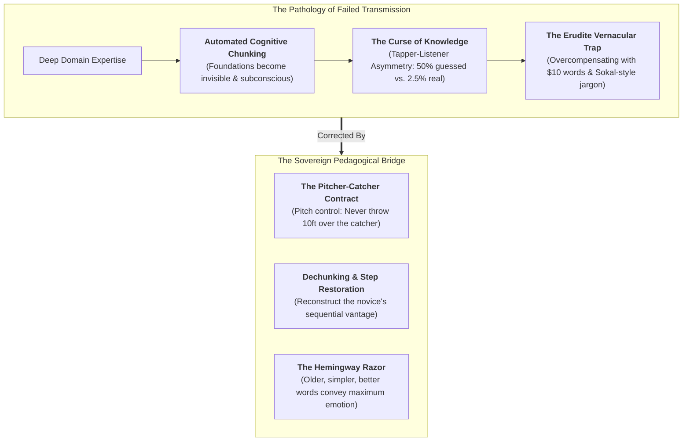
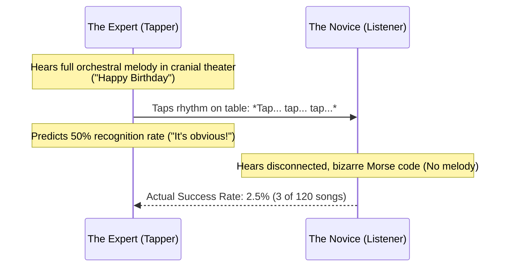
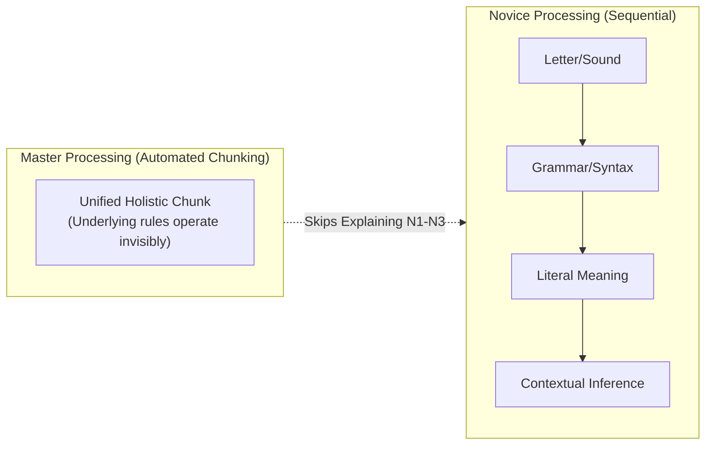
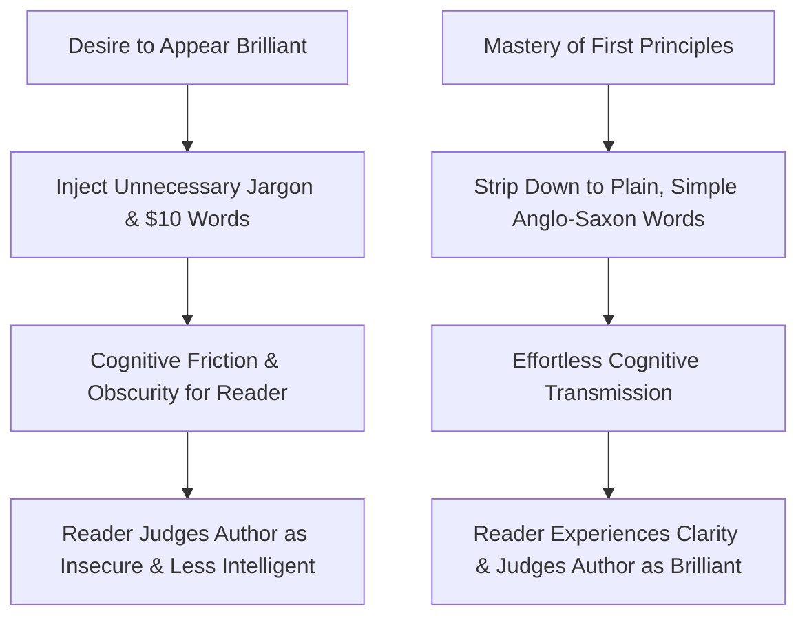
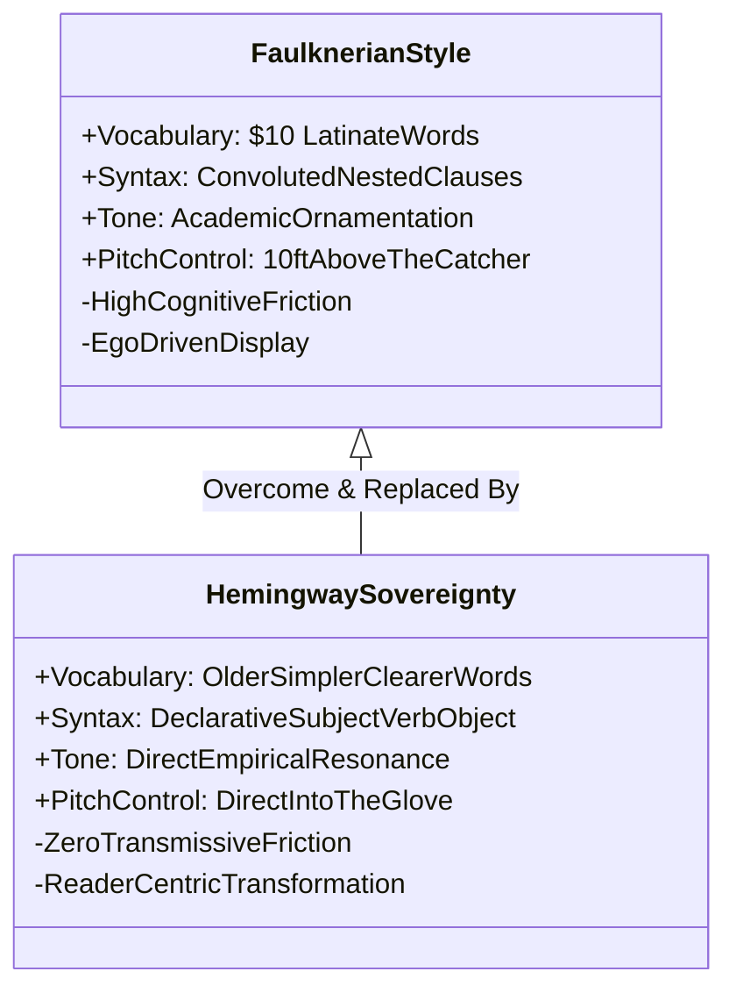

When an intelligent student, reader, or junior professional opens a foundational masterwork—such as John Rawls’ *A Theory of Justice*—and struggles to parse the prose, their immediate instinct is self-condemnation: *“I am not smart enough to understand this.”*

Yet cognitive science and educational psychology reveal a counter-intuitive reality: **profound ideas are frequently obscured not by their intrinsic complexity, but by the author’s cognitive pathology.** 

Just because an individual possesses world-class expertise in a domain does not mean they possess the pedagogical architecture to transmit it. In fact, deep mastery often acts as an active impediment to clear communication.

---

### The Curse of Knowledge & The Tapper-Listener Asymmetry

In cognitive psychology, the **Curse of Knowledge** (formalized by Harvard linguist Steven Pinker in *The Sense of Style*) defines the profound difficulty an expert experiences when attempting to simulate what it is like *not* to know something they already master.

The definitive empirical demonstration was conducted by Stanford researcher Elizabeth Newton:

1. **The Setup**: Participants were assigned one of two roles: *Tappers* or *Listeners*. A tapper was given a universally recognized song (e.g., "Happy Birthday" or "The Star-Spangled Banner") and instructed to tap out the rhythm on a table. The listener had to guess the song.
2. **The Prediction**: Prior to testing, tappers predicted that listeners would correctly identify the song roughly **50% of the time**. To the tapper, the melody was roaring inside their head with vivid lyrics, brass instruments, and rhythm.
3. **The Brutal Reality**: Out of 120 songs tapped, listeners correctly identified only **3 songs (2.5%)**.
4. **The Cognitive Disconnect**: To the listener, the tapping did not resemble a song; it sounded like an erratic, disconnected series of thumps on wood. The tapper was utterly incapable of mentally turning off their internal music to hear how barren their external communication actually sounded.

Whenever an expert explains a complex financial, philosophical, or technical concept to a novice, **they are tapping on the table**. In their own cranial theater, fifty interdependent models are harmonizing; in the novice’s mind, only disconnected, alien syllables are landing.

---

### Cognitive Pattern Chunking: The Blind Spot of Mastery

Why do experts fail to hear their own communicative deficits? The answer lies in how human memory reorganizes under deliberate practice.

When cognitive scientists compare novice and grandmaster chess players, a distinct neurological difference emerges:
* **The Novice**: Analyzes the board on the level of **individual pieces and singular legal squares** ($A1 \to B3$). Working memory is rapidly overwhelmed by combinatorial explosion.
* **The Grandmaster**: Does not look at individual pieces; they look at **holistic patterns and positional arrangements ("chunks")**. A cluster of five pieces is perceived as a single defensive configuration.

The identical automation occurs in advanced reading and technical domains:
- As an expert practices, syntax, historical context, domain jargon, and analytical frameworks collapse into subconscious cognitive algorithms.
- **The Explanatory Penalty**: Because these foundational steps operate on autopilot, the expert takes them for granted. When explaining their thesis, they leap directly to advanced synthesis, omitting the very foundational scaffolding that the beginner requires to make sense of the structure.

---

### The Erudite Vernacular Trap & The Sokal Hoax

When thinkers struggle to articulate their insights clearly, they frequently succumb to an insidious insecurity: **The Erudite Vernacular Trap**.

They believe that for an idea to be recognized as profound, rigorous, or academic, it must be draped in Byzantine syntax, multisyllabic Latinate vocabulary, and impenetrable abstractions.

#### 1. The Sokal Hoax (1996)
In 1996, NYU physicist Alan Sokal tested this intellectual pretension. He submitted an essay titled *"Transgressing the Boundaries: Towards a Transformative Hermeneutics of Quantum Gravity"* to the prestigious academic cultural studies journal *Social Text*. 

The paper was deliberate, unadulterated nonsense: Sokal combined genuine mathematical physics jargon with absurd postmodern slogans, unsupported logical leaps, and grammatically ornate sentences that literally meant nothing. The journal eagerly published it. On the day of publication, Sokal revealed the hoax, demonstrating that **intellectual institutions readily mistake pretentious vocabulary for profound depth.**

#### 2. The Oppenheimer Penalty
In a landmark Princeton study titled *"Consequences of Erudite Vernacular Utilized Irrespective of Necessity"*, psychologist Daniel Oppenheimer investigated the opposite dynamic: **how readers judge genuine ideas when expressed in complex language**.

Oppenheimer presented readers with different versions of identical analytical arguments:
- **Version A**: Used simple, direct, clear Anglo-Saxon vocabulary.
- **Version B**: Replaced plain words with multisyllabic, thesaurus-heavy terminology.

The experimental outcome was unequivocal: **readers judged authors who deployed unnecessarily complex vocabulary to be significantly LESS intelligent.** 

Ornate complexity is perceived as compensatory posturing; effortless simplicity is the hallmark of genuine intellectual sovereignty.

---

### The Pitcher-Catcher Contract & The Hemingway Razor

In their classic pedagogical treatise *How to Read a Book*, Mortimer Adler and Charles Van Doren frame the relationship between writer and reader through a baseball metaphor:

> **The Writer is the Pitcher; the Writing is the Ball; the Reader is the Catcher.**

A successful transmission requires an active partnership:
1. **The Catcher's Duty**: The reader cannot remain passive. They must strap on the gear, focus their attention, and make an active physical effort to catch what is thrown.
2. **The Pitcher's Duty (Pitch Control)**: The pitcher has an inviolable obligation to throw the ball within reach. **If a pitcher hurls the baseball ten feet above the catcher's head into the backstop, the failure belongs 100% to the pitcher.**

Authors who write dense, obfuscated prose and dismiss bewildered readers as "too stupid" are pitchers blaming the catcher for not leaping ten feet into the bleachers.

This dynamic was captured in the legendary exchange between American literary titans William Faulkner and Ernest Hemingway. When Faulkner snidely remarked:
> *"Hemingway has never been known to use a word that might send a reader to the dictionary."*

Hemingway delivered the ultimate sovereign retort:
> *"Poor Faulkner. Does he really think big emotions come from big words? He thinks I don't know the ten-dollar words. I know them all right. But there are older and simpler and better words, and those are the ones I use."*

---

### The Sovereignty Protocol: How to Explain What You Know

To eradicate the Curse of Knowledge and achieve transmissive mastery, execute three structural protocols:

1. **The Dechunking Audit**:
   Before teaching a concept, break down your pattern chunks into sequential, microscopic steps. Ask: *"What foundational rule or definition am I treating as obvious that a beginner has never seen?"*
2. **The Tapper Test**:
   Read your explanation aloud without your internal melody. Imagine a listener who knows nothing about your discipline hearing only the bare literal words on the page. Are you communicating the song, or just tapping on wood?
3. **The Hemingway Substitution Rule**:
   Audit your text for ten-dollar words. Wherever a simple, ancient word (*build*, *use*, *stop*, *clear*) can replace a Latinate abstraction (*construct*, *utilize*, *terminate*, *lucid*), make the substitution without mercy. 

True intelligence does not reside in the capacity to make simple things sound complex; **it is the supreme power to take the profoundly complex and make it undeniably clear.**
