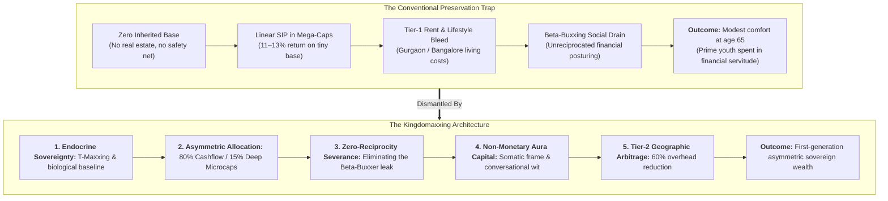
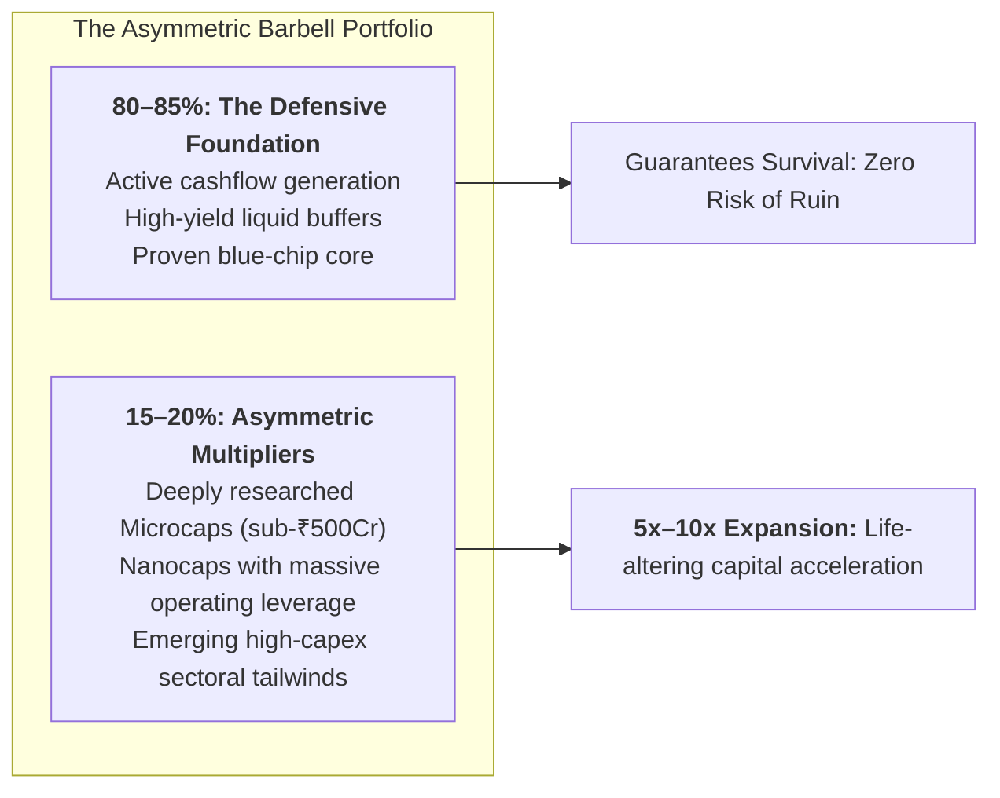
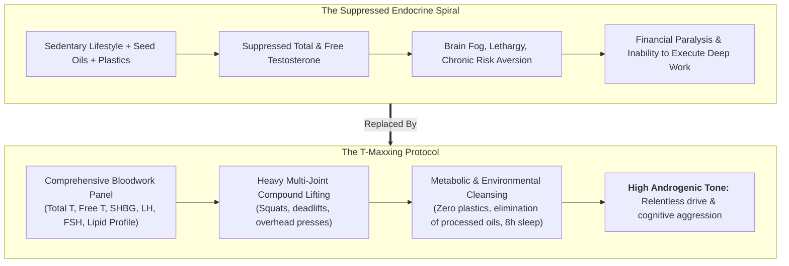
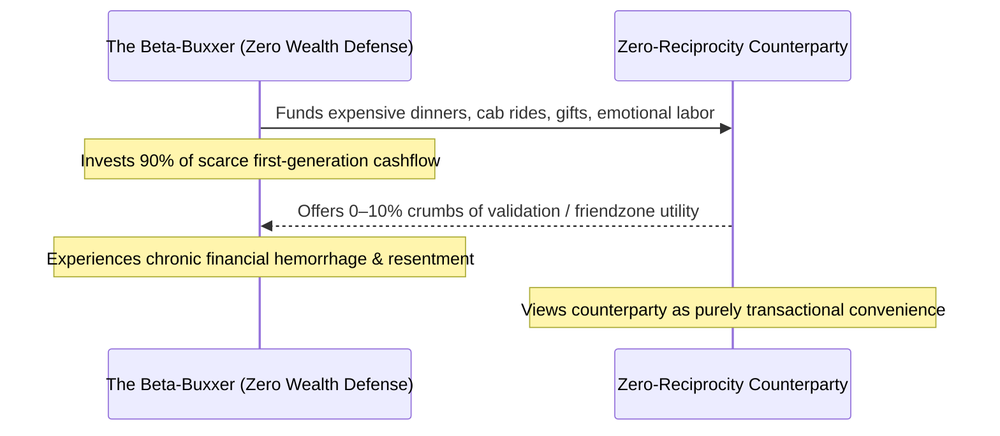
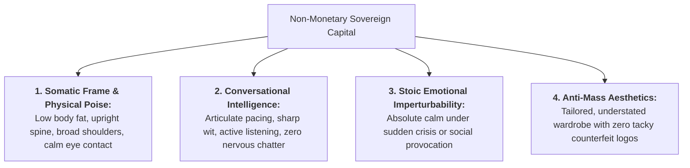
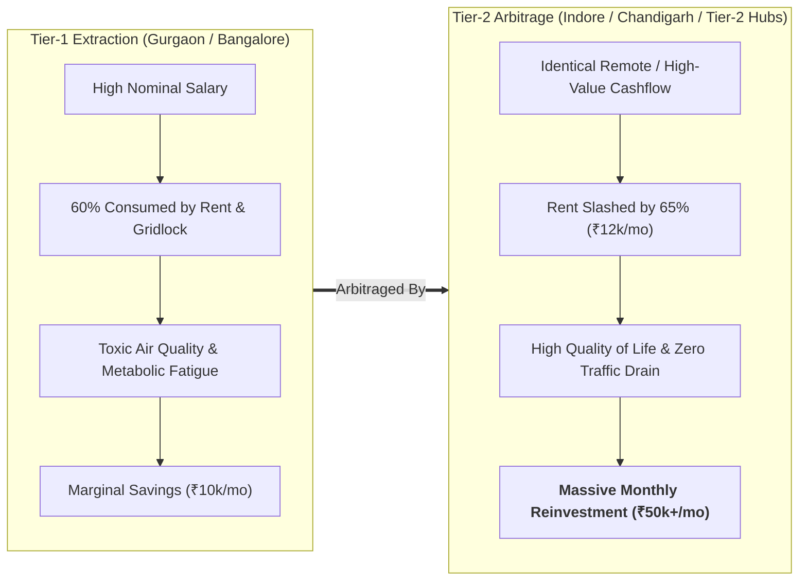

The conventional wisdom handed down by modern financial influencers is an insidious trap for first-generation builders.

Young men from middle-class and working-class families—often emerging from **Low-Ambition Family Architectures (LAFA)** without ancestral land, industrial dynastic connections, or inherited trust funds—are told: 
> *“Just invest ₹10,000 every month into an index fund, wait 40 years, and let 12% compound interest make you a millionaire at age 65.”*

While mathematically sound for **wealth preservation**, this linear prescription is **catastrophically deficient for wealth creation**. 



A dynasty with ₹20 Crores in prime real estate compounds ₹2.4 Crores per year effortlessly without lifting a finger. A young man starting with ₹50,000 cannot play the game of passive preservation; he must master **The Architecture of Kingdomaxxing**: the deliberate synthesis of asymmetric capital allocation, hormonal vitality, ruthless social triage, aura capital, and geographic leverage.

---

### Pillar 1: Asymmetric Capital Allocation & The Microcap Barbell

Generational wealth in India is anchored in **Real Estate**: commercial land, agricultural tracts, and prime urban plots acquired generations ago. For a first-generation builder, attempting to enter prime commercial real estate today requires crippling 30-year mortgages that convert working hours into debt service for banking cartels.

To break through this structural ceiling, the capital allocation strategy must be bifurcated into a **Barbell Architecture**:



#### The Rules of Asymmetric Microcap Hunting:
1. **Never Play Speculative Gambles**: Buying penny stocks on Telegram tips is financial suicide. Asymmetric investing requires **1.5 to 2 hours of daily balance-sheet excavation**: reading quarterly earnings transcripts, analyzing promoter shareholding, verifying debt-to-equity ratios, and confirming working capital cycles.
2. **Target High-Moat Structural Niches**: Look for sub-₹500Cr to ₹1,000Cr enterprises operating in specialized supply chains (e.g., aerospace components, precision defense optics, specialized railway infrastructure, specialized chemical synthesis) where entry barriers are high and government capex is expanding.
3. **The Multi-Bagger Mathematical Asymmetry**: In an index fund, a 20% gain on ₹1 Lakh yields ₹20,000. In a vetted microcap experiencing an operational turnaround, a 5x–10x expansion turns ₹1 Lakh into ₹5–10 Lakhs, fundamentally altering the baseline capital available for subsequent reinvestment.

---

### Pillar 2: Endocrine Sovereignty & Biological Capital (T-Maxxing)

Financial aggression, risk tolerance, and sustained analytical focus are not mere philosophical choices; **they are downstream of endocrine biology.**

A man with suppressed testosterone, chronic metabolic inflammation, and disrupted circadian rhythms will inevitably lack the psychological stamina to analyze balance sheets after a workday, execute bold asymmetric bets, and navigate high-stakes negotiations.



#### The Baseline Protocol for Hormonal Sovereignty:
- **Diagnostic Ground Truth**: Before spending money on supplements, perform a clinical diagnostic blood panel under medical supervision: Total Testosterone, Free Testosterone, Estradiol, SHBG, Fasting Insulin, and Vitamin D3.
- **Somatic Resistance Training**: Heavy compound movements recruit large motor units, signaling the endocrine axis to sustain elevated androgenic receptor density.
- **Environmental Toxin Eviction**: Microplastics and phthalates in heated food containers act as synthetic xenoestrogens. Switch exclusively to stainless steel, cast iron, and glass.
- **The Dopamine-Testosterone Link**: High testosterone elevates dopamine receptor sensitivity, transforming hard cognitive work into an intrinsically rewarding challenge rather than an agonizing chore.

---

### Pillar 3: Tactical Resource Allocation & Eliminating the "Beta-Buxxer" Leak

One of the primary destroyers of first-generation wealth in modern societies is **The Beta-Buxxing Trap (The Unconscious ATM Syndrome)**.

Young men who lack social confidence, masculine frame, and authentic self-worth often attempt to buy proximity, romantic attention, and social acceptance by becoming **unilateral financial providers** for people who feel zero genuine desire or respect for them:



#### The Sovereign Reciprocity Rule:
1. **Audit Every Relationship for Reciprocity**: If you are expending 80% of the financial, logistical, and emotional capital in a connection while the counterparty offers 10%, **terminate the transaction immediately**.
2. **Never Subsidize Lifestyle Inflation**: Buying high-end dining, designer gifts, or club tables to impress peers or romantic interests when you do not possess a commercial real estate empire is financial insanity.
3. **Strategic Networking Exception**: The only acceptable asymmetrical expenditure is investing in mentorship or elite peer circles where an elder statesman or industry leader provides 10% assistance that yields a **10x return in strategic access or deal flow**. All non-strategic, zero-reciprocity drains must be eliminated.

---

### Pillar 4: Aura-Maxxing & Non-Monetary Capital

When you walk into a room without generational wealth, your bank balance is not stamped across your forehead. 

Men who rely entirely on inherited wealth frequently become soft, physically degraded, and conversationally hollow. The first-generation builder must weaponize **the assets that money cannot purchase**:



#### The Anti-Mass Wardrobe Protocol:
- **Never Wear Counterfeit Luxury**: Wearing fake Gucci, replica Rolexes, or second-copy Balenciaga signals deep-seated status anxiety and low integrity. To high-status observers, counterfeit logos broadcast poverty of mind.
- **Reject Generic E-Commerce Fast-Fashion**: When every young man buys the top-reviewed algorithmically generated polyester shirts from mass e-commerce platforms, individual presence evaporates into uniform mediocrity.
- **Invest in Tailored, Understated Quality**: Seek out independent, high-grade linen, cotton, and structured tailoring. Fit, drape, and tactile texture convey quiet, sovereign authority that screams elegance without shouting a single brand name.

---

### Pillar 5: Geographic Arbitrage & Global Cultural Fluency

The modern Tier-1 metropolitan center in India—such as Gurgaon, Bangalore, or South Mumbai—has become a **financial extraction meat grinder** for young professionals:

```
[THE TIER-1 SALARY EXTRACTION TRAP]
Gross Monthly Income: ₹1,00,000
├── Rent (Matchbox 1BHK in Cyber Hub/Koramangala): ₹38,000 (38%)
├── Daily Gridlock Commute / Uber / Fuel: ₹12,000 (12%)
├── Lifestyle Inflation (Pubs, overpriced dining, delivery): ₹25,000 (25%)
├── Taxes & Utilities: ₹15,000 (15%)
└── REMAINING INVESTABLE CAPITAL: ₹10,000 (10%) -> Decades to Financial Freedom
```



#### The Geographic Arbitrage Strategy:
1. **Relocate to High-Infrastructure Emerging Hubs**: Cities like **Indore, Chandigarh, or emerging Smart Cities** offer world-class connectivity, clean infrastructure, and modern amenities at a fraction of Tier-1 living costs.
2. **Channel the Spread into Equity**: Slicing monthly overhead from ₹60,000 to ₹20,000 frees up **₹40,000 every single month**. Channeled into asymmetric microcap allocations, this capital spread compounds into life-altering assets over a 5-year cycle.
3. **Master Native-Level Cultural & Linguistic Fluency**: Do not merely learn basic functional English for office emails. Train yourself to speak with native-level phonetic clarity, international cadence, and cultural sophistication. When you combine low domestic overhead with the ability to interface seamlessly with global capital, you unlock true asymmetric leverage.

---

### The Kingdomaxxing Master Operating Protocol

```
[THE KINGDOMAXXING EXECUTION MATRIX]
├── PHASE 1: THE BIOLOGICAL BASELINE (Month 1–3)
│   ├── Complete comprehensive hormone, lipid, and metabolic bloodwork.
│   ├── Strip xenoestrogens and seed oils; train heavy compound lifts 4x weekly.
│   └── Establish 8-hour non-negotiable sleep architecture.
├── PHASE 2: THE CASHFLOW DEFENSE (Month 3–6)
│   ├── Audit all relationships; eliminate 100% of zero-reciprocity beta-buxxing drains.
│   ├── Execute Tier-2 geographic arbitrage if paying >35% of income on Tier-1 rent.
│   └── Cut all mass-market counterfeit luxury; rebuild wardrobe on fit and understated tailoring.
└── PHASE 3: THE ASYMMETRIC OFFENSIVE (Month 6 onward)
    ├── Allocate 80% of savings into defensive cashflow foundations.
    ├── Allocate 15–20% into deeply researched sub-₹500Cr microcaps with structural tailwinds.
    └── Reinvest multi-bagger yields into sovereign debt-free commercial assets.
```
