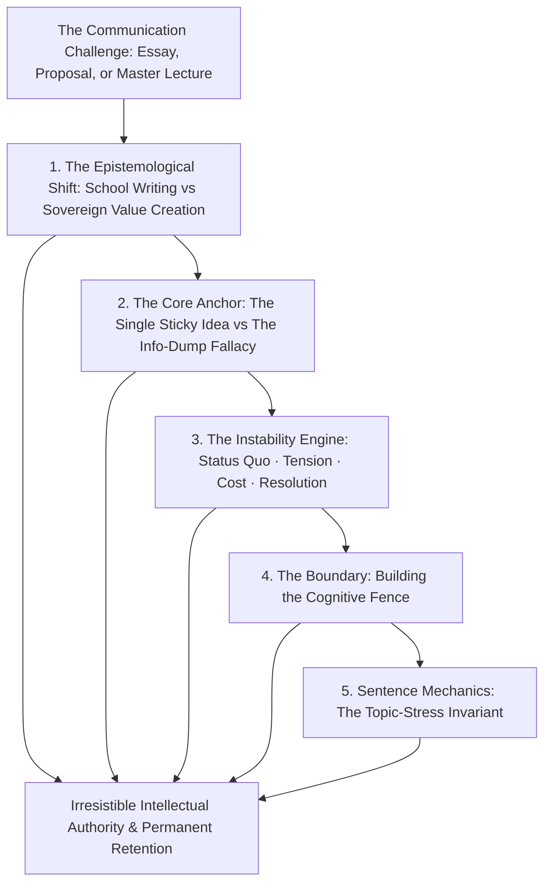
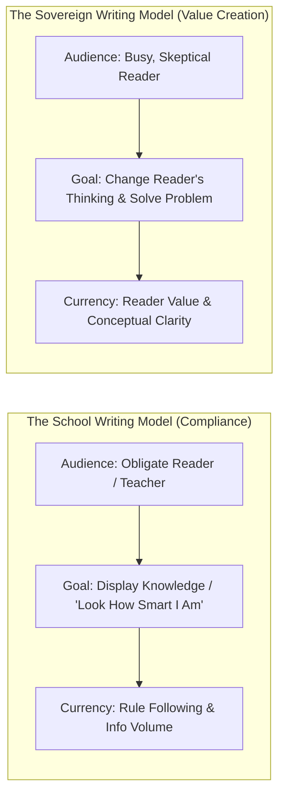
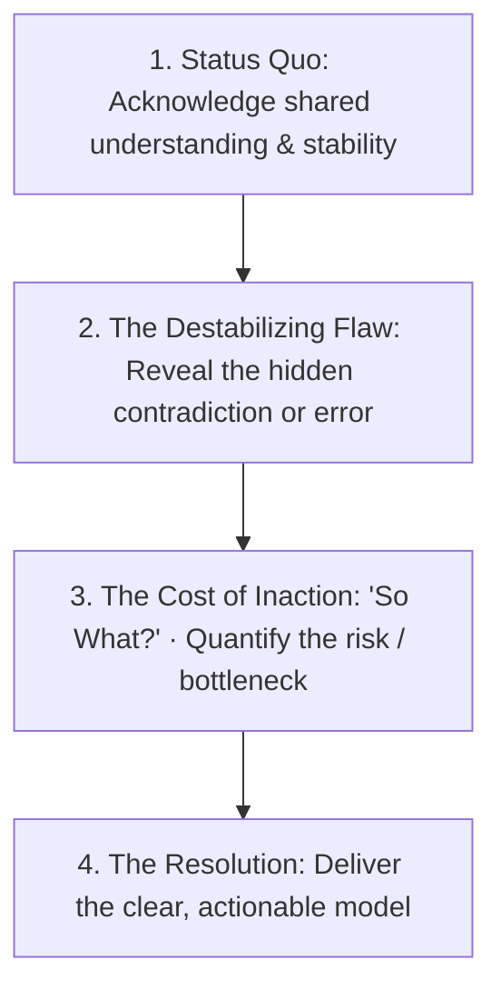
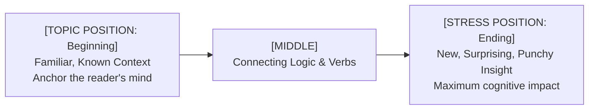
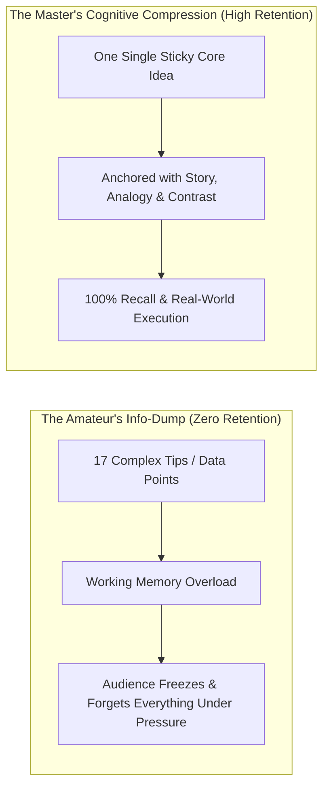
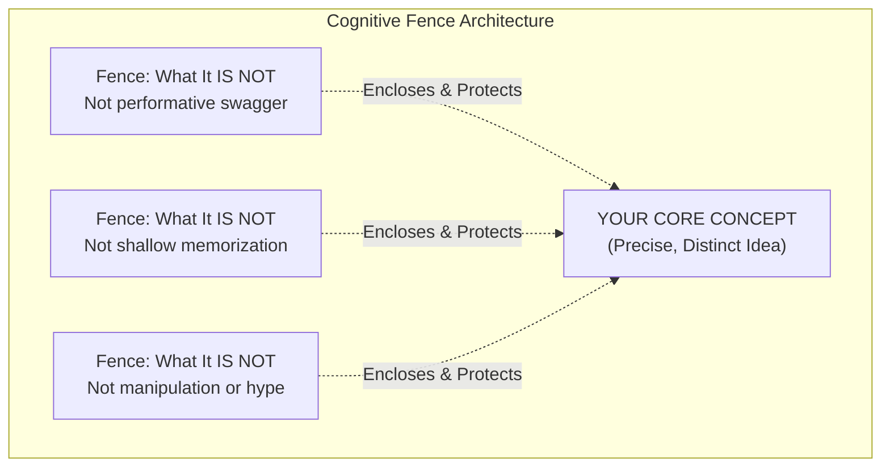

In the modern knowledge economy, the trajectory of your life and influence is heavily dictated by a simple mathematical reality:

$$\text{Realized Leverage} = \text{Quality of Ideas} \times \text{Ability to Write} \times \text{Ability to Speak}$$

If you have world-class insights but zero capacity to transmit them through clear prose and spoken dialogue, your ideas remain inert. Conversely, when you master **High-Impact Pedagogy and Sovereign Writing**, your ability to teach, persuade, and lead scales without friction.

Effective communication is not governed by innate charisma; it is governed by deterministic rules of **Cognitive Compression, Reader-Centric Value Creation, and Structural Architecture**.

---

### The Architecture of Long-Form Transmission

---

### The Epistemological Shift: School Writing vs. Sovereign Writing

1. **The School Fallacy**: In formal education, the reader (the teacher) is paid to read your work, already knows the answers, and grades you on whether you display knowledge. This conditions people to write long, self-centered explanations designed to prove they studied.
2. **The Sovereign Reality**: In the real world, **no one cares what you think, what you feel, or how hard you worked**. The reader cares exclusively about what *they* think and whether your text helps them solve an acute problem.
3. **The Value Invariant**: Knowledge alone is a cheap commodity. Writing is valuable only when it **changes the reader's perspective and moves their decision forward**.

---

### The Instability Engine: How to Make Ideas Matter

Readers are not moved by raw facts or disconnected truths. They are moved by **Instability and Resolution**:

* **Step 1 (Status Quo)**: Establish common ground (*"We have long assumed that increasing study hours is the direct path to exam mastery"*).
* **Step 2 (The Destabilizing Flaw)**: Introduce the tension (*"However, cognitive neuroscience reveals that passive repetition beyond 4 hours induces neural fatigue and negative transfer"*).
* **Step 3 (The Cost of Inaction)**: Explain why it hurts (*"Continuing this approach guarantees burnout and lower test-day retention"*).
* **Step 4 (The Resolution)**: Provide the sovereign framework (*"By restructuring into 90-minute ultradian sprint blocks, retention increases by 40%"*).

---

### Sentence Architecture: The Topic-Stress Invariant

Human cognitive processing naturally emphasizes certain positions within a sentence:

* **The Topic Position (Start with the Known)**: Place familiar concepts at the beginning of the sentence to ground the reader.
* **The Stress Position (End with the Punchline)**: Place the most important, novel, or impactful word at the very end of the sentence. The human brain naturally registers the final word as the climax of the thought.

---

### The Information-Dump Fallacy vs. The Single Sticky Idea

* **The Rookie's Fallacy**: Believing that "more information equals more value." Dumping 15 different techniques onto an audience creates cognitive overload. Under pressure, the brain forgets all 15.
* **The Master's Law of Retention**: **Communication is measured strictly by what the reader/listener retains and can execute under pressure.**
* **The Lead Domino Principle**: Anchor every document, essay, or lecture around **One Single Core Insight**. All secondary points exist solely to reinforce that singular idea.

---

### The Five Master Heuristics of High-Impact Pedagogy

---

#### 1. The Empowerment Promise (The Opening Invariant)
* **The Fatal Mistake**: Starting with pleasantries, background history, or apologies.
* **The Master Heuristic**: Open within the first 15 seconds with the **Empowerment Promise**—an explicit contract declaring what the reader will be able to do:
  * *"In the next 10 pages, you will learn the exact three-part architecture to articulate complex ideas under pressure without freezing."*

---

#### 2. Building the Cognitive Fence
* **The Problem**: When you introduce a novel idea, the human brain automatically tries to map it onto clichés it already knows.
* **The Master Heuristic**: Explicitly define what your idea **IS** and what it **IS NOT**:
  * *"This framework is not about speaking louder or dominating a room; it is strictly about structuring your core argument so that complex ideas become intuitive to a beginner."*

---

#### 3. Cycling (The Rule of Three Re-Entries)
* Attention is cyclical. Readers and listeners drift.
* **The Master Heuristic**: Cycle through critical ideas at least three times from different vantage points:
  1. *Plain-English Definition*.
  2. *Mechanical Functional Example*.
  3. *Synthesized Big-Picture Takeaway*.

---

#### 4. Verbal & Visual Punctuation (Cognitive Signposts)
* Use explicit landmarks throughout your prose (*"That concludes the biological mechanism. Now we turn to the second pillar: Daily Execution"*). These act as cognitive re-entry ramps.

---

#### 5. The Final Salute: Concluding with Authority
* Never end with a trailing, apologetic *"Thank you for listening"* (which subconsciously signals: *"Thank you for enduring my boring talk"*).
* Deliver your ultimate synthesized takeaway, salute the reader's craft, and stop with absolute stillness.

---

### The Core Takeaway to Remember
> Writing and speaking are not acts of self-expression; they are acts of reader transformation. Strip away the school habit of showing what you know. Create instability by exposing hidden flaws, anchor your sentences in topic-stress alignment, fence your ideas with surgical precision, and deliver sovereign clarity.
