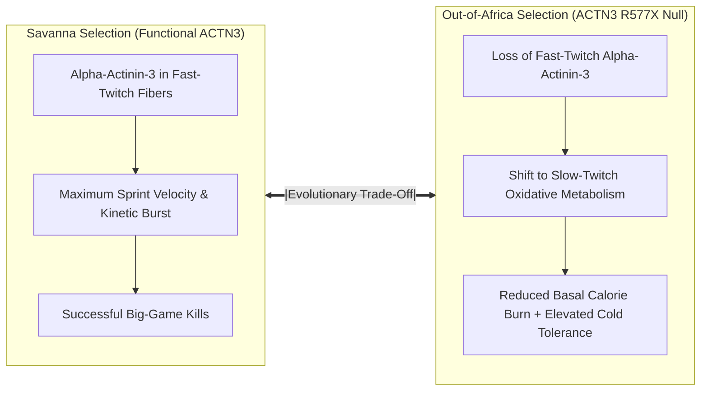
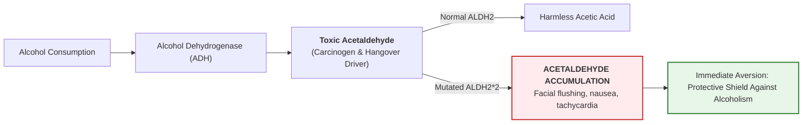
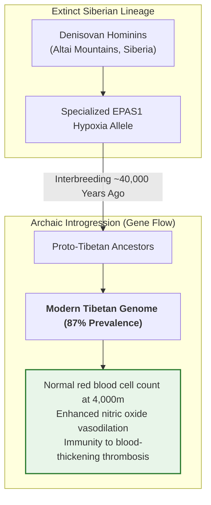

Human anatomy and psychology are not static, perfectly engineered instruments. **They are living archaeological palimpsests**: dynamic biological mosaics shaped by catastrophic famines, glacial bottlenecks, parasitic wars, and archaic sexual selection.

Every physiological quirk—from the texture of your earwax and your capacity to digest milk to your susceptibility to addiction, your pain threshold, and your restless appetite for novelty—was purchased through the brutal arithmetic of natural selection.

```mermaid
flowchart TD
    subgraph EvolutionaryPressures["The Four Evolutionary Selective Engines"]
        P1["<b>1. Pathogen Pressure:</b> Malaria, parasitic fevers, toxins"]
        P2["<b>2. Climate & Thermal Extremes:</b> Glaciation, low UV, hypoxia"]
        P3["<b>3. Metabolic Scarcity:</b> Famine, drought, agrarian shifts"]
        P4["<b>4. Sexual Selection:</b> Novelty, height, symmetry, scent"]
    end

    subgraph AdaptiveGenomicOutputs["The 11 Master Genetic Adaptations"]
        P1 --> G1["<b>HBB:</b> Sickle Cell / Malaria Immunity"]
        P1 --> G2["<b>ALDH2:</b> Alcohol Flushing Shield"]
        P2 --> G3["<b>EPAS1:</b> Denisovan High-Altitude Hypoxia"]
        P2 --> G4["<b>MC1R:</b> Pale Skin / Vitamin D Synthesis"]
        P2 --> G5["<b>ACTN3:</b> Fast-Twitch Sprint vs Cold Efficiency"]
        P3 --> G6["<b>FTO:</b> Ghrelin Surge & Famine Fat Storage"]
        P3 --> G7["<b>MCM6:</b> Adult Lactase Persistence"]
        P4 --> G8["<b>DRD4:</b> 7R Wanderlust / Migration Dopamine"]
        P4 --> G9["<b>ABCC11:</b> Zero Axillary Odor / Glacial Caves"]
        P4 --> G10["<b>HERC2:</b> Melanin Switch / Blue Eye Radiation"]
        P4 --> G11["<b>HMGA2:</b> Dutch Sexual Selection for Height"]
    end
```



To master the biology of the self, one must deconstruct the **11 Primary Genetic Adaptations** that govern the human machine.

---

### 1. ABCC11: Scent Sovereignty & The Glacial Cave (38,000 BC)

In northern China during the Last Glacial Maximum, hominin tribes were forced into cramped animal-hide shelters to survive brutal winters. In these sealed, smoke-filled, unwashed quarters, body odor was an inescapable sensory reality.

- **The Mutation**: A single base-pair substitution (538G>A) in the **ABCC11 gene** disabled the protein transporter that secretes proteins and lipids into apocrine sweat glands.
- **The Phenotype**: Carriers produce **zero underarm body odor** (axillary osmidrosis is extinguished) and their earwax is dry and flaky rather than wet and sticky.
- **The Evolutionary Lever**: In enclosed living spaces, scent played a crucial role in mate selection. Today, over 80–95% of East Asians carry this mutation, making deodorant culturally obsolete.

---

### 2. ACTN3: The Speed Gene vs. Metabolic Heat Conservation (200,000 BC)

On the East African savanna, survival required explosive velocity: sprinting across open terrain to close the distance on wounded game before it escaped into predator-dense brush.



- **The Function**: The **ACTN3 gene** codes for alpha-actinin-3, a structural protein found exclusively in fast-twitch muscle fibers responsible for generating explosive force.
- **The Trade-Off**: Over **1.5 billion people alive today have lost this gene entirely (the R577X null allele)**. As humans migrated out of equatorial Africa into freezing Eurasian latitudes, burst sprinting became secondary to metabolic efficiency. The loss of ACTN3 remodeled muscle fibers toward slow-twitch oxidative metabolism, conserving baseline calories and improving hypothermia resistance.

---

### 3. FTO: The Thrifty Gene & Famine Resilience (7,000 BC)

In prehistoric agrarian settlements, feast and famine operated on violent, unpredictable cycles. A single failed monsoon meant complete societal starvation.

- **The Mutation**: The A-variant of the **FTO gene**—the most ubiquitous obesity-associated variant in the modern genome.
- **The Mechanism**: It chronically elevates circulating levels of **ghrelin** (the hunger hormone), muting satiety signals and driving the brain to demand more calories even after a full meal.
- **The Historic Miracle**: While lean, vascular hunters with low body fat starved within weeks of crop failure, FTO carriers possessed massive adipose energy reserves. The fat carried them through six months of famine, leaving them as the primary genetic survivors. In modern grocery-abundant environments, this ancient lifesaver has transformed into the primary driver of metabolic syndrome.

---

### 4. HERC2 / OCA2: The Blue-Eye Iris Switch (15,000 BC)

For the first 200,000 years of human existence, every single human possessed brown eyes. Melanin production in the iris was absolute.

- **The Mutation**: A single regulatory mutation in an intron of the **HERC2 gene** acted as a rheostat, switching off the normal transcription of the adjacent **OCA2 gene** in the iris stroma.
- **The Emergence**: Originating near the Black Sea / Southern Europe roughly 6,000 to 10,000 years ago, blue eyes conferred zero survival utility against predators or disease.
- **Sexual Selection**: Its rapid propagation to over **300 million living humans** was propelled almost entirely by **Positive Assortative Mating and Sexual Selection**—the psychological attraction to novel, striking visual phenotypes in small, expanding populations.

---

### 5. ALDH2: The Agrarian Shield Against Addiction (3,200 BC)

With the invention of agriculture in Neolithic southern China came the accidental discovery of rice wine fermentation. For the first time, humans had access to cheap, concentrated liquid alcohol.



- **The Mutation**: The **ALDH2\*2 allele** disables the aldehyde dehydrogenase enzyme, causing toxic, carcinogenic acetaldehyde to pool in the bloodstream within minutes of drinking.
- **The Paradox**: While carriers suffer immediate facial flushing, nausea, and rapid heart rates ("Asian Flush"), this physiological distress served as a **powerful evolutionary shield**. In agrarian societies where alcoholism ravaged communities, ALDH2\*2 carriers remained sober, reliable, and agriculturally productive, passing on their genes at massive rates.

---

### 6. DRD4: The 7R Wanderlust Allele & The Migration Gradient (50,000 BC)

Why did small bands of early humans abandon the fertile, game-rich Great Rift Valley of Africa to freeze on the Siberian steppe or paddle canoes across the Pacific Ocean?

- **The Mutation**: The **7R variant of the DRD4 dopamine receptor gene** produces a blunted dopamine receptor.
- **The Psychology**: Normal resting environments fail to generate baseline dopamine tone for 7R carriers. They suffer from profound existential restlessness; they require novel stimuli, unpredictable exploration, and high-risk frontiers to feel alive.
- **The Out-of-Africa Correlation**: Population geneticists discovered that the **frequency of the DRD4 7R allele directly correlates with the geographical distance a population migrated from Africa**. The nomadic tribes that traversed the Bering Strait into the Americas possess the highest concentration of the 7R allele on Earth.

---

### 7. MC1R: Highland Melanin Loss & The Rewired Pain Axis

In high-latitude, cloudy environments such as prehistoric Scotland, ultraviolet radiation is so weak that dark-skinned hominins suffered from severe rickets, bone deformities, and immune collapse caused by profound Vitamin D deficiency.

- **The Mutation**: Recessive loss-of-function variants in the **MC1R gene** switched melanin synthesis from dark eumelanin to pale, reddish pheomelanin.
- **The Synthesis Engine**: Extremely fair skin allowed even the weakest rays of winter UV light to penetrate deep into the dermis, catalyzing the synthesis of Vitamin D to harden bones and maintain immune surveillance.
- **Pleiotropic Nociception**: The identical MC1R mutation rewired the central nervous system's pain pathways. Redheads produce higher levels of endogenous analgesic endorphins, exhibiting significantly higher tolerances to thermal pain and electrical shock. In Scotland, over 13% of the population carries two copies of this survival adaptation.

---

### 8. MCM6 / LCT: Lactase Persistence & Liquid Food Security (1,000 BC)

Mammals are genetically programmed to produce lactase only during infancy. Once weaned, the lactase enzyme shuts down, causing lactose intolerance in over 65% of the modern global population.

- **The Mutation**: A regulatory point mutation within the introns of the adjacent **MCM6 gene** kept the **LCT (lactase) gene** permanently activated throughout adulthood.
- **The Pastoralist Revolution**: In Central and Northern Europe, nomadic pastoralists relied on cattle herds. When crops failed and game vanished, drinking fresh, uncontaminated milk provided an instant, renewable source of sterile hydration, complete animal protein, and calcium. Those who could drink milk survived famines; those who suffered diarrhea and fluid loss perished.

---

### 9. HBB: The Tragic Balance of Sickle Cell Trait (1,000 BC)

When West African tribes cleared tropical rainforests to plant yams, sunlight hit standing pools of rainwater, creating ideal breeding grounds for *Anopheles* mosquitoes carrying *Plasmodium falciparum* malaria.

```mermaid
graph TD
    A["HBB Gene Inheritance"] --> B{"Genotype"}
    B -->|Normal (HbA / HbA)| C["<b>No Sickle Cell</b><br>100% Vulnerable to Fatal Malaria Fever"]
    B -->|Heterozygote (HbA / HbS)| D["<b>SICKLE CELL TRAIT (OPTIMAL FITNESS)</b><br>50% misshapen cells kill malaria parasite<br>Normal daily life + Malaria Immunity"]
    B -->|Homozygote Mutated (HbS / HbS)| E["<b>Sickle Cell Anemia</b><br>Severe vaso-occlusion, organ damage, early mortality"]

    style D fill:#e8f5e9,stroke:#2e7d32,stroke-width:2px
    style E fill:#ffebee,stroke:#c62828,stroke-width:2px
    style C fill:#ffebee,stroke:#c62828,stroke-width:2px
```

- **The Mutation**: A single amino acid change in the beta-globin chain (**HBB gene**).
- **Heterozygote Advantage**: Inheriting **one copy** deformed just enough red blood cells to puncture and destroy the malaria parasite, conferring near-total immunity against childhood mortality.
- **The Tragic Cost**: If two carriers mate, their child has a 25% chance of inheriting **two copies**, producing full-blown sickle-cell disease. Evolution accepted the agonizing death of homozygotes to ensure the survival of the heterozygote population.

---

### 10. HMGA2: Sexual Selection & The Dutch Stature Inversion (1860)

In 1860, the average Dutch male stood 5'5"—making them among the shortest populations in Europe, three inches shorter than the average American. Today, Dutch men are the tallest on Earth, averaging over 6'0".

- **The Genetic Drivers**: Polygenic variants, including the **HMGA2 gene**, which directly regulates cell growth and skeletal elongation.
- **The Modern Selection**: While improved nutrition and dairy consumption provided the fuel, statistical demographic studies revealed that **tall Dutch men had significantly more surviving children than short men**. Shorter men were half as likely to secure a reproductive partner. Over just six generations, intense female sexual selection drove an unprecedented physical transformation across an entire nation.

---

### 11. EPAS1: Denisovan Archaic Introgression (800 AD)

At 4,000 meters above sea level on the Tibetan Plateau, atmospheric oxygen is 40% lower than at sea level. Lowland humans ascend to this altitude and suffer acute mountain sickness, pulmonary edema, and dangerously thick blood (polycythemia) as their bone marrow overproduces red blood cells.



- **The Genetic Origin**: Tibetans did not wait for a random mutation to occur. Approximately 40,000 years ago, their human ancestors interbred with **Denisovans**—an extinct sister branch of Neanderthals who had already lived in high-altitude Eurasia for hundreds of thousands of years.
- **The Mechanism**: The Denisovan **EPAS1 variant** regulates hypoxia-inducible factors, preventing the dangerous spike in red blood cells that causes strokes and heart failure, while maximizing capillary vasodilation and nitric oxide production.
- **The Modern Divergence**: **87% of Tibetans carry the Denisovan EPAS1 gene**, compared to only 9% of Han Chinese who share identical common ancestry from just a few thousand years prior.

---

### Operational Synthesis: The Evolutionary Biological Matrix

| Gene | Core Adaptation | Environmental Crucible | Modern Manifestation / Trade-off |
| :--- | :--- | :--- | :--- |
| **ABCC11** | Zero body odor, dry earwax | Glacial caves in northern China | Deodorant redundancy in >80% of East Asians |
| **ACTN3** | Fast-twitch sprint velocity | Savanna persistence hunting | R577X null allele trades speed for cold/caloric endurance |
| **FTO** | Elevated ghrelin, continuous fat storage | Cyclical crop failures and famines | Drives obesity in calorie-abundant modern environments |
| **HERC2** | Melanin shutdown in iris (blue eyes) | Post-glacial Europe sexual selection | 300M modern carriers; zero survival utility |
| **ALDH2** | Acetaldehyde toxicity (flushing) | Neolithic rice wine overconsumption | Evolutionary shield against liver disease and addiction |
| **DRD4 (7R)**| Blunted dopamine / novelty hunger | Out-of-Africa worldwide migration | Fuels wanderlust and ADHD-like frontier exploration |
| **MC1R** | Pale skin & rewired pain pathways | Low UV light in Scotland/Nordics | Rapid Vitamin D synthesis + elevated pain tolerance |
| **MCM6/LCT**| Adult lactase persistence | Pastoralist dairy farming in Europe | Unlocked raw milk as emergency famine survival fuel |
| **HBB** | Misshapen erythrocytes kill malaria | West African rainforest clearance | Heterozygote immunity vs. homozygote sickle-cell disease |
| **HMGA2** | Skeletal elongation / height | 19th-century Dutch mate selection | Transitioned Netherlands to tallest population on Earth |
| **EPAS1** | Hypoxia tolerance without polycythemia | Tibetan Plateau (4,000m elevation) | Denisovan archaic gene flow enabling life on roof of world |
