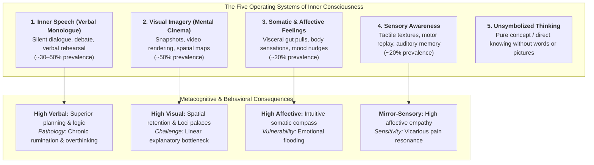
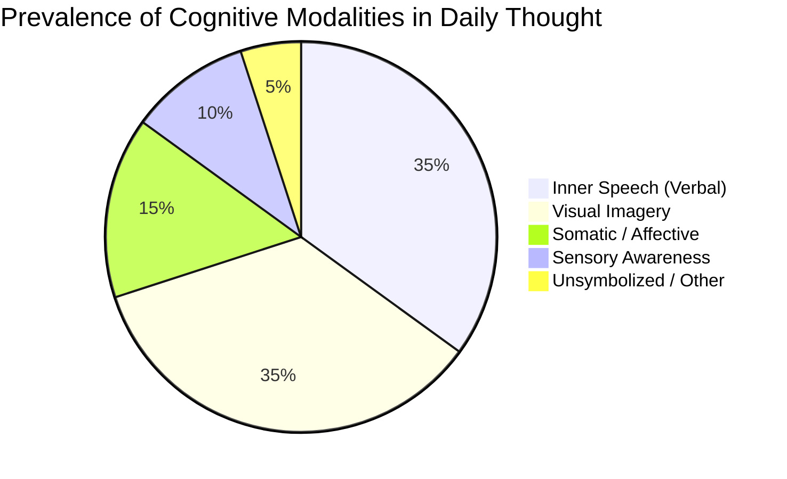
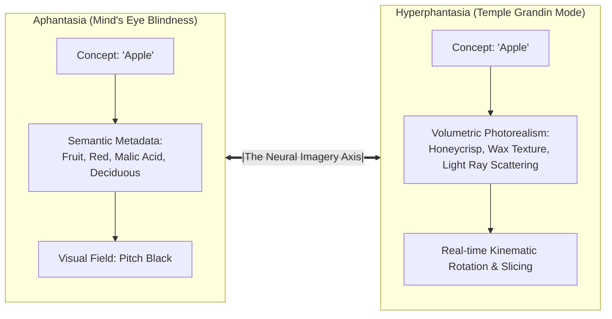
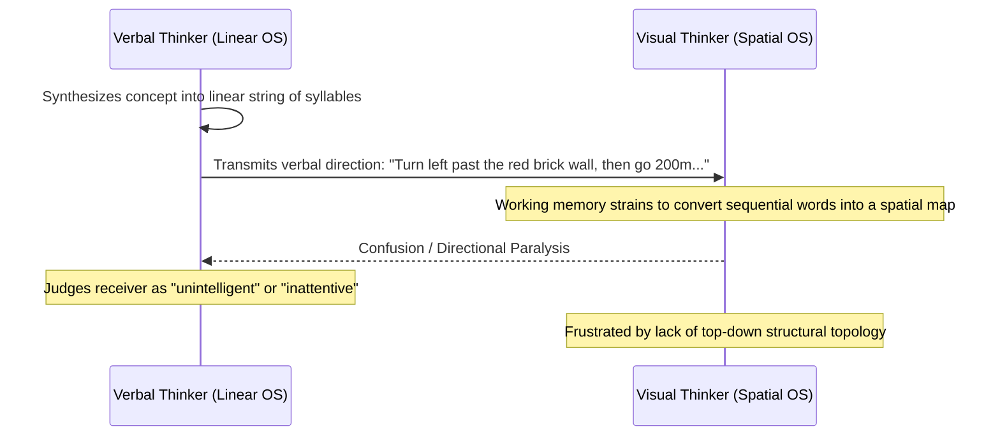

One of the most universal and unexamined delusions of the human species is **the assumption of cognitive uniformity**: the subconscious conviction that the interior theater of every other mind operates with the identical sensory mechanics, internal voice, and visual fidelity as one's own.

We perceive another individual speaking English, navigating traffic, and holding a cup of coffee, and we assume their cranial processing mirrors ours. 

Yet neuroscience and descriptive cognitive sampling reveal a startling reality: **the human mind possesses no universal default operating system.** 

Human consciousness is partitioned across radically divergent modalities—spanning individuals who experience a non-stop, multi-voice verbal debate in their skulls to those who experience completely silent, photorealistic 3D spatial simulations, to those whose thoughts consist entirely of raw somatic visceral pulls or pure symbol-free concepts.



According to Harvard research by Matthew Killingsworth and Daniel Gilbert (*"A Wandering Mind Is an Unhappy Mind"*), humans spend approximately **47% of their waking hours thinking about what is not currently occurring**. During this continuous internal voyage, the brain generates between **6,000 and 60,000 thoughts per day**. 

Yet how those thoughts manifest in subjective qualia differs so profoundly that two people standing side by side are frequently operating on incompatible cognitive architectures.

---

### The Five Operating Systems of Inner Experience

Pioneered by psychologist Russell Hurlburt using *Descriptive Experience Sampling* (DES), empirical analysis of immediate inner experience categorizes cognition into five core modalities:



#### 1. Inner Speech (The Verbal Monologue)
- **The Phenotype**: The individual experiences thoughts as an auditory or quasi-auditory linguistic monologue. They argue with themselves, rehearse prospective conversations with employers, narrate their morning routine, and mentally vocalize their questions.
- **Cognitive Profile**: Observed in roughly **30% to 50% of the population**, appearing in approximately 20% to 30% of individual sampled moments (though high-verbalizers exceed 70%).
- **Operational Edge**: Exceptional capacity for linear logical deductions, complex semantic analysis, and disciplined contingency planning.
- **The Pathology**: High susceptibility to **perseverative rumination** and anxiety loops. The verbal thinker cannot easily "turn off" the narrator; silence is merely the pause between sentences.

#### 2. Visual Imagery (The Spatial Cinema)
- **The Phenotype**: Thoughts manifest as mental snapshots, dynamic moving scenes, or topological blueprints without accompanying verbal commentary.
- **Cognitive Profile**: When searching for lost keys, the visual thinker does not ask, *"Where did I put them?"* Instead, they mentally render a panoramic snapshot of the hallway console, the passenger seat of their vehicle, or the coat pocket.
- **Operational Edge**: High-speed parallel processing, instantaneous spatial orientation, and elite visual mnemonic indexing.

#### 3. Somatic & Affective Intuition
- **The Phenotype**: Cognition bypasses words and pictures entirely, manifesting as **visceral somatic signals**: a tightening in the solar plexus, a kinetic postural impulse, or an emotional gravitation toward a physical direction.
- **Cognitive Profile**: Comprises roughly **20% of reported inner thoughts**. The individual feels an impulse toward the bedroom before their rational prefrontal cortex can formulate why they are walking there.

#### 4. Sensory Awareness (Tactile & Auditory Simulation)
- **The Phenotype**: The replay of raw physical sensations: the kinetic weight of keys dropping onto mahogany, the tactile drag of velvet across fingertips, or the thermal chill of aluminum.
- **Vocal & Musical Kinematics**: Approximately **80% of individuals can replay music internally with near-photographic pitch, tempo, and instrumental separation**. Over 50% can project internal voices in pitches, timbres, and foreign accents that their physical vocal cords are anatomically incapable of reproducing.

#### 5. Unsymbolized Thinking (Pure Conceptual Knowing)
- **The Phenotype**: The mind grasps a complex, multi-variable proposition with absolute clarity **without the presence of a single word, image, or bodily sensation**.
- **The Reality**: You understand the principle, the resolution, and the implications instantaneously; if forced to explain it, you must consciously translate the pure concept into the secondary medium of language.

---

### The Mental Imagery Continuum: From Aphantasia to Hyperphantasia

The human capacity for visual projection exists on a radical bell curve, most clearly illuminated by **The Apple Test**:

```
[THE APPLE TEST SPECTRUM]
1: Total Darkness (Aphantasia) ───────────────> 5: Photorealistic 3D (Hyperphantasia)
├── Level 1: Aphantasia (~0.8–3%): No image; pure semantic/conceptual metadata.
├── Level 2: Low-Resolution Silhouette: Faint, monochromatic, fleeting outline.
├── Level 3: Moderate Visualization: Clear 2D image with basic color and shape.
├── Level 4: High-Fidelity Rendering: Textured skin, stem, shadow, reflections.
└── Level 5: Hyperphantasia: Rotatable, volumetric 3D model with tactile depth.
```



- **Aphantasia (Mind's Eye Blindness)**: Coined by cognitive neurologist Dr. Adam Zeman (University of Exeter), aphantasia affects approximately **0.8% to 3% of humans**. Aphantasics possess zero voluntary visual imagery. When instructed to "picture a beach," they experience pitch blackness. 
  - *The Revelation Paradox*: Many aphantasics do not discover their condition until their twenties or thirties, having spent their youth assuming phrases like *"picture this"* or *"see it in your mind's eye"* were purely poetic metaphors.
- **Hyperphantasia (Dr. Temple Grandin)**: At the opposite pole, hyperphantasics generate mental imagery so vivid and structurally complete that it rivals external optical reality. 
  - Renowned animal scientist Dr. Temple Grandin (author of *Thinking in Pictures*) describes her mind as a full-motion video library. When designing livestock facilities, she tests hydraulic gates and cattle movements in real-time mental CAD simulations. Grandin famously remarked that attempting to comprehend word-based, linear thinkers felt like trying to decipher an alien species.

---

### Cross-Modal Friction: The Cognitive OS Incompatibility

The profound diversity of inner monologues exposes why human communication is fraught with structural friction: **we routinely attempt to run identical software on incompatible operating systems.**



#### Diagnostic Manifestations of OS Mismatch:
1. **Navigational Friction**: A high-verbal thinker gives directions via sequential propositions: *"Take the third exit, drive 400 meters past the pharmacy, and turn left at the stone fountain."* A high-visual thinker's working memory collapses under this verbal buffer; their brain demands a top-down spatial topography (*"Head northwest toward the clock tower, then cut behind the lake"*).
2. **Pedagogical Failure**: Teachers who rely exclusively on linear verbal exposition abandon spatial and kinesthetic learners, mistaking an OS incompatibility for a lack of intellectual horsepower.
3. **Conversational Rhythm**: An unsymbolized thinker may pause for five seconds before answering a question—not because their brain is sluggish, but because they are undertaking the laborious task of encoding non-verbal concepts into vocal syntax.

---

### Mirror-Sensory Perception & Affective Empathy

Empirical inquiry reveals that sensory imagination is not distributed equally across human populations. Approximately **15% of individuals experience somatosensory and mirror-sensory imagination**:
- Reading about ice-cold steel produces an immediate, detectable drop in perceived fingertip temperature.
- Witnessing someone crush a finger in a doorway triggers a visceral, electric cringe in their own corresponding limb.

```mermaid
flowchart LR
    A["Visual Observation of Another's Pain"] --> B{"Somatosensory Mirror Activation"}
    B -->|High Sensory Imagineers (~15%)| C["Physical Limb Resonance & Visceral Cringe"]
    C --> D["<b>Elevated Affective Empathy</b><br>(Direct neuro-somatic sharing of another's state)"]
    B -->|Low / Cognitive Imagineers| E["Abstract Intellectual Recognition"]
    E --> F["<b>Cognitive Empathy</b><br>(Understanding without physical resonance)"]
```

Neuropsychological testing demonstrates that individuals with vivid somatosensory imagination score significantly higher on measures of **Affective Empathy**—the capacity to physically feel what another organism feels—as opposed to purely **Cognitive Empathy** (the detached, intellectual comprehension of another's mental state).

---

### The Cognitive Trade-Off Matrix

No cognitive operating system is inherently superior; each represents a specialized evolutionary trade-off:

| Dimension | The High-Verbal Thinker | The High-Visual Thinker | The Somatic / Intuitive Thinker |
| :--- | :--- | :--- | :--- |
| **Core Strength** | Sequential logic, debate, contingency articulation | Spatial modeling, dynamic simulation, design | Instantaneous pattern recognition, risk sensing |
| **Mnemonic Leverage** | Phonological loop, semantic associations | **The Method of Loci / Memory Palace** (5–10x retention multiplier) | State-dependent somatic anchors |
| **Primary Failure Mode** | **Chronic Rumination**: Trapped in looping internal dialogue | **Explanatory Bottleneck**: Struggle to verbalize spatial models | **Cognitive Flooding**: Difficulty isolating rational basis from emotion |
| **Optimal Domain** | Jurisprudence, philosophy, editing, diplomacy | Architecture, engineering, surgery, strategy | Crisis navigation, high-stakes trading, tactical leadership |

---

### Sonder & Epistemic Solitude

The ultimate philosophical yield of cognitive variance is the realization of **Epistemic Solitude**:
> *You will never experience another human being’s consciousness, and no one will ever inhabit yours.*

When you pass a stranger on a crowded street, they are not a generic background character in your narrative. They inhabit a self-contained, idiosyncratic cranial universe—perhaps navigating the day through a rich, multi-voiced Shakespearean monologue, perhaps drifting through silent, high-resolution cinematic vistas, or perhaps steered by subtle somatic tides of intuition.

True metacognitive mastery begins with recognizing the boundaries of your own operating system: **respecting the silence of the visualist, tempering the rumination of the verbalist, and honoring the deep, unvoiced complexity of the human mind.**
