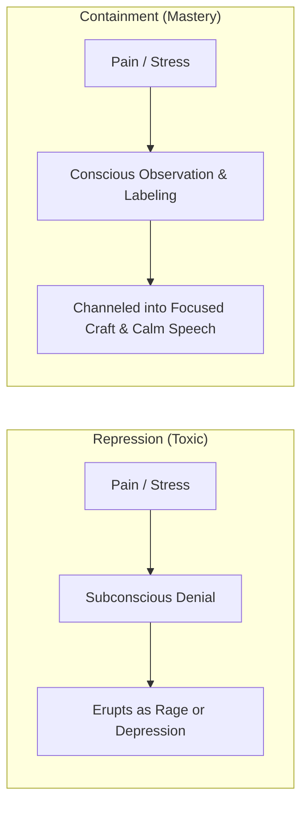
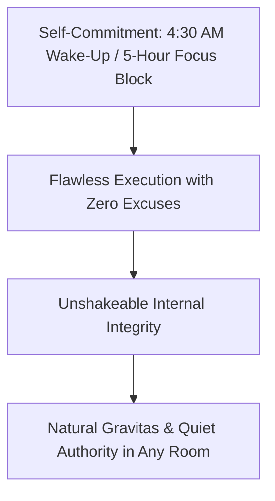

In the modern world, the concept of strength and mature character has been heavily distorted by two extreme caricatures:
1. **The Performative Posturer**: Loud dominance games, emotional suppression, constant status signaling, and desperate attempts to look powerful.
2. **The Approval-Seeker**: Prioritizing being liked over being respected, chronic people-pleasing, lack of personal boundaries, and an externalized victim mindset.

In the philosophy of human excellence and mature psychology, true power lies in **Integrated Strength**: the state of being physically disciplined, professionally competent, emotionally self-contained, and radically accountable.

When you master the **Code of Integrated Strength**, you prioritize unshakeable respect over cheap likability, hold clear non-negotiable boundaries, and become an unshakeable stabilizing anchor for yourself and those around you.

---

### The Spectrum of Character & Maturity

```mermaid
graph TD
    subgraph SG_1_1__The_Performa ["1. The Performative Posturer"]
        P1[Loud Status Signaling & Domination Games]
        --> P2[Fragile Ego Armor · Zero Vulnerability]
        --> P3[Blames Others upon Failure · Chronic Insecurity]
    end

    subgraph SG_2_2__The_Approval ["2. The Approval-Seeker"]
        R1[Prioritizes Being Liked · People-Pleasing]
        --> R2[Boundaryless Compromise · Leaks Authority]
        --> R3[Resentment & Victim Mindset]
    end

    subgraph SG_3_3__The_Integrat ["3. The Integrated Sovereign"]
        I1[Quiet Competence · Prioritizes Respect Over Approval]
        --> I2[Clear 'Hard-No' Boundaries · Radical Ownership]
        --> I3[Emotional Containment · Stabilizing Anchor for Others]
    end

```

---

### The Five Pillars of Integrated Strength

---

#### 1. Prioritizing Respect Over Being Liked
* **The Approval Trap**: When you optimize for being liked by everyone, you become malleable. You say "yes" when you want to say "no," avoid uncomfortable decisions, and dilute your standards.
* **The Law of Respect**: True respect is never demanded through loud posturing; it is commanded through **integrity, competence, and consistency**. Being willing to hold a high standard—even when it creates temporary social friction—earns long-term, unshakeable respect.

---

#### 2. The "Hard-No" Boundary Invariant
* Respect begins with what you refuse to tolerate from yourself and others.
* Define a clear list of **non-negotiable standards ("Hard-Nos")** regarding integrity, gossip, disrespect, and time boundaries.
* **The Rule of Enforcement**: When a boundary is crossed, enforce it immediately with **calm firmness, zero rage, and zero apology**. An emotional explosion signals weakness; calm, immovable firmness signals sovereign power.

---

#### 3. Quiet Competence (Action Over Advertising)
* **The Principle**: The loudest person in the room is almost universally the most insecure. An individual who truly knows how to execute never needs to boast about their plans, announce their study blocks, or broadcast proofs of success.
* **The Rule**: **Let your craft speak; let your ego whisper.** Execute your daily blocks in silence. Real competence creates a gravitational field of respect that requires zero self-promotion.

---

#### 4. Emotional Containment vs. Repression
* **The Misconception**: Traditional culture taught people to repress emotions until they exploded into rage or burnout. Modern pop-culture often swings to the other extreme, encouraging raw, unfiltered emotional dumping onto others.
* **The Mature Truth**: **Containment is not repression; containment is emotional self-possession.**
  * You feel anger, grief, fear, or frustration with complete conscious awareness.
  * However, you maintain the metacognitive discipline not to let transient emotional storms dictate your speech or derail your actions. You absorb turbulence and emit calm clarity.

---

#### 5. The Dignity of Radical Ownership
* **The Habit of the Weak**: Making defensive excuses when a project fails, a deadline is missed, or a relationship encounters friction (*"The traffic was terrible," "The instructions were unclear," "They provoked me"*).
* **The Code of Ownership**: The moment an error occurs, eliminate all defensiveness immediately.
  * State plainly: *"That was my responsibility. Here is exactly where the system broke down, and here is the concrete step I am taking right now to fix it."*
  * Taking 100% ownership instantly dissolves interpersonal conflict, commands undeniable respect, and gives you complete power to correct the outcome.

---

### The Internal Engine: Keeping Promises to Yourself

* True confidence and natural gravitas do not come from external applause; they come from **an unbroken track record of keeping commitments to yourself**.
* When you tell yourself you will wake up at 4:30 AM, complete your deep work block, or maintain physical discipline—and you never back down—your brain registers that your word is law. This internal certainty broadcasts effortlessly in every conversation.

---

### The Core Takeaway to Remember
> Respect is not given; it is earned through an unshakeable track record of competence, internal integrity, and calm boundaries. Stop chasing the fleeting approval of others. Keep every promise you make to yourself, take radical ownership of every outcome, let your results do the talking, and become an unshakeable pillar of strength.
