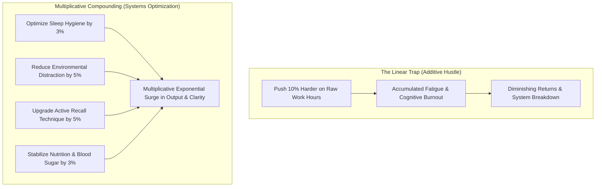
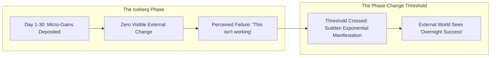
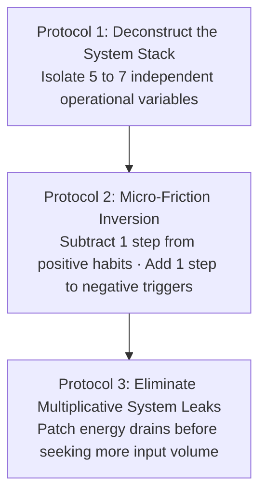

The popular aphorism *"get 1% better every day"* is frequently dismissed as motivational fluff.

To the untrained mind, the concept sounds mathematically absurd or unsustainable: if you study for 8 hours today, does 1% improvement mean studying for 8 hours and 5 minutes tomorrow, compounding until you study 24 hours a day?

This skepticism stems from a fundamental misunderstanding of **Linear Addition vs. Multiplicative Systems Engineering**.

The **Aggregation of Marginal Gains** is not about pushing harder on a single metric until physical exhaustion. It is the practice of **deconstructing a complex endeavor into its underlying components, optimizing each component by a tiny fraction, and letting them multiply across the system**.

---

### Linear Effort vs. Multiplicative Systems

When you treat your life or study as a single monolithic block, progress is slow and exhausting. When you deconstruct your life into distinct interrelated sub-systems, tiny micro-calibrations create massive asymmetric breakthroughs:

$$\text{System Yield} = (\text{Sleep}) \times (\text{Focus Environment}) \times (\text{Retrieval Method}) \times (\text{Emotional Equanimity})$$

* If each variable is improved by just 5%, the result is not an additive $+20\%$, but a multiplicative explosion:
  $$(1.05)^4 \approx 1.2155 \quad (+21.6\% \text{ total systemic leverage})$$
* Conversely, a **single neglected leak multiplies downward**: if poor sleep degrades your cognitive baseline by 20%, every subsequent hour of study is cut by a 0.8 multiplier, regardless of how much willpower you exert.

---

### The Latent Plateau & The Iceberg of Delayed Results

The most common reason people abandon systematic improvement is the **Valley of Disappointment (The Latent Plateau)**.

* **The Melting Ice Cube Metaphor**: Imagine an ice cube sitting in a cold room at $-5^\circ\text{C}$. You heat the room to $-4^\circ\text{C}$, then $-3^\circ\text{C}$, then $-1^\circ\text{C}$. To an untrained observer, nothing has happened; the ice is still solid. But at $0^\circ\text{C}$, a dramatic phase change occurs and the ice turns to liquid water. The energy was not wasted; it was **accumulating latent potential**.
* **The Compounding Curve**: In human skill acquisition and competitive exam preparation, the first 60 to 90 days of disciplined execution often show zero dramatic outward markers. The brain is quietly laying down myelin and synaptic density. Those who understand the latent plateau endure the quiet phase and reap the exponential reward.

---

### The Three Protocols for Operationalizing Marginal Gains

---

#### 1. Deconstruct the System Stack
Never try to "fix your entire life" at once. Isolate your daily craft into 5 distinct operational layers:
1. **Biological Input**: Sleep consistency, hydration, morning sunlight exposure.
2. **Environmental Friction**: Physical isolation of the smartphone, clean visual desk space.
3. **Information Intake**: High-yield source selection vs. low-yield noise filtering.
4. **Cognitive Processing**: Active retrieval loops and blank-page testing instead of passive re-reading.
5. **Recovery & Synthesis**: NSDR protocols and evening reflection to consolidate learning.

Optimize one variable by 1% each week.

---

#### 2. Micro-Friction Inversion
Human behavior follows the path of least mechanical resistance.

* **Positive Habits**: Remove just 1 physical barrier (e.g., have your textbook already opened to tomorrow's page and your notebook pen uncapped before going to sleep).
* **Negative Habits**: Add just 1 physical barrier (e.g., place website blocker passwords on a separate piece of paper in another room). That 5-second delay is enough for the prefrontal cortex to intercept the impulse.

---

#### 3. Patch the Downstream Multiplicative Leaks
Before adding more hours to your study or work schedule, find and eliminate the negative multipliers:
* A 30-minute late-night social media binge creates a **0.8 multiplier** on tomorrow's deep work capacity.
* A sugary breakfast creates a mid-day glucose crash that acts as a **0.7 multiplier** on analytical problem-solving.
* Eliminating one negative leak delivers greater performance returns than adding two extra hours of exhausted studying.

---

### The Core Takeaway to Remember
> True mastery is not the result of one heroic leap; it is the aggregation of countless invisible micro-calibrations. Deconstruct your system, eliminate hidden leaks, trust the latent plateau, and allow the mathematics of compounding to elevate your life.
