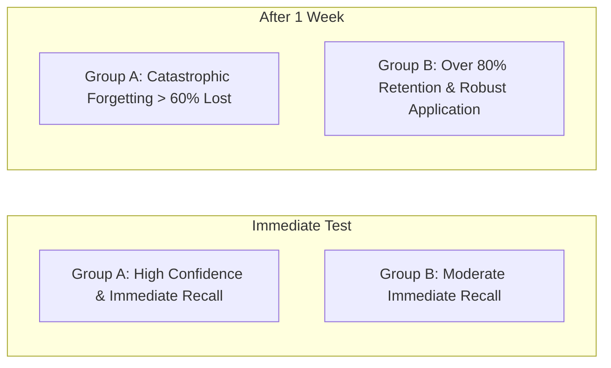
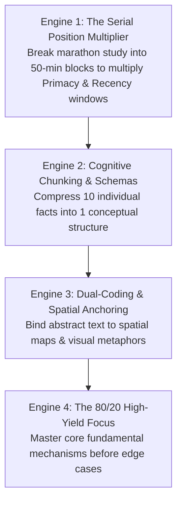
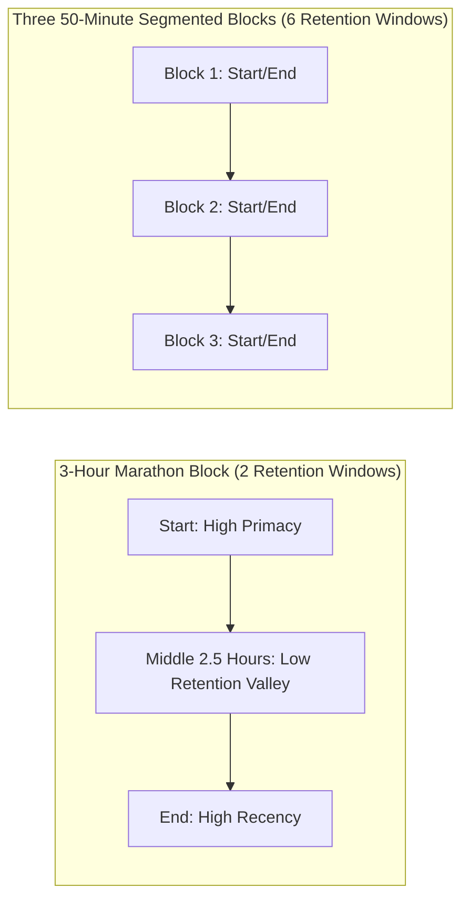
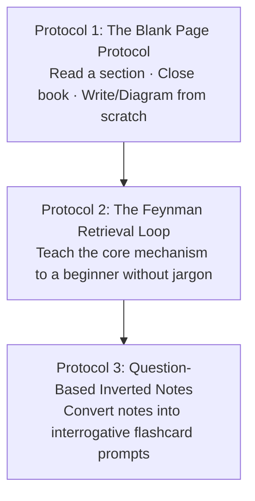
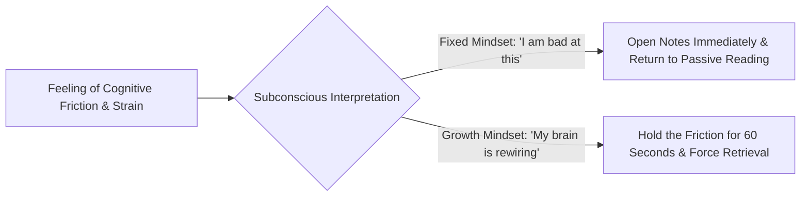
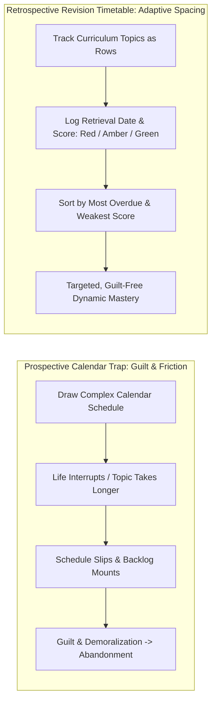
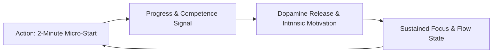

There is a widespread misconception that elite performers and top exam scorers possess exceptional photographic memory or spend 14 exhausting hours a day chained to a desk.

In cognitive psychology and neuroscience, **top scorers do not study more hours—they remember more per unit of time**.

When an average student studies, they rely on **passive review**: highlighting textbooks, re-reading highlighted notes, and watching recorded lectures. This produces the **Illusion of Competence** (the fluency trap). Because the information is directly in front of their eyes, recognition requires zero metabolic effort. The brain mistakes the ease of *recognition* for the capacity to *retrieve and apply* the concept independently.

True retention is an **active construction and spatial encoding network**. By understanding the biological mechanics of memory, you can double your retention while cutting study hours in half.

---

### The Two Pathways of Learning

```mermaid
graph TD
    subgraph SG_1_Passive_Review_ ["Passive Review: The Fluency Trap"]
        P1[Read / Highlight Notes] --> P2[Low Cognitive Effort & High Comfort]
        P2 --> P3[Recognition Only 'Looks Familiar']
        P3 --> P4["Rapid Memory Decay: 80% Lost in 48 Hours"]
    end

    subgraph SG_2_Active_Retrieva ["Active Retrieval & Spatial Architecture"]
        A1[Close Notes & Force Retrieval from Scratch] --> A2[High Cognitive Friction & Calibrated Struggle]
        A2 --> A3[Synaptic Consolidation & Myelination]
        A3 --> A4[Permanent Neural Storage & Instant Recall]
    end

```

---

### The Cognitive Science of Retrieval: The Testing Effect

In landmark clinical trials by cognitive psychologists Henry Roediger and Jeffrey Karpicke, students were divided into two groups:
* **Group A (Repeated Study)**: Read material four times consecutively.
* **Group B (Active Testing)**: Read material once and spent the remaining time taking practice recall tests without looking at the text.

* **The Finding**: While repeated reading produced temporary confidence immediately after studying, **Group B outperformed Group A by more than 50% after one week**.
* **The Biological Mechanism**: The act of struggling to extract a half-forgotten fact from your memory sends an intense electrical signal to the hippocampus and prefrontal cortex. This friction triggers **synaptic consolidation** and thickens the myelin sheath around that neural circuit.

---

### The Four Engines of Elite Retention

---

#### 1. The Serial Position Multiplier (Primacy & Recency)
The human brain does not remember information evenly across a study session. Due to the **Primacy and Recency Effects**, the brain naturally remembers what happens in the first 10 minutes (Primacy) and the last 10 minutes (Recency), while the middle 2 hours degenerate into a "retention sinkhole."

* **The Tactical Shift**: Instead of studying for 3 unbroken hours, divide your session into **three 50-minute blocks with 5-minute cognitive pauses**. This simple adjustment triples your high-retention windows from 2 to 6 with zero extra effort.

---

#### 2. Cognitive Chunking & Schemas (Overcoming the 4-Slot RAM Limit)
Human working memory can hold only **4 to 7 discrete items** at once.

* **The Novice Mistake**: Treating every formula, date, and definition as an isolated fact, which instantly overloads cognitive capacity.
* **The Master's Chunking**: Grouping interrelated facts under an overarching conceptual framework (schema). When 10 isolated facts are synthesized into 1 unified mental model, they occupy only **1 slot in working memory**, allowing the brain to manipulate complex problems effortlessly.

---

#### 3. Dual-Coding & Spatial Anchoring (The Method of Loci)
For hundreds of thousands of years, the human brain evolved for **spatial navigation and visual terrain memory**, not for reading abstract printed symbols on a screen.

* **The Mechanism**: Abstract words and numbers are biologically difficult for the brain to grip. When you pair an abstract concept with a vivid spatial diagram, flowchart, or physical location (*The Method of Loci*), you activate both the visual cortex and the semantic hippocampus.
* **Dual Retrieval Pathways**: If the verbal memory pathway falters during an exam, the visual-spatial pathway immediately steps in to reconstruct the concept.

---

#### 4. The Pareto Memory Rule (80/20 Core Mastery)
In any major syllabus, 80% of exam marks test roughly 20% of fundamental mechanisms.

* Elite students spend the majority of their active retrieval energy testing the **core 20% high-frequency principles** until recall is instantaneous.
* Once the foundation is unshakeable, marginal details effortlessly latch onto the existing conceptual framework.

---

### The Three Master Active Recall Protocols

1. **The Blank Page Protocol (The Blurting Method)**: Read for 20 minutes. Close the book and diagram everything you remember on a blank sheet. Open the notes and fill what you missed in red ink to instantly reveal neural gaps.
2. **The Feynman Retrieval Loop**: Explain the mechanism out loud in simple terms without notes. The moment you hesitate or use complex jargon as a crutch, you have isolated an explanatory flaw to repair.
3. **Question-Based Note Taking (Inverted Notes)**: Replace passive bullet points with sharp interrogative questions (e.g., *"Why does chunking expand functional working memory?"*). Test yourself before looking at the answer.
4. **The No-Answer Question Sheet (The Secretarial Inversion)**: Developed by Cambridge Medicine top-ranker Dr. Said. Students squander hundreds of hours transcribing exhaustive answers into beautiful summary documents. Instead, compile a document composed **strictly of questions with zero written answers**.
   * **The Flaw of Writing Answers**: Writing answers creates the illusion of learning through clerical labor. Worse, when answers are visible below a question, subsequent testing inevitably lapses into passive verification.
   * **Just-in-Time Reference Retrieval**: When you fail a question, consult the canonical textbook or lecture slides at that exact moment to resolve the gap, but do not clutter your sheet with the answer.
   * **Color-Coded Multi-Pass Triage**: On Pass 1, test every question. Highlight failed questions in color. On subsequent passes, test *only* the highlighted questions, concentrating cognitive bandwidth exclusively on weak neural connections.

```mermaid
graph TD
    subgraph SG_1_Traditional_Notes ["Traditional Note-Taking: The Secretarial Trap"]
        T1["Listen to Lecture / Read Text"] --> T2["Spend 40 Hours Transcribing Answers & Summaries"]
        T2 --> T3["Notes Become Static Trophy & Passive Artifact"]
        T3 --> T4["Rereading Notes Before Exam -> Illusion of Competence"]
    end

    subgraph SG_2_The_No_Answer_Bank ["The No-Answer Question Bank: Pure Socratic Retrieval"]
        S1["Listen to Lecture / Read Text"] --> S2["Compile Question-Only Document: Zero Answers"]
        S2 --> S3["Force Pure Retrieval from Scratch on Blank Page"]
        S3 --> S4["Multi-Pass Triage: Re-Test Only Failed Flagged Nodes"]
    end
```

---

### The Rule of Desirable Difficulty

When practicing Active Recall, your brain will feel tired, frustrated, and slow.

* **Effort is the Engine of Retention**: The harder it is to retrieve a piece of information, the more permanent that memory becomes once successfully reconstructed.
* **Never Peek Prematurely**: When you cannot remember an answer, spend at least **45 to 60 seconds straining your memory** before consulting the reference. That period of strain primes your brain to absorb the correct answer with maximum salience.

---

### The Retrospective Revision Timetable: Eliminating Calendar Guilt

Traditional study planning relies on **prospective timetables** (e.g., *"On Tuesday 4 PM I will study Cardiac Physiology"*). These schedules almost universally fail: unexpected delays occur, tasks take longer than predicted, and falling behind creates demoralizing guilt that triggers avoidance.

The **Retrospective Revision Timetable** flips the planning architecture:
* **The Structure**: The rows are your curriculum topics; the columns are dates on which you completed a retrieval session.
* **The Color-Coded Feedback**: After every active recall session, you score the topic using three objective colors:
  * 🔴 **Red**: Struggled to retrieve core mechanisms; high friction; critical knowledge gaps.
  * 🟡 **Amber**: Retrieved the foundation but stumbled on edge cases or specific details.
  * 🟢 **Green**: Effortless, fluent recall from the blank page.
* **Algorithmic Study Selection**: When you sit down to study, you do not consult an inflexible calendar. You simply scan your matrix and select:
  1. The topic with the **oldest date** (maximum elapsed time / highest forgetting risk).
  2. The topic with **Red or Amber status** (highest marginal return on effort).

---

### The 1-Bible Scoping Heuristic

A primary driver of study paralysis is **resource saturation**: collecting five textbooks, three question banks, and dozens of video playlists before starting.

* **The 1-Bible Rule**: Select **one canonical textbook or curriculum spine** and designate it as your primary authority. Master that single source until you understand 85–90% of the conceptual terrain.
* **Targeted Infill**: Treat all other textbooks, lecture notes, and video lectures as *supplementary tools* strictly used to clarify specific points where your primary source is ambiguous.
* **Syllabus Scoping**: Before reading a single paragraph, map the entire subject hierarchy from the exam specification. Knowing the structural branches in advance allows working memory to file individual facts into pre-constructed mental shelves.

---

### Interleaved Practice: Breaking Pattern Autopilot

When students practice **blocked study** (solving 30 consecutive problems of Type A, then 30 of Type B), the brain takes algorithmic shortcuts. Because it already knows which formula is required, it skips the most cognitively demanding phase: **problem diagnosis**.

* **The Interleaving Principle**: Mix problem types and conceptual domains within the same study session ($A \to B \to C \to A \to C$).
* **Cognitive Discrimination**: Interleaving forces the brain to analyze each problem from scratch to diagnose *which schema applies*, mimicking the unpredictable environment of an actual exam.

---

### The Action-First Motivation Flywheel

Students frequently wait to "feel motivated" before initiating demanding active recall sessions. In behavioral neuroscience, **motivation is an emotional byproduct of competence, not a biological prerequisite for action**.

* **The Friction Inversion**: Eliminate startup friction by setting out your materials the night before.
* **The 2-Minute Rule**: Commit to only answering 1 question or writing for 120 seconds. Once the baseline activation energy is breached, the brain's internal dopamine flywheel takes over.

---

### The Core Takeaway to Remember
> High-yield learning is not a contest of endurance; it is a discipline of cognitive retrieval. Multiply your retention windows through segmented sessions, chunk complex details into unified schemas, anchor ideas visually, and test your mind against the blank page.

