There is a widespread misconception that elite performers and top exam scorers possess exceptional photographic memory or spend 14 exhausting hours a day chained to a desk.

In cognitive psychology and neuroscience, **top scorers do not study more hours—they remember more per unit of time**.

When an average student studies, they rely on **passive review**: highlighting textbooks, re-reading highlighted notes, and watching recorded lectures. This produces the **Illusion of Competence** (the fluency trap). Because the information is directly in front of their eyes, recognition requires zero metabolic effort. The brain mistakes the ease of *recognition* for the capacity to *retrieve and apply* the concept independently.

True retention is an **active construction and spatial encoding network**. By understanding the biological mechanics of memory, you can double your retention while cutting study hours in half.

---

### The Two Pathways of Learning

```mermaid
graph TD
    subgraph SG_1_Passive_Review_ ["Passive Review: The Fluency Trap"]
        P1[Read / Highlight Notes] --> P2[Low Cognitive Effort & High Comfort]
        P2 --> P3[Recognition Only 'Looks Familiar']
        P3 --> P4["Rapid Memory Decay: 80% Lost in 48 Hours"]
    end

    subgraph SG_2_Active_Retrieva ["Active Retrieval & Spatial Architecture"]
        A1[Close Notes & Force Retrieval from Scratch] --> A2[High Cognitive Friction & Calibrated Struggle]
        A2 --> A3[Synaptic Consolidation & Myelination]
        A3 --> A4[Permanent Neural Storage & Instant Recall]
    end

```

---

### The Cognitive Science of Retrieval: The Testing Effect

In landmark clinical trials by cognitive psychologists Henry Roediger and Jeffrey Karpicke, students were divided into two groups:
* **Group A (Repeated Study)**: Read material four times consecutively.
* **Group B (Active Testing)**: Read material once and spent the remaining time taking practice recall tests without looking at the text.

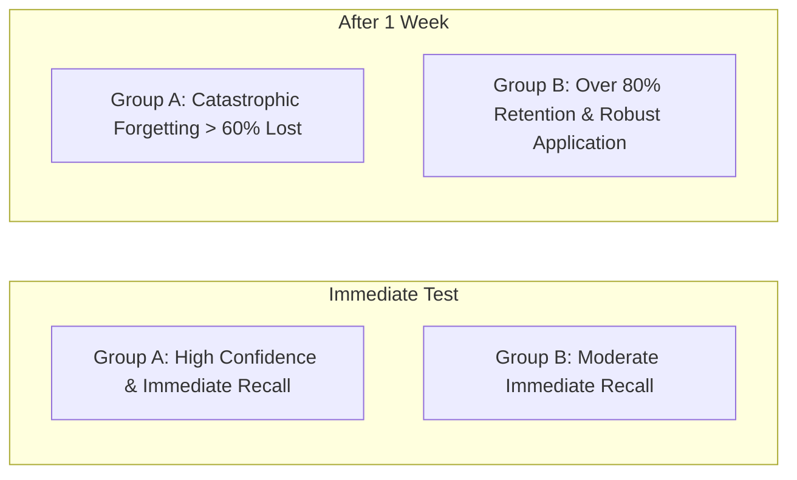

* **The Finding**: While repeated reading produced temporary confidence immediately after studying, **Group B outperformed Group A by more than 50% after one week**.
* **The Biological Mechanism**: The act of struggling to extract a half-forgotten fact from your memory sends an intense electrical signal to the hippocampus and prefrontal cortex. This friction triggers **synaptic consolidation** and thickens the myelin sheath around that neural circuit.
* **The Jungle Trail Metaphor & Circuit Dissociation**: 
  * Why does understanding fail to produce recall? Comprehension activates **sensory and semantic recognition circuits**. But generating an answer under exam pressure requires a separate neural pathway: **prefrontal-hippocampal generative retrieval**.
  * Imagine a dense tropical jungle overgrown with wild brush. The first time you walk through, there is immense friction, and the weeds immediately spring back behind you. Looking at a satellite map (passive rereading) does not clear the terrain.
  * Active recall is physically marching down the trail repeatedly. With each passage, your boots trample the brush, compacting the soil until the pathway becomes a paved, myelinated neural highway where action potentials fire at over 100 m/s.

---

### The Four Engines of Elite Retention

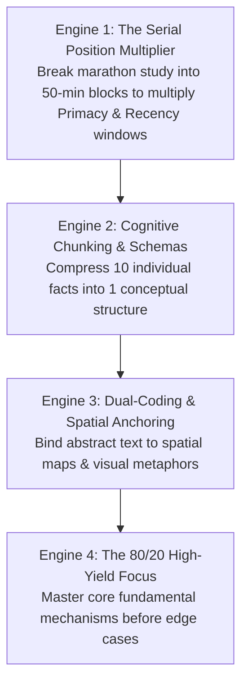

---

#### 1. The Serial Position Multiplier (Primacy & Recency)
The human brain does not remember information evenly across a study session. Due to the **Primacy and Recency Effects**, the brain naturally remembers what happens in the first 10 minutes (Primacy) and the last 10 minutes (Recency), while the middle 2 hours degenerate into a "retention sinkhole."

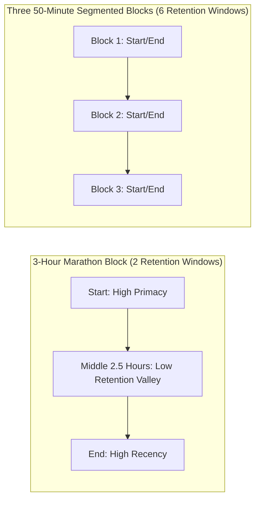

* **The Tactical Shift**: Instead of studying for 3 unbroken hours, divide your session into **three 50-minute blocks with 5-minute cognitive pauses**. This simple adjustment triples your high-retention windows from 2 to 6 with zero extra effort.

---

#### 2. Cognitive Chunking & Schemas (Overcoming the 4-Slot RAM Limit)
Human working memory can hold only **4 to 7 discrete items** at once.

* **The Novice Mistake**: Treating every formula, date, and definition as an isolated fact, which instantly overloads cognitive capacity.
* **The Master's Chunking**: Grouping interrelated facts under an overarching conceptual framework (schema). When 10 isolated facts are synthesized into 1 unified mental model, they occupy only **1 slot in working memory**, allowing the brain to manipulate complex problems effortlessly.

---

#### 3. Dual-Coding & Spatial Anchoring (The Method of Loci)
For hundreds of thousands of years, the human brain evolved for **spatial navigation and visual terrain memory**, not for reading abstract printed symbols on a screen.

* **The Mechanism**: Abstract words and numbers are biologically difficult for the brain to grip. When you pair an abstract concept with a vivid spatial diagram, flowchart, or physical location (*The Method of Loci*), you activate both the visual cortex and the semantic hippocampus.
* **Dual Retrieval Pathways**: If the verbal memory pathway falters during an exam, the visual-spatial pathway immediately steps in to reconstruct the concept.

---

#### 4. The Pareto Memory Rule (80/20 Core Mastery)
In any major syllabus, 80% of exam marks test roughly 20% of fundamental mechanisms.

* Elite students spend the majority of their active retrieval energy testing the **core 20% high-frequency principles** until recall is instantaneous.
* Once the foundation is unshakeable, marginal details effortlessly latch onto the existing conceptual framework.

---

### The Three Master Active Recall Protocols

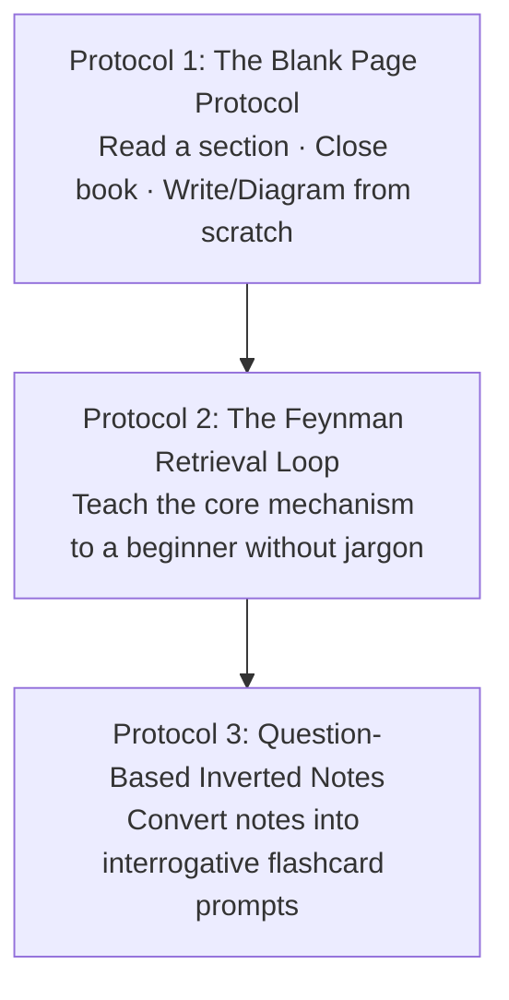

1. **The Blank Page Protocol (The Blurting Method)**: Read for 20 minutes. Close the book and diagram everything you remember on a blank sheet. Open the notes and fill what you missed in red ink to instantly reveal neural gaps.
   * **Keyword-Compressed Blurting (Syntactic De-Noising)**: Novices exhaust themselves writing full grammatical sentences during blurting. Instead, record **compressed keyword chains** (e.g., `Cardiac Output -> Preload -> Frank-Starling -> Actin-Myosin Overlap`). Stripping syntactic overhead preserves 100% of working memory for pure conceptual retrieval.
2. **The Feynman Retrieval Loop**: Explain the mechanism out loud in simple terms without notes. The moment you hesitate or use complex jargon as a crutch, you have isolated an explanatory flaw to repair.
3. **Question-Based Note Taking (Inverted Notes)**: Replace passive bullet points with sharp interrogative questions (e.g., *"Why does chunking expand functional working memory?"*). Test yourself before looking at the answer.
4. **The No-Answer Question Sheet (The Secretarial Inversion)**: Developed by Cambridge Medicine top-ranker Dr. Said. Students squander hundreds of hours transcribing exhaustive answers into beautiful summary documents. Instead, compile a document composed **strictly of questions with zero written answers**.
   * **The Flaw of Writing Answers**: Writing answers creates the illusion of learning through clerical labor. Worse, when answers are visible below a question, subsequent testing inevitably lapses into passive verification.
   * **Just-in-Time Reference Retrieval**: When you fail a question, consult the canonical textbook or lecture slides at that exact moment to resolve the gap, but do not clutter your sheet with the answer.
   * **Color-Coded Multi-Pass Triage**: On Pass 1, test every question. Highlight failed questions in color. On subsequent passes, test *only* the highlighted questions, concentrating cognitive bandwidth exclusively on weak neural connections.

```mermaid
graph TD
    subgraph SG_1_Traditional_Notes ["Traditional Note-Taking: The Secretarial Trap"]
        T1["Listen to Lecture / Read Text"] --> T2["Spend 40 Hours Transcribing Answers & Summaries"]
        T2 --> T3["Notes Become Static Trophy & Passive Artifact"]
        T3 --> T4["Rereading Notes Before Exam -> Illusion of Competence"]
    end

    subgraph SG_2_The_No_Answer_Bank ["The No-Answer Question Bank: Pure Socratic Retrieval"]
        S1["Listen to Lecture / Read Text"] --> S2["Compile Question-Only Document: Zero Answers"]
        S2 --> S3["Force Pure Retrieval from Scratch on Blank Page"]
        S3 --> S4["Multi-Pass Triage: Re-Test Only Failed Flagged Nodes"]
    end
```

---

### The Rule of Desirable Difficulty

When practicing Active Recall, your brain will feel tired, frustrated, and slow.

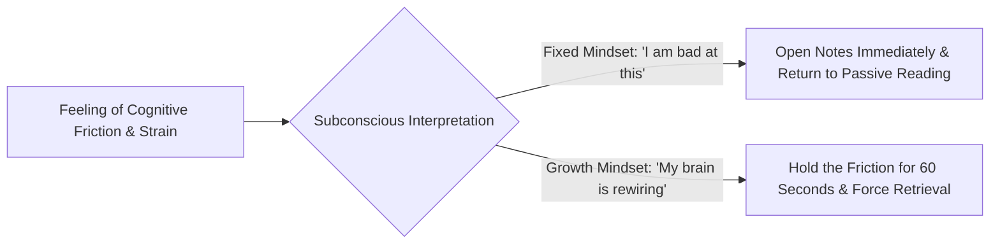

* **Effort is the Engine of Retention**: The harder it is to retrieve a piece of information, the more permanent that memory becomes once successfully reconstructed.
* **Never Peek Prematurely**: When you cannot remember an answer, spend at least **45 to 60 seconds straining your memory** before consulting the reference. That period of strain primes your brain to absorb the correct answer with maximum salience.

---

### The Retrospective Revision Timetable: Eliminating Calendar Guilt

Traditional study planning relies on **prospective timetables** (e.g., *"On Tuesday 4 PM I will study Cardiac Physiology"*). These schedules almost universally fail: unexpected delays occur, tasks take longer than predicted, and falling behind creates demoralizing guilt that triggers avoidance.

The **Retrospective Revision Timetable** flips the planning architecture:
* **The Structure**: The rows are your curriculum topics; the columns are dates on which you completed a retrieval session.
* **The Color-Coded Feedback**: After every active recall session, you score the topic using three objective colors:
  * 🔴 **Red**: Struggled to retrieve core mechanisms; high friction; critical knowledge gaps.
  * 🟡 **Amber**: Retrieved the foundation but stumbled on edge cases or specific details.
  * 🟢 **Green**: Effortless, fluent recall from the blank page.
* **Algorithmic Study Selection**: When you sit down to study, you do not consult an inflexible calendar. You simply scan your matrix and select:
  1. The topic with the **oldest date** (maximum elapsed time / highest forgetting risk).
  2. The topic with **Red or Amber status** (highest marginal return on effort).

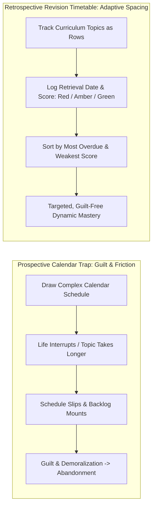

---

### The 1-Bible Scoping Heuristic

A primary driver of study paralysis is **resource saturation**: collecting five textbooks, three question banks, and dozens of video playlists before starting.

* **The 1-Bible Rule**: Select **one canonical textbook or curriculum spine** and designate it as your primary authority. Master that single source until you understand 85–90% of the conceptual terrain.
* **Targeted Infill**: Treat all other textbooks, lecture notes, and video lectures as *supplementary tools* strictly used to clarify specific points where your primary source is ambiguous.
* **Syllabus Scoping**: Before reading a single paragraph, map the entire subject hierarchy from the exam specification. Knowing the structural branches in advance allows working memory to file individual facts into pre-constructed mental shelves.

---

### Interleaved Practice: Breaking Pattern Autopilot

When students practice **blocked study** (solving 30 consecutive problems of Type A, then 30 of Type B), the brain takes algorithmic shortcuts. Because it already knows which formula is required, it skips the most cognitively demanding phase: **problem diagnosis**.

* **The Interleaving Principle**: Mix problem types and conceptual domains within the same study session ($A \to B \to C \to A \to C$).
* **Cognitive Discrimination**: Interleaving forces the brain to analyze each problem from scratch to diagnose *which schema applies*, mimicking the unpredictable environment of an actual exam.

---

### The Action-First Motivation Flywheel

Students frequently wait to "feel motivated" before initiating demanding active recall sessions. In behavioral neuroscience, **motivation is an emotional byproduct of competence, not a biological prerequisite for action**.

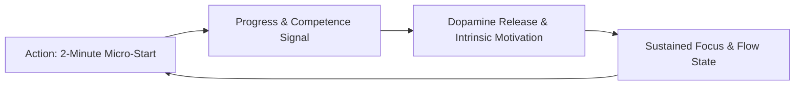

* **The Friction Inversion**: Eliminate startup friction by setting out your materials the night before.
* **The 2-Minute Rule**: Commit to only answering 1 question or writing for 120 seconds. Once the baseline activation energy is breached, the brain's internal dopamine flywheel takes over.

---

### The STic Meta-Framework: The Unified Science of Learning

All evidence-based revision techniques converge into a single four-part operational model—the **STic Framework**:
* **S — Spacing (The Spacing Effect)**: Distribute retrieval across time to interrupt the exponential forgetting curve (Ebbinghaus).
* **T — Testing (The Testing Effect)**: Replace passive review with generative retrieval from scratch against blank paper.
* **i — Interleaving (The Shuffling Effect)**: Alternate between distinct topic schemas within a single study sprint to train diagnostic pattern recognition.
* **c — Categorization (The Schema Multiplier)**: Cluster isolated factual units into hierarchical conceptual trees (chunking) to prevent working memory saturation.

---

### The Essay Memorisation Framework: Modular Rhetorical Architecture

For qualitative, humanities, and descriptive exam papers (e.g. university dissertations or Officer-level descriptive English), students struggle to synthesize dense arguments under time pressure. The **Essay Memorisation Framework** solves this through modular pre-fabrication:
1. **Pre-Constructed Thesis Introductions**: Draft and memorize bulletproof introductory frames containing core definitions, historiographical/economic context, and thesis boundaries. In the exam hall, writing the introduction requires zero creative cognitive load.
2. **Modular Topic Argument Spiders**: Represent each major theme as a radial spider-diagram containing:
   - Primary Thesis & Axiom
   - Empirical / Historical Evidence
   - Critical Counter-Argument / Boundary Condition
   - Concluding Synthesis
3. **Dynamic Re-Combination**: In the exam, an unfamiliar prompt is simply addressed by selecting 3 pre-memorized argument modules and linking them via customized transition sentences.

---

### State-Congruent Retrieval: Circadian & Environmental Inoculation

A frequent tragedy in high-stakes examinations is the student who scores 95% in home practice tests but experiences catastrophic cognitive freezing in the exam hall. In cognitive psychology, this is explained by **Context-Dependent & State-Dependent Memory** (Godden & Baddeley, 1975).

* **The Home Mock Trap**: Practicing mock exams in an air-conditioned bedroom with casual attire, ambient music, snacks, and flexible timing wires memory retrieval to a relaxed biological state.
* **The Circadian & Stress Invariant**: If your actual examination occurs from 9:00 AM to 12:00 PM or 2:00 PM to 5:00 PM in an austere, silent examination hall:
  1. **Clock Synchronization**: Your primary daily 3-hour deep retrieval blocks must be scheduled in the *exact same diurnal time slot* to synchronize biological alertness and metabolic cortisol peaks.
  2. **Environmental Austerity**: Eliminate background music, snacks, and informal seating during mock testing. By conditioning neural pathways to fire under austere, time-pressured conditions, retrieval becomes resilient to exam-day sympathetic nervous system arousal.

---

### The Knowledge Acquisition Equation: Cognitive Batching & The Morning Frog Protocol

In competitive examination preparation, students routinely succumb to the **Labor Illusion**—measuring physical exhaustion and chair-time as proxies for academic progress. A student who spends 12 hours highlighting a textbook feels virtuous, yet performs poorly because recognition memory degrades rapidly under retrieval pressure.

#### 1. The Knowledge Acquisition Efficiency Equation
$$\text{Knowledge Gained} = \text{Information Consumed} \times \text{Cognitive Efficiency}$$

* **The Fallacy of Endurance**: Consider Student 1 who studies for 10 hours at 20% passive efficiency ($10 \times 0.20 = 2.0\text{ effective units}$), compared to Student 2 who studies for 4 hours at 50% active retrieval efficiency ($4 \times 0.50 = 2.0\text{ effective units}$).
* Both acquire identical working knowledge, but Student 1 incurs severe prefrontal metabolic depletion and burnout, while Student 2 maintains cognitive sharpness, physical health, and emotional stamina.
* **The Measurement Dilemma**: Because seat-time is easily quantified, students prioritize hours over efficiency. Elite performance requires optimizing the *efficiency multiplier* rather than brute-forcing the time variable.

#### 2. Information Ingestion vs. Cognitive Digestion
Most students dedicate 95% of their schedule to content ingestion (reading chapters, watching lectures) and 5% to retrieval. This mirrors consuming vast quantities of food without allowing biological digestion: the digestive system bloats, and nutrient absorption plummets.

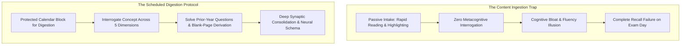

* **The Digestion Time-Block**: Schedule dedicated blocks reserved strictly for *sitting with difficult concepts*. During this time, no new pages are turned; the student interrogates the concept from multiple angles, writes structural answer outlines, and solves previous-year exam questions (PYQs).
* **Parkinson's Law with Built-in Factor of Safety**: Work expands to fill the time allocated to it. If you assign 30 days to finish a standard reference text, the task dilates to consume all 30 days. Instead, calculate your reading velocity:
  $$\text{Target Hours} = \frac{\text{Total Pages}}{\text{Pages per Hour}} \times \text{Safety Factor (1.5–2.0)}$$
  Assigning a strict, bounded time horizon compresses focus and activates heightened prefrontal engagement.

#### 3. Cognitive Context Batching & The 3.5-Hour Ceiling
A pervasive error in multi-stage competitive exam preparation is fragmenting the day across five or six unrelated subjects (e.g., 1 hour Polity, 1 hour Quant, 1 hour History, 1 hour Economy, 1 hour Current Affairs).

* **The Context-Switching Groove Penalty**: Every cognitive pivot forces the brain's executive network to flush working memory and load a new semantic schema. The first 15 to 30 minutes of each switch are squandered in "groove acquisition."
* **The Batching Heuristic**:
  * Limit daily preparation to **2 to 3 subjects maximum**.
  * Group tasks sharing isomorphic cognitive processing styles: pair **Essay Writing with Subjective Answer Synthesis** (both recruit long-form rhetorical networks); pair **Objective MCQs with Daily Current Affairs Fact Triaging** (both recruit rapid discriminatory retrieval).
* **The 3.5-Hour Physiological Ceiling**: Cognitive endurance sharply declines beyond 3 to 3.5 hours of continuous exertion—the exact duration of standard competitive examination shifts in India. Schedule mandatory 30-to-60 minute cognitive resets between major blocks rather than attempting unbroken 6-hour marathons.

#### 4. The Subject Energy Audit & Mark Twain’s Frog Protocol
Not all curriculum topics exert equal metabolic drag. Disregarding personal energy profiles leads to chronic procrastination and study aversion.

* **The Weekly Energy Audit**: For 7 days, log each study block with a simple binary metric:
  * **$(+)$ Energizing / Flow**: High interest, rapid engagement, leaves the mind stimulated.
  * **$(-)$ Draining / High Friction**: Dense, complex, or tedious; demands maximum inhibitory control.
* **The Morning Frog Rule**: As Mark Twain observed, if your job is to eat a frog, do it first thing in the morning. Schedule your most draining, high-friction topic ($(-)$ status) as the **first deep-work block of the day**.
* **Guilt-Free Recovery**: Postponing the "frog" to the evening generates background anxiety that poisons the entire day. Conquering the hardest subject at dawn liberates mental bandwidth, allowing evening relaxation and sleep to be completely guilt-free.
* **Sharpening the Axe**: Lincoln's maxim—*"If I had six hours to chop down a tree, I would spend four hours sharpening the axe."* Physical maintenance is not lost study time; 30 minutes of daily aerobic exercise stimulates brain-derived neurotrophic factor (BDNF) and hippocampal neurogenesis, while daily meditation trains rapid attentional re-anchoring when distractions occur.

---

### The Lobdell Architecture: Stimulus Control, The 30/5 Rule & The 80/20 Recitation Law

In educational psychology, the pioneering work of Professor Marty Lobdell (*Pierce College*) dismantled the conventional myth of unbroken marathon study. His clinical observations identify two primary failure modes among competitive students: **aversive conditioning from uncalibrated endurance** and **subconscious environmental cue contamination**.

#### 1. The 25–30 Minute Drop & The 30/5 Behavioral Reset
* **The Fatigue Threshold**: Empirical tracking of college students indicates that active, high-retention reading comprehension steepens into a sharp decline after **25 to 30 minutes**. Beyond this threshold, reading becomes mechanical eye-tracking without cognitive encoding ("shoveling against the tide").
* **The Aversive Conditioning Trap (The Janette Case Study)**: A student with poor grades commits to studying 6 hours unbroken every evening (6:00 PM to midnight). After the first 30 minutes, she enters an unassimilated cognitive slump. Because her initial 30 minutes of real learning is followed by 5.5 hours of mental misery, the brain applies **operant conditioning**: studying becomes paired with punishment, producing deep avoidance, chronic anxiety, and total academic failure (dropping from 1.0 to 0.0 GPA).
* **The 30/5 Protocol**:
  1. Study with pure focus for 25 to 30 minutes.
  2. The instant comprehension begins to slide, stand up immediately and step away from the study zone.
  3. Spend **5 minutes** engaging in an enjoyable, restorative reward (listening to music, brief physical movement, social interaction).
  4. Return to the desk: attentional capacity resets to nearly 100%.
  5. Conclude the entire day's study block with a substantial, pre-planned primary reward ("the big treat") to operantly reinforce the complete study habit chain.

```mermaid
graph TD
    subgraph SG_1_Lobdell_Cycle ["The Lobdell 30/5 Cognitive Reset"]
        L1["25-30 Min High-Intensity Study Sprint"] --> L2["First Onset of Mental Friction / Drop"]
        L2 --> L3["Immediate 5-Min Reinforcing Break"]
        L3 --> L4["100% Attentional Reset & Next Sprint"]
    end

    subgraph SG_2_Stimulus_Control ["Environmental Stimulus Control"]
        S1["Dedicated Study Lamp ON: Desk Faces Blank Wall"] --> S2["Focused Study Exclusively"]
        S2 --> S3["Distraction / Break -> Lamp OFF & Stand Up"]
        S3 --> S4["Uncompromised Conditioned Focus Reflex"]
    end
```

#### 2. Environmental Stimulus Control ($S^D$) & The Dedicated Study Lamp
Human behavior is governed by environmental discriminative stimuli ($S^D$). In multi-purpose environments (e.g. a bedroom or studio dorm), a desk is surrounded by competing behavioral associations: the bed triggers sleepiness, the doorway triggers socializing, and the screen triggers entertainment.

* **The University of Hawaii Study Lamp Protocol**:
  * Set up a desk facing a blank wall, explicitly turning your back to the bed.
  * Procure a simple desk lamp designated **exclusively as the Study Lamp**.
  * **The Rule**: The lamp is illuminated *only* when actively studying. It is never used for grooming, snacking, checking smartphones, or casual daydreaming.
  * The precise moment concentration wavers or a break begins, **turn the lamp off and leave the chair**.
  * Within 10 to 14 days, classical conditioning establishes the illuminated lamp as a potent psychological cue: turning it on instantaneously primes the prefrontal cortex for deep analytical work without internal conflict.

#### 3. The 80/20 Recitation Law & The Empty-Chair Socratic Method
* **The 80/20 Rule of Memory**: Educational research demonstrates that **80% of effective study time should be spent reciting/retrieving, and only 20% reading**. Students who invert this ratio—spending 80% reading and 20% reviewing—suffer rapid memory extinction.
* **The Socratic Empty-Chair Technique**: Recitation must be active and verbal. Teach the topic to a peer, a family member, or **an empty chair**. 
  * Thinking is largely silent internal speech, which easily conceals false fluency.
  * Speaking out loud forces internal semantic fragments through the motor-speech generation network. The moment you stumble or cannot articulate a concept clearly, your explanatory gap is exposed with surgical precision.

#### 4. The Magazine Recognition Test vs. Generative Recollection
* **The Highlighting Delusion**: Highlighting textbooks produces the dangerous illusion of competence. When reviewing highlighted passages, the text is physically present, evoking effortless sensory recognition.
* **The Magazine Test**: Grab a magazine read months ago and leaf through its pages. Every article and advertisement feels instantly familiar. Yet, if challenged to state what appears on the next page *before* turning it, you will fail completely.
* **The Look-Away Heuristic**: Never proceed to a subsequent concept without closing the text, looking away, and articulating the core mechanism aloud or in writing in your own words. If you cannot explain it independently, you have only recognized it; you have not learned it.

#### 5. The SQ3R System for Non-Fiction Textbooks
Textbooks are dense, non-linear structural knowledge repositories. Reading a textbook from page 1 like a novel is an epistemic disaster.
1. **S — Survey**: Spend 2 to 3 minutes scanning the entire chapter. Inspect section titles, diagrams, charts, bold keywords, and summary tables to map the subject architecture.
2. **Q — Question**: Convert each section heading into an active analytical query before reading (e.g., *"What is an operational concept? How does it differ from a prototype?"*). This primes hippocampal search circuits to seek answers rather than passively absorbing text.
3. **R1 — Read**: Read the text specifically to answer the formulated question.
4. **R2 — Recite**: Close the section immediately and state the answer in your own words without looking.
5. **R3 — Review**: Conduct periodic cumulative recall testing across the chapter to consolidate multi-part schemas.

#### 6. The Post-Lecture 5-Minute Expansion Rule
Lecture notes degrade exponentially within hours. Taking raw jottings home without immediate synthesis guarantees that 50% of personal shorthand will become incomprehensible by evening.
* **The 5-Minute Expansion Rule**: Spend exactly 5 minutes *immediately following a lecture or study sprint* to flesh out raw bullet points, expand shorthand, add clarifying diagrams, and consult peers on ambiguous points. This 5-minute investment yields greater long-term recall than 2 hours of subsequent unassisted cramming.

#### 7. The Associative Mnemonics Triad for Arbitrary Factoids
While structural **Concepts** (functional mechanisms) endure for decades once understood, arbitrary **Facts** (anatomical nomenclature, numerical constants, statutory dates) lack inherent meaning and require artificial cognitive bridges:
* **Acronyms**: Compress multi-part items into a single pronounceable token (e.g., `RADIO` = Right Atrium Deoxygenated; `ROYGBIV` for light refraction).
* **Coined Sayings / Acrostics**: Rhymes or mnemonic sentences where first letters map sequentially to complex orders (e.g., cranial nerves).
* **Interacting Concrete Images**: Couple abstract numbers or facts to vivid, bizarre mental imagery (e.g., associating carbohydrates with a car having 4 wheels $\to$ 4 kcal/g; associating dietary fat with a fat cat possessing 9 lives $\to$ 9 kcal/g).

---

### The Core Takeaway to Remember
> High-yield learning is not a contest of endurance; it is a discipline of cognitive retrieval. Multiply your retention windows through segmented sessions, chunk complex details into unified schemas, anchor ideas visually, and test your mind against the blank page.

