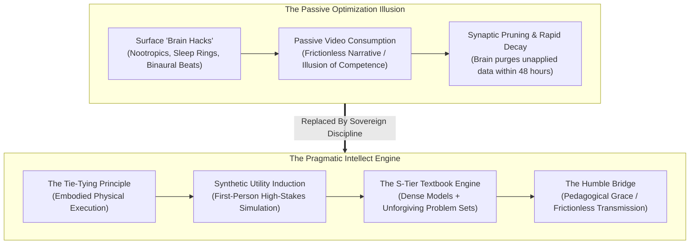
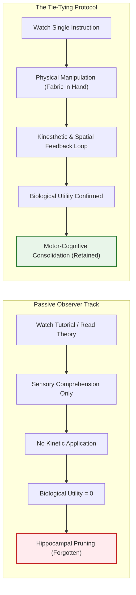
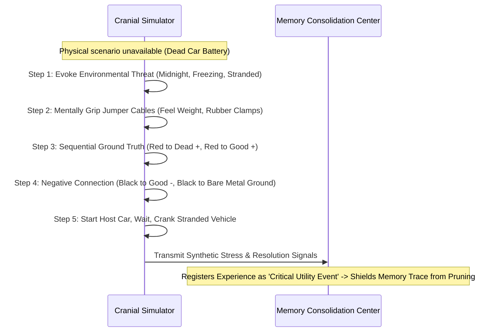
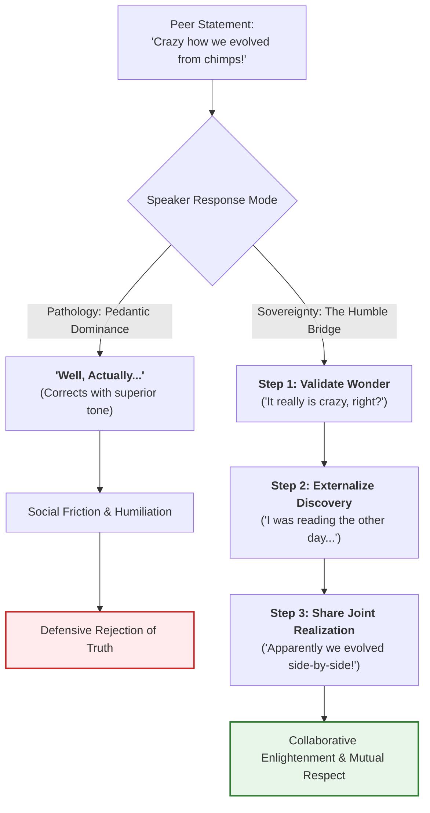

The modern culture of self-improvement has reduced intellectual development to an aesthetic farce. 

In place of disciplined inquiry and rigorous problem-solving, the contemporary seeker is inundated with passive biological micro-optimizations: consuming organic blueberries for anthocyanins, timing caffeine intake to circadian cortisol curves, tracking rapid eye movement sleep through wearable rings, and listening to Baroque string concertos in the hope of passive neurological priming. 

While baseline physiology undeniably supports neural function, **none of these interventions actually teach you anything**. You can hydrate with surgical precision, maintain immaculate sleep hygiene, and still remain functionally illiterate in the foundational laws of economics, engineering, rhetoric, and physics.



True intelligence is not a genetic lottery, nor is it a theoretical abstraction measured by artificial puzzle tests. Pragmatic intellect consists of three operational capabilities:
1. **The rapid acquisition of high-leverage mental models and actionable skills** that generate tangible value.
2. **The capacity to solve non-trivial problems under genuine uncertainty and resource constraints.**
3. **The communicative grace to articulate insights with humble clarity**, lifting others without triggering status-driven defensive hostility.

---

### The Biological Utility Filter & The Tie-Tying Principle

The human brain represents approximately 2% of total body mass while consuming nearly 20% of its basal metabolic energy. Because glucose and oxygen are biologically expensive, evolution has equipped the central nervous system with an aggressive **Synaptic Pruning Engine**.

If the brain cannot identify an immediate, survival-relevant, or operational utility for a newly encountered datum, the hippocampus tags the synaptic trace as disposable noise and purges it during the subsequent slow-wave sleep cycle.



This biological invariant yields **The Tie-Tying Principle**:
> *“No one ever learned how to tie a necktie merely by watching someone tie a necktie. You only learn how to tie a necktie by watching someone tie a necktie while physically tying a necktie.”*

When you observe an expert manipulating silk fabric across a video screen, your visual cortex fires and your mirror neurons simulate the arc. You experience the **Fluency Illusion**: because the movement appears smooth and obvious, your conscious mind asserts that it possesses the skill. 

However, the moment you close the screen and grasp the cloth, your fingers fumble. The spatial orientation is inverted, the tension is uncalibrated, and the knot collapses. 

Mastery requires closing the **Kinetic-Feedback Loop**:
- Reading about cleaning a room must immediately terminate in cleaning a physical room.
- Reading about financial accounting must immediately terminate in building a three-statement financial model in a spreadsheet.
- Reading about code architecture must immediately terminate in compiling an executable script.

Unless the motor cortex and executive decision centers are physically enlisted, the brain treats the input as abstract entertainment and erases it.

---

### Synthetic Utility Induction: The Simulation Engine

What occurs when immediate physical enactment is impossible? 

Consider an individual reading an automotive repair manual illustrating how to jump-start a dead vehicle using jumper cables. Very few people keep two automobiles and a drained battery in their living room to practice on demand. 

Under passive reading, this diagram is forgotten within three days. When a genuine battery failure strikes in a freezing parking lot months later, the person stands paralyzed, terrified of causing an electrical fire or exploding the battery.



The solution is **Synthetic Utility Induction (First-Person Cognitive Simulation)**:
1. **Evoke Environmental Threat & Sensory Grounding**: Close the text and project yourself into the visceral reality of the scenario. Feel the sub-zero wind against your knuckles; visualize the dim amber glow of the failing dashboard lights.
2. **First-Person Rehearsal**: Do not picture yourself from a third-person cinematic perspective; look *through your own retinas*. Mentally extend your hands, grip the heavy rubber-coated clamps, identify the red plastic positive terminal marked with corrosion, clamp it firmly, then walk to the operational vehicle.
3. **Trace the Grounding Protocol**: Mentally identify an unpainted metal bolt on the vehicle chassis far away from the battery, connect the black negative clamp, hear the snap of the jaws, and simulate turning the ignition key.
4. **The Neurological Payoff**: The prefrontal cortex and hippocampus do not distinguish between vivid, sensorially grounded first-person simulation and physical experience. By forcing your neural circuitry to execute the complete operational sequence under simulated high stakes, you trick the brain into registering the procedure as life-critical utility, shielding it from synaptic deletion.

---

### The Conversational Humble Bridge: Teaching Without Humiliation

Intellectual growth often introduces a toxic social pathology: **conversational arrogance**. 

The novice who has just digested a popular science book or historical analysis develops an irresistible urge to display dominance. The moment a colleague or friend voices an everyday misconception, the insecure intellectual strikes:

> *"Crazy how we evolved from chimpanzees, right?"*  
> **The Pedantic Blunder**: *"Well, actually, evolution is non-linear, and several hominin species inhabited Earth simultaneously, none of which could remotely be classified as chimpanzees."*

While technically accurate, opening with *"Well, actually..."* is conversational poison. It signals social deafness and transforms an informal dialogue into an intellectual courtroom where the other person is sentenced to looking ignorant. The listener instantly erects emotional defenses, disregards the factual correction, and marks the speaker as obnoxious.



The antidote is **The Humble Bridge**:
1. **Validate the Emotional Core**: Acknowledge the curiosity or wonder behind the observation (*"It really is crazy to think about, right?"*).
2. **Externalize the Knowledge Source**: Do not position yourself as the supreme authority. Introduce the insight as a serendipitous, recent discovery from an outside source (*"You know, I was reading about this the other day and it blew my mind..."*).
3. **Frame the Correction as a Shared Realization**: Present the fact as something you also recently had to unlearn, placing yourself on the same intellectual plane as the listener (*"I always thought we descended straight from them too, but apparently chimpanzees and humans are more like cousins who evolved side by side from a common ancestor millions of years ago."*).

The Humble Bridge achieves the holy grail of communication: **it transmits precise truth, elevates the listener’s understanding, and deepens social trust without eliciting defensive recoil.**

---

### The Epistemic Division: Fiction vs. Non-Fiction Allocation

High-yield readers maintain an intentional division of labor between imaginative literature and structural non-fiction:

| Dimension | Fiction Architecture | Non-Fiction Architecture |
| :--- | :--- | :--- |
| **Primary Cognitive Engine** | Visual rendering, narrative parsing, theory of mind | Conceptual frameworks, causal mechanics, invariant laws |
| **Linguistic Function** | Expands descriptive vocabulary, conversational cadence, rhythmic syntax | Injects domain-specific technical models and analytical terminology |
| **Empathy & Theory of Mind** | Simulates alien psychologies, subtext, and conflicting human motives | Deconstructs systemic structures, incentives, and empirical data |
| **Pacing & Speed** | Trains rapid visual scanning, verbal velocity, and narrative immersion | Demands intermittent pauses, active retrieval, and marginal synthesis |
| **Optimal Daily Ratio** | 20–30% (Evening decompression / Linguistic conditioning) | 70–80% (Prime cognitive hours / Practical skill acquisition) |

Fiction conditions the **linguistic instrument**—teaching the mind how words dance, how dialogue flows, and how subtle motives operate beneath words. Non-fiction builds the **conceptual arsenal**—providing the structural models necessary to analyze economies, organize systems, and solve material problems.

---

### The S-Tier Textbook Engine: Zero Fluff, Uncompromising Friction

The digital ecosystem has commodified learning into frictionless, high-dopamine media. Video essays, animated book summaries, and podcast roundtables promise effortless mastery in ten minutes. 

Yet their primary product is an **illusion of competence**. Because the viewer encounters zero friction, no active recall, and no algorithmic derivation, retention evaporates within hours.


The undisputed **S-Tier format for genuine intellectual acceleration is the standard academic textbook**.

#### Why Textbooks Dominate All Other Media:
1. **Elimination of Fluff and Narrative Posturing**: Trade books often stretch a single 15-page essay into a 300-page volume using repetitive anecdotes and journalistic padding. Textbooks prioritize information density, defining axioms, boundary conditions, and mechanics with mathematical or analytical precision.
2. **Structural Problem Density**: A rigorous textbook does not merely present assertions; it punctuates every chapter with 20 to 50 progressive, non-trivial problems designed to expose subtle misunderstandings.
3. **The Appendix Protocol**: The answers in a genuine textbook are sequestered in the back (e.g., Appendix C, Page 640). This mechanical separation forces the learner into the **Crucible of Retrieval**: you must battle the problem on blank paper, exhausting your analytical schemas before you are permitted to verify the solution.

When you master a subject through an S-tier textbook, you do not possess mere opinions about a field; you possess its underlying generative mechanics.

---

### Operational Synthesis: The Pragmatic Intellect Protocol

To convert this chapter into actionable intellectual habit:

```
[PRAGMATIC INTELLECT ACTION CHECKLIST]
├── 1. The Embodied Practice Check
│   └── Never consume a procedural chapter without an object or canvas in hand.
│   └── If reading code, open the terminal; if reading finance, open the spreadsheet.
├── 2. The Synthetic Simulation Protocol
│   └── For abstract or dangerous procedures, execute a 60-second first-person mental trial.
│   └── Visualize the physical environment, feel the equipment, and step through the failure modes.
├── 3. The Conversational Humble Bridge
│   └── Ban "Well, actually" from your vocabulary entirely.
│   └── Validate curiosity -> Externalize the source -> Share the finding as mutual wonder.
└── 4. The S-Tier Textbook Immersion
    └── Replace 3 hours of passive video essays each week with 60 minutes of textbook problem solving.
    └── Always derive the solution on paper before inspecting the appendix.
```
