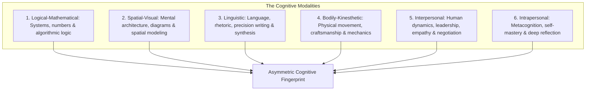
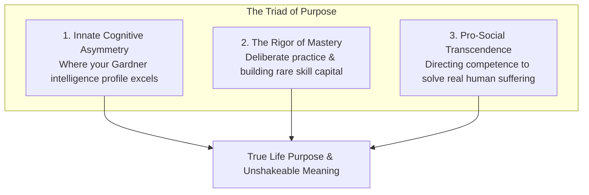
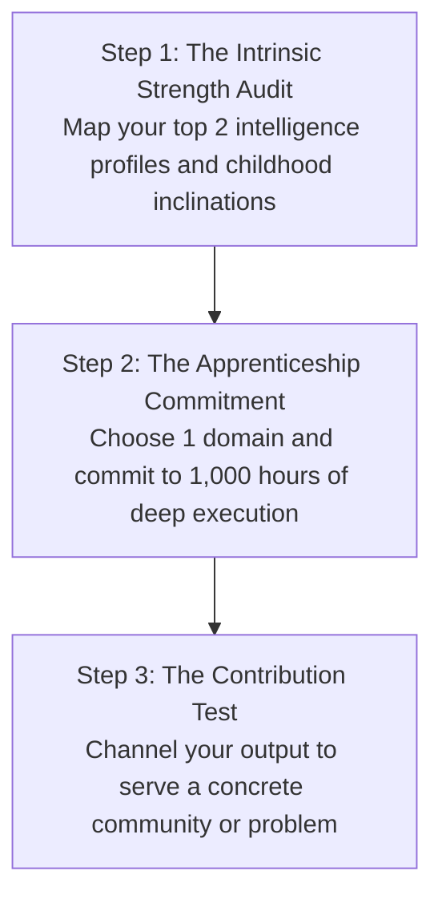
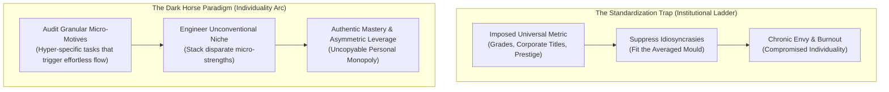
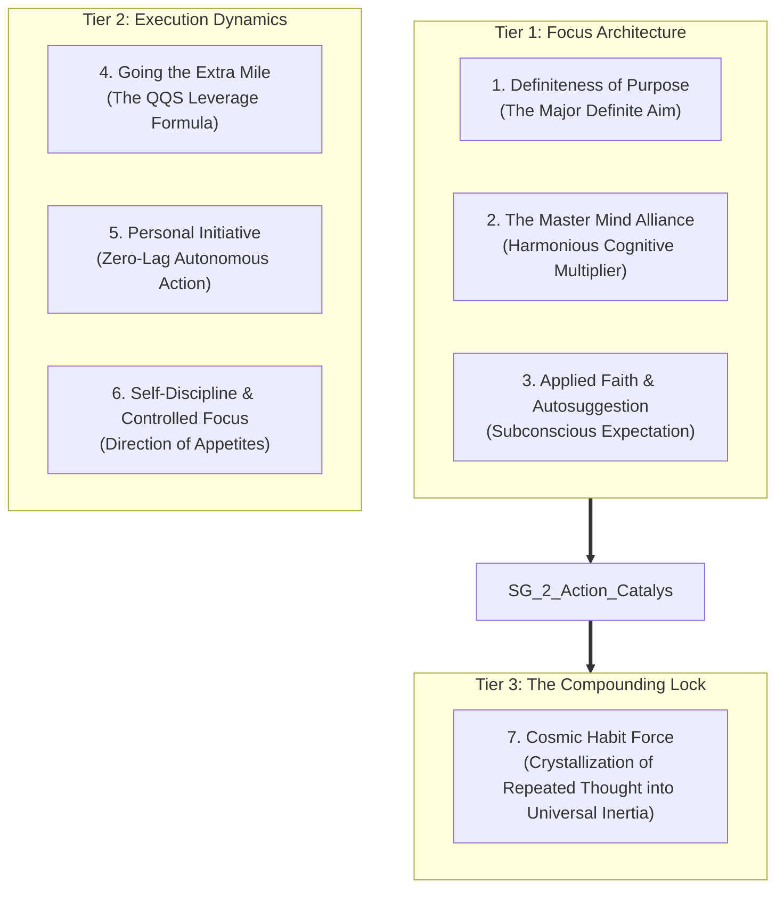

The dominant cultural myth regarding human potential is the **"Passion Myth"**: the romantic idea that purpose is a fully formed, pre-packaged treasure waiting to be discovered in an instant flash of divine inspiration.

In cognitive psychology and the science of expertise, **purpose is not discovered; purpose is constructed through deliberate mastery and pro-social contribution**.

When you wait around to "find your passion" before you commit to hard work, you become a victim of the **Consumer Mindset**. High performers operate under the **Craftsman Mindset**: they identify their unique cognitive inclinations, endure the rigorous apprenticeship of skill acquisition, and allow genuine passion and purpose to emerge as the natural byproduct of rare competence.

---

### The Passion Trap vs. The Craftsman Mindset

* **The Fallacy of Premature Passion**: Passion does not precede competence. When you are a complete beginner at a difficult craft, everything feels clumsy and frustrating. If you rely on passion to sustain you, you will quit the moment friction arises.
* **The Competence-Purpose Sequence**: Autonomy, mastery, and purpose are rewards earned after you build rare and valuable skills that the world desperately needs.

---

### Decoding Your Primal Inclinations (The Mastery Archetype)

In his landmark work *Mastery*, author Robert Greene demonstrated that every human mind possesses **Primal Inclinations**—subtle, innate affinities that surfaced in early childhood before parental and societal conditioning imposed external expectations.

* **The Childhood Marker**: What subjects, objects, or activities fascinated you before you cared about money, grades, or peer status? Did you build physical structures, dissect systems, tell stories, draw maps, or organize groups?
* **The Return to the Root**: Reconnecting with your primal inclinations provides the authentic fuel required to sustain decades of deliberate practice without burning out.

---

### The Spectrum of Multiple Intelligences

Formulated by developmental psychologist Dr. Howard Gardner in *Frames of Mind*, intelligence is not a single linear metric (IQ). Human cognitive architecture encompasses distinct modalities:

1. **Logical-Mathematical**: Mastery of abstract reasoning, quantitative relations, and complex systematic problem-solving.
2. **Spatial-Visual**: The ability to manipulate 3D models mentally, design visual schemas, and navigate complex topologies.
3. **Linguistic**: Precision with words, dialectic arguments, structured synthesis, and compelling narrative delivery.
4. **Bodily-Kinesthetic**: Physical coordination, fine motor dexterity, and physical craftsmanship.
5. **Interpersonal**: Deep sensitivity to others' motivations, group dynamics, and conflict resolution.
6. **Intrapersonal**: Intense self-awareness, emotional regulation, and metacognitive clarity.

---

### The Triad of Durable Purpose

1. **Cognitive Alignment**: Aligning your daily work with your natural intelligence profile so that learning feels frictionless and intuitive.
2. **The Rigor of Mastery**: Committing to the unglamorous, repetitive grind of foundational skill acquisition over years.
3. **Pro-Social Transcendence (Service)**: Purpose is only fully unlocked when mastery is directed outward. As long as your goals are purely selfish (more wealth, higher status), the brain remains vulnerable to existential dread. When your craft alleviates real suffering or solves critical problems for others, meaning becomes unbreakable.

---

### The 3-Step Protocol for Constructing Purpose

1. **The Intrinsic Strength Audit**: Review Gardner's modalities and identify the two where your learning speed is 3x faster than average.
2. **The 1,000-Hour Apprenticeship**: Pick one specific domain aligned with those modalities. Refuse to change domains for at least 1,000 hours of focused study and building.
3. **The Contribution Test**: Never ask *"What can the world give me?"* Ask *"What rare value can my craft give to the world?"*

---

### The Dark Horse Paradigm: Harnessing Idiosyncratic Micro-Motives
In *Dark Horse: Achieving Success Through the Pursuit of Fulfillment*, Harvard developmental psychologist Dr. Todd Rose studied individuals who achieved extraordinary mastery by unconventional, non-linear routes. Their shared operating principle dismantles the industrial "Standardization Trap":

#### 1. Know Your Micro-Motives
Most people define their motivation in generic abstractions: *"I want to help people"*, *"I want to be creative"*, or *"I want to be financially free"*. Dark Horses drill down into **micro-motives**—hyper-specific, visceral reactions to tiny elements of tasks:
* Not *"I like coding"*, but *"I love tracking down subtle race conditions in concurrent data structures."*
* Not *"I like teaching"*, but *"I get a chemical rush when turning an intimidating 50-page paper into a crystal-clear 1-page visual framework."*

#### 2. Ignore the Destination, Master the Immediate Vector
Standardized paths force you to fixate on a 10-year destination (Partner at law firm, Director of Engineering), blinding you to whether the daily process matches your neurological wiring. Dark Horses choose opportunities that offer the highest alignment with their micro-motives *right now*, developing deep mastery that unlocks unanticipated high-leverage doors later.

---

### The Master Key Architecture: Hill's Laws of Achievement (1954)

Synthesizing over 25 years of fieldwork studying hundreds of history's most prolific industrialists (Andrew Carnegie, Thomas Edison, Henry Ford), **Napoleon Hill** codified the mechanical laws governing personal achievement (*Napoleon Hill's Master Key*). Strip away mystical misunderstandings, and Hill's system operates as a **cybernetic feedback loop for human volition**:

#### 1. Definiteness of Purpose: The Laser vs. The Lamp
Hill observed that 98 out of 100 people live in perpetual drift. They possess wishes, daydreams, and vague hopes, but **zero definite purpose**:
> *"Definiteness of purpose is the starting point of all achievement. Weak desires bring weak results, just as a small amount of fire brings a small amount of heat."*

* **The Mechanism**: When the human mind is presented with a singular, non-negotiable **Major Definite Aim**, the Reticular Activating System (RAS) reorganizes perception. Opportunities, texts, conversations, and ideas that were previously invisible suddenly stand out in high contrast.
* **The Elimination of Choice Friction**: Indecision is a metabolic hemorrhage. A fixed, written purpose acts as an automatic binary filter: does this action accelerate my Major Definite Aim? If yes, execute; if no, discard immediately.

#### 2. The Master Mind Principle: Multi-Brain Symbiosis
No individual mind is complete unto itself. Carnegie attributed 100% of his steel monopoly to his Master Mind group:
* **The Definition**: The coordination of knowledge and effort in a spirit of **absolute harmony** between two or more minds for the attainment of a definite purpose.
* **The "Third Mind" Phenomenon**: Just as connecting electrical batteries in series produces a voltage greater than any single cell, harmonious intellectual collaboration creates an emergent cognitive field. Creative problems that stonewall an isolated operator surrender rapidly to the fused intellectual leverage of aligned allies.

#### 3. The Law of Going the Extra Mile: The QQS Formula
The consensus instinct in employment, study, and market exchange is transactional: *"How little work can I get away with for the current reward?"* Hill inverted this with the **QQS Formula**:
$$\text{Compounding Leverage} = \text{Quality} + \text{Quantity} + \text{Spirit of Service}$$
* **Rendering More Service than Paid For**: When you consistently deliver greater quality and quantity than expected—and do so with an ungrudging, proactive spirit—you trigger the law of increasing returns. You become structurally irreplaceable, creating asymmetric upside in reputation and authority.

#### 4. Cosmic Habit Force: The Universal Inertia of Mastery
The ultimate culmination of Hill's system is **Cosmic Habit Force**—nature's universal law of inertia applied to human consciousness:
* **The Crystallization of Habit**: In the beginning, establishing a 12-hour study cadence, waking early, or maintaining ruthless focus feels like pushing a boulder uphill. You must fight your limbic instincts with voluntary will.
* **The Inertial Handover**: Hill noted that nature abhors a vacuum and abhors perpetual friction. If you enforce a voluntary pattern long enough, **Cosmic Habit Force takes over**. The behavior moves from conscious friction to automated subconscious nature. Once habit force locks in, continuing elite performance requires less effort than stopping.

---

### The Core Takeaway to Remember
> Stop waiting for purpose to strike you like lightning. Purpose is not found; it is forged. Identify your unique cognitive strengths, embrace the quiet discipline of mastery, dedicate your skills to something larger than yourself, and let meaning be the natural fruit of your devotion.
