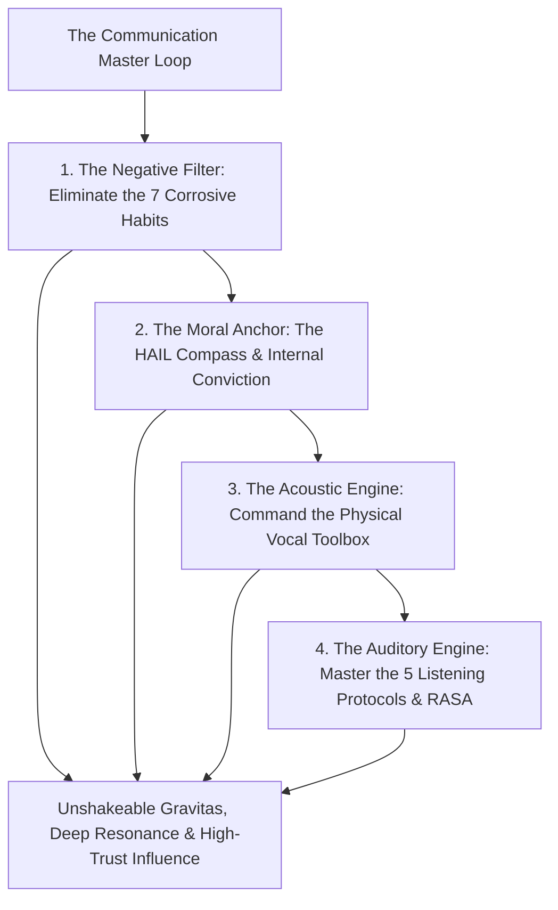
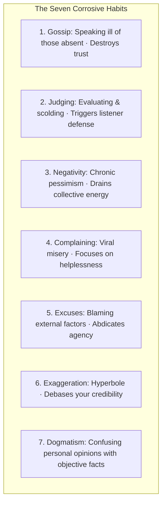
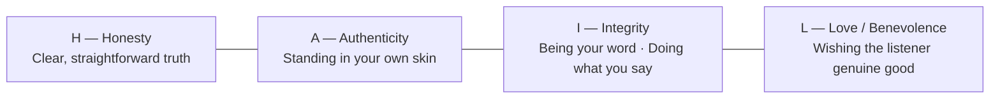
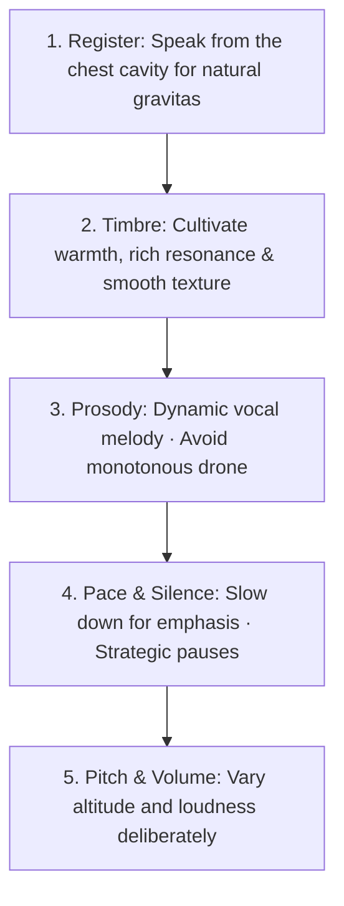
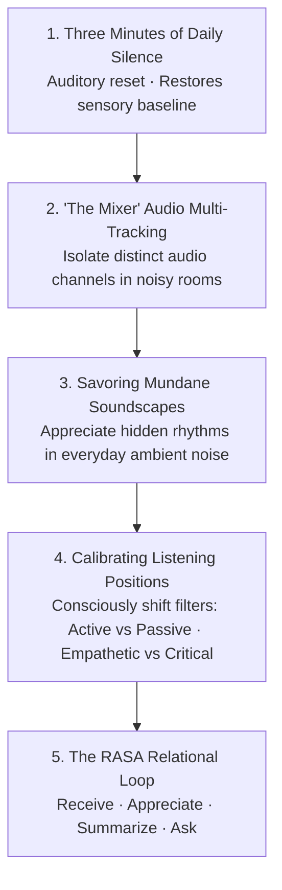

The human voice is the most powerful instrument on earth. It is the sole medium that can start a war, declare love, inspire a generation, or dismantle a career.

Yet, most people move through life completely unaware of the **acoustic, psychological, and relational resonance** of their speech. They obsess over superficial vocabulary while leaking credibility through lack of conviction, or they listen passively without engagement.

When you master the **Architecture of Resonance**, you eliminate corrosive conversational habits, anchor your speech in **Internal Conviction**, calibrate the physical vocal instrument, and master the **Five Daily Protocols of Conscious Listening**.

---

### The Architecture of Powerful Communication



---

### The Law of Internal Conviction & Humanizing Shortcomings

```mermaid
graph LR
    subgraph The Incongruence Trap (Weakness)
        P1[Performative Vocabulary / Polish] 
        --> P2[Internal Self-Doubt / Faking] 
        --> P3[Audience's Incongruence Radar Alerts · Trust Dies]
    end

    subgraph The Conviction Engine (Mastery)
        C1[Unshakeable Internal Belief] 
        --> C2[Transparently Humanize Shortcomings] 
        --> C3[Raw Resonance, Authenticity & Deep Respect]
    end
```

1. **The Incongruence Radar**: Human beings possess an evolutionary biological radar for authenticity. If you do not believe in the truth and weight of your message, no amount of polished vocabulary, expensive accent training, or corporate buzzwords will persuade the listener.
2. **Language is Secondary to Transmission**: Fluency is merely the vehicle; **conviction and emotional clarity are the engine**. A speaker using simple, unpretentious words delivered with total conviction commands vastly more authority than a nervous speaker hiding behind dense jargon.
3. **The "Humanize the Shortcoming" Protocol**:
   * When you encounter a limitation—a lack of specialized vocabulary, language friction, or an incomplete dataset—**never fake competence or posture**.
   * Transparently name and humanize the gap: *"I am still mastering the technical terminology of this domain, but here is the core empirical dynamic."*
   * Openly acknowledging a limitation instantly disarms audience skepticism, projects supreme inner confidence, and converts vulnerability into trust.

---

### The Seven Corrosive Habits of Speech

Before you can speak with power, you must systematically eliminate the seven subconscious behaviors that cause people to close their ears:



1. **Gossip**: Speaking poorly of someone who is not present. While it offers a cheap, 2-minute hit of bonding, the listener immediately realizes: *"If they speak this way about others, they speak this way about me when I leave."*
2. **Judging**: Infusing your tone with moral superiority or scrutiny, which instantly puts the listener on the psychological defensive.
3. **Negativity**: Viewing every event through a lens of disaster, broadcasting exhausting emotional friction.
4. **Complaining**: Spreading viral misery without proposing a constructive solution.
5. **Excuses**: Shifting blame to circumstances or other people, signaling an absence of personal sovereignty.
6. **Exaggeration**: Inflating numbers, emotions, or claims. Hyperbole devalues your words like counterfeit currency; eventually, no one trusts your baseline statements.
7. **Dogmatism**: Bombarding the room with personal opinions disguised as undeniable cosmic facts, leaving zero space for collaborative dialogue.

---

### The HAIL Compass: The Four Cornerstones of Resonance

To speak in a way that moves people and stands the test of time, anchor your internal posture in the four cornerstones of **HAIL**:



* **Honesty (Clear Truth)**: Speaking what is real and true, tempered with wisdom (honesty without love is cruelty; love without honesty is sentimentality).
* **Authenticity (Grounded Self-Possession)**: Shedding performative costumes. People have an uncanny biological radar for phoniness; they relax only when they feel you are comfortable in your own skin.
* **Integrity (The Iron Word)**: Absolute alignment between what you say and what you do. When your word is an unbreakable contract, your speech carries immense natural weight.
* **Love / Benevolence (Service Orientation)**: Entering every dialogue with a genuine desire to bring value, clarity, and well-being to the listener rather than trying to extract validation.

---

### The Vocal Instrument Toolbox (Physical Mechanics)

Your voice is a physical wind instrument. Commanding its acoustic properties transforms ordinary words into resonant communication:



1. **Register (The Seat of Authority)**: Speaking from the throat or nose produces a thin, anxious sound. Speaking from the **chest cavity** deepens your natural register, broadcasting calm biological authority and emotional groundedness.
2. **Prosody (The Music of Meaning)**: Avoid the monotonic flatline that puts listeners to sleep, as well as the juvenile habit of "uptalk" (ending statements with a rising pitch as if asking for permission). Use natural melodic variation.
3. **The Power of the Strategic Pause**: The amateur fears silence and fills gaps with nervous filler words (*"um," "uh," "like," "you know"*). The master embraces the **intentional pause**. A 2-second silence before answering a difficult question signals deep processing, commands total attention, and triples the weight of your words.

---

### The Five Daily Protocols for Conscious Listening

We retain only 25% of what we hear because we live in an increasingly noisy world that fosters passive listening. To restore sensory precision and relational power, train the **Five Listening Protocols**:



1. **Three Minutes of Daily Silence**: Spend 3 minutes every morning in total silence. This acts as an acoustic palate cleanser, recalibrating your auditory cortex to perceive subtle nuances in human speech.
2. **"The Mixer" (Auditory Multi-Tracking)**: In a coffee shop or bustling office, close your eyes and isolate individual sound streams (the hum of the espresso machine, the murmur of the table to your left, the footsteps outside). This dramatically improves your executive focus in complex environments.
3. **Savoring Mundane Soundscapes**: Train aesthetic attention by listening to mundane noises (the rhythm of rain, the hum of air conditioning) as ambient music.
4. **Calibrating Listening Positions (Filter Awareness)**:
   * Most people listen through a fixed, subconscious filter (often critical or defensive).
   * High-agency communicators deliberately shift their listening posture to match the moment:
     * *Empathetic Mode*: Listening purely to understand emotional reality without solving.
     * *Critical Mode*: Listening with epistemic precision to analyze logic and data.
     * *Expansive Mode*: Listening to discover unexpected opportunities and synergies.
5. **The RASA Relational Framework**:
   * **R — Receive**: Turn your torso toward the speaker, make steady eye contact, and eliminate all screens.
   * **A — Appreciate**: Provide subtle micro-signals (*"hmm,"* slight nods) confirming the message is landing.
   * **S — Summarize**: Use the golden bridge: *"So what you're saying is [Core Essence]—is that accurate?"*
   * **A — Ask**: Ask open-ended questions that uncover deeper root causes.

---

### The 6-Step Daily Vocal Conditioning Protocol

Before any high-stakes meeting, interview, or presentation, tune your physical instrument in 2 minutes:

1. **Arms Up & Deep Exhale**: Stretch upward, inhale deeply into the belly, and sigh out with an *"Ahhh"* to release trapped thoracic tension.
2. **Lip Flutter / Trill**: Gently vibrate your lips together (*"Brrr"*) from low pitch to high pitch to warm up vocal cord elasticity.
3. **Tongue Stretch**: Extend your tongue out and upward to release tension at the base of the throat.
4. **The Siren Glide**: Glide smoothly on an *"Oooo"* sound from your lowest chest note to your highest head note and back down.
5. **Jaw Release**: Massage the masseter muscles of your jaw while humming softly.
6. **Consonant Crispness**: Rapidly enunciate *"Ba-Da-Ga-Ta-Ka-Pa"* to sharpen articulatory precision.

---

### The Core Takeaway to Remember
> How you speak determines how the world listens; how you listen determines what the world reveals. Speak with the undeniable fire of internal conviction, humanize your shortcomings with quiet pride, ground your voice in the resonance of the chest, and master the art of conscious listening.
