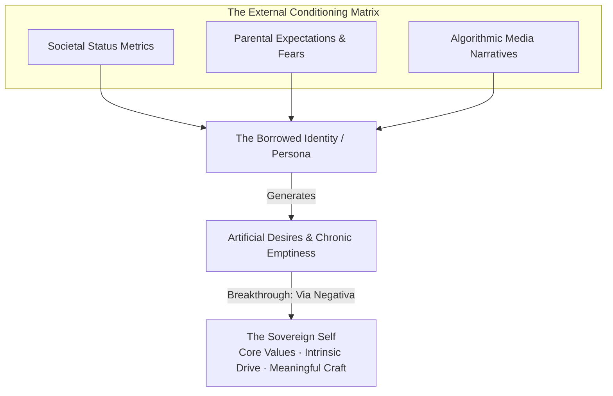
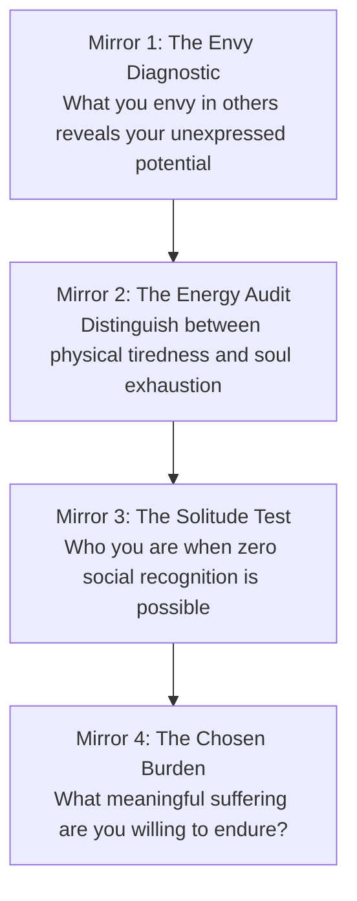
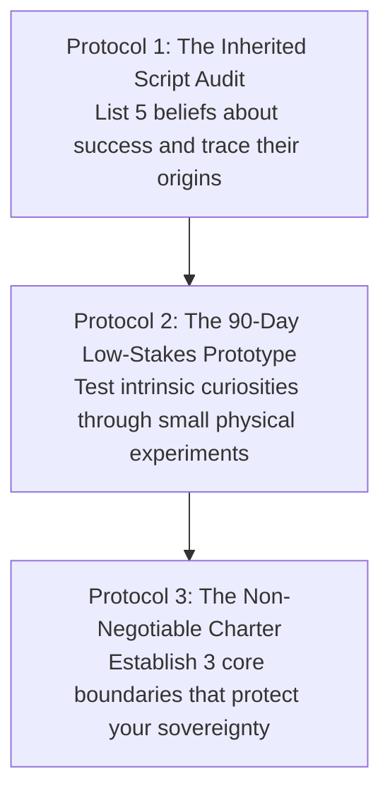

Most human beings do not live their own lives; they live **borrowed lives**.

From childhood, the human nervous system absorbs inherited scripts: parental anxieties, cultural definitions of success, peer status competitions, and algorithmic media trends. By adulthood, most people mistake these external pressures for their own authentic desires. They spend decades climbing ladders of career, status, and consumption, only to discover upon reaching the top that the ladder was leaning against the wrong wall.

"Finding yourself" is not a mystical cliché or an exercise in passive daydreaming. In cognitive psychology and existential philosophy, **self-discovery is an active process of subtractive elimination (*Via Negativa*) and empirical testing**.

---

### The Anatomy of the Borrowed Self

* **The Persona Trap**: Carl Jung termed the social mask we wear the *Persona*. When you over-identify with your persona (e.g., "the high achiever," "the agreeable child," "the corporate climber"), your true intrinsic values atrophy from disuse.
* **The Existential Cost**: Living a borrowed life produces a chronic, low-grade existential nausea—the subconscious mind registers that all your daily sacrifices are servicing someone else's script.

---

### The Via Negativa of Self-Discovery

In philosophy, *Via Negativa* (the negative way) states that we understand what something is by stripping away what it is not. You do not "find" yourself by adding more identities, titles, or possessions; you find yourself by **stripping away inherited conditioning**.

---

### The Four Reality Mirrors of Self-Knowledge

To uncover what is genuine within you, examine yourself through four objective psychological diagnostic mirrors:

#### 1. The Envy Diagnostic (The Unexpressed Compass)
* Society treats envy as a moral sin. In metacognitive psychology, **envy is a distorted compass**.
* When you feel a sharp pang of envy toward someone, do not suppress it. Audit it: *“What exact aspect of their freedom, mastery, or lifestyle triggered this reaction?”* Envy points directly to uncultivated desires you have denied in yourself.

#### 2. The Autonomic Energy Audit
* Pay close attention to your physiological state during different activities:
  * **Generative Fatigue**: Hard, demanding work that leaves you physically tired but deeply calm and satisfied.
  * **Depletive Exhaustion**: Easy, shallow busywork that leaves you drained, irritable, and anxious.
* Your nervous system cannot be fooled by prestige; follow the activities that produce generative fatigue.

#### 3. The Solitude Mirror
* Ask yourself: *“If I could never post about my work, tell my peers about my accomplishments, or receive public applause, what would I still choose to study, build, and master?”*
* The answer to that question isolates your **intrinsic craft** from your performative vanity.

#### 4. The Chosen Burden (Logotherapy)
* Life involves unavoidable struggle and friction. Finding yourself is not finding a life free of pain; it is finding the **specific form of difficulty and responsibility you are glad to bear**.
* As Viktor Frankl noted, human beings do not need a tensionless state; they need the striving and struggling for a worthwhile goal chosen freely.

---

### The Protocols for Sovereign Self-Alignment

1. **The Inherited Script Audit**: Write down your top 5 beliefs about career, wealth, and lifestyle. For each, ask: *“Did I arrive at this through firsthand experience and deep reason, or did I unconsciously inherit it from my environment?”*
2. **The 90-Day Low-Stakes Prototype**: Never make impulsive, dramatic life pivots based on abstract theories. Build small, low-risk prototypes of your authentic interests (e.g., write 10 essays, solve 50 domain problems, build 1 prototype) for 90 days before making major commitments.
3. **The Sovereign Charter**: Establish 3 absolute personal boundaries that you refuse to compromise for status, money, or social approval.

---

### The Core Takeaway to Remember
> Life does not begin when you satisfy society's expectations; life begins when you stop living someone else's script. Strip away the borrowed desires, audit your true energy, choose the burdens worthy of your devotion, and build your life upon the unshakeable rock of your own authentic nature.
