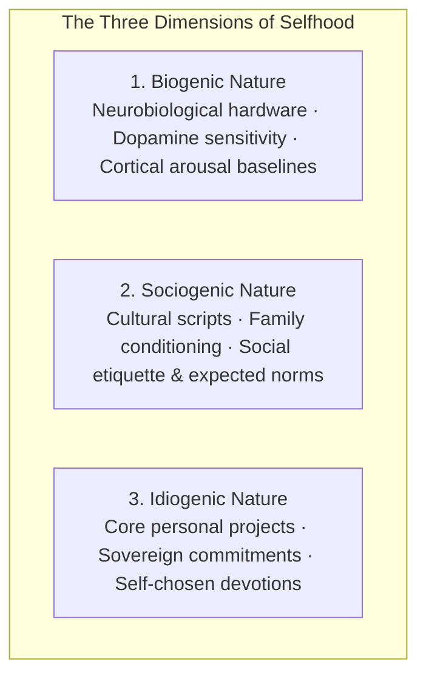
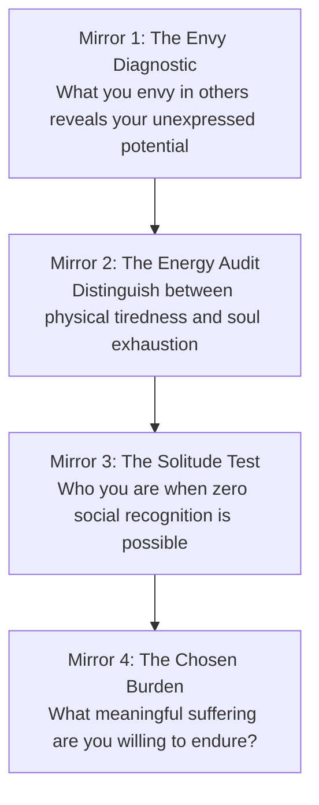
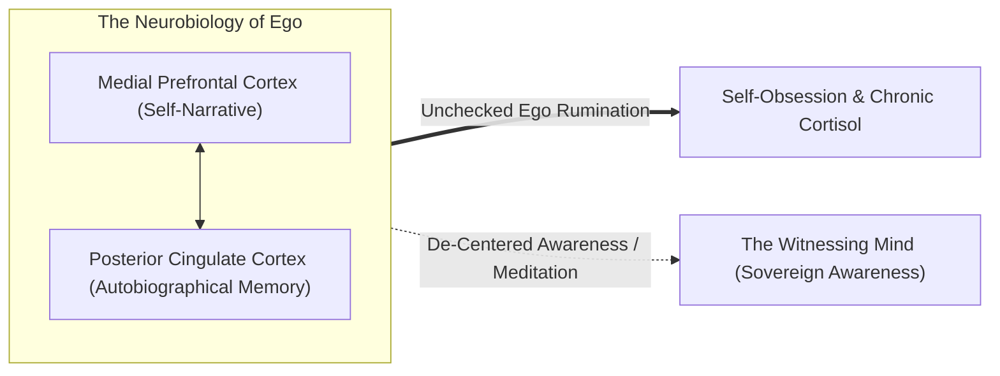
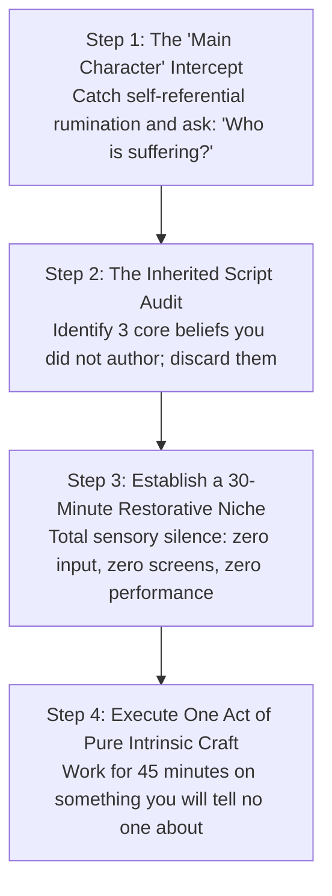

Most human beings do not live their own lives; they live **borrowed lives**.

From childhood, the human nervous system absorbs inherited scripts: parental anxieties, cultural definitions of success, peer status competitions, and algorithmic media trends. By adulthood, most people mistake these external pressures for their own authentic desires. They spend decades climbing ladders of career, status, and consumption, only to discover upon reaching the top that the ladder was leaning against the wrong wall.

"Finding yourself" is not a mystical cliché or an exercise in passive daydreaming. In cognitive psychology and existential philosophy, **self-discovery is an active process of subtractive elimination (*Via Negativa*) and empirical testing**.

```mermaid
flowchart TD
    Borrowed["Inherited Scripts & Social Programming<br>(Parental expectations, media envy, corporate ladders)"]
    SelfObsession["Self-Obsession & Ego Narrative<br>('What do they think of me? Am I enough?')"]
    
    Borrowed --> SelfObsession
    SelfObsession --> Misery["Chronic Burnout, Depletive Exhaustion & Imposter Anxiety"]
    
    Misery ==>|Subtractive Elimination (Via Negativa)| Mirrors["The Four Reality Mirrors<br>(Envy, Energy, Solitude, Chosen Burden)"]
    Mirrors ==> Sovereign["The Sovereign True Self<br>(Witnessing Awareness, Authentic Craft, Generative Fatigue)"]
```

---

### The Architecture of Personality: The Three Natures (Brian Little)

Cambridge psychologist Brian Little establishes that human personality is not a static Myers-Briggs label, but an interaction of three distinct forces:



1. **Biogenic Nature**: Your genetic neurochemistry. Introverts have naturally high baseline cortical arousal and retreat from excessive stimulation; extroverts have lower baseline arousal and require external stimulus to feel energized.
2. **Sociogenic Nature**: The behavioral expectations imposed by family, school, and workplace culture.
3. **Idiogenic Nature**: The self-chosen personal projects, missions, and devotions that make life meaningful. Through **Free Traits**, human beings can strategically override biogenic constraints (e.g., an introverted researcher delivering an electrifying public keynote) to advance their idiogenic devotions.
4. **The Restorative Niche**: Crucially, executing free traits drains biological reserves. Without intentional retreat into a **Restorative Niche** that honors your biogenic baseline, chronic neuroendocrine exhaustion occurs.

---

### The Four Reality Mirrors: Diagnostic Self-Knowledge

To uncover what is genuine within you, examine yourself through four objective psychological diagnostic mirrors:



#### 1. The Envy Diagnostic (The Unexpressed Compass)
Society treats envy as a moral sin. In metacognitive psychology, **envy is a distorted compass**. When you feel a sharp pang of envy toward someone, do not suppress it. Audit it: *“What exact aspect of their freedom, mastery, or lifestyle triggered this reaction?”* Envy points directly to uncultivated desires you have denied in yourself.

#### 2. The Autonomic Energy Audit
Pay close attention to your physiological state during different activities:
* **Generative Fatigue**: Hard, demanding work that leaves you physically tired but deeply calm, centered, and fulfilled.
* **Depletive Exhaustion**: Easy, shallow busywork that leaves you drained, irritable, and anxious.
Your nervous system cannot be fooled by prestige; follow the activities that produce generative fatigue.

#### 3. The Solitude Mirror
Ask yourself: *“If I could never post about my work, tell my peers about my accomplishments, or receive public applause, what would I still choose to study, build, and master?”* The answer to that question isolates your **intrinsic craft** from your performative vanity.

#### 4. The Chosen Burden (Logotherapy)
Life involves unavoidable struggle and friction. Finding yourself is not finding a life free of pain; it is finding the **specific form of difficulty and responsibility you are glad to bear**. As Viktor Frankl noted, human beings do not need a tensionless state; they need the striving and struggling for a worthwhile goal chosen freely.

---

## 🏛️ Tier 1: The Jargon-Free Reality Bridge (Plain English Hook)
*Target: An intelligent 25-year-old graduate struggling with self-doubt, career confusion, and overthinking.*

- **The Main Character Delusion**: Notice how 95% of your mental energy is spent starring in a movie that only exists inside your skull: *"Did I sound awkward in that email? Why didn't they reply? What if I fail and everyone judges me?"* That is **self-obsession**. You assume the whole world is holding up a magnifying glass to your life, when in reality, every other person is equally paralyzed by their own internal movie. As Naval Ravikant explains, suffering is almost always self-referential: the ego constantly measuring reality against its own vanity.
- **The Cost of Living an Actor's Life**: When you spend your 20s performing a role to satisfy your parents, impress college peers, or collect LinkedIn applause, your nervous system registers the deceit. That chronic, low-grade emptiness isn't depression; it is your soul staging a revolt against a stolen life.
- **Why This Matters Today**: The modern economy rewards extreme authenticity. If you are a copy of someone else, you can be outsourced, automated, or replaced. Real self-knowledge is the ultimate economic and spiritual foundation: when you know who you are, you stop wasting energy on battles that do not belong to you.

---

## 🔬 Tier 2: Modern Cognitive Science & Eastern Metacognition Correlate
*Target: Grounding identity deconstruction in neuroscience, the Default Mode Network, and first-principles spirituality.*



- **The Default Mode Network (DMN) & Self-Obsession**: Neuroimaging shows that when humans are not actively engaged in a task, the brain defaults to the DMN (centered in the medial prefrontal cortex and posterior cingulate). The DMN's primary function is **autobiographical storytelling**—projecting past regrets and future anxieties onto an imagined "I". When Naval observes that *"self-obsession is the root of all misery,"* he is describing the hyperactivity of the DMN. Downregulating the DMN through deep flow, meditation, or awe expands awareness beyond the egoic boundary.
- **Nullius in Verba (Take No One's Word for It)**: The motto of the Royal Society is the core epistemic razor for genuine self-knowledge. Second-hand wisdom, motivational aphorisms, and inherited religious/cultural dogmas are worthless if you have not empirically validated them through your own direct consciousness. Real understanding is felt and tested, not memorized.
- **The True Self vs False Self (Advaita & Modern Metacognition)**: The false self is a conceptual avatar constructed out of language, memories, and social badges (*"I am an engineer; I am an anxious person"*). The true self is the silent substrate of awareness that observes these thoughts arise and pass away without identifying with them. Freedom is recognizing that you are the sky, not the weather passing through it.
- **Unselfish Love as Radical Acceptance**: Naval defines love as viewing another person or reality without imposing conditions: *"I accept you exactly as you are, without requiring you to change so that I feel better."* Conditional attachment is merely another disguised form of self-cherishing.

---

## ⚖️ Tier 3: The Skeptic’s Razor & Failure Mode Guardrails
*Target: Inoculating against pseudo-spiritual narcissism, solipsism, and irresponsible escapism.*

- **The Spiritual Narcissism Trap**: Dropping self-obsession does not mean adopting the persona of a detached spiritual guru. Bragging about how "ego-free," "mindful," or "enlightened" you are is just the ego wearing white robes. True inner clarity is quiet, functional, and humble; it solves problems and treats people well without needing to announce its transcendence.
- **The Inaction & Apathy Fallacy**: Saying *"Identity is an illusion, so nothing matters"* is cheap nihilism. Dropping the false ego does not paralyze you; it liberates you to take massive, fearless action. When your ego isn't on the line, you can launch companies, write books, fail publicly, and pivot effortlessly because failure carries zero existential threat to your worth.
- **The "Follow Your Passion" Trap**: Passion without rare, high-value skill is a recipe for poverty and bitterness. You do not discover self-knowledge by waiting for a divine thunderbolt of passion. You discover it through **rigorous engagement with reality**: build skills, observe where your unique curiosities make work feel like play, and let mastery generate deep passion organically.

---

## ⚡ Tier 4: The 24-Hour Behavioral Protocol ("The Homework")
*Target: The 4 Concrete Steps to Dismantle Self-Obsession & Anchor in Sovereign Selfhood.*



1. **Step 1: The "Main Character" Intercept (Dropping the Self-Narrative)**
   - *Action*: Today, the moment you catch yourself spiraling into social anxiety, embarrassment, or self-pity (*"Why did they say that? Do they respect me?"*).
   - *Execution*: Pause and ask the clinical inquiry: *"Is this an actual physical emergency, or is it just my ego defending its movie?"* Deliberately turn your attention outward: look at the room, the sky, the faces of people around you. Notice how instantly the psychological weight evaporates when you stop focusing on yourself.
2. **Step 2: The Inherited Script Audit**
   - *Action*: Sit with a blank notebook and write down your top 3 current life goals.
   - *Execution*: Next to each goal, write: *“Where did I get this from?”* If the honest answer is *"My parents expected it,"* *"Tech Twitter said it's cool,"* or *"My peers are doing it,"* draw a line through it. Replace it with a goal that emerges from your own direct curiosity.
3. **Step 3: Establish a 30-Minute Restorative Niche**
   - *Action*: Protect your biological hardware by scheduling 30 minutes of total cognitive isolation daily.
   - *Execution*: No podcast, no phone, no music, no books, no conversation. Go for a walk in nature, sit in an empty room, or stretch. Allow your autonomic nervous system and Default Mode Network to process unprocessed sensory backlog and reset to its resting baseline.
4. **Step 4: The Intrinsic Craft Test**
   - *Action*: Spend 45 minutes today practicing a skill, writing code, reading a difficult book, or drawing.
   - *Execution*: Enforce one absolute rule: **You are forbidden from posting about it, photographing it, or telling a single soul that you did it.** Experience the pure, unpolluted joy of craft executed for its own sake.

---

### The Core Takeaway to Remember
> You are not your name, your job title, your bank balance, or the neurotic monologue chattering in your head. Almost all human misery is self-obsession—the ego endlessly demanding that reality conform to its preferences. When you drop the borrowed scripts, investigate reality firsthand, and ground yourself in witnessing awareness, true sovereignty and unshakeable peace take their place.
