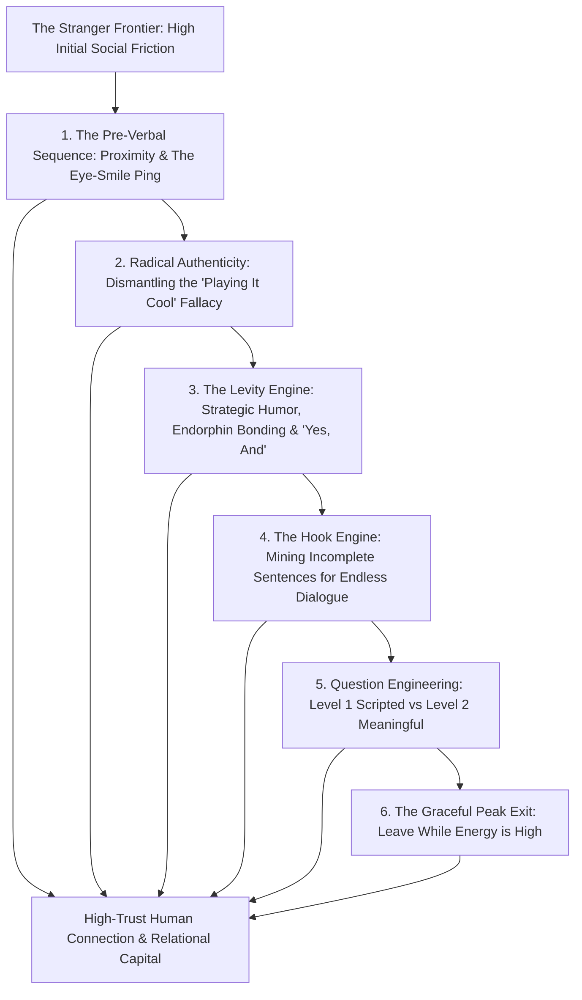
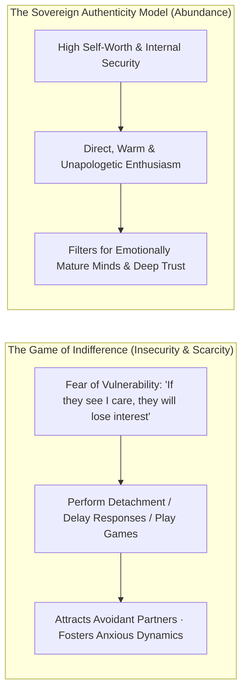
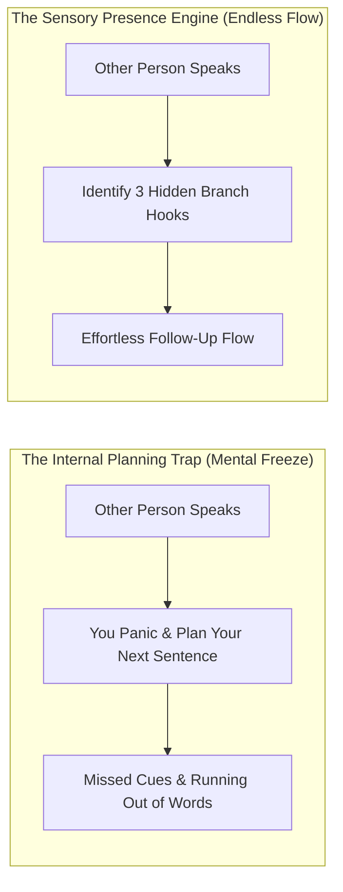
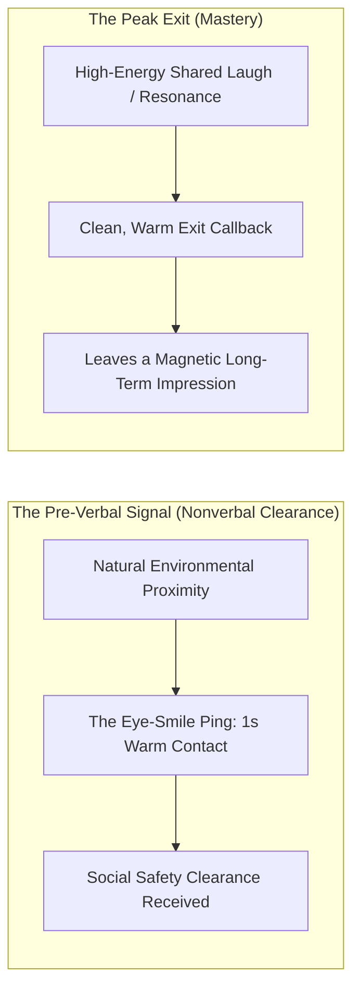
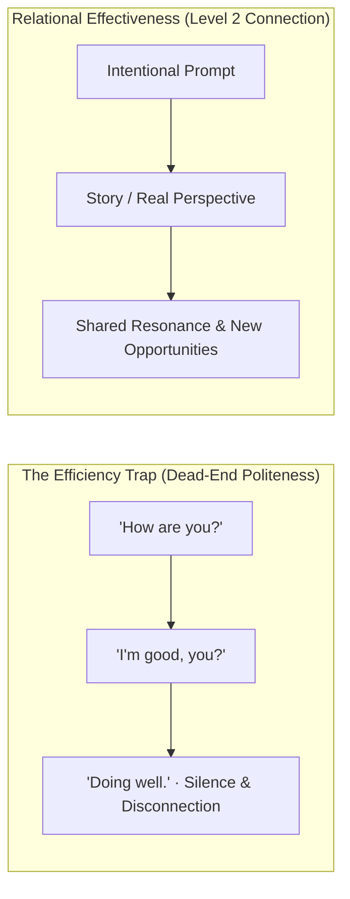
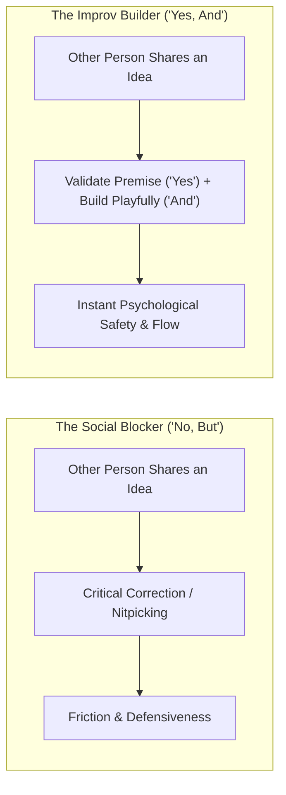
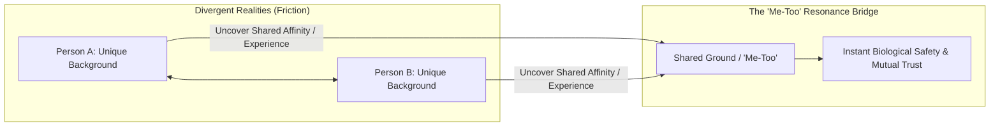

Modern urban life is characterized by a strange psychological paradox: we are surrounded by millions of human beings, yet we live in self-imposed isolation. Conditioned by social anxiety and childhood warnings of *"don't talk to strangers"*, most adults carry an invisible wall of social friction.

Every stranger you pass is a locked library—a potential lifelong collaborator, mentor, friend, or source of life-changing perspective.

In social psychology and conversational dynamics, **rapport is not an accidental spark; it is a predictable sequence of nonverbal readiness, question engineering, strategic levity, active listening for conversational hooks, and radical emotional authenticity**.

When you master the **Architecture of Social Connectivity**, you escape the trap of playing manipulative indifference games, deploy the Incomplete Sentence Hook Engine, and build high-trust relational bridges with anyone you meet.

---

### The Anatomy of Social Rapport

---

### The Pathology of "Playing It Cool" vs. Radical Relational Authenticity

#### 1. Why People "Playing It Cool"
* In modern dating and professional networking, many people deliberately suppress their enthusiasm, delay responses, or pretend not to care.
* **The Root Cause**: Deep-seated attachment insecurity and fear of rejection. Subconsciously, people fear that revealing genuine interest exposes them as "needy" or desperate.
* **The Game**: They manufacture artificial scarcity, attempting to trigger desire through anxiety and uncertainty rather than authentic resonance.

#### 2. The Filter of Emotional Maturity
* Performing indifference is a destructive filter: **it attracts only those who are emotionally unavailable and stimulated by rejection**.
* **The Sovereign Law**: Direct, unhurried clarity (*"I really enjoyed our discussion and would love to collaborate"* or *"I had a wonderful time and want to see you again"*) is the ultimate display of high self-esteem.
* You only need games if you believe your authentic self lacks inherent value. When you possess self-worth, unapologetic enthusiasm becomes your most magnetic asset.

---

### The Incomplete Sentence Engine (How to Never Run Out of Things to Say)

1. **The Incomplete Sentence Heuristic**:
   * People never communicate 100% of their context in a single statement. Every sentence contains **2 to 3 implicit branching hooks**.
   * *Example Statement*: *"I just got back from a crazy trip to Chicago for a design conference."*
   * *The 3 Embedded Hooks*:
     1. *The Travel Hook*: *"What made the trip so crazy?"*
     2. *The Geographic Hook*: *"Have you spent much time in Chicago before, or was this your first visit?"*
     3. *The Craft Hook*: *"What was the single most surprising insight from the conference?"*
2. **Presence Over Planning**:
   * Running out of things to say happens when you stop listening to plan your next witty remark. When you give 100% of your sensory attention to their words, the conversational path unfolds automatically.
3. **Befriending the Micro-Pause (Comfortable Silence)**:
   * Silence is only awkward when you tense up and treat it as a failure. When a natural lull occurs, remain relaxed, take a breath, and smile. Unhurried comfort in silence signals supreme emotional security.

---

### The Pre-Verbal Sequence & The Graceful Peak Exit

1. **The Eye-Smile Ping**: Before uttering a single word, make brief, warm eye contact paired with a subtle, friendly smile. This acts as a biological ping to test receptivity and signal non-threatening intent.
2. **The Ping-Pong Dynamic**: A great conversation is a game of ping-pong, not catch. Deliver your ball, allow the other person to return it, and resist the urge to hold the ball with endless monologues.
3. **The Peak Exit Heuristic (Leave on the High Note)**:
   * Conclude the interaction **at the peak of conversational energy** (*"I have to run to my next block, but this was great meeting you, [Name]"*). Leaving at the peak permanently cements a high-value memory in their mind.

---

### The Efficiency Trap vs. Relational Effectiveness

1. **The Efficiency Trap**: Most people optimize daily interactions for speed rather than depth. Automated pleasantries (*"How's it going?", "Good, how are you?"*) are efficient, but shut down genuine human connection.
2. **The Question Engineering Hierarchy**:
   * **Level 1 (Scripted / Transactional)**: Questions that solicit automatic, canned answers (*"What do you do?", "Busy week?"*).
   * **Level 2 (Meaningful / Intentional)**: Questions that prompt personal reflection, perspective, and values (*"What is the most interesting challenge on your desk right now?"* or *"What made you decide to get into that field?"*).
3. **The Over-Talking Trap**:
   * Amateurs talk continuously out of anxiety. Masters ask a surgical Level 2 question, **stop talking entirely**, and hold comfortable space for the truth.

---

### The Skill of Levity & The "Yes, And" Improv Principle

1. **Humor as Cognitive Engineering**: Laughter releases endorphins and dopamine while dropping cortisol. It instantly lowers threat detection and doubles information retention.
2. **The "Yes, And" Mindset**: Never block someone's casual observation with *"No, actually..."* Accept their premise (*"Yes"*) and build upon it with levity or curiosity (*"And what makes it even crazier is..."*).
3. **The Curator vs. Creator Principle**: You do not need to be a comedian; be an appreciative **curator of levity**—finding lighthearted observations and never taking yourself too seriously.

---

### The Seven Hooks of Social Rapport

---

#### 1. The Frictionless First Word (The 3-Second Ice-Break)
* The content of the first word does not matter; only the **warmth and directness** matter. A simple, unhurried *"Hello"* paired with steady eye contact and an open smile breaks 90% of stranger friction instantly.

---

#### 2. The Specific Micro-Observation (Beyond Generic Flattery)
* Offer a **specific micro-observation** that shows you are actually paying attention to their choices or craft (*"That notebook you're writing in has incredible paper weight—what brand is it?"*). Specificity signals genuine attentiveness.

---

#### 3. The Open Narrative Prompt (Banning "Yes/No" Deadlocks)
* Ask questions that require a story or a perspective:
  * Replace *"What do you do?"* with *"What project is taking up most of your headspace right now?"*
  * Replace *"Where are you from?"* with *"What was the biggest culture shock when you moved here?"*

---

#### 4. Mining for "Me-Toos" (The Common Ground Heuristic)
* Rapport is established the exact millisecond two minds discover a shared reference point—a shared hometown, an obscure author both have read, or a mutual love for early morning discipline. Flag it immediately: *"Me too—I experienced the exact same thing."*

---

#### 5. Genuine Curiosity (The Whole Book vs. The Headline)
* Treat every human being as a complete, complex book rather than a 1-line headline. Assume the person in front of you knows something vital about life that you do not yet understand.

---

#### 6. The Reciprocity Bridge (Vulnerability Calibrated)
* Deploy **Calibrated Reciprocity**: After the other person shares a personal detail or challenge, match their depth by sharing a small, authentic detail from your own life.

---

#### 7. The Name Callback & The Memorable Finish
* A person's name is the sweetest sound in any language. Use their name naturally during the conversation and anchor it in your memory.
* End on a high note: *"It was genuinely great meeting you, [Name]. I'm taking your recommendation with me."*

---

### The Core Takeaway to Remember
> Relational depth is forged through unhurried presence and radical honesty. Abandon the fear-based games of playing it cool; state your enthusiasm with sovereign clarity, mine the hidden hooks in every sentence, and build genuine bridges everywhere you go.
