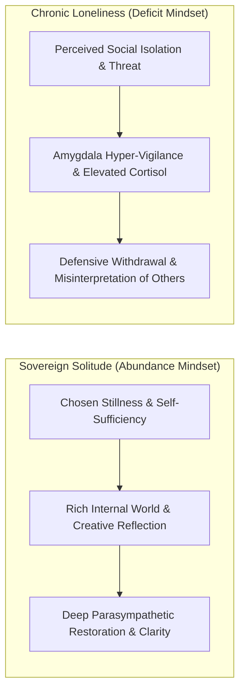
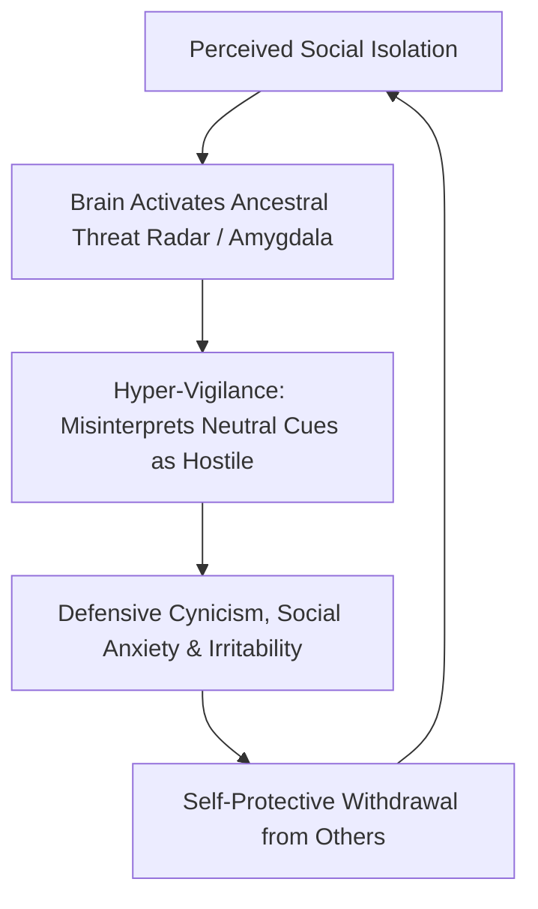
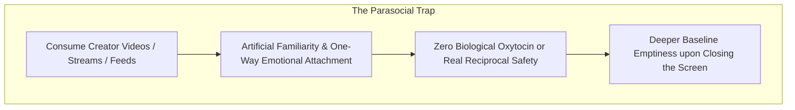
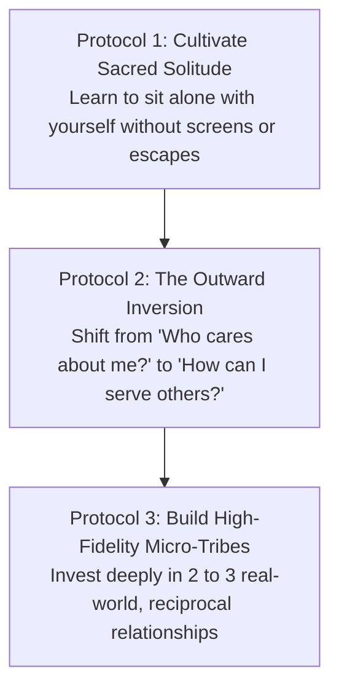
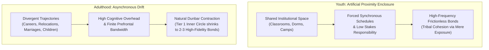

In the hyper-connected digital age, humanity faces an unprecedented paradox: **we have never had more digital connections, yet we have never experienced higher rates of chronic loneliness**.

Most people treat loneliness as an unavoidable emotional curse or a personal inadequacy: *"Nobody understands me, and I am isolated."* In evolutionary psychology and neurobiology, **loneliness is not a character flaw; it is an ancient biological warning system—identical to physical hunger or thirst—alerting you to an existential deficit in social safety**.

Understanding the difference between **destructive loneliness** and **sovereign solitude** is essential for maintaining emotional stability, deep creative work, and genuine human connection.

---

### Solitude vs. Loneliness: The Fundamental Divergence

* **Solitude (The Joy of Being Alone)**: Solitude is a state of chosen self-communion. It is the fertile soil where deep thinking, self-discovery, and creative mastery take root. The mind in solitude feels whole and complete.
* **Loneliness (The Pain of Feeling Isolated)**: Loneliness is a state of perceived deficit and emotional abandonment. It is accompanied by an aching sense of lack, internal restlessness, and an urgent drive to escape oneself.

---

### The Evolutionary Threat Loop of Chronic Loneliness

Pioneered by neuroscientist Dr. John Cacioppo, the **Evolutionary Theory of Loneliness** reveals that our ancestors could not survive alone in the wild. Being separated from the tribe meant certain death.

1. **The Alarm Bell**: The moment the brain perceives prolonged isolation, it assumes you are vulnerable to predators. It triggers a chronic surge in cortisol and norepinephrine, shifting your nervous system into permanent fight-or-flight alert.
2. **The Hyper-Vigilance Filter**: A lonely brain develops a distorted cognitive filter: it becomes hyper-sensitive to perceived slights, misinterprets neutral expressions as rejecting, and assumes others are untrustworthy.
3. **The Defensive Paradox**: To protect itself from potential rejection, the lonely mind withdraws further into cynicism and isolation, thereby reinforcing the very condition it suffers from.

---

### The Parasocial Illusion: Junk Food Connection

To escape the discomfort of loneliness, millions turn to modern digital substitutes: parasocial relationships with content creators, endless social media feeds, and algorithmic forums.

* **The Pseudo-Community Trap**: Watching a podcast or following a creator gives the intellectual illusion of sitting with friends. However, because the interaction is entirely one-directional and non-reciprocal, it fails to produce the mammalian neurochemistry of safety (oxytocin and vagal down-regulation).
* **The Nutritional Analogy**: Digital feeds are the **refined sugar of human connection**: they provide an instant dopamine rush but leave your deeper biological need for genuine intimacy completely malnourished.

---

### The Three Protocols for Restoring Social Sovereignty

#### 1. Cultivate Sacred Solitude (Befriending the Self)
* If you cannot sit in a quiet room for 15 minutes without reaching for a screen, you are not seeking company—you are running away from yourself.
* Practice intentional, device-free solitude through silent walks in nature, reflective journaling, or quiet reading. When you become comfortable with your own mind, you never enter relationships from a place of desperate neediness.

#### 2. The Outward Inversion (Dismantling Self-Absorption)
* Chronic loneliness is profoundly self-referential: the mind is constantly obsessing over its own perceived inadequacies, awkwardness, and social standing.
* Break the loop by flipping the spotlight outward: ask *“How can I genuinely help, encourage, or listen to someone else today?”* Generosity and genuine curiosity dissolve the defensive threat radar instantly.

#### 3. Build High-Fidelity Micro-Tribes
* You do not need a crowd or dozens of casual acquaintances; the human nervous system requires only **two or three high-trust, authentic bonds** where vulnerability and mutual support are absolute.
* Prioritize physical presence, shared difficulty (working out, building projects together), and deep unhurried conversations over thousands of superficial digital interactions.

---

### Asynchronous Trajectory Drift & The Dunbar Contraction in Adulthood (20s & 30s)

A near-universal crisis of human adulthood is the sudden, bewildering contraction of one's friendship circle between the ages of 22 and 35. Individuals frequently interpret this as personal failure, social inadequacy, or moral decline in peers. Neurobiology and sociometric network dynamics reveal this is an inevitable structural phenomenon:

#### 1. The Death of Forced Proximity
In school and university, social bonds are artificially subsidized by institutional enclosures: shared physical spaces, synchronized life stages, zero career liability, and shared adversaries (exams, administrators). True intimacy is often conflated with *mere geographical repetition*. Once this artificial scaffolding dissolves upon entering the workforce, relationships must be actively sustained by deliberate cognitive investment.

#### 2. Divergent Vector Drift
In adulthood, individuals differentiate along highly asymmetric vectors:
* Variance in risk tolerances (entrepreneurship vs. corporate stability vs. artistic pursuits).
* Divergent relationship and family commitments (parenting rewires executive time allocation).
* Shifting neurochemical baselines and lifestyle choices (late-night partying vs. circadian-aligned deep focus).

When core values and daily rituals diverge, holding onto youth-stage peer groups creates severe relational friction. Acknowledging that friends from past developmental stages served a genuine purpose—without obligating oneself to maintain high-latency superficial contact out of nostalgic guilt—liberates immense cognitive bandwidth.

#### 3. Dunbar Bandwidth and Strategic Depth
Anthropologist Robin Dunbar demonstrated that the human neocortex can maintain approximately 150 stable relationships, but only **5 close emotional supports** (Tier 1). In demanding adult phases, this shrinks to 2 or 3. Experiencing peer circle reduction is not an erosion of your character—it is a physiological normalization. The objective of adult connection is not maintaining a wide, shallow roster, but cultivating unconditional psychological safety within a compact, resilient micro-tribe.

---

### The Core Takeaway to Remember
> Loneliness is an ancient biological call to connection, not a life sentence of inadequacy. Do not numb the call with shallow parasocial feeds. Master the quiet power of sovereign solitude, turn your attention outward in service to others, and forge real-world bonds that anchor your nervous system in enduring safety.
