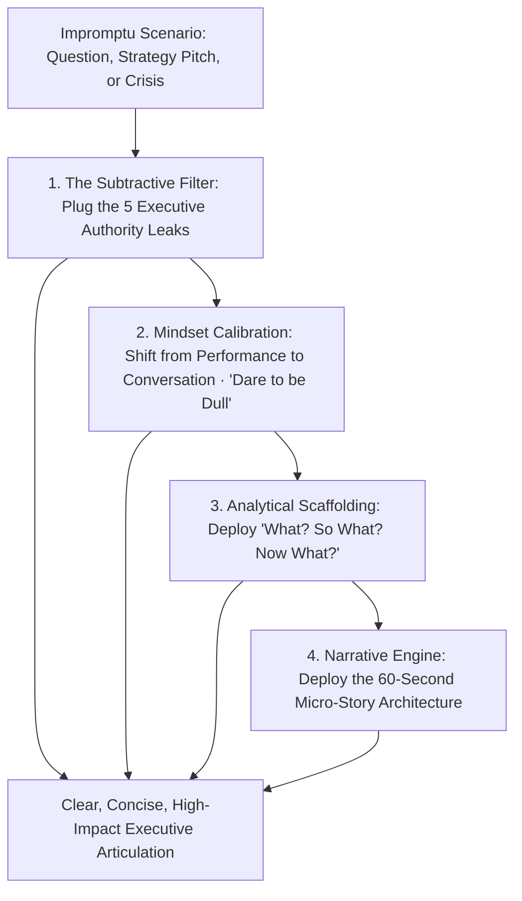
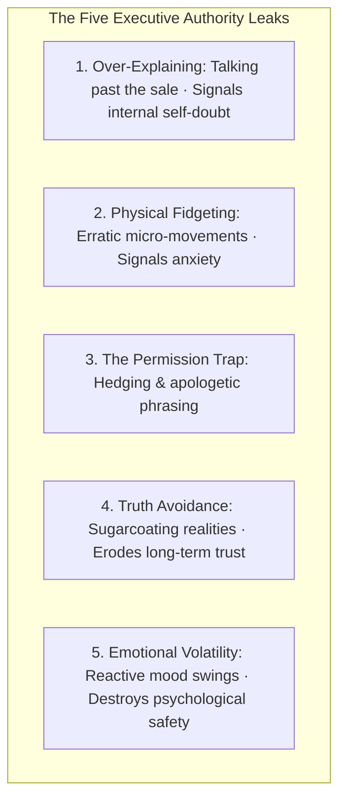
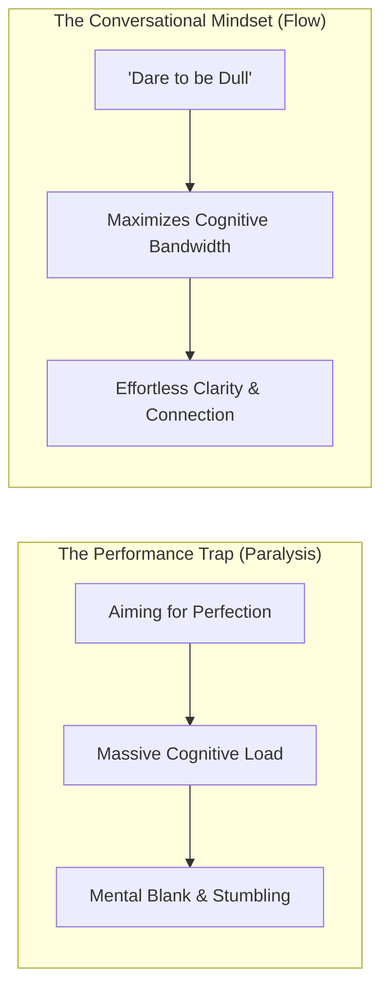
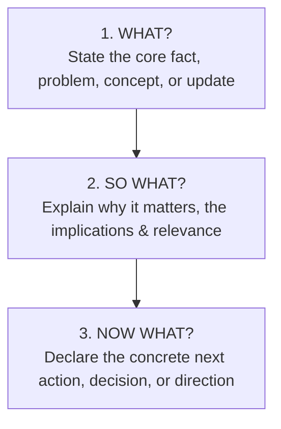
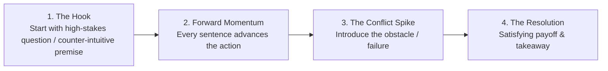
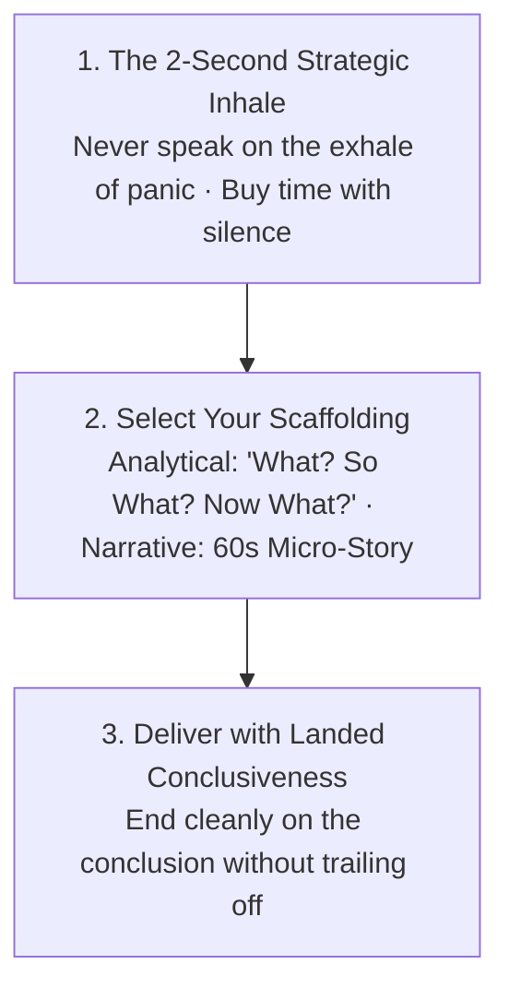

Most human communication does not occur during rehearsed keynote presentations or scripted interviews. It happens **in the wild**: being asked an unexpected question in a meeting, defending a proposal on the spot, explaining a strategy in 60 seconds, or leading through sudden turbulence.

When caught off guard, most people freeze, babble incoherently, or wander through rambling backstories that leak authority and lose the listener's respect.

In executive communication and cognitive science, **articulation is not created by adding complex jargon or performative swagger; it is created through Subtraction (Via Negativa)**.

When you eliminate the five subconscious authority leaks, deploy the **"What? So What? Now What?"** scaffolding, and master the **60-Second Micro-Story Engine**, you articulate your thoughts with effortless precision and executive command.

---

### The Architecture of Spontaneous Speaking & Articulation

---

### Phase 1: The Subtractive Articulation Framework (The 5 Leaks)

Executive presence is built not by what you say, but by **what you deliberately choose NOT to do**:

1. **Stop Over-Explaining (The Economy of Speech)**:
   * Over-explaining makes you appear insecure, as if you are begging the listener to validate your logic.
   * State your point clearly, provide the single strongest reason, and **stop talking**. The smartest individuals in any room use the fewest words.
2. **Stop Fidgeting (Stillness Signals Power)**:
   * Erratic tapping, shifting weight, and hand-wringing broadcast nervous energy that distracts from your message. Adopt intentional stillness.
3. **Stop Asking for Permission (The Hedging Trap)**:
   * Avoid apologetic, weak preambles (*"I was just wondering if maybe we could possibly try..."*).
   * Replace with direct, ownership-anchored statements: *"Here is the proposal, and here is why it solves our core bottleneck."*
4. **Stop Avoiding Difficult Truths**:
   * Amateurs avoid uncomfortable feedback to stay likable in the short term. Leaders are calm truth-tellers; addressing uncomfortable realities directly commands immense respect.
5. **Prioritize Emotional Predictability**:
   * Inconsistency and emotional volatility destroy trust. When your baseline response under stress is calm, measured, and predictable, you create instant psychological safety.

---

### Phase 2: Mindset Calibration ("Dare to be Dull")

1. **Shift from "Performance" to "Conversation"**:
   * A performance has a right and wrong script; it invites judgment. A conversation is a dynamic, collaborative connection. The moment you treat a meeting or interview as a *conversation*, performance anxiety drops by 70%.
2. **"Dare to be Dull" (The Paradox of Lowering the Bar)**:
   * When an unexpected question is asked, your brain tries to find the "genius, brilliant, perfect" response. This perfectionist filter creates immense cognitive drag, causing your mind to go blank.
   * By giving yourself permission to **deliver a clean, simple, unpretentious answer**, you free up 100% of your working memory to articulate your core truth clearly. Paradoxically, simple clarity sounds brilliant to the listener.

---

### Phase 3: The Universal Message Scaffoldings

When caught off-guard, do not invent a new narrative structure in panic. Rely on one of the **Master Scaffoldings**:

---

#### 1. The Master Framework: "What? So What? Now What?"

* **What? (The Core Truth)**: State the key fact, observation, or answer directly in 1–2 sentences without preamble.
* **So What? (The Significance)**: Explain why this fact is critical for the listener, the team, or the project.
* **Now What? (The Next Step)**: Provide the forward-looking recommendation, question, or action item.
* **Example in Practice**:
  * *What*: *"Our mock test quantitative scores dropped by 8% this week."*
  * *So What*: *"This indicates that while our concept clarity is strong, our speed in arithmetic calculations is creating a bottleneck."*
  * *Now What*: *"Starting tomorrow, we will allocate the first 30 minutes of our morning block exclusively to rapid calculation drills."*

---

#### 2. The 60-Second Micro-Story Engine

1. **The Hook (Curiosity Gap Opening)**: Open with a provocative question or high-stakes tension (*"What happens when you study 10 hours a day for 6 months, only to realize you were testing yourself on the wrong metrics?"*).
2. **Forward Momentum**: Every sentence advances the action; cut out all deadweight background trivia.
3. **The Conflict Spike**: Reveal the moment of obstacle or mistake. Tension is what locks human attention.
4. **The Resolution**: Deliver the clear lesson and stop.

---

### The 3-Step Impromptu Delivery Protocol

1. **The 2-Second Inhale**: When asked a question, never blurt out the first reactive thought. Pause, plant your feet, and take a full breath into your belly.
2. **Select the Scaffolding**: Mentally select *"What? So What? Now What?"* for analytical questions, or the *Micro-Story Engine* for narrative prompts.
3. **Stick the Landing**: Deliver the conclusion and **stop talking**. Silence after a clear conclusion projects supreme authority.

---

### The Core Takeaway to Remember
> Clear articulation is an act of subtraction. Eliminate over-explaining, stop asking for permission, anchor your speech in structured scaffolding, and deliver your conclusions with the unshakeable stillness of someone who knows their worth.
