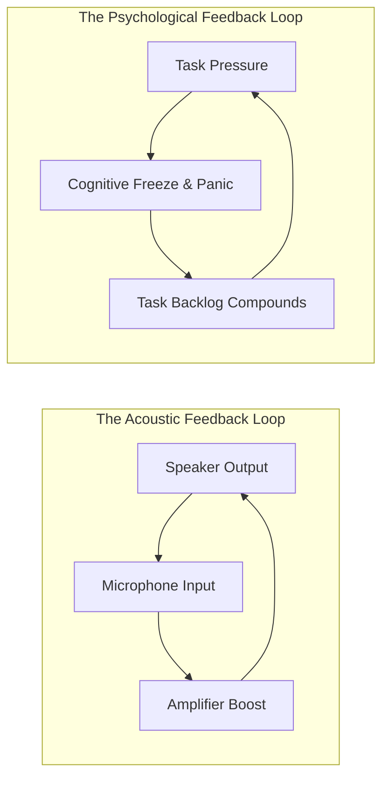
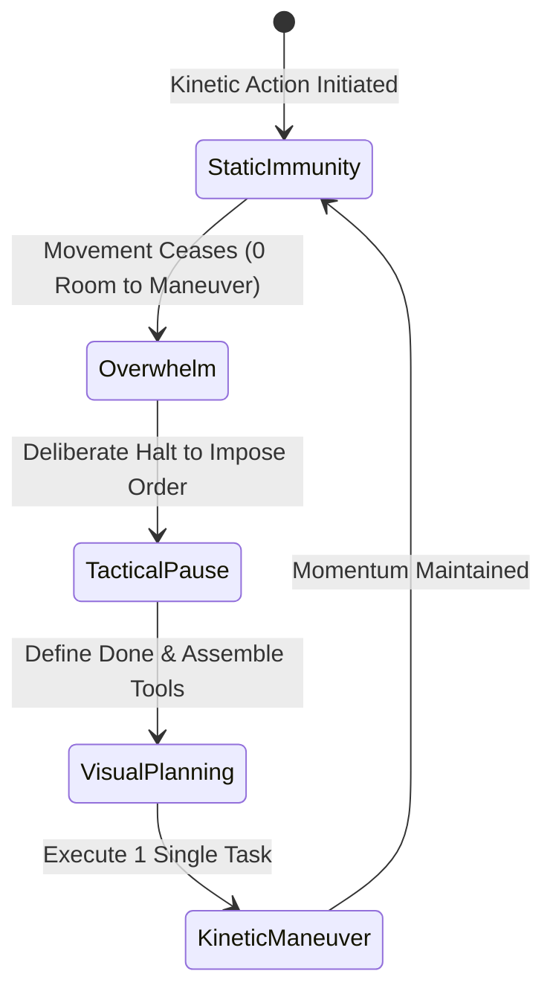
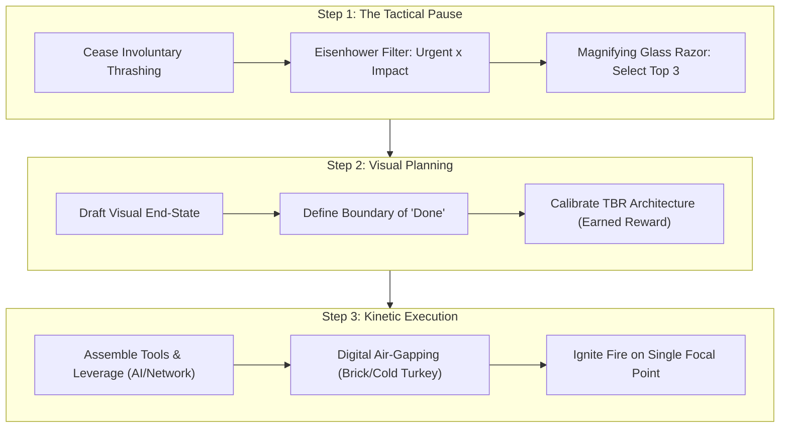
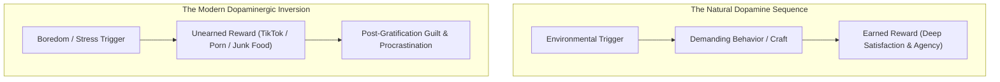

Most people believe that high performers exist in a state of tranquil serenity, devoid of pressure. This is a naive misunderstanding of human performance. **Stress is an invariant constant of high-stakes existence.** The difference between the elite operator who feels fulfilled and the exhausted amateur who collapses into burnout does not lie in the volume of stress they encounter. 

It lies entirely in their capacity to prevent stress from degenerating into **Overwhelm**.

---

### The Acoustic Feedback Loop of Overwhelm

Overwhelm is not a mysterious emotional curse; it is an **uncontrolled positive feedback loop**. 

In audio engineering, if a microphone is held in front of its own loudspeaker, the microphone captures the ambient sound, routes it to the amplifier, blasts it out of the speaker, recaptures the amplified sound, and repeats this cycle exponentially. Within seconds, the room is filled with a deafening, piercing screech that terminates only when a limiter trips or the speaker cone physically tears apart.

The human psyche operates under identical dynamics. An intense influx of demands produces anxiety; anxiety degrades executive prefrontal function; degraded prefrontal function induces procrastination or erratic thrashing; the growing backlog amplifies the pressure; and the system spirals into catatonia. 

The traditional biological taxonomy recognizes two basic survival responses to acute threat: **Fight** or **Flight**. In modern professional and cognitive landscapes, however, the dominant response is the third: **Freeze**. When frozen, the individual becomes like a deer transfixed by headlights—flooded with cortisol, incapable of decision, and suffocating under mental inertia.

---

### The Movement Invariant: Overwhelm as a Tactical Deadlock

In military tactics, an infantry unit or armored column is defined as "overwhelmed" only under one precise condition: **when the formation has zero room to maneuver**. 

If a squad cannot advance, cannot withdraw, cannot shift left, and cannot flank right, it is pinned down and overwhelmed. But if that unit can make even a five-pace tactical repositioning behind a stone wall, it is in combat, not in overwhelm.

From this battlefield reality emerges **The Movement Invariant**:

> **Overwhelm is a choice. So long as you are capable of choosing and executing deliberate kinetic movement toward a single point, you are mathematically and operationally not overwhelmed.**

When the sensation of drowning strikes, your objective is not to solve the entire ten-year career trajectory or liquidate a 200-item backlog simultaneously. Your singular duty is to restore **tactical maneuverability**.

---

### The Tactical Triad: Pause — Plan — Move

When novice soldiers in basic training are given an ambiguous, high-stress cooperative challenge under severe time limits—such as dismantling and re-staggering an entire bay of heavy two-tier bunks within thirty minutes—their instinct is immediate, chaotic action. One squad moves beds left; an uncoordinated squad moves beds right; units collide in the center; chaos ensues.

The veteran response is counter-intuitive: **impose an immediate tactical cease-fire**.

#### 1. Step 1: The Tactical Pause (The Magnifying Glass Principle)
The hardest part of the pause is that it *feels* passive. In a culture conditioned by frantic panic, taking sixty seconds to sit with a pen while the building is on fire feels like negligence. In reality, it is the highest-leverage action available: **it takes control of the problem space rather than allowing the problem space to dictate terms.**

To execute the pause:
- **Map Demands to the Eisenhower Matrix**: Categorize tasks across two axes: **Impact** (y-axis) and **Urgency** (x-axis).
- **The Single-Task Reality**: You possess neither the neurological architecture nor the executive bandwidth to execute two complex tasks simultaneously. Having one hundred tasks is irrelevant because execution bandwidth is strictly serial ($N=1$).
- **The Magnifying Glass Razor**: Ambient sunlight resting on a sheet of paper heats it moderately without effect. But concentrate those identical sunbeams through a magnifying glass onto a 1mm focal point, and the paper bursts into flame within seconds.
- **Select the Top Three**: Do not obsess over ranking every task with perfect mathematical precision. Highlight the top three high-impact, urgent items. Pick any one of them and begin.

#### 2. Step 2: The Planning Phase (The Anti-Hydra Razor & The TBR Engine)

##### A. Escaping the Sisyphus & Hydra Trap
In Greek mythology, Sisyphus was condemned by Zeus to roll a massive stone up a mountain, only to watch it roll back down the moment he reached the summit. In modern knowledge work, professionals construct their own Sisyphus torture because **every completed task naturally births two adjacent tasks**. 

If you do not explicitly delineate what **Done** looks like before picking up your tools, finishing a task brings no psychological closure. Instead, it feels like fighting the Lernaean Hydra: cut off one head, and two grow in its place.

> **The Anti-Hydra Razor**: Before beginning work, write down the precise, visual criteria that constitute completion. Once those criteria are satisfied, the task is dead. You collect your psychological victory and enforce closure.

##### B. The TBR Architecture (Trigger — Behavior — Reward)
Human action is anchored like a stone trilithon: the central **Behavior** rests upon two load-bearing columns—the **Trigger** and the **Reward**.

If a behavior is failing to materialize, diagnostic analysis is simple:
1. **The Trigger is Too Weak**: The environmental cue is ambiguous, hidden, or drowned in distraction.
2. **The Reward is Insufficiently Incentivizing**: The payoff is distant, abstract, or purely rooted in fear of punishment.

Most people attempt to motivate themselves through avoidance—running from an angry boss, running from poverty, running from exam failure. High-velocity execution inverts this polarity: **design work around the pursuit of potent, earned rewards**. Whether it is a massage, an espresso and pastry at a favorite café, or a long-anticipated cinema release, designate an unambiguous, sensory reward that is unlocked *exclusively* upon completion of the task.

##### C. The Pathology of Pre-Earned Dopamine
The foundational pathology of the 21st century is the decoupling of reward from effort. Algorithmic feeds, ultra-processed calories, and digital entertainment allow an individual to gorge on dopamine **before executing the preceding behavior**.

This inversion damages cognition in two distinct ways:
1. **The Reward Tastes Bitter**: An unearned reward produces immediate hollow guilt. The nervous system recognizes that the status or sensory payoff was fraudulent.
2. **Synaptic Deconditioning**: If the mammalian brain learns that it can obtain high-grade dopamine shortcuts without expending metabolic energy, it will aggressively resist future arduous behaviors.

The sequence must remain inviolable: **Trigger $\to$ Behavior $\to$ Reward**. Never **Trigger $\to$ Reward $\to$ Behavior**.

---

### Step 3: Kinetic Movement & Leverage Assembly

Once the pause has restored composure and the plan has defined the target, execution is merely a matter of kinetic movement. To ensure the formation maneuvers rapidly, assemble leverage beforehand:

| Leverage Category | Mechanism & Tactical Application |
| :--- | :--- |
| **Capital Leverage** | If a problem can be completely solved by allocating existing capital, write the check and eliminate the mental drag. |
| **Relational Leverage** | Solicit the specialized expertise of colleagues or mentors. Seeking competent assistance is not a sign of deficit; it is tactical velocity. |
| **Cognitive / AI Leverage** | Deploy high-reasoning LLMs (e.g., Claude 3.5 Sonnet) as cognitive sparring partners to draft initial task decompositions or structure Eisenhower matrices. |
| **Physical Air-Gapping** | Implement non-negotiable physical barriers to distraction: hardware NFC blockers (*Brick*), deep system-level website inhibitors (*Cold Turkey*), and visual noise decrapifiers (*Unhook* for educational video work). |

---

### The Immunity Invariant

Stress is inevitable; panic is an indulgence; overwhelm is a tactical failure.

The next time the cognitive walls begin closing in, execute the drill: **Call a tactical cease-fire. Pause. Pick the single highest-impact target with the magnifying glass. Write down exactly what "Done" looks like. Anchor an earned reward on the other side. Assemble your weapons, eliminate the exits, and move.**
